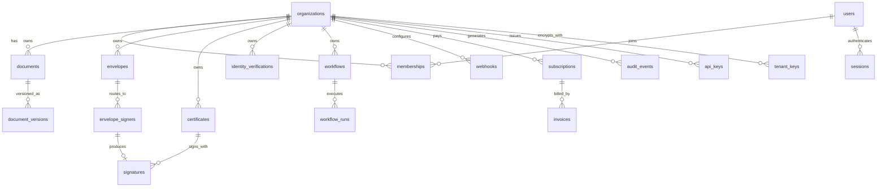
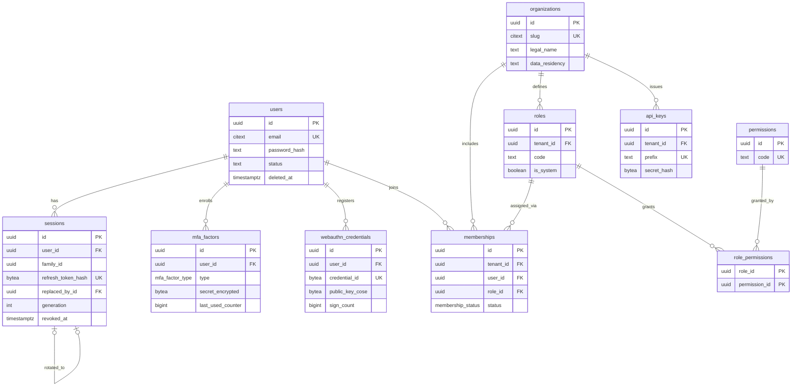
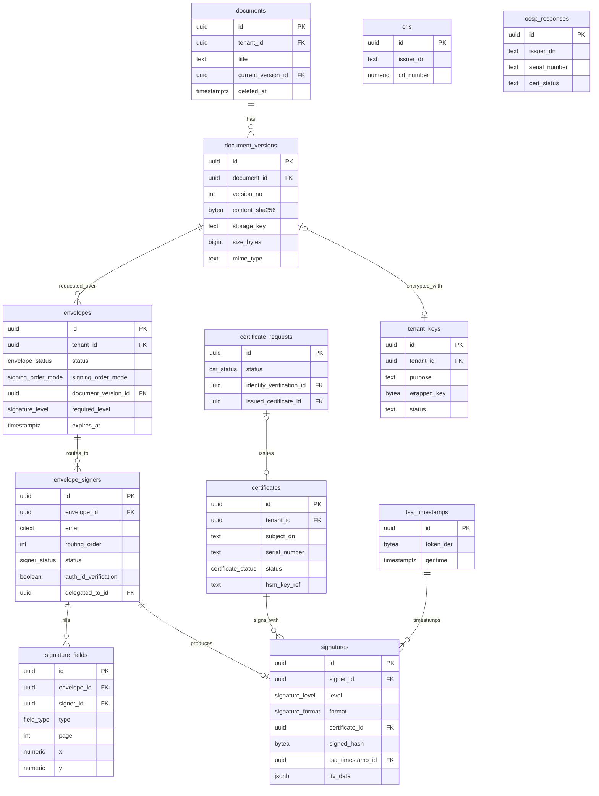
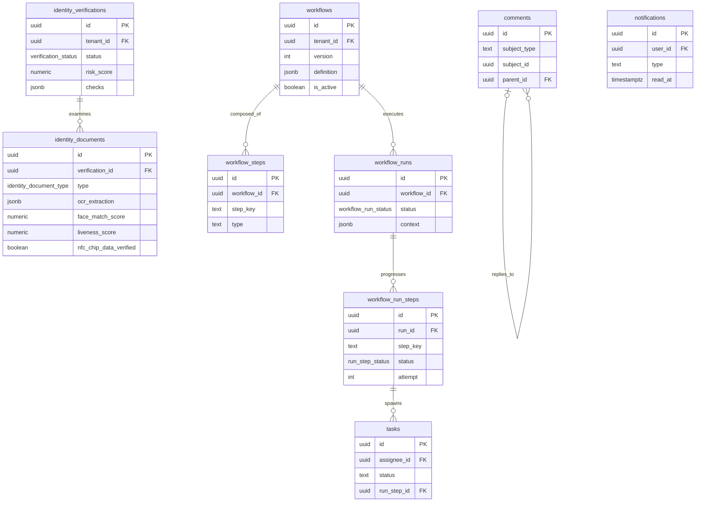
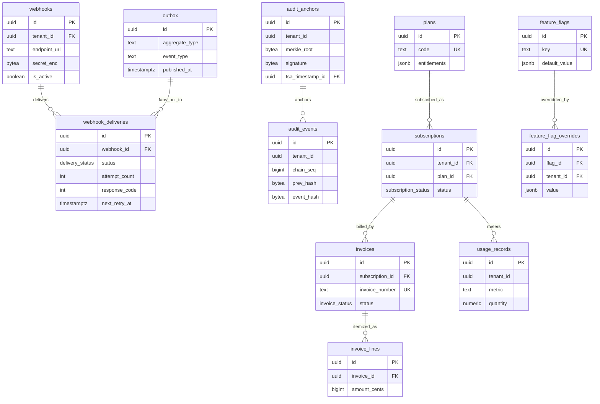

# CertiDZ — Database Architecture

> **Owner:** Data Architecture / Platform Team — CertiDZ by HISN
> **Status:** Approved for implementation (v1.0)
> **Datastores:** PostgreSQL 16 (primary system of record), Redis (cache/queues/rate limits), Elasticsearch (search projections), S3-compatible object storage (document bytes, evidence bundles, archives).
> **ORM:** Prisma (NestJS backend). Raw SQL used for RLS, partitioning, triggers, and hash-chain machinery via customized migrations.

This document is the single source of truth for the relational model of the CertiDZ platform: e-signature (PAdES/XAdES/CAdES, LTV, RFC 3161 timestamping), digital identity verification (OCR / face match / liveness / NFC), PKI and certificate lifecycle, trusted document management, workflow automation, multi-tenant organizations, billing, and tamper-evident auditing aligned with eIDAS, Algerian Law 15-04, GDPR, ISO 27001 and SOC 2.

---

## Table of Contents

1. [Conventions](#conventions)
2. [Bounded Context: Identity & Access (IAM)](#bounded-context-identity--access-iam)
3. [Bounded Context: Documents](#bounded-context-documents)
4. [Bounded Context: Signing & Envelopes](#bounded-context-signing--envelopes)
5. [Bounded Context: PKI & Trust Services](#bounded-context-pki--trust-services)
6. [Bounded Context: Identity Verification (KYC)](#bounded-context-identity-verification-kyc)
7. [Bounded Context: Workflow & Collaboration](#bounded-context-workflow--collaboration)
8. [Bounded Context: Integration & Eventing](#bounded-context-integration--eventing)
9. [Bounded Context: Audit & Compliance](#bounded-context-audit--compliance)
10. [Bounded Context: Billing & Entitlements](#bounded-context-billing--entitlements)
11. [ER Diagrams](#er-diagrams)
12. [Key Indexes](#key-indexes)
13. [Partitioning Strategy](#partitioning-strategy)
14. [Tamper-Evident Audit Log (Hash Chain)](#tamper-evident-audit-log-hash-chain)
15. [Row-Level Security (RLS)](#row-level-security-rls)
16. [Migration Strategy](#migration-strategy)
17. [Connection Pooling](#connection-pooling)
18. [Read Replicas](#read-replicas)
19. [Backup & PITR](#backup--pitr)
20. [Data Retention Matrix](#data-retention-matrix)

---

## Conventions

### Primary keys — UUIDv7

All primary keys are **UUIDv7** (time-ordered, RFC 9562). UUIDv7 gives us:

- Global uniqueness across shards/regions without coordination (needed for offline signing kiosks and future regional cells).
- Time-ordered prefix → B-tree friendly inserts (no random-page write amplification like UUIDv4).
- No information leakage of row counts (unlike bigserial).

PostgreSQL 16 does not ship `uuidv7()` natively (PG 18 does), so we install a SQL implementation once and treat it as infrastructure:

```sql
-- migration: 000000000000_infrastructure/migration.sql
CREATE EXTENSION IF NOT EXISTS pgcrypto;      -- gen_random_bytes, digest()
CREATE EXTENSION IF NOT EXISTS pg_trgm;       -- trigram search fallback
CREATE EXTENSION IF NOT EXISTS btree_gin;     -- composite GIN where needed

CREATE OR REPLACE FUNCTION uuid_generate_v7()
RETURNS uuid
LANGUAGE sql
VOLATILE PARALLEL SAFE
AS $$
  -- 48-bit unix ms timestamp || version 7 || 74 bits of randomness
  SELECT encode(
    set_bit(
      set_bit(
        overlay(gen_random_bytes(16)
                PLACING substring(int8send((extract(epoch FROM clock_timestamp()) * 1000)::bigint) FROM 3)
                FROM 1 FOR 6),
        52, 1),
      53, 1),
    'hex')::uuid;
$$;
```

Every table uses:

```sql
id uuid PRIMARY KEY DEFAULT uuid_generate_v7()
```

Application code (Prisma) may also generate UUIDv7 client-side (e.g. `uuidv7` npm package) so IDs exist before the INSERT; both paths are valid because the default only fires when the app does not supply one.

### Naming

| Rule | Example |
|---|---|
| Tables: `snake_case`, plural | `envelope_signers` |
| Columns: `snake_case` | `signed_hash`, `tsa_token` |
| FK columns: `<singular>_id` | `envelope_id`, `certificate_id` |
| Indexes: `ix_<table>__<cols>` (`uq_` for unique, `pk_` implicit) | `ix_envelopes__tenant_status_created` |
| Check constraints: `ck_<table>__<rule>` | `ck_signature_fields__geometry` |
| Triggers: `trg_<table>__<purpose>` | `trg_audit_events__block_mutation` |
| Enums (PG): `<domain>_<noun>` singular | `envelope_status`, `signature_level` |

### Timestamps & soft delete

- Every table: `created_at timestamptz NOT NULL DEFAULT now()`, `updated_at timestamptz NOT NULL DEFAULT now()` (maintained by Prisma `@updatedAt`; a defensive trigger exists for raw-SQL writers).
- **Soft delete** (`deleted_at timestamptz NULL`) only where business recovery/trash semantics exist: `documents`, `workflows`, `roles`, `webhooks`, `users` (account deactivation before anonymization), `organizations`. Soft-deleted rows are excluded by partial unique indexes (`WHERE deleted_at IS NULL`).
- **Never soft-deleted:** `audit_events` (append-only, immutable), `signatures`, `certificates` (revoked, not deleted — legal evidence), billing records, `sessions` (revoked instead).
- All timestamps are `timestamptz` stored in UTC. `date` only for billing period boundaries.

### Multi-tenancy

- Tenant = **organization**. Every tenant-scoped table carries `tenant_id uuid NOT NULL REFERENCES organizations(id)`.
- `tenant_id` is **denormalized deliberately** onto child tables (e.g. `signature_fields` carries it even though it is derivable via `envelopes`) so that RLS never requires a join and composite indexes lead with it.
- Global (non-tenant) tables: `users` (a user can belong to several organizations), `plans`, `permissions`, `feature_flags`, `crls`, `ocsp_responses` (shared PKI cache), and partition/anchor bookkeeping.
- Composite FK pattern to prevent cross-tenant references at the constraint level (defense in depth below RLS):

```sql
-- parent exposes (tenant_id, id) as a unique pair
ALTER TABLE envelopes ADD CONSTRAINT uq_envelopes__tenant_id_id UNIQUE (tenant_id, id);
-- child references the pair
ALTER TABLE envelope_signers
  ADD CONSTRAINT fk_envelope_signers__envelope
  FOREIGN KEY (tenant_id, envelope_id) REFERENCES envelopes (tenant_id, id);
```

### RLS policy pattern (summary — full section [below](#row-level-security-rls))

```sql
ALTER TABLE envelopes ENABLE ROW LEVEL SECURITY;
ALTER TABLE envelopes FORCE ROW LEVEL SECURITY;   -- applies to table owner too

CREATE POLICY tenant_isolation ON envelopes
  USING (tenant_id = current_setting('app.tenant_id')::uuid)
  WITH CHECK (tenant_id = current_setting('app.tenant_id')::uuid);
```

The application sets `SET LOCAL app.tenant_id = '<uuid>'` inside every transaction (Prisma `$transaction` with a leading `$executeRaw`). See [RLS](#row-level-security-rls) for the worker bypass role and PgBouncer caveats.

### Prisma mapping notes

- Prisma models are `PascalCase`, fields `camelCase`; **every** model/field maps explicitly: `@@map("envelope_signers")`, `@map("tenant_id")`.
- `id String @id @default(dbgenerated("uuid_generate_v7()")) @db.Uuid`.
- `createdAt DateTime @default(now()) @map("created_at") @db.Timestamptz(6)`, `updatedAt DateTime @updatedAt`.
- JSONB columns: `Json @db.JsonB`. Byte columns (hashes, DER blobs): `Bytes @db.ByteA`.
- RLS, triggers, partitions, check constraints beyond Prisma's vocabulary live in **customized migrations** (`prisma migrate dev --create-only`, then edit the SQL). Prisma never "sees" partitioned child tables — only the parent is modeled.
- Partitioned tables have composite PKs (`(id, occurred_at)`); modeled in Prisma as `@@id([id, occurredAt])`.
- Views used for reporting are marked `view` in Prisma 5+ or accessed via `$queryRaw`.

### Enum strategy

**Rule: Postgres native enums for closed, protocol-level vocabularies; `text + CHECK` for anything product-evolving.**

| Use PG `ENUM` when | Use `text + CHECK` when |
|---|---|
| The set is defined by a standard/protocol and effectively frozen: `signature_format` (PAdES/XAdES/CAdES), `signature_level` (eIDAS SES/AdES/QES), `hash_algorithm` | Product may add values without a migration window: notification types, task types, webhook event names |
| Values participate in hot indexes and storage matters (enum = 4 bytes) | Values are tenant-visible strings you may want to rename |
| State machines we control end-to-end: `envelope_status`, `certificate_status` | Sets synced from external systems (payment provider statuses) |

Adding a value to a PG enum is `ALTER TYPE ... ADD VALUE` (non-transactional pre-PG12 semantics apply to indexes — we always add at the end and never remove; renames are forbidden). Prisma supports native enums directly. For `text + CHECK`, the check is dropped/recreated in a custom migration:

```sql
ALTER TABLE notifications DROP CONSTRAINT IF EXISTS ck_notifications__type;
ALTER TABLE notifications ADD CONSTRAINT ck_notifications__type
  CHECK (type IN ('envelope.sent','envelope.completed','task.assigned','mention','system'));
```

### Shared enum definitions

```sql
CREATE TYPE envelope_status AS ENUM
  ('draft','sent','in_progress','completed','declined','voided','expired');
CREATE TYPE signer_status AS ENUM
  ('created','notified','viewed','authenticated','signed','declined','delegated','expired');
CREATE TYPE signing_order_mode AS ENUM ('sequential','parallel','hybrid');
CREATE TYPE signature_level AS ENUM ('simple','advanced','qualified');
CREATE TYPE signature_format AS ENUM ('pades','xades','cades');
CREATE TYPE field_type AS ENUM
  ('signature','initials','date','text','checkbox','radio','dropdown','stamp');
CREATE TYPE certificate_status AS ENUM
  ('pending','active','suspended','revoked','expired');
CREATE TYPE csr_status AS ENUM
  ('draft','submitted','identity_check','approved','issued','rejected','cancelled');
CREATE TYPE verification_status AS ENUM
  ('created','pending','processing','approved','rejected','expired','requires_review');
CREATE TYPE workflow_run_status AS ENUM
  ('pending','running','waiting','completed','failed','cancelled');
CREATE TYPE run_step_status AS ENUM
  ('pending','running','waiting','completed','failed','skipped','cancelled');
CREATE TYPE membership_status AS ENUM ('invited','active','suspended','removed');
CREATE TYPE subscription_status AS ENUM
  ('trialing','active','past_due','paused','cancelled','expired');
CREATE TYPE invoice_status AS ENUM ('draft','open','paid','void','uncollectible');
CREATE TYPE delivery_status AS ENUM ('pending','delivering','succeeded','failed','dead');
CREATE TYPE mfa_factor_type AS ENUM ('totp','sms','recovery_codes');
CREATE TYPE identity_document_type AS ENUM
  ('cni','passport','driving_licence','residence_permit');
```

---

## Bounded Context: Identity & Access (IAM)

Covers authentication (`users`, `sessions`, `mfa_factors`, `webauthn_credentials`), tenancy (`organizations`, `memberships`), authorization (`roles`, `permissions`, `role_permissions`) and machine access (`api_keys`).

### users (global — not tenant-scoped)

A user is a global identity; tenancy attaches via `memberships`.

```sql
CREATE TABLE users (
  id                     uuid PRIMARY KEY DEFAULT uuid_generate_v7(),
  email                  citext NOT NULL,                 -- case-insensitive
  email_verified_at      timestamptz,
  phone_e164             text,                            -- +213...
  phone_verified_at      timestamptz,
  password_hash          text,                            -- argon2id; NULL for SSO-only users
  password_updated_at    timestamptz,
  given_name             text NOT NULL,
  family_name            text NOT NULL,
  locale                 text NOT NULL DEFAULT 'fr-DZ',   -- fr-DZ | ar-DZ | en
  timezone               text NOT NULL DEFAULT 'Africa/Algiers',
  avatar_storage_key     text,
  status                 text NOT NULL DEFAULT 'active',
  failed_login_count     int  NOT NULL DEFAULT 0,
  locked_until           timestamptz,
  last_login_at          timestamptz,
  terms_accepted_at      timestamptz,
  created_at             timestamptz NOT NULL DEFAULT now(),
  updated_at             timestamptz NOT NULL DEFAULT now(),
  deleted_at             timestamptz,                     -- deactivation; PII anonymized by retention job
  CONSTRAINT ck_users__status CHECK (status IN ('active','suspended','pending_deletion')),
  CONSTRAINT ck_users__phone  CHECK (phone_e164 IS NULL OR phone_e164 ~ '^\+[1-9][0-9]{6,14}$')
);
CREATE UNIQUE INDEX uq_users__email ON users (email) WHERE deleted_at IS NULL;
```

### sessions — refresh-token families with rotation & reuse detection

Access tokens are stateless JWTs (10 min). Refresh tokens are opaque, stored **hashed**, rotated on every use. A *family* groups all rotations descending from one login; presenting an already-rotated token (`replaced_by_id IS NOT NULL`) is **reuse** → the whole family is revoked (`revoked_reason = 'reuse_detected'`).

```sql
CREATE TABLE sessions (
  id                    uuid PRIMARY KEY DEFAULT uuid_generate_v7(),
  user_id               uuid NOT NULL REFERENCES users(id) ON DELETE CASCADE,
  family_id             uuid NOT NULL,                    -- constant across rotations
  refresh_token_hash    bytea NOT NULL,                   -- sha256(token)
  parent_id             uuid REFERENCES sessions(id),     -- token this one rotated from
  replaced_by_id        uuid REFERENCES sessions(id),     -- set when rotated; reuse detector
  generation            int  NOT NULL DEFAULT 0,          -- rotation counter within family
  ip_address            inet,
  user_agent            text,
  device_fingerprint    text,
  auth_level            text NOT NULL DEFAULT 'password', -- password | mfa | webauthn | sso
  mfa_verified_at       timestamptz,
  expires_at            timestamptz NOT NULL,             -- absolute family lifetime (30 d)
  last_used_at          timestamptz,
  revoked_at            timestamptz,
  revoked_reason        text,                             -- logout | reuse_detected | admin | password_change
  created_at            timestamptz NOT NULL DEFAULT now(),
  updated_at            timestamptz NOT NULL DEFAULT now(),
  CONSTRAINT ck_sessions__auth_level
    CHECK (auth_level IN ('password','mfa','webauthn','sso'))
);
CREATE UNIQUE INDEX uq_sessions__token_hash ON sessions (refresh_token_hash);
CREATE INDEX ix_sessions__family ON sessions (family_id, generation DESC);
-- hot path: find live sessions for a user (partial index, see Key Indexes)
CREATE INDEX ix_sessions__user_active ON sessions (user_id, expires_at)
  WHERE revoked_at IS NULL AND replaced_by_id IS NULL;
```

### mfa_factors (TOTP, SMS, recovery codes)

```sql
CREATE TABLE mfa_factors (
  id                 uuid PRIMARY KEY DEFAULT uuid_generate_v7(),
  user_id            uuid NOT NULL REFERENCES users(id) ON DELETE CASCADE,
  type               mfa_factor_type NOT NULL,
  label              text,                                -- "Aegis on Pixel 8"
  secret_encrypted   bytea,          -- TOTP seed, AES-256-GCM under KMS DEK (NULL for recovery type)
  secret_key_id      text,           -- KMS key/DEK reference used to wrap
  recovery_codes     jsonb,          -- [{hash, used_at}] for type=recovery_codes
  totp_digits        smallint NOT NULL DEFAULT 6,
  totp_period_s      smallint NOT NULL DEFAULT 30,
  totp_algorithm     text NOT NULL DEFAULT 'SHA1',
  last_used_at       timestamptz,
  last_used_counter  bigint,         -- anti-replay: reject same/older TOTP window
  verified_at        timestamptz,    -- NULL until enrollment confirmed
  created_at         timestamptz NOT NULL DEFAULT now(),
  updated_at         timestamptz NOT NULL DEFAULT now(),
  CONSTRAINT ck_mfa_factors__totp_algo CHECK (totp_algorithm IN ('SHA1','SHA256','SHA512'))
);
CREATE UNIQUE INDEX uq_mfa_factors__user_type ON mfa_factors (user_id, type)
  WHERE verified_at IS NOT NULL;
```

### webauthn_credentials (FIDO2 / passkeys)

```sql
CREATE TABLE webauthn_credentials (
  id                  uuid PRIMARY KEY DEFAULT uuid_generate_v7(),
  user_id             uuid NOT NULL REFERENCES users(id) ON DELETE CASCADE,
  credential_id       bytea NOT NULL,          -- raw credential ID from authenticator
  public_key_cose     bytea NOT NULL,          -- COSE-encoded public key
  sign_count          bigint NOT NULL DEFAULT 0, -- clone detection: must be monotonic
  aaguid              uuid,
  transports          text[],                  -- {'internal','usb','nfc','ble','hybrid'}
  attestation_format  text,                    -- 'packed' | 'none' | ...
  backup_eligible     boolean NOT NULL DEFAULT false,   -- passkey sync flags (BE/BS)
  backup_state        boolean NOT NULL DEFAULT false,
  device_label        text,
  last_used_at        timestamptz,
  created_at          timestamptz NOT NULL DEFAULT now(),
  updated_at          timestamptz NOT NULL DEFAULT now()
);
CREATE UNIQUE INDEX uq_webauthn_credentials__cred_id ON webauthn_credentials (credential_id);
CREATE INDEX ix_webauthn_credentials__user ON webauthn_credentials (user_id);
```

### organizations (= tenants)

```sql
CREATE TABLE organizations (
  id                   uuid PRIMARY KEY DEFAULT uuid_generate_v7(),
  slug                 citext NOT NULL,           -- URL-safe, e.g. 'sonatrach'
  legal_name           text NOT NULL,
  trade_register_no    text,                      -- RC (registre de commerce) — DZ
  tax_id               text,                      -- NIF
  country_code         char(2) NOT NULL DEFAULT 'DZ',
  default_locale       text NOT NULL DEFAULT 'fr-DZ',
  logo_storage_key     text,
  settings             jsonb NOT NULL DEFAULT '{}'::jsonb,  -- branding, signing policy defaults
  data_residency       text NOT NULL DEFAULT 'dz',          -- 'dz' | 'eu'
  status               text NOT NULL DEFAULT 'active',
  created_at           timestamptz NOT NULL DEFAULT now(),
  updated_at           timestamptz NOT NULL DEFAULT now(),
  deleted_at           timestamptz,
  CONSTRAINT ck_organizations__status CHECK (status IN ('active','suspended','offboarding'))
);
CREATE UNIQUE INDEX uq_organizations__slug ON organizations (slug) WHERE deleted_at IS NULL;
```

### memberships

```sql
CREATE TABLE memberships (
  id             uuid PRIMARY KEY DEFAULT uuid_generate_v7(),
  tenant_id      uuid NOT NULL REFERENCES organizations(id),
  user_id        uuid NOT NULL REFERENCES users(id),
  role_id        uuid NOT NULL REFERENCES roles(id),
  status         membership_status NOT NULL DEFAULT 'invited',
  invited_by_id  uuid REFERENCES users(id),
  invited_email  citext,                 -- pre-registration invite target
  invite_token_hash bytea,
  invite_expires_at timestamptz,
  joined_at      timestamptz,
  created_at     timestamptz NOT NULL DEFAULT now(),
  updated_at     timestamptz NOT NULL DEFAULT now(),
  CONSTRAINT uq_memberships__tenant_user UNIQUE (tenant_id, user_id)
);
CREATE INDEX ix_memberships__user ON memberships (user_id) WHERE status = 'active';
```

### roles / permissions / role_permissions (RBAC)

`permissions` is a **global catalog** seeded by migrations (`resource:action`, e.g. `envelope:send`, `certificate:revoke`). `roles` are tenant-scoped (system roles have `tenant_id NULL + is_system = true` and are visible to all tenants via a dedicated RLS policy).

```sql
CREATE TABLE permissions (
  id           uuid PRIMARY KEY DEFAULT uuid_generate_v7(),
  code         text NOT NULL UNIQUE,          -- 'envelope:send'
  resource     text NOT NULL,                 -- 'envelope'
  action       text NOT NULL,                 -- 'send'
  description  text,
  created_at   timestamptz NOT NULL DEFAULT now(),
  updated_at   timestamptz NOT NULL DEFAULT now()
);

CREATE TABLE roles (
  id           uuid PRIMARY KEY DEFAULT uuid_generate_v7(),
  tenant_id    uuid REFERENCES organizations(id),   -- NULL = system role
  code         text NOT NULL,                        -- 'owner','admin','member','auditor', custom
  name         text NOT NULL,
  description  text,
  is_system    boolean NOT NULL DEFAULT false,
  created_at   timestamptz NOT NULL DEFAULT now(),
  updated_at   timestamptz NOT NULL DEFAULT now(),
  deleted_at   timestamptz,
  CONSTRAINT ck_roles__system_no_tenant CHECK (NOT is_system OR tenant_id IS NULL)
);
CREATE UNIQUE INDEX uq_roles__tenant_code ON roles (COALESCE(tenant_id, '00000000-0000-0000-0000-000000000000'::uuid), code)
  WHERE deleted_at IS NULL;

CREATE TABLE role_permissions (
  role_id        uuid NOT NULL REFERENCES roles(id) ON DELETE CASCADE,
  permission_id  uuid NOT NULL REFERENCES permissions(id) ON DELETE CASCADE,
  created_at     timestamptz NOT NULL DEFAULT now(),
  PRIMARY KEY (role_id, permission_id)
);
```

### api_keys

Keys are shown once; we persist only `sha256(secret)`. `prefix` (first 12 chars, e.g. `cdz_live_A1b2`) enables O(1) lookup and dashboard display.

```sql
CREATE TABLE api_keys (
  id              uuid PRIMARY KEY DEFAULT uuid_generate_v7(),
  tenant_id       uuid NOT NULL REFERENCES organizations(id),
  name            text NOT NULL,
  prefix          text NOT NULL,                 -- 'cdz_live_A1b2C3d4'
  secret_hash     bytea NOT NULL,                -- sha256(full secret)
  scopes          text[] NOT NULL DEFAULT '{}',  -- subset of permission codes
  created_by_id   uuid REFERENCES users(id),
  last_used_at    timestamptz,
  last_used_ip    inet,
  expires_at      timestamptz,
  revoked_at      timestamptz,
  created_at      timestamptz NOT NULL DEFAULT now(),
  updated_at      timestamptz NOT NULL DEFAULT now()
);
CREATE UNIQUE INDEX uq_api_keys__prefix ON api_keys (prefix);
CREATE INDEX ix_api_keys__tenant ON api_keys (tenant_id) WHERE revoked_at IS NULL;
```

---

## Bounded Context: Documents

Document **bytes never live in Postgres** — only metadata, content hashes and S3 storage keys. `documents` is the logical entity; `document_versions` is the immutable content history (every upload, conversion to PDF/A, or signed output is a new version).

### documents

```sql
CREATE TABLE documents (
  id                  uuid PRIMARY KEY DEFAULT uuid_generate_v7(),
  tenant_id           uuid NOT NULL REFERENCES organizations(id),
  folder_path         text NOT NULL DEFAULT '/',           -- materialized path, '/contracts/2026/'
  title               text NOT NULL,
  current_version_id  uuid,                                 -- FK added after document_versions exists
  classification      text NOT NULL DEFAULT 'internal',     -- public|internal|confidential|secret
  ai_summary          text,                                 -- AI document intelligence output
  ai_extracted        jsonb,                                -- entities, clauses, dates (AI pipeline)
  tags                text[] NOT NULL DEFAULT '{}',
  created_by_id       uuid REFERENCES users(id),
  created_at          timestamptz NOT NULL DEFAULT now(),
  updated_at          timestamptz NOT NULL DEFAULT now(),
  deleted_at          timestamptz,                          -- trash; purged after 30 d
  CONSTRAINT uq_documents__tenant_id_id UNIQUE (tenant_id, id),
  CONSTRAINT ck_documents__classification
    CHECK (classification IN ('public','internal','confidential','secret'))
);
```

### document_versions

```sql
CREATE TABLE document_versions (
  id               uuid PRIMARY KEY DEFAULT uuid_generate_v7(),
  tenant_id        uuid NOT NULL REFERENCES organizations(id),
  document_id      uuid NOT NULL,
  version_no       int  NOT NULL,
  content_sha256   bytea NOT NULL,        -- 32 bytes; integrity + dedup + evidence
  storage_key      text  NOT NULL,        -- s3://certidz-docs-dz/{tenant}/{doc}/{version}
  storage_bucket   text  NOT NULL,
  size_bytes       bigint NOT NULL,
  mime_type        text  NOT NULL,        -- application/pdf, image/png ...
  page_count       int,
  is_pdf_a         boolean NOT NULL DEFAULT false,   -- archival conversion done
  source           text NOT NULL DEFAULT 'upload',   -- upload|conversion|signed_output|api
  encryption_key_id uuid REFERENCES tenant_keys(id), -- envelope encryption DEK reference
  created_by_id    uuid REFERENCES users(id),
  created_at       timestamptz NOT NULL DEFAULT now(),
  updated_at       timestamptz NOT NULL DEFAULT now(),
  CONSTRAINT uq_document_versions__doc_ver UNIQUE (document_id, version_no),
  CONSTRAINT uq_document_versions__tenant_id_id UNIQUE (tenant_id, id),
  CONSTRAINT fk_document_versions__document
    FOREIGN KEY (tenant_id, document_id) REFERENCES documents (tenant_id, id),
  CONSTRAINT ck_document_versions__sha_len CHECK (octet_length(content_sha256) = 32),
  CONSTRAINT ck_document_versions__size CHECK (size_bytes >= 0)
);

ALTER TABLE documents
  ADD CONSTRAINT fk_documents__current_version
  FOREIGN KEY (current_version_id) REFERENCES document_versions(id)
  DEFERRABLE INITIALLY DEFERRED;   -- circular FK resolved at commit
```

---

## Bounded Context: Signing & Envelopes

An **envelope** is a signature request over one or more document versions, sent to ordered **signers**, each with placed **fields**; completed signing produces cryptographic **signatures** with timestamping and LTV material.

### envelopes — status machine

```
draft ──send──▶ sent ──first signer opens──▶ in_progress ──all signed──▶ completed
  │               │                             │  │
  │               └────────────┬────────────────┘  └──▶ declined
  └──▶ voided ◀────────────────┘                        (any signer declines)
                    expires_at passes ──▶ expired
```

Transitions are enforced in the service layer (single writer per envelope via `SELECT ... FOR UPDATE`) and audited; the DB constrains the value set.

```sql
CREATE TABLE envelopes (
  id                  uuid PRIMARY KEY DEFAULT uuid_generate_v7(),
  tenant_id           uuid NOT NULL REFERENCES organizations(id),
  title               text NOT NULL,
  message             text,                              -- email body to signers
  status              envelope_status NOT NULL DEFAULT 'draft',
  signing_order_mode  signing_order_mode NOT NULL DEFAULT 'sequential',
  document_version_id uuid NOT NULL,                     -- primary document (v1: one doc per envelope)
  required_level      signature_level NOT NULL DEFAULT 'simple',   -- minimum level for all signers
  signature_format    signature_format NOT NULL DEFAULT 'pades',
  reminder_interval_h int,                               -- NULL = no auto reminders
  expires_at          timestamptz,
  sent_at             timestamptz,
  completed_at        timestamptz,
  voided_at           timestamptz,
  void_reason         text,
  callback_url        text,                              -- per-envelope completion webhook
  external_ref        text,                              -- caller's correlation ID
  created_by_id       uuid REFERENCES users(id),
  created_at          timestamptz NOT NULL DEFAULT now(),
  updated_at          timestamptz NOT NULL DEFAULT now(),
  CONSTRAINT uq_envelopes__tenant_id_id UNIQUE (tenant_id, id),
  CONSTRAINT fk_envelopes__doc_version
    FOREIGN KEY (tenant_id, document_version_id) REFERENCES document_versions (tenant_id, id),
  CONSTRAINT ck_envelopes__terminal_ts CHECK (
    (status <> 'completed' OR completed_at IS NOT NULL) AND
    (status <> 'voided'    OR voided_at    IS NOT NULL)
  )
);
```

### envelope_signers

Auth requirements are additive: a signer may require email OTP **and** ID verification (mapped to eIDAS advanced/qualified levels). Delegation creates a new signer row linked via `delegated_to_id`.

```sql
CREATE TABLE envelope_signers (
  id                       uuid PRIMARY KEY DEFAULT uuid_generate_v7(),
  tenant_id                uuid NOT NULL REFERENCES organizations(id),
  envelope_id              uuid NOT NULL,
  user_id                  uuid REFERENCES users(id),     -- NULL for external signers
  email                    citext NOT NULL,
  full_name                text NOT NULL,
  phone_e164               text,                          -- required if auth_sms_otp
  routing_order            int NOT NULL DEFAULT 1,        -- same value ⇒ parallel group (hybrid mode)
  role                     text NOT NULL DEFAULT 'signer',-- signer|approver|cc|witness
  status                   signer_status NOT NULL DEFAULT 'created',
  -- authentication requirements (challenge gates before signing)
  auth_email_otp           boolean NOT NULL DEFAULT true,
  auth_sms_otp             boolean NOT NULL DEFAULT false,
  auth_id_verification     boolean NOT NULL DEFAULT false,
  identity_verification_id uuid,                          -- FK to identity_verifications when done
  -- access & evidence
  access_token_hash        bytea,                         -- hashed signing-link token
  access_token_expires_at  timestamptz,
  viewed_at                timestamptz,
  authenticated_at         timestamptz,
  signed_at                timestamptz,
  declined_at              timestamptz,
  decline_reason           text,
  -- delegation
  delegated_to_id          uuid REFERENCES envelope_signers(id),
  delegated_from_id        uuid REFERENCES envelope_signers(id),
  delegation_reason        text,
  consent_given_at         timestamptz,                   -- e-signature consent (Law 15-04 art. 7)
  signing_ip               inet,
  signing_user_agent       text,
  created_at               timestamptz NOT NULL DEFAULT now(),
  updated_at               timestamptz NOT NULL DEFAULT now(),
  CONSTRAINT uq_envelope_signers__tenant_id_id UNIQUE (tenant_id, id),
  CONSTRAINT fk_envelope_signers__envelope
    FOREIGN KEY (tenant_id, envelope_id) REFERENCES envelopes (tenant_id, id) ON DELETE CASCADE,
  CONSTRAINT ck_envelope_signers__role CHECK (role IN ('signer','approver','cc','witness')),
  CONSTRAINT ck_envelope_signers__routing CHECK (routing_order >= 1)
);
CREATE UNIQUE INDEX uq_envelope_signers__env_email
  ON envelope_signers (envelope_id, email) WHERE delegated_to_id IS NULL;
```

### signature_fields

Coordinates are normalized to the page: `x/y/w/h ∈ [0,1]` (resolution-independent; renderer maps to PDF user-space).

```sql
CREATE TABLE signature_fields (
  id           uuid PRIMARY KEY DEFAULT uuid_generate_v7(),
  tenant_id    uuid NOT NULL REFERENCES organizations(id),
  envelope_id  uuid NOT NULL,
  signer_id    uuid NOT NULL,
  type         field_type NOT NULL,
  page         int NOT NULL,
  x            numeric(8,6) NOT NULL,
  y            numeric(8,6) NOT NULL,
  w            numeric(8,6) NOT NULL,
  h            numeric(8,6) NOT NULL,
  required     boolean NOT NULL DEFAULT true,
  label        text,
  default_value text,
  value        text,                       -- filled value for text/checkbox/date fields
  filled_at    timestamptz,
  created_at   timestamptz NOT NULL DEFAULT now(),
  updated_at   timestamptz NOT NULL DEFAULT now(),
  CONSTRAINT fk_signature_fields__envelope
    FOREIGN KEY (tenant_id, envelope_id) REFERENCES envelopes (tenant_id, id) ON DELETE CASCADE,
  CONSTRAINT fk_signature_fields__signer
    FOREIGN KEY (tenant_id, signer_id) REFERENCES envelope_signers (tenant_id, id) ON DELETE CASCADE,
  CONSTRAINT ck_signature_fields__page CHECK (page >= 1),
  CONSTRAINT ck_signature_fields__geometry CHECK (
    x >= 0 AND y >= 0 AND w > 0 AND h > 0 AND x + w <= 1 AND y + h <= 1
  )
);
CREATE INDEX ix_signature_fields__envelope ON signature_fields (envelope_id);
CREATE INDEX ix_signature_fields__signer   ON signature_fields (signer_id);
```

### signatures — cryptographic evidence

One row per completed cryptographic signature act. LTV (Long-Term Validation) material — full certificate chain, OCSP responses, CRLs embedded at signing time — is stored so validation succeeds decades later even after CA infrastructure changes (PAdES-B-LTA profile).

```sql
CREATE TABLE signatures (
  id                     uuid PRIMARY KEY DEFAULT uuid_generate_v7(),
  tenant_id              uuid NOT NULL REFERENCES organizations(id),
  envelope_id            uuid NOT NULL,
  signer_id              uuid NOT NULL,
  level                  signature_level NOT NULL,          -- simple | advanced | qualified
  format                 signature_format NOT NULL,         -- pades | xades | cades
  profile                text NOT NULL DEFAULT 'B-LTA',     -- B-B | B-T | B-LT | B-LTA
  certificate_id         uuid REFERENCES certificates(id),  -- NULL for level=simple
  signed_hash            bytea NOT NULL,                    -- sha256 digest that was signed
  hash_algorithm         text  NOT NULL DEFAULT 'SHA-256',
  signature_value        bytea NOT NULL,                    -- raw signature bytes (or CMS blob)
  tsa_timestamp_id       uuid REFERENCES tsa_timestamps(id),
  ltv_data               jsonb,                             -- {chain:[...], ocsp:[keys], crl:[keys]} → S3 refs
  ltv_archived_at        timestamptz,                       -- archive timestamp (LTA) applied
  signed_version_id      uuid,                              -- resulting signed document_version
  evidence_storage_key   text,                              -- S3 evidence bundle (audit trail PDF)
  created_at             timestamptz NOT NULL DEFAULT now(),
  updated_at             timestamptz NOT NULL DEFAULT now(),
  CONSTRAINT fk_signatures__envelope
    FOREIGN KEY (tenant_id, envelope_id) REFERENCES envelopes (tenant_id, id),
  CONSTRAINT fk_signatures__signer
    FOREIGN KEY (tenant_id, signer_id) REFERENCES envelope_signers (tenant_id, id),
  CONSTRAINT ck_signatures__hash_len CHECK (octet_length(signed_hash) IN (32, 48, 64)),
  CONSTRAINT ck_signatures__cert_required
    CHECK (level = 'simple' OR certificate_id IS NOT NULL)   -- AdES/QES need a certificate
);
CREATE UNIQUE INDEX uq_signatures__signer ON signatures (signer_id);
```

### tsa_timestamps — RFC 3161 tokens (shared by signatures & audit anchors)

```sql
CREATE TABLE tsa_timestamps (
  id               uuid PRIMARY KEY DEFAULT uuid_generate_v7(),
  tsa_url          text NOT NULL,
  policy_oid       text,
  hashed_message   bytea NOT NULL,        -- digest sent to TSA
  hash_algorithm   text NOT NULL DEFAULT 'SHA-256',
  token_der        bytea NOT NULL,        -- full RFC 3161 TimeStampToken (DER)
  gentime          timestamptz NOT NULL,  -- from TSTInfo
  serial_number    text NOT NULL,         -- TSA-assigned
  created_at       timestamptz NOT NULL DEFAULT now(),
  updated_at       timestamptz NOT NULL DEFAULT now()
);
CREATE INDEX ix_tsa_timestamps__gentime ON tsa_timestamps (gentime);
```

---

## Bounded Context: PKI & Trust Services

Certificate lifecycle for signing certificates (issued via internal CA or the Algerian national hierarchy — AGCE root), CSR flow, revocation-data caches, and per-tenant encryption key registry. **Private keys never touch Postgres** — only HSM key references (PKCS#11 URIs / KMS ARNs).

### certificates

```sql
CREATE TABLE certificates (
  id                 uuid PRIMARY KEY DEFAULT uuid_generate_v7(),
  tenant_id          uuid NOT NULL REFERENCES organizations(id),
  user_id            uuid REFERENCES users(id),          -- subject user (NULL = org seal certificate)
  profile            text NOT NULL,                      -- 'natural_person_qes','org_seal_adv','tls_client'
  subject_dn         text NOT NULL,                      -- RFC 4514 string
  issuer_dn          text NOT NULL,
  serial_number      text NOT NULL,                      -- hex, issuer-scoped uniqueness
  not_before         timestamptz NOT NULL,
  not_after          timestamptz NOT NULL,
  key_algorithm      text NOT NULL DEFAULT 'RSA-3072',   -- RSA-3072 | EC-P256 | EC-P384
  key_usage          text[] NOT NULL,                    -- {'digitalSignature','nonRepudiation'}
  extended_key_usage text[] NOT NULL DEFAULT '{}',
  certificate_pem    text NOT NULL,
  chain_pem          text,                               -- issuing chain up to root
  fingerprint_sha256 bytea NOT NULL,
  hsm_key_ref        text,        -- pkcs11:token=...;object=... or KMS ARN; NULL if key held by user (QSCD)
  qscd               boolean NOT NULL DEFAULT false,     -- key resides on qualified device
  status             certificate_status NOT NULL DEFAULT 'pending',
  revoked_at         timestamptz,
  revocation_reason  text,                               -- RFC 5280 CRLReason keyword
  request_id         uuid REFERENCES certificate_requests(id),
  created_at         timestamptz NOT NULL DEFAULT now(),
  updated_at         timestamptz NOT NULL DEFAULT now(),
  CONSTRAINT uq_certificates__issuer_serial UNIQUE (issuer_dn, serial_number),
  CONSTRAINT ck_certificates__validity CHECK (not_after > not_before),
  CONSTRAINT ck_certificates__fp_len CHECK (octet_length(fingerprint_sha256) = 32)
);
CREATE INDEX ix_certificates__tenant_status ON certificates (tenant_id, status);
CREATE INDEX ix_certificates__user ON certificates (user_id) WHERE status = 'active';
CREATE INDEX ix_certificates__expiry ON certificates (not_after) WHERE status = 'active';
```

### certificate_requests (CSR flow)

```sql
CREATE TABLE certificate_requests (
  id                        uuid PRIMARY KEY DEFAULT uuid_generate_v7(),
  tenant_id                 uuid NOT NULL REFERENCES organizations(id),
  user_id                   uuid REFERENCES users(id),
  profile                   text NOT NULL,
  csr_pem                   text,                 -- NULL when key is HSM-generated server-side
  requested_dn              text NOT NULL,
  key_generation            text NOT NULL DEFAULT 'server_hsm',  -- server_hsm | client_csr | qscd
  status                    csr_status NOT NULL DEFAULT 'draft',
  identity_verification_id  uuid REFERENCES identity_verifications(id), -- KYC gate for QES
  approved_by_id            uuid REFERENCES users(id),   -- RA officer
  approved_at               timestamptz,
  rejected_reason           text,
  issued_certificate_id     uuid REFERENCES certificates(id),
  ca_ref                    text,                 -- external CA order/reference id
  created_at                timestamptz NOT NULL DEFAULT now(),
  updated_at                timestamptz NOT NULL DEFAULT now()
);
CREATE INDEX ix_certificate_requests__tenant_status
  ON certificate_requests (tenant_id, status, created_at DESC);
```

### crls — CRL cache (global, shared across tenants)

```sql
CREATE TABLE crls (
  id                uuid PRIMARY KEY DEFAULT uuid_generate_v7(),
  issuer_dn         text NOT NULL,
  crl_number        numeric,               -- CRL extension 2.5.29.20 (can exceed bigint)
  this_update       timestamptz NOT NULL,
  next_update       timestamptz NOT NULL,
  crl_der           bytea,                 -- small CRLs inline
  storage_key       text,                  -- large CRLs → S3
  distribution_url  text NOT NULL,
  entry_count       int,
  fetched_at        timestamptz NOT NULL DEFAULT now(),
  created_at        timestamptz NOT NULL DEFAULT now(),
  updated_at        timestamptz NOT NULL DEFAULT now(),
  CONSTRAINT ck_crls__body CHECK (crl_der IS NOT NULL OR storage_key IS NOT NULL)
);
CREATE UNIQUE INDEX uq_crls__issuer_number ON crls (issuer_dn, crl_number);
CREATE INDEX ix_crls__issuer_latest ON crls (issuer_dn, this_update DESC);
```

### ocsp_responses — OCSP cache (global)

```sql
CREATE TABLE ocsp_responses (
  id                  uuid PRIMARY KEY DEFAULT uuid_generate_v7(),
  issuer_dn           text NOT NULL,
  serial_number       text NOT NULL,
  cert_status         text NOT NULL,          -- good | revoked | unknown
  this_update         timestamptz NOT NULL,
  next_update         timestamptz,
  produced_at         timestamptz NOT NULL,
  responder_url       text NOT NULL,
  response_der        bytea NOT NULL,         -- full BasicOCSPResponse for LTV embedding
  created_at          timestamptz NOT NULL DEFAULT now(),
  updated_at          timestamptz NOT NULL DEFAULT now(),
  CONSTRAINT ck_ocsp_responses__status CHECK (cert_status IN ('good','revoked','unknown'))
);
CREATE UNIQUE INDEX uq_ocsp__issuer_serial_produced
  ON ocsp_responses (issuer_dn, serial_number, produced_at);
CREATE INDEX ix_ocsp__lookup ON ocsp_responses (issuer_dn, serial_number, produced_at DESC);
```

### tenant_keys — per-tenant encryption key registry

Envelope encryption: each tenant has data-encryption keys (DEKs) wrapped by an HSM/KMS master key (KEK). Rotation creates a new active row; old keys stay for decryption until re-encryption completes.

```sql
CREATE TABLE tenant_keys (
  id               uuid PRIMARY KEY DEFAULT uuid_generate_v7(),
  tenant_id        uuid NOT NULL REFERENCES organizations(id),
  purpose          text NOT NULL,                 -- 'document_dek' | 'pii_dek' | 'audit_anchor_sign'
  version          int  NOT NULL,
  wrapped_key      bytea NOT NULL,                -- DEK wrapped by KEK (never plaintext)
  kek_ref          text  NOT NULL,                -- KMS ARN / PKCS#11 URI of wrapping key
  algorithm        text  NOT NULL DEFAULT 'AES-256-GCM',
  status           text  NOT NULL DEFAULT 'active',   -- active | decrypt_only | destroyed
  activated_at     timestamptz NOT NULL DEFAULT now(),
  retired_at       timestamptz,
  destroyed_at     timestamptz,                  -- crypto-shredding timestamp (GDPR erasure)
  created_at       timestamptz NOT NULL DEFAULT now(),
  updated_at       timestamptz NOT NULL DEFAULT now(),
  CONSTRAINT uq_tenant_keys__tenant_purpose_version UNIQUE (tenant_id, purpose, version),
  CONSTRAINT ck_tenant_keys__status CHECK (status IN ('active','decrypt_only','destroyed'))
);
CREATE UNIQUE INDEX uq_tenant_keys__one_active
  ON tenant_keys (tenant_id, purpose) WHERE status = 'active';
```

---

## Bounded Context: Identity Verification (KYC)

A **verification** is a session (one applicant, one flow); it aggregates one or more **identity documents** plus biometric checks. Raw images live in S3 under short retention (see [retention matrix](#data-retention-matrix)); the DB keeps scores, statuses, and extracted fields (encrypted).

### identity_verifications

```sql
CREATE TABLE identity_verifications (
  id                 uuid PRIMARY KEY DEFAULT uuid_generate_v7(),
  tenant_id          uuid NOT NULL REFERENCES organizations(id),
  user_id            uuid REFERENCES users(id),        -- NULL for external signer verification
  envelope_signer_id uuid REFERENCES envelope_signers(id),
  purpose            text NOT NULL DEFAULT 'signature',-- signature | certificate_issuance | onboarding
  status             verification_status NOT NULL DEFAULT 'created',
  risk_score         numeric(5,4),                     -- 0.0000 (safe) .. 1.0000 (fraud)
  risk_band          text,                             -- low | medium | high
  checks             jsonb NOT NULL DEFAULT '[]'::jsonb,
  -- [{check:'face_match',status:'passed',score:0.98,provider:'certidz-ai',at:'...'},
  --  {check:'liveness',status:'passed',score:0.99,...},
  --  {check:'doc_authenticity',...},{check:'sanctions_screening',...}]
  provider           text,                             -- 'certidz-ai' | external vendor id
  provider_session_id text,
  reviewed_by_id     uuid REFERENCES users(id),        -- manual review (requires_review path)
  reviewed_at        timestamptz,
  decision_reason    text,
  expires_at         timestamptz,                      -- verification validity window
  completed_at       timestamptz,
  created_at         timestamptz NOT NULL DEFAULT now(),
  updated_at         timestamptz NOT NULL DEFAULT now(),
  CONSTRAINT uq_identity_verifications__tenant_id_id UNIQUE (tenant_id, id),
  CONSTRAINT ck_identity_verifications__risk CHECK (risk_score IS NULL OR (risk_score >= 0 AND risk_score <= 1))
);
CREATE INDEX ix_idv__tenant_status ON identity_verifications (tenant_id, status, created_at DESC);
CREATE INDEX ix_idv__checks_gin ON identity_verifications USING gin (checks jsonb_path_ops);
```

### identity_documents

```sql
CREATE TABLE identity_documents (
  id                      uuid PRIMARY KEY DEFAULT uuid_generate_v7(),
  tenant_id               uuid NOT NULL REFERENCES organizations(id),
  verification_id         uuid NOT NULL,
  type                    identity_document_type NOT NULL,   -- cni | passport | driving_licence | residence_permit
  country_code            char(2) NOT NULL DEFAULT 'DZ',
  document_number_enc     bytea,          -- AES-256-GCM under tenant pii_dek
  front_storage_key       text,           -- S3, short retention bucket
  back_storage_key        text,
  selfie_storage_key      text,
  ocr_extraction          jsonb,          -- {surname, given_names, dob, nin, expiry, mrz:{...}, confidence:{...}}
  ocr_confidence          numeric(5,4),
  mrz_valid               boolean,        -- MRZ check digits verified
  face_match_score        numeric(5,4),   -- selfie vs document portrait
  liveness_score          numeric(5,4),   -- active/passive liveness
  liveness_method         text,           -- 'passive' | 'active_challenge'
  nfc_chip_read           boolean NOT NULL DEFAULT false,
  nfc_chip_data_verified  boolean,        -- passive authentication (SOD signature) OK
  nfc_chip_auth_method    text,           -- 'BAC' | 'PACE' ; + 'AA'/'CA' anti-clone if done
  nfc_dg_hashes_valid     boolean,        -- data-group hashes match SOD
  authenticity_score      numeric(5,4),   -- forgery/tamper detection on images
  doc_expires_on          date,
  status                  text NOT NULL DEFAULT 'pending',
  rejection_reason        text,
  created_at              timestamptz NOT NULL DEFAULT now(),
  updated_at              timestamptz NOT NULL DEFAULT now(),
  purged_at               timestamptz,    -- images deleted from S3 (retention job)
  CONSTRAINT fk_identity_documents__verification
    FOREIGN KEY (tenant_id, verification_id)
    REFERENCES identity_verifications (tenant_id, id) ON DELETE CASCADE,
  CONSTRAINT ck_identity_documents__status
    CHECK (status IN ('pending','processing','accepted','rejected')),
  CONSTRAINT ck_identity_documents__scores CHECK (
    (face_match_score IS NULL OR (face_match_score BETWEEN 0 AND 1)) AND
    (liveness_score   IS NULL OR (liveness_score   BETWEEN 0 AND 1)) AND
    (ocr_confidence   IS NULL OR (ocr_confidence   BETWEEN 0 AND 1))
  )
);
CREATE INDEX ix_identity_documents__verification ON identity_documents (verification_id);
CREATE INDEX ix_identity_documents__purge
  ON identity_documents (created_at) WHERE purged_at IS NULL;
```

---

## Bounded Context: Workflow & Collaboration

Workflows are versioned JSONB definitions (DAG of steps: approvals, signature requests, AI extraction, conditions, webhooks). `workflow_steps` is the normalized projection of the current definition for querying; `workflow_runs`/`workflow_run_steps` are execution state. Human work lands in `tasks`; discussion in `comments`; fan-out in `notifications`.

### workflows

```sql
CREATE TABLE workflows (
  id             uuid PRIMARY KEY DEFAULT uuid_generate_v7(),
  tenant_id      uuid NOT NULL REFERENCES organizations(id),
  name           text NOT NULL,
  description    text,
  version        int  NOT NULL DEFAULT 1,
  definition     jsonb NOT NULL,       -- {nodes:[{id,type,config,next:[...]}], triggers:[...], edges:[...]}
  definition_schema_version text NOT NULL DEFAULT '2026-01',
  is_active      boolean NOT NULL DEFAULT false,   -- only one active version per lineage
  lineage_id     uuid NOT NULL,        -- stable across versions of the "same" workflow
  published_at   timestamptz,
  created_by_id  uuid REFERENCES users(id),
  created_at     timestamptz NOT NULL DEFAULT now(),
  updated_at     timestamptz NOT NULL DEFAULT now(),
  deleted_at     timestamptz,
  CONSTRAINT uq_workflows__tenant_id_id UNIQUE (tenant_id, id),
  CONSTRAINT uq_workflows__lineage_version UNIQUE (lineage_id, version)
);
CREATE UNIQUE INDEX uq_workflows__one_active
  ON workflows (lineage_id) WHERE is_active AND deleted_at IS NULL;
CREATE INDEX ix_workflows__definition_gin ON workflows USING gin (definition jsonb_path_ops);
```

### workflow_steps

```sql
CREATE TABLE workflow_steps (
  id             uuid PRIMARY KEY DEFAULT uuid_generate_v7(),
  tenant_id      uuid NOT NULL REFERENCES organizations(id),
  workflow_id    uuid NOT NULL,
  step_key       text NOT NULL,        -- node id inside definition JSON
  name           text NOT NULL,
  type           text NOT NULL,        -- approval|signature|ai_extract|condition|webhook|delay|notify
  position       int  NOT NULL,        -- topological display order
  config         jsonb NOT NULL DEFAULT '{}'::jsonb,
  created_at     timestamptz NOT NULL DEFAULT now(),
  updated_at     timestamptz NOT NULL DEFAULT now(),
  CONSTRAINT uq_workflow_steps__wf_key UNIQUE (workflow_id, step_key),
  CONSTRAINT fk_workflow_steps__workflow
    FOREIGN KEY (tenant_id, workflow_id) REFERENCES workflows (tenant_id, id) ON DELETE CASCADE,
  CONSTRAINT ck_workflow_steps__type CHECK
    (type IN ('approval','signature','ai_extract','condition','webhook','delay','notify'))
);
```

### workflow_runs

```sql
CREATE TABLE workflow_runs (
  id             uuid PRIMARY KEY DEFAULT uuid_generate_v7(),
  tenant_id      uuid NOT NULL REFERENCES organizations(id),
  workflow_id    uuid NOT NULL,
  workflow_version int NOT NULL,       -- pinned at start; run is immune to later edits
  status         workflow_run_status NOT NULL DEFAULT 'pending',
  context        jsonb NOT NULL DEFAULT '{}'::jsonb,  -- run variables (document ids, form data)
  document_id    uuid,                                 -- primary subject document, if any
  envelope_id    uuid,                                 -- spawned envelope, if any
  triggered_by   text NOT NULL DEFAULT 'manual',       -- manual | api | schedule | event
  triggered_by_id uuid REFERENCES users(id),
  error          jsonb,                                -- {step_key, message, stack_ref}
  started_at     timestamptz,
  finished_at    timestamptz,
  created_at     timestamptz NOT NULL DEFAULT now(),
  updated_at     timestamptz NOT NULL DEFAULT now(),
  CONSTRAINT uq_workflow_runs__tenant_id_id UNIQUE (tenant_id, id),
  CONSTRAINT fk_workflow_runs__workflow
    FOREIGN KEY (tenant_id, workflow_id) REFERENCES workflows (tenant_id, id)
);
CREATE INDEX ix_workflow_runs__tenant_status
  ON workflow_runs (tenant_id, status, created_at DESC);
```

### workflow_run_steps

```sql
CREATE TABLE workflow_run_steps (
  id             uuid PRIMARY KEY DEFAULT uuid_generate_v7(),
  tenant_id      uuid NOT NULL REFERENCES organizations(id),
  run_id         uuid NOT NULL,
  step_key       text NOT NULL,
  status         run_step_status NOT NULL DEFAULT 'pending',
  attempt        int  NOT NULL DEFAULT 1,
  input          jsonb,
  output         jsonb,
  error          jsonb,
  started_at     timestamptz,
  finished_at    timestamptz,
  waiting_until  timestamptz,          -- delay steps / human-in-the-loop deadline
  created_at     timestamptz NOT NULL DEFAULT now(),
  updated_at     timestamptz NOT NULL DEFAULT now(),
  CONSTRAINT uq_workflow_run_steps__run_key_attempt UNIQUE (run_id, step_key, attempt),
  CONSTRAINT fk_workflow_run_steps__run
    FOREIGN KEY (tenant_id, run_id) REFERENCES workflow_runs (tenant_id, id) ON DELETE CASCADE
);
CREATE INDEX ix_wrs__waiting ON workflow_run_steps (waiting_until)
  WHERE status = 'waiting';
```

### tasks

```sql
CREATE TABLE tasks (
  id              uuid PRIMARY KEY DEFAULT uuid_generate_v7(),
  tenant_id       uuid NOT NULL REFERENCES organizations(id),
  type            text NOT NULL DEFAULT 'generic',   -- approval | review | sign | generic
  title           text NOT NULL,
  description     text,
  status          text NOT NULL DEFAULT 'open',       -- open | in_progress | done | cancelled
  priority        smallint NOT NULL DEFAULT 3,        -- 1 urgent .. 5 low
  assignee_id     uuid REFERENCES users(id),
  due_at          timestamptz,
  run_step_id     uuid REFERENCES workflow_run_steps(id),  -- when spawned by a workflow
  envelope_id     uuid,
  document_id     uuid,
  completed_at    timestamptz,
  completed_by_id uuid REFERENCES users(id),
  outcome         jsonb,                              -- {decision:'approved', note:'...'}
  created_by_id   uuid REFERENCES users(id),
  created_at      timestamptz NOT NULL DEFAULT now(),
  updated_at      timestamptz NOT NULL DEFAULT now(),
  CONSTRAINT ck_tasks__status CHECK (status IN ('open','in_progress','done','cancelled')),
  CONSTRAINT ck_tasks__priority CHECK (priority BETWEEN 1 AND 5)
);
CREATE INDEX ix_tasks__assignee_open
  ON tasks (tenant_id, assignee_id, due_at) WHERE status IN ('open','in_progress');
```

### comments (polymorphic on subject)

```sql
CREATE TABLE comments (
  id            uuid PRIMARY KEY DEFAULT uuid_generate_v7(),
  tenant_id     uuid NOT NULL REFERENCES organizations(id),
  subject_type  text NOT NULL,        -- 'document' | 'envelope' | 'task' | 'workflow_run'
  subject_id    uuid NOT NULL,
  parent_id     uuid REFERENCES comments(id),   -- threading
  author_id     uuid NOT NULL REFERENCES users(id),
  body          text NOT NULL,
  mentions      uuid[] NOT NULL DEFAULT '{}',   -- mentioned user ids
  edited_at     timestamptz,
  created_at    timestamptz NOT NULL DEFAULT now(),
  updated_at    timestamptz NOT NULL DEFAULT now(),
  deleted_at    timestamptz,
  CONSTRAINT ck_comments__subject
    CHECK (subject_type IN ('document','envelope','task','workflow_run'))
);
CREATE INDEX ix_comments__subject ON comments (tenant_id, subject_type, subject_id, created_at);
```

### notifications

```sql
CREATE TABLE notifications (
  id            uuid PRIMARY KEY DEFAULT uuid_generate_v7(),
  tenant_id     uuid NOT NULL REFERENCES organizations(id),
  user_id       uuid NOT NULL REFERENCES users(id),
  type          text NOT NULL,                 -- 'envelope.sent','task.assigned','mention',...
  title         text NOT NULL,
  body          text,
  data          jsonb NOT NULL DEFAULT '{}'::jsonb,   -- deep-link payload
  channel_state jsonb NOT NULL DEFAULT '{}'::jsonb,   -- {email:{sent_at},sms:{...},push:{...}}
  read_at       timestamptz,
  created_at    timestamptz NOT NULL DEFAULT now(),
  updated_at    timestamptz NOT NULL DEFAULT now()
);
CREATE INDEX ix_notifications__user_unread
  ON notifications (user_id, created_at DESC) WHERE read_at IS NULL;
```

---

## Bounded Context: Integration & Eventing

Outbound webhooks with delivery ledger, and the **transactional outbox** — every domain event is written in the same transaction as the state change, then relayed to Redis/queue consumers (webhook fan-out, Elasticsearch projection, notification dispatch). This is what keeps ES and webhooks consistent with Postgres.

### webhooks

```sql
CREATE TABLE webhooks (
  id             uuid PRIMARY KEY DEFAULT uuid_generate_v7(),
  tenant_id      uuid NOT NULL REFERENCES organizations(id),
  endpoint_url   text NOT NULL,
  description    text,
  secret_enc     bytea NOT NULL,       -- HMAC-SHA256 signing secret, encrypted under tenant DEK
  secret_key_id  uuid REFERENCES tenant_keys(id),
  events         text[] NOT NULL,      -- {'envelope.completed','signature.created','verification.approved'}
  api_version    text NOT NULL DEFAULT '2026-01',
  is_active      boolean NOT NULL DEFAULT true,
  disabled_reason text,                -- auto-disabled after sustained failures
  created_by_id  uuid REFERENCES users(id),
  created_at     timestamptz NOT NULL DEFAULT now(),
  updated_at     timestamptz NOT NULL DEFAULT now(),
  deleted_at     timestamptz,
  CONSTRAINT ck_webhooks__url CHECK (endpoint_url ~ '^https://')
);
CREATE INDEX ix_webhooks__tenant_active ON webhooks (tenant_id)
  WHERE is_active AND deleted_at IS NULL;
CREATE INDEX ix_webhooks__events_gin ON webhooks USING gin (events);
```

### webhook_deliveries (partitioned — see [Partitioning](#partitioning-strategy))

```sql
CREATE TABLE webhook_deliveries (
  id               uuid NOT NULL DEFAULT uuid_generate_v7(),
  tenant_id        uuid NOT NULL,
  webhook_id       uuid NOT NULL,
  event_type       text NOT NULL,
  event_id         uuid NOT NULL,             -- outbox event id (idempotency key for receiver)
  payload          jsonb NOT NULL,
  status           delivery_status NOT NULL DEFAULT 'pending',
  attempt_count    int  NOT NULL DEFAULT 0,
  max_attempts     int  NOT NULL DEFAULT 8,   -- exp backoff: 30s,2m,10m,30m,2h,6h,12h,24h
  last_attempt_at  timestamptz,
  response_code    int,
  response_body    text,                      -- truncated to 4 KiB
  response_ms      int,
  next_retry_at    timestamptz,
  delivered_at     timestamptz,
  created_at       timestamptz NOT NULL DEFAULT now(),
  updated_at       timestamptz NOT NULL DEFAULT now(),
  PRIMARY KEY (id, created_at)                -- partition key must be in PK
) PARTITION BY RANGE (created_at);

CREATE INDEX ix_webhook_deliveries__retry
  ON webhook_deliveries (next_retry_at)
  WHERE status IN ('pending','failed');
CREATE INDEX ix_webhook_deliveries__tenant_hook
  ON webhook_deliveries (tenant_id, webhook_id, created_at DESC);
```

### outbox (transactional outbox)

```sql
CREATE TABLE outbox (
  id              uuid PRIMARY KEY DEFAULT uuid_generate_v7(),
  tenant_id       uuid,                       -- NULL for platform events
  aggregate_type  text NOT NULL,              -- 'envelope','signature','verification',...
  aggregate_id    uuid NOT NULL,
  event_type      text NOT NULL,              -- 'envelope.completed'
  payload         jsonb NOT NULL,
  headers         jsonb NOT NULL DEFAULT '{}'::jsonb,   -- trace ids, actor, api version
  published_at    timestamptz,                -- NULL = unpublished
  created_at      timestamptz NOT NULL DEFAULT now()
);
-- relay polls: FOR UPDATE SKIP LOCKED on this partial index
CREATE INDEX ix_outbox__unpublished ON outbox (created_at) WHERE published_at IS NULL;
```

Relay worker loop (NestJS cron / dedicated process):

```sql
WITH batch AS (
  SELECT id FROM outbox
  WHERE published_at IS NULL
  ORDER BY created_at
  LIMIT 500
  FOR UPDATE SKIP LOCKED
)
UPDATE outbox o SET published_at = now()
FROM batch WHERE o.id = batch.id
RETURNING o.*;
```

Published rows are deleted after 7 days by a maintenance job.

---

## Bounded Context: Audit & Compliance

See the dedicated [hash-chain section](#tamper-evident-audit-log-hash-chain) for chain mechanics; DDL here.

### audit_events (append-only, hash-chained, partitioned)

```sql
CREATE TABLE audit_events (
  id             uuid NOT NULL DEFAULT uuid_generate_v7(),
  tenant_id      uuid NOT NULL,               -- platform chain uses the zero UUID sentinel
  chain_seq      bigint NOT NULL,             -- dense, per-tenant, assigned by audit_chain_heads
  occurred_at    timestamptz NOT NULL DEFAULT now(),
  actor_type     text NOT NULL,               -- 'user' | 'api_key' | 'system' | 'signer'
  actor_id       uuid,
  actor_ip       inet,
  actor_ua       text,
  action         text NOT NULL,               -- 'envelope.sent', 'certificate.revoked', ...
  resource_type  text NOT NULL,
  resource_id    uuid,
  context        jsonb NOT NULL DEFAULT '{}'::jsonb,  -- diff, request id, session id
  prev_hash      bytea NOT NULL,              -- 32 bytes; genesis uses sha256(tenant_id)
  event_hash     bytea NOT NULL,              -- sha256(canonical_json(event) || prev_hash)
  PRIMARY KEY (id, occurred_at),
  CONSTRAINT ck_audit_events__hash_len
    CHECK (octet_length(prev_hash) = 32 AND octet_length(event_hash) = 32)
) PARTITION BY RANGE (occurred_at);

-- per-tenant chain ordering & lookup
CREATE UNIQUE INDEX uq_audit_events__tenant_seq ON audit_events (tenant_id, chain_seq, occurred_at);
CREATE INDEX ix_audit_events__tenant_time ON audit_events (tenant_id, occurred_at DESC);
CREATE INDEX ix_audit_events__resource ON audit_events (tenant_id, resource_type, resource_id, occurred_at DESC);
CREATE INDEX ix_audit_events__context_gin ON audit_events USING gin (context jsonb_path_ops);
```

### audit_chain_heads (serialization point per tenant chain)

```sql
CREATE TABLE audit_chain_heads (
  tenant_id     uuid PRIMARY KEY,
  last_seq      bigint NOT NULL DEFAULT 0,
  last_hash     bytea  NOT NULL,             -- = event_hash of latest event
  updated_at    timestamptz NOT NULL DEFAULT now()
);
```

### audit_anchors (daily Merkle roots, HSM-signed, optionally RFC 3161 timestamped)

```sql
CREATE TABLE audit_anchors (
  id               uuid PRIMARY KEY DEFAULT uuid_generate_v7(),
  tenant_id        uuid NOT NULL,
  period_start     timestamptz NOT NULL,
  period_end       timestamptz NOT NULL,
  first_seq        bigint NOT NULL,
  last_seq         bigint NOT NULL,
  event_count      bigint NOT NULL,
  merkle_root      bytea NOT NULL,           -- root over event_hash leaves, in chain_seq order
  head_hash        bytea NOT NULL,           -- chain head at period_end (redundant check)
  signature        bytea NOT NULL,           -- HSM signature over (merkle_root || period_end)
  signing_key_ref  text  NOT NULL,           -- HSM key used ('audit_anchor_sign')
  tsa_timestamp_id uuid REFERENCES tsa_timestamps(id),   -- RFC 3161 proof of existence
  published_ref    text,                     -- optional external publication (transparency log / JORADP-style)
  created_at       timestamptz NOT NULL DEFAULT now(),
  CONSTRAINT uq_audit_anchors__tenant_period UNIQUE (tenant_id, period_start),
  CONSTRAINT ck_audit_anchors__range CHECK (period_end > period_start AND last_seq >= first_seq)
);
```

---

## Bounded Context: Billing & Entitlements

### plans (global catalog)

```sql
CREATE TABLE plans (
  id                 uuid PRIMARY KEY DEFAULT uuid_generate_v7(),
  code               text NOT NULL UNIQUE,       -- 'free','pro','enterprise'
  name               text NOT NULL,
  description        text,
  price_monthly_cents bigint NOT NULL DEFAULT 0,
  price_yearly_cents  bigint NOT NULL DEFAULT 0,
  currency           char(3) NOT NULL DEFAULT 'DZD',
  entitlements       jsonb NOT NULL DEFAULT '{}'::jsonb,
  -- {envelopes_per_month:100, seats:10, qes:false, api:true, idv_per_month:50, retention_days:365}
  is_public          boolean NOT NULL DEFAULT true,
  sort_order         int NOT NULL DEFAULT 0,
  created_at         timestamptz NOT NULL DEFAULT now(),
  updated_at         timestamptz NOT NULL DEFAULT now()
);
```

### subscriptions

```sql
CREATE TABLE subscriptions (
  id                    uuid PRIMARY KEY DEFAULT uuid_generate_v7(),
  tenant_id             uuid NOT NULL REFERENCES organizations(id),
  plan_id               uuid NOT NULL REFERENCES plans(id),
  status                subscription_status NOT NULL DEFAULT 'trialing',
  billing_cycle         text NOT NULL DEFAULT 'monthly',    -- monthly | yearly
  seats                 int  NOT NULL DEFAULT 1,
  current_period_start  date NOT NULL,
  current_period_end    date NOT NULL,
  trial_ends_at         timestamptz,
  cancel_at_period_end  boolean NOT NULL DEFAULT false,
  cancelled_at          timestamptz,
  payment_provider      text,                                -- 'satim' | 'cib' | 'stripe' | 'manual'
  provider_customer_ref text,
  provider_sub_ref      text,
  created_at            timestamptz NOT NULL DEFAULT now(),
  updated_at            timestamptz NOT NULL DEFAULT now(),
  CONSTRAINT ck_subscriptions__cycle CHECK (billing_cycle IN ('monthly','yearly')),
  CONSTRAINT ck_subscriptions__period CHECK (current_period_end > current_period_start)
);
CREATE UNIQUE INDEX uq_subscriptions__tenant_live
  ON subscriptions (tenant_id)
  WHERE status IN ('trialing','active','past_due','paused');
```

### invoices / invoice_lines

```sql
CREATE TABLE invoices (
  id              uuid PRIMARY KEY DEFAULT uuid_generate_v7(),
  tenant_id       uuid NOT NULL REFERENCES organizations(id),
  subscription_id uuid REFERENCES subscriptions(id),
  invoice_number  text NOT NULL,               -- 'CDZ-2026-000123' — sequential per fiscal law
  status          invoice_status NOT NULL DEFAULT 'draft',
  currency        char(3) NOT NULL DEFAULT 'DZD',
  subtotal_cents  bigint NOT NULL DEFAULT 0,
  tax_rate_pct    numeric(5,2) NOT NULL DEFAULT 19.00,  -- Algerian TVA
  tax_cents       bigint NOT NULL DEFAULT 0,
  total_cents     bigint NOT NULL DEFAULT 0,
  period_start    date,
  period_end      date,
  issued_at       timestamptz,
  due_at          timestamptz,
  paid_at         timestamptz,
  payment_ref     text,
  pdf_storage_key text,
  created_at      timestamptz NOT NULL DEFAULT now(),
  updated_at      timestamptz NOT NULL DEFAULT now(),
  CONSTRAINT uq_invoices__number UNIQUE (invoice_number),
  CONSTRAINT uq_invoices__tenant_id_id UNIQUE (tenant_id, id)
);

CREATE TABLE invoice_lines (
  id              uuid PRIMARY KEY DEFAULT uuid_generate_v7(),
  tenant_id       uuid NOT NULL REFERENCES organizations(id),
  invoice_id      uuid NOT NULL,
  description     text NOT NULL,
  line_type       text NOT NULL DEFAULT 'subscription',  -- subscription | usage | one_off | credit
  quantity        numeric(12,3) NOT NULL DEFAULT 1,
  unit_price_cents bigint NOT NULL,
  amount_cents    bigint NOT NULL,
  metric          text,                        -- for usage lines: 'envelopes','idv_checks',...
  period_start    date,
  period_end      date,
  created_at      timestamptz NOT NULL DEFAULT now(),
  updated_at      timestamptz NOT NULL DEFAULT now(),
  CONSTRAINT fk_invoice_lines__invoice
    FOREIGN KEY (tenant_id, invoice_id) REFERENCES invoices (tenant_id, id) ON DELETE CASCADE,
  CONSTRAINT ck_invoice_lines__type
    CHECK (line_type IN ('subscription','usage','one_off','credit'))
);
CREATE INDEX ix_invoice_lines__invoice ON invoice_lines (invoice_id);
```

### usage_records (partitioned — metering)

```sql
CREATE TABLE usage_records (
  id           uuid NOT NULL DEFAULT uuid_generate_v7(),
  tenant_id    uuid NOT NULL,
  metric       text NOT NULL,          -- 'envelope.sent','idv.check','api.request','storage.gb_day','timestamp.rfc3161'
  quantity     numeric(14,4) NOT NULL DEFAULT 1,
  resource_id  uuid,                   -- envelope id, verification id, ...
  idempotency_key text,                -- dedupe at-least-once emitters
  recorded_at  timestamptz NOT NULL DEFAULT now(),
  created_at   timestamptz NOT NULL DEFAULT now(),
  PRIMARY KEY (id, recorded_at)
) PARTITION BY RANGE (recorded_at);

CREATE INDEX ix_usage_records__rollup
  ON usage_records (tenant_id, metric, recorded_at);
-- dedupe within partition (see partitioning notes on global uniqueness)
CREATE UNIQUE INDEX uq_usage_records__idem
  ON usage_records (tenant_id, idempotency_key, recorded_at)
  WHERE idempotency_key IS NOT NULL;
```

### feature_flags / feature_flag_overrides

```sql
CREATE TABLE feature_flags (
  id            uuid PRIMARY KEY DEFAULT uuid_generate_v7(),
  key           text NOT NULL UNIQUE,          -- 'qes_signing','nfc_verification','ai_summaries'
  description   text,
  flag_type     text NOT NULL DEFAULT 'boolean',   -- boolean | percentage | variant
  default_value jsonb NOT NULL DEFAULT 'false'::jsonb,
  rollout_pct   smallint,                      -- for percentage flags
  is_archived   boolean NOT NULL DEFAULT false,
  created_at    timestamptz NOT NULL DEFAULT now(),
  updated_at    timestamptz NOT NULL DEFAULT now(),
  CONSTRAINT ck_feature_flags__type CHECK (flag_type IN ('boolean','percentage','variant')),
  CONSTRAINT ck_feature_flags__pct CHECK (rollout_pct IS NULL OR rollout_pct BETWEEN 0 AND 100)
);

CREATE TABLE feature_flag_overrides (
  id           uuid PRIMARY KEY DEFAULT uuid_generate_v7(),
  flag_id      uuid NOT NULL REFERENCES feature_flags(id) ON DELETE CASCADE,
  tenant_id    uuid REFERENCES organizations(id),   -- tenant-level override
  user_id      uuid REFERENCES users(id),           -- or user-level override
  value        jsonb NOT NULL,
  reason       text,
  expires_at   timestamptz,
  created_by_id uuid REFERENCES users(id),
  created_at   timestamptz NOT NULL DEFAULT now(),
  updated_at   timestamptz NOT NULL DEFAULT now(),
  CONSTRAINT ck_ffo__exactly_one_scope
    CHECK ((tenant_id IS NOT NULL)::int + (user_id IS NOT NULL)::int = 1)
);
CREATE UNIQUE INDEX uq_ffo__flag_tenant ON feature_flag_overrides (flag_id, tenant_id)
  WHERE tenant_id IS NOT NULL;
CREATE UNIQUE INDEX uq_ffo__flag_user ON feature_flag_overrides (flag_id, user_id)
  WHERE user_id IS NOT NULL;
```

---

## ER Diagrams

### High-level context map



### IAM context



### Documents, Signing & PKI context



### KYC & Workflow context



### Integration, Audit & Billing context



---

## Key Indexes

**FK indexing policy:** Postgres does not auto-index FK columns. Every FK column that participates in `JOIN`, `ON DELETE CASCADE` fan-out, or reverse lookup gets an explicit index — usually as the second column of a `(tenant_id, fk)` composite, since RLS forces the tenant predicate into every plan. Exceptions: FK columns already covered as a leading prefix of another index.

### IAM

| Index | Definition | Rationale |
|---|---|---|
| `uq_users__email` | `(email) WHERE deleted_at IS NULL` | Login lookup; frees email after account deletion |
| `ix_sessions__user_active` | `(user_id, expires_at) WHERE revoked_at IS NULL AND replaced_by_id IS NULL` | "Active devices" screen + revoke-all; partial keeps it tiny vs. full session history |
| `uq_sessions__token_hash` | `(refresh_token_hash)` | O(1) refresh; hash is the only lookup key |
| `ix_sessions__family` | `(family_id, generation DESC)` | Reuse detection walks/revokes a family in one range scan |
| `ix_memberships__user` | `(user_id) WHERE status='active'` | Org-switcher: list orgs for user |
| `uq_api_keys__prefix` | `(prefix)` | Auth hot path: prefix → row → compare hash |

### Documents & Signing

| Index | Definition | Rationale |
|---|---|---|
| `ix_documents__tenant_folder` | `(tenant_id, folder_path text_pattern_ops, title) WHERE deleted_at IS NULL` | Folder listing with prefix scans on materialized path |
| `ix_documents__title_trgm` | `USING gin (title gin_trgm_ops)` | Fuzzy title search fallback when Elasticsearch is degraded |
| `ix_document_versions__sha` | `(content_sha256)` | Dedup on upload; verify-by-hash API (`/verify?sha256=`) |
| `ix_envelopes__tenant_status_created` | `(tenant_id, status, created_at DESC)` | Dashboard: "in-progress envelopes, newest first" — dominant query |
| `ix_envelopes__pending_expiry` | `(expires_at) WHERE status IN ('sent','in_progress')` | Expiry sweeper scans only live envelopes |
| `ix_envelope_signers__envelope_order` | `(envelope_id, routing_order)` | Next-signer resolution in sequential/hybrid routing |
| `ix_envelope_signers__email` | `(tenant_id, email)` | "Everything awaiting this person" |
| `ix_signatures__certificate` | `(certificate_id)` | Impact analysis on certificate revocation |

### PKI & KYC

| Index | Definition | Rationale |
|---|---|---|
| `uq_certificates__issuer_serial` | `(issuer_dn, serial_number)` | X.509 identity; also OCSP responder lookup |
| `ix_certificates__expiry` | `(not_after) WHERE status='active'` | Expiry-notification job scans only active certs |
| `ix_ocsp__lookup` | `(issuer_dn, serial_number, produced_at DESC)` | Freshest cached OCSP response first |
| `ix_crls__issuer_latest` | `(issuer_dn, this_update DESC)` | Latest CRL per issuer |
| `ix_idv__tenant_status` | `(tenant_id, status, created_at DESC)` | Review queue (`requires_review`) |
| `ix_idv__checks_gin` | `USING gin (checks jsonb_path_ops)` | Fraud analytics: `checks @> '[{"check":"liveness","status":"failed"}]'` |
| `ix_identity_documents__purge` | `(created_at) WHERE purged_at IS NULL` | Retention purge job — shrinks to nothing when caught up |

### Workflow, Integration, Audit, Billing

| Index | Definition | Rationale |
|---|---|---|
| `ix_workflows__definition_gin` | `USING gin (definition jsonb_path_ops)` | Find workflows using a node type / referencing a template |
| `ix_wrs__waiting` | `(waiting_until) WHERE status='waiting'` | Scheduler tick: due steps only |
| `ix_tasks__assignee_open` | `(tenant_id, assignee_id, due_at) WHERE status IN ('open','in_progress')` | Inbox query; partial excludes historical tasks |
| `ix_outbox__unpublished` | `(created_at) WHERE published_at IS NULL` | Relay poll — index empties as relay catches up |
| `ix_webhook_deliveries__retry` | `(next_retry_at) WHERE status IN ('pending','failed')` | Retry scheduler; per-partition, tiny |
| `ix_webhooks__events_gin` | `USING gin (events)` | Event fan-out: `events @> '{envelope.completed}'` |
| `ix_audit_events__tenant_time` | `(tenant_id, occurred_at DESC)` | Tenant audit timeline (partition-pruned) |
| `ix_audit_events__resource` | `(tenant_id, resource_type, resource_id, occurred_at DESC)` | "History of this envelope" |
| `ix_usage_records__rollup` | `(tenant_id, metric, recorded_at)` | Monthly aggregation per metric |
| `ix_notifications__user_unread` | `(user_id, created_at DESC) WHERE read_at IS NULL` | Badge count + unread list |

---

## Partitioning Strategy

Three high-churn, time-series tables are declaratively **RANGE-partitioned by month**: `audit_events` (compliance volume, 10-year retention), `webhook_deliveries` (high write rate, 90-day retention), `usage_records` (metering, 24-month retention).

### DDL pattern (audit_events)

```sql
-- Parent (already shown) : PARTITION BY RANGE (occurred_at)

CREATE TABLE audit_events_2026_07 PARTITION OF audit_events
  FOR VALUES FROM ('2026-07-01 00:00:00+00') TO ('2026-08-01 00:00:00+00');
CREATE TABLE audit_events_2026_08 PARTITION OF audit_events
  FOR VALUES FROM ('2026-08-01 00:00:00+00') TO ('2026-09-01 00:00:00+00');
-- default partition as a safety net for clock-skewed writes; alerted on, normally empty
CREATE TABLE audit_events_default PARTITION OF audit_events DEFAULT;
```

Indexes are declared **on the parent** — Postgres cascades them to each partition automatically.

### Automatic partition management — pg_partman

```sql
CREATE EXTENSION IF NOT EXISTS pg_partman;

SELECT partman.create_parent(
  p_parent_table  => 'public.audit_events',
  p_control       => 'occurred_at',
  p_type          => 'native',
  p_interval      => '1 month',
  p_premake       => 3               -- always keep 3 future partitions ready
);

UPDATE partman.part_config
SET retention            = '120 months',   -- 10 years (Law 15-04 evidence horizon)
    retention_keep_table = true,           -- DETACH, never DROP — archive job takes over
    infinite_time_partitions = true
WHERE parent_table = 'public.audit_events';
```

`partman.run_maintenance_proc()` is scheduled via **pg_cron** nightly. Where pg_partman is unavailable (managed PG without the extension), an equivalent NestJS scheduled job runs idempotent `CREATE TABLE ... PARTITION OF` for `now() + 3 months` and detaches expired partitions — same contract, application-owned.

Per-table policy:

| Table | Interval | Premake | Retention | After retention |
|---|---|---|---|---|
| `audit_events` | 1 month | 3 | 120 months hot/warm | `DETACH CONCURRENTLY` → `COPY` to Parquet → S3 Glacier (Object Lock, compliance mode) → verify chain segment → drop detached table |
| `webhook_deliveries` | 1 month | 2 | 3 months | detach → drop (payloads reproducible from outbox/audit) |
| `usage_records` | 1 month | 2 | 24 months | detach → CSV to S3 (billing evidence) → drop |

Archive/detach job:

```sql
ALTER TABLE audit_events DETACH PARTITION audit_events_2016_07 CONCURRENTLY;
-- worker: COPY (SELECT * FROM audit_events_2016_07 ORDER BY tenant_id, chain_seq)
--         TO PROGRAM 'archive-to-s3 --bucket certidz-audit-archive --lock-mode compliance';
-- worker verifies hash chain continuity of the segment against audit_anchors BEFORE drop
DROP TABLE audit_events_2016_07;
```

### Constraints & caveats on partitioned tables

- **Global uniqueness limitation:** unique constraints on a partitioned table **must include the partition key**. Hence `PRIMARY KEY (id, occurred_at)` — `id` alone cannot be globally unique-enforced. UUIDv7 makes collisions cryptographically negligible; the app treats `id` as unique. Same applies to `uq_usage_records__idem` (includes `recorded_at`): true cross-partition idempotency dedupe is done in Redis (`SETNX` with TTL) before insert; the DB index is a per-month backstop.
- **FKs referencing partitioned tables:** other tables do not FK into `audit_events`/`webhook_deliveries`/`usage_records` (they are leaf/ledger tables) — this avoids the referencing-a-partitioned-table restrictions and keeps detach cheap.
- **Partition pruning** requires the `occurred_at`/`created_at`/`recorded_at` predicate in queries; all repository methods for these tables take a mandatory time range. `plan_cache_mode` left default; runtime pruning covers parameterized queries.
- **Partition-wise constraints:** each monthly partition inherits parent CHECKs; the range constraint itself lets the planner skip partitions. Never add partition-local unique indexes that differ from the parent — keeps `ATTACH PARTITION` validation-free when constraints match.
- `VACUUM`/`ANALYZE` run per-partition (autovacuum tuned with lower `autovacuum_vacuum_scale_factor = 0.02` on current-month partitions via `ALTER TABLE ... SET`).

---

## Tamper-Evident Audit Log (Hash Chain)

### Design

Every audit event is a link in a **per-tenant hash chain** (plus one platform chain under the sentinel tenant `00000000-0000-0000-0000-000000000000` for cross-tenant/system events):

```
event_hash = sha256( canonical_json(event) || prev_hash )
```

- `canonical_json(event)` = RFC 8785 (JCS) canonicalization of the **hash payload**: `{tenant_id, chain_seq, occurred_at (RFC3339 UTC, µs), actor_type, actor_id, actor_ip, action, resource_type, resource_id, context}` — sorted keys, no whitespace, UTF-8. Canonicalization happens in the application layer (single audited implementation in `@certidz/audit-core`), never ad hoc.
- `prev_hash` = `event_hash` of `chain_seq - 1` for the same tenant.
- **Genesis:** `chain_seq = 1` uses `prev_hash = sha256(tenant_id::text)` — deterministic, so verification needs no stored genesis secret. The `audit_chain_heads` row is created with the tenant.
- Per-tenant chains (rather than one global chain) mean: tenant exports are independently verifiable, one tenant's volume doesn't serialize others' writes, and a tenant can be given their own chain + anchors as a portable evidence package.

### Write path (serialized per tenant)

Appends go through one SQL function so ordering, hashing inputs, and head advancement are atomic. The `audit_chain_heads` row lock is the per-tenant serialization point (short critical section; different tenants don't contend).

```sql
CREATE OR REPLACE FUNCTION audit_append(
  p_tenant_id uuid, p_actor_type text, p_actor_id uuid, p_actor_ip inet, p_actor_ua text,
  p_action text, p_resource_type text, p_resource_id uuid,
  p_context jsonb, p_canonical_json text   -- canonical form computed app-side, verified here
) RETURNS audit_events
LANGUAGE plpgsql AS $$
DECLARE
  v_head audit_chain_heads;
  v_prev bytea;
  v_seq  bigint;
  v_row  audit_events;
BEGIN
  -- serialize appends for this tenant
  SELECT * INTO v_head FROM audit_chain_heads WHERE tenant_id = p_tenant_id FOR UPDATE;
  IF NOT FOUND THEN
    v_seq  := 1;
    v_prev := digest(p_tenant_id::text, 'sha256');          -- genesis
    INSERT INTO audit_chain_heads (tenant_id, last_seq, last_hash)
    VALUES (p_tenant_id, 0, v_prev);
  ELSE
    v_seq  := v_head.last_seq + 1;
    v_prev := v_head.last_hash;
  END IF;

  INSERT INTO audit_events
    (tenant_id, chain_seq, occurred_at, actor_type, actor_id, actor_ip, actor_ua,
     action, resource_type, resource_id, context, prev_hash, event_hash)
  VALUES
    (p_tenant_id, v_seq, now(), p_actor_type, p_actor_id, p_actor_ip, p_actor_ua,
     p_action, p_resource_type, p_resource_id, p_context,
     v_prev, digest(convert_to(p_canonical_json, 'UTF8') || v_prev, 'sha256'))
  RETURNING * INTO v_row;

  UPDATE audit_chain_heads
  SET last_seq = v_seq, last_hash = v_row.event_hash, updated_at = now()
  WHERE tenant_id = p_tenant_id;

  RETURN v_row;
END $$;
```

### Append-only enforcement

Belt and suspenders — privileges **and** triggers:

```sql
-- 1. Privileges: nobody but the append path can write; nobody can mutate
REVOKE UPDATE, DELETE, TRUNCATE ON audit_events FROM PUBLIC;
REVOKE UPDATE, DELETE, TRUNCATE ON audit_events FROM certidz_app, certidz_worker;
GRANT  INSERT, SELECT            ON audit_events TO   certidz_app, certidz_worker;

-- 2. Trigger: stops superuser-adjacent mistakes and any future grant drift
CREATE OR REPLACE FUNCTION audit_events_block_mutation() RETURNS trigger
LANGUAGE plpgsql AS $$
BEGIN
  RAISE EXCEPTION 'audit_events is append-only (% blocked)', TG_OP
    USING ERRCODE = 'raise_exception';
END $$;

CREATE TRIGGER trg_audit_events__block_mutation
  BEFORE UPDATE OR DELETE OR TRUNCATE ON audit_events
  FOR EACH STATEMENT EXECUTE FUNCTION audit_events_block_mutation();
```

New monthly partitions inherit the parent's row triggers; the statement-level trigger is (re)applied by the partition-maintenance job to each new partition as a safeguard. Retention `DETACH PARTITION` is performed by a dedicated `certidz_retention` role that is granted `ALTER` on the parent only — detach does not fire the mutation trigger (it is DDL, not DML) and is itself audited + gated on a successful chain-segment verification.

### Daily anchoring (Merkle root, HSM-signed, RFC 3161)

A nightly job per tenant (00:30 Africa/Algiers):

1. Select `event_hash` for `occurred_at` in `[period_start, period_end)` ordered by `chain_seq`; note `first_seq`, `last_seq`, `event_count`.
2. Build a Merkle tree over the leaves (duplicate last leaf on odd levels); compute `merkle_root`.
3. Sign `sha256(merkle_root || period_end)` with the HSM anchor key (`tenant_keys.purpose = 'audit_anchor_sign'` → `kek_ref`).
4. Obtain an RFC 3161 timestamp for the signature → `tsa_timestamps` row.
5. Insert `audit_anchors` row; optionally publish `merkle_root` to an external transparency medium (`published_ref`).

An attacker who can rewrite the table **and** the heads table still cannot forge history past the latest anchor without breaking the HSM signature or the third-party TSA timestamp.

### Verification procedure

**SQL — chain-link integrity of a range (per tenant):**

```sql
-- Recompute linkage: every event's prev_hash must equal the previous event's event_hash,
-- and sequence must be dense. Any row returned = tampering or corruption.
WITH ordered AS (
  SELECT chain_seq, prev_hash, event_hash,
         lag(event_hash) OVER (ORDER BY chain_seq) AS expected_prev,
         lag(chain_seq)  OVER (ORDER BY chain_seq) AS prev_seq
  FROM audit_events
  WHERE tenant_id = :tenant_id
    AND occurred_at >= :from AND occurred_at < :to   -- enables partition pruning
)
SELECT chain_seq,
       CASE
         WHEN prev_seq IS NOT NULL AND chain_seq <> prev_seq + 1 THEN 'gap_in_sequence'
         WHEN expected_prev IS NOT NULL AND prev_hash <> expected_prev THEN 'broken_link'
       END AS failure
FROM ordered
WHERE (prev_seq IS NOT NULL AND chain_seq <> prev_seq + 1)
   OR (expected_prev IS NOT NULL AND prev_hash <> expected_prev);
```

**Pseudocode — full verification including content hashes and anchors:**

```
verify_tenant_chain(tenant_id, from_seq, to_seq):
    prev = fetch_prev_hash(tenant_id, from_seq)        # sha256(tenant_id) if from_seq == 1
    for ev in stream_events(tenant_id, from_seq, to_seq):   # ORDER BY chain_seq
        assert ev.chain_seq == expected_seq            # density
        assert ev.prev_hash == prev                    # linkage
        payload = canonical_json(hash_fields(ev))      # same RFC 8785 impl as writer
        assert sha256(payload || prev) == ev.event_hash  # content integrity
        prev = ev.event_hash; expected_seq += 1

    for anchor in anchors_covering(tenant_id, from_seq, to_seq):
        leaves = [ev.event_hash for anchor.first_seq..anchor.last_seq]
        assert merkle_root(leaves) == anchor.merkle_root
        assert hsm_verify(anchor.signature, sha256(anchor.merkle_root || anchor.period_end),
                          anchor.signing_key_ref)
        assert rfc3161_verify(anchor.tsa_timestamp)    # third-party time attestation

    assert prev == chain_head(tenant_id).last_hash if to_seq is head
```

Runs (a) continuously as a sampling verifier (random 1‑hour windows, alert on failure), (b) fully before any partition detach/archive, (c) on-demand for a tenant evidence export.

### Interaction with partitioning

- The chain is ordered by `(tenant_id, chain_seq)`; partitioning is by `occurred_at`. Because `chain_seq` is assigned under the head lock in `occurred_at` order per tenant, chains never interleave across partition boundaries out of order — a chain crosses month boundaries linearly.
- Verification queries always carry an `occurred_at` range → partition pruning works; the `uq_audit_events__tenant_seq` index (per partition) makes ordered scans cheap.
- **Detached/archived partitions remain verifiable:** an archive segment `[first_seq, last_seq]` plus the anchor rows (kept forever in `audit_anchors`, which is *not* partitioned) is self-contained: the first event's `prev_hash` links to the previous segment's last `event_hash`, and the Merkle root pins the segment content. Cross-segment verification only needs the two boundary hashes.
- The retention job refuses to detach a partition whose events are not fully covered by verified anchors.

---

## Row-Level Security (RLS)

### Roles

```sql
CREATE ROLE certidz_app       LOGIN;  -- API traffic: RLS enforced
CREATE ROLE certidz_worker    LOGIN;  -- queue workers: RLS enforced, sets tenant per job
CREATE ROLE certidz_system    LOGIN BYPASSRLS;  -- cross-tenant maintenance ONLY:
                                                 -- partition mgmt, retention, anchoring,
                                                 -- billing rollups, chain verification
CREATE ROLE certidz_migrator  LOGIN;  -- DDL owner, used by CI migrations only
```

`certidz_system` credentials never reach request-handling code paths; usage is itself audited, and the role has no access from the API network segment.

### Enable + policies (representative)

Applied to **every tenant-scoped table** by a generated migration block (list maintained in `migrations/rls/tables.sql`):

```sql
-- Pattern (envelopes shown; identical for documents, envelope_signers, signatures,
-- certificates, identity_verifications, workflows, tasks, webhooks, invoices, ...)
ALTER TABLE envelopes ENABLE ROW LEVEL SECURITY;
ALTER TABLE envelopes FORCE ROW LEVEL SECURITY;

CREATE POLICY tenant_isolation ON envelopes
  FOR ALL
  TO certidz_app, certidz_worker
  USING     (tenant_id = current_setting('app.tenant_id')::uuid)
  WITH CHECK (tenant_id = current_setting('app.tenant_id')::uuid);

-- audit_events: INSERT must match tenant; SELECT within tenant; no UPDATE/DELETE policy
-- exists at all (deny by default) — combined with REVOKE + trigger above.
ALTER TABLE audit_events ENABLE ROW LEVEL SECURITY;
ALTER TABLE audit_events FORCE ROW LEVEL SECURITY;
CREATE POLICY tenant_read  ON audit_events FOR SELECT TO certidz_app, certidz_worker
  USING (tenant_id = current_setting('app.tenant_id')::uuid);
CREATE POLICY tenant_write ON audit_events FOR INSERT TO certidz_app, certidz_worker
  WITH CHECK (tenant_id = current_setting('app.tenant_id')::uuid);

-- roles: tenant rows OR shared system rows
CREATE POLICY tenant_or_system ON roles
  FOR SELECT TO certidz_app, certidz_worker
  USING (tenant_id = current_setting('app.tenant_id')::uuid OR is_system);
```

Notes:

- `current_setting('app.tenant_id')` **without** `true`: if the GUC is unset the query errors instead of silently returning zero rows — fail closed and loud. A `missing_ok` variant is used only in the health-check probe.
- `FORCE` ensures even the table owner is subject to policies — protects against a future refactor where migrations and runtime share a role.
- Global tables (`users`, `plans`, `permissions`, `feature_flags`, `crls`, `ocsp_responses`, `tsa_timestamps`) have RLS **enabled with explicit permissive policies scoped to what the app role legitimately needs** (e.g. `users`: app may select any row it can name by PK — join safety comes from the tenant-scoped `memberships`).

### The `app.tenant_id` GUC with Prisma

Every tenant-scoped unit of work runs in an interactive transaction that first pins the tenant:

```ts
// NestJS: PrismaTenantService — every request-scoped repository goes through this
async withTenant<T>(tenantId: string, fn: (tx: Prisma.TransactionClient) => Promise<T>) {
  return this.prisma.$transaction(async (tx) => {
    // SET LOCAL scopes the GUC to THIS transaction only — mandatory under PgBouncer
    await tx.$executeRawUnsafe(
      `SET LOCAL app.tenant_id = '${assertUuid(tenantId)}'`  // validated UUID, not interpolatable input
    );
    return fn(tx);
  });
}
```

Rules enforced by lint + code review:

1. **Never** `SET app.tenant_id` (session-level) — with PgBouncer transaction pooling the session is shared; `SET LOCAL` inside a transaction is the only safe form.
2. No tenant-scoped query outside `withTenant` — the raw `PrismaService` is not injectable into feature modules.
3. Workers call `withTenant(job.tenantId, ...)` per job; batch/system jobs use the `certidz_system` connection (separate Prisma client, separate DSN).
4. RLS is **defense in depth**, not a substitute: repositories still filter by `tenant_id` explicitly (predictable plans, index usage) — RLS catches the bug that forgets.

---

## Migration Strategy

- **Prisma Migrate is the single migration runner.** Schema-shaped changes come from `schema.prisma`; everything Prisma can't express is hand-written SQL **inside the same migration folder**:
  1. `prisma migrate dev --create-only`
  2. Edit `migration.sql`: append RLS `ALTER TABLE/CREATE POLICY`, triggers, `PARTITION BY` conversions, functions (`uuid_generate_v7`, `audit_append`), grants.
  3. Commit; CI runs `prisma migrate deploy` against a scratch DB + RLS conformance tests (a test suite that, per tenant-scoped table, inserts as tenant A and asserts invisibility as tenant B).
- Partitioned tables: Prisma models the parent; the initial `CREATE TABLE ... PARTITION BY RANGE` is written manually in the migration (Prisma's generated `CREATE TABLE` is replaced). `prisma migrate diff` drift checks run with an **ignore list** for partition children and pg_partman objects.
- Zero-downtime rules: additive first (new column nullable → backfill batched → `SET NOT NULL` with `NOT VALID`/`VALIDATE` pattern), `CREATE INDEX CONCURRENTLY` in out-of-band migrations (flagged `-- prisma: no-transaction`), never `ALTER TYPE ... ADD VALUE` inside a transaction block with concurrent index builds.
- Every migration is reversible-by-forward-fix (we do not run `migrate down` in prod); destructive changes require a two-release deprecation window.

## Connection Pooling

- **PgBouncer in transaction mode** in front of the primary (app pods do not pool per-pod at scale).
- Consequences we design around:
  - Session state does not survive across transactions → **`SET LOCAL` only** (see RLS section). `SET`, `LISTEN/NOTIFY`, advisory *session* locks, prepared statements at protocol level are banned. Prisma is configured with `pgbouncer=true` (disables prepared-statement caching) and `statement_cache_size=0`.
  - Advisory locks: only `pg_advisory_xact_lock` (transaction-scoped) is allowed.
  - `Prisma $transaction` interactive transactions map 1:1 to a pooled server connection for their duration — keep them short; no external I/O (S3, HSM, TSA calls) inside a DB transaction. Signing flows persist state machines instead of holding transactions across HSM latency.
- Separate pools: `certidz_app` (API, small & hot), `certidz_worker` (fewer, longer), `certidz_system` (tiny), migrations connect directly to Postgres (not through PgBouncer).

## Read Replicas

- Streaming replication, two replicas: one same-AZ (HA candidate, `synchronous_commit = on` quorum with primary), one for read offloading.
- Read-routing via Prisma read-replica extension: **only explicitly marked queries** go to replicas — dashboards, audit timeline reads, reporting rollups, Elasticsearch re-indexing. Anything in a signing, auth, or billing decision path reads the primary (no stale reads on state machines).
- RLS applies identically on replicas; the same `withTenant` wrapper is used (GUC + `SET LOCAL` works on replica transactions).
- Replication lag SLO 5 s; the router falls back to primary when `pg_last_wal_replay_lsn` lag exceeds it.

## Backup & PITR

- **WAL archiving** (pgBackRest) to S3 with server-side encryption; full backup weekly, differential daily, WAL continuously → **PITR to any second** within 35 days.
- Backup of the DB alone is insufficient for us: document bytes live in S3 (versioned buckets + cross-region replication for `data_residency='dz'` within Algerian jurisdiction where available; Object Lock on evidence/audit archive buckets).
- Quarterly restore drills: full PITR restore + hash-chain verification of a sampled tenant + application smoke suite. RPO ≤ 5 min (WAL ship interval), RTO ≤ 1 h (documented runbook).
- Backups are encrypted with keys independent of `tenant_keys`; note that **crypto-shredding** (destroying a tenant DEK) is our GDPR-erasure mechanism that also neutralizes PII inside historical backups without rewriting them.

## Data Retention Matrix

Retention balances GDPR/Law 18-07 (Algerian data protection) minimization against Law 15-04 / eIDAS evidence preservation. "Anonymize" = irreversible removal of identifying fields while keeping the row for referential/statistical integrity; "crypto-shred" = destroy the wrapping DEK in `tenant_keys`.

| Table class | Tables | Hot retention | Then | Legal basis / note |
|---|---|---|---|---|
| Legal evidence | `signatures`, `tsa_timestamps`, `audit_anchors`, `certificates`, `certificate_requests` | Life of contract + **10 years** | Archive (S3 Object Lock), never delete inside horizon | Law 15-04 signature evidence; Algerian civil commercial prescription |
| Audit trail | `audit_events` | 12 months in Postgres, **10 years** total | Monthly partitions → Parquet → Glacier (compliance lock) | ISO 27001 A.8.15, SOC 2, eIDAS audit |
| Identity images | S3 objects referenced by `identity_documents` (`*_storage_key`) | **90 days** after decision (configurable per tenant, max 12 months) | Purge job deletes objects, sets `purged_at`; scores/extraction retained | GDPR data minimization — biometric raw data is highest sensitivity |
| KYC results | `identity_verifications`, `identity_documents` (rows) | 5 years | Anonymize `document_number_enc` via crypto-shred | KYC obligations vs. minimization |
| Signed documents | `documents`, `document_versions` + S3 | Tenant-controlled (plan `retention_days`), default life of account | Tenant export → crypto-shred DEK on offboarding | Controller is the tenant |
| Auth artifacts | `sessions` | Revoked/expired rows kept 90 days (forensics) | Hard delete | — |
| | `mfa_factors`, `webauthn_credentials` | Life of enrollment | Hard delete on removal (audit event keeps the fact) | — |
| Messaging | `notifications` | 6 months | Hard delete | — |
| | `comments` | Life of subject | Soft delete with subject | — |
| Integration | `webhook_deliveries` | 3 months (partitions) | Drop partition | Payload reproducible |
| | `outbox` | 7 days after publish | Hard delete | Transport artifact |
| Billing | `invoices`, `invoice_lines`, `subscriptions`, `plans` | **10 years** | Archive | Algerian fiscal law |
| Metering | `usage_records` | 24 months (partitions) | CSV → S3, drop partition | Billing disputes |
| Accounts | `users` | Until deletion request | 30-day grace → anonymize (email → `deleted-{uuid}@anon.certidz.dz`, names/phone nulled); membership + audit facts persist | GDPR Art. 17 with legal-hold carve-outs |
| Config | `workflows`, `roles`, `webhooks`, `feature_flags*` | Life of tenant | Soft delete → purge at offboarding + 90 d | — |

Retention execution: a `certidz_system` scheduled job per class, each run **audited** (`retention.purged` events with counts, never row contents), with a global **legal-hold registry** check (tenant- or resource-level holds suspend purges — required for litigation under both GDPR and Algerian procedure).

---

*End of document. Changes to this model require a design review with the platform team and, for anything touching `audit_events`, `signatures`, `certificates`, or retention, sign-off from the Compliance Officer.*
