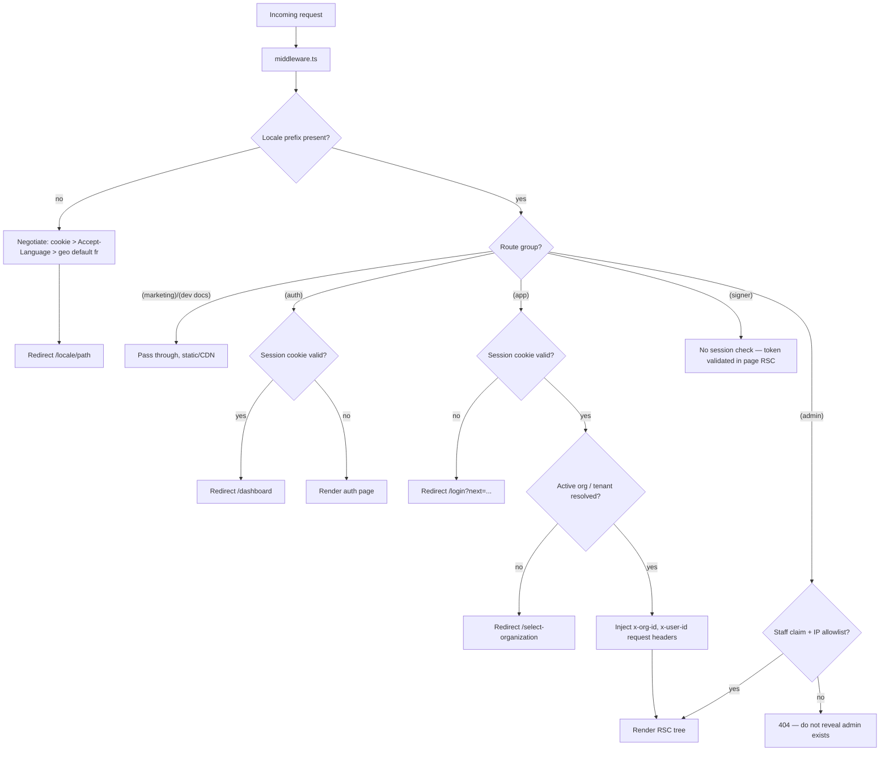
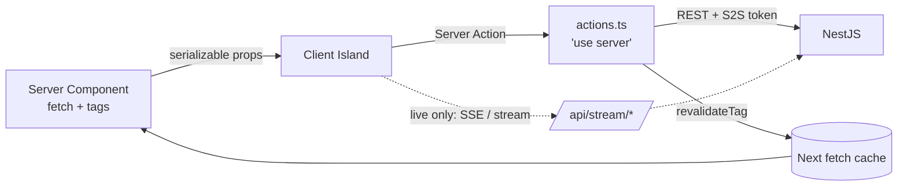
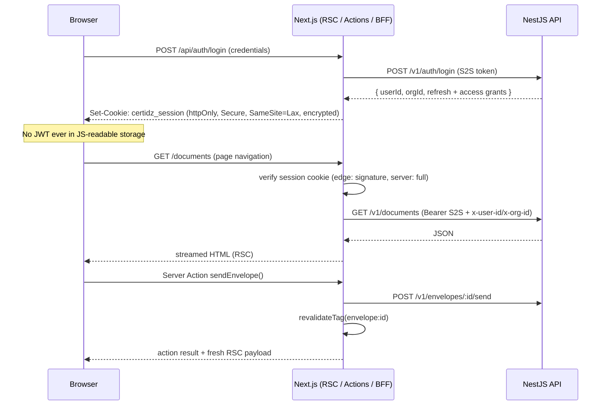

# CertiDZ Frontend Architecture

**Product:** CertiDZ by HISN — The Trusted AI-Powered Digital Trust Platform for Algeria and Africa
**Scope:** e-signatures, digital identity verification, PKI/certificates, trusted document management, AI document intelligence, workflows, multi-tenant organizations
**Stack:** Next.js (App Router, RSC, PPR) · NestJS REST API (+ GraphQL for dashboard reads) · Tailwind design system · FR/AR/EN with full RTL
**Status:** Living document — owned by Frontend Architecture. Changes via ADR + PR review.
**Last updated:** 2026-07-02

---

## Table of Contents

1. [App Router Route Map](#1-app-router-route-map)
2. [Server vs Client Component Strategy](#2-server-vs-client-component-strategy)
3. [Data Fetching & Mutations](#3-data-fetching--mutations)
4. [State Management](#4-state-management)
5. [Design System](#5-design-system)
6. [Internationalization & RTL Arabic](#6-internationalization--rtl-arabic)
7. [Accessibility — WCAG 2.2 AA](#7-accessibility--wcag-22-aa)
8. [PWA / Offline Strategy](#8-pwa--offline-strategy)
9. [Performance Budgets](#9-performance-budgets)

---

## 1. App Router Route Map

### 1.1 Principles

- **Route groups** partition the app into isolated layout trees with distinct shells, auth requirements, and bundles: `(marketing)`, `(auth)`, `(app)`, `(signer)`, `(admin)`, `(dev)`.
- Every group under `/[locale]/` for i18n (see §6). The signer ceremony additionally accepts `?lang=` overrides because guest signers arrive via email links.
- **Loading and error boundaries at every data-bearing segment.** `loading.tsx` renders skeletons matched to the final layout (CLS discipline, §9); `error.tsx` is a client boundary with retry + Sentry capture; `not-found.tsx` at group roots.
- **PPR (Partial Prerendering)** is the default rendering posture for `(marketing)` and the `(app)` shell: static shell streamed instantly, dynamic holes suspend.

### 1.2 Annotated route tree

```text
app/
└── [locale]/                                  # fr | ar | en — set by middleware, drives dir="rtl"
    ├── layout.tsx                             # <html lang dir> + NextIntlClientProvider + ThemeProvider
    │
    ├── (marketing)/                           # PUBLIC · static/PPR · marketing shell (header/footer, no app chrome)
    │   ├── layout.tsx                         # glass hero-capable header, mega-nav, footer
    │   ├── page.tsx                           # Landing — static, PPR hole for "live signatures counter"
    │   ├── pricing/page.tsx                   # static; plan cards from CMS at build, ISR 1h
    │   ├── product/
    │   │   ├── e-signature/page.tsx           # static
    │   │   ├── identity-verification/page.tsx # static
    │   │   ├── pki-certificates/page.tsx      # static
    │   │   ├── document-intelligence/page.tsx # static (AI features)
    │   │   └── workflows/page.tsx             # static
    │   ├── docs/
    │   │   ├── layout.tsx                     # docs sidebar (generated from MDX tree)
    │   │   └── [...slug]/page.tsx             # static, generateStaticParams from MDX; ISR
    │   ├── blog/
    │   │   ├── page.tsx                       # static list, ISR 15m
    │   │   └── [slug]/page.tsx                # static, generateStaticParams
    │   ├── legal/
    │   │   ├── terms/page.tsx                 # static
    │   │   ├── privacy/page.tsx               # static
    │   │   ├── cps/page.tsx                   # Certification Practice Statement — static, versioned
    │   │   └── compliance/page.tsx            # eIDAS / Algerian law 15-04 mapping — static
    │   ├── contact/page.tsx                   # static shell + Server Action form
    │   └── error.tsx / not-found.tsx
    │
    ├── (auth)/                                # PUBLIC (unauthenticated only) · dynamic · centered card shell
    │   ├── layout.tsx                         # minimal brand shell; redirects authed users → /dashboard
    │   ├── login/page.tsx                     # email+password / SSO buttons / passkey autofill (conditional UI)
    │   ├── register/page.tsx                  # org-or-personal signup wizard step 1
    │   ├── forgot-password/page.tsx
    │   ├── reset-password/[token]/page.tsx    # dynamic — token validated server-side before render
    │   ├── mfa/page.tsx                       # MFA challenge: TOTP / SMS / recovery codes (interstitial session)
    │   ├── passkey/page.tsx                   # WebAuthn register/authenticate ceremony (client island)
    │   ├── invite/[token]/page.tsx            # org invite acceptance — token → org preview → accept/create account
    │   ├── verify-email/[token]/page.tsx      # dynamic; server-verifies then redirects
    │   └── loading.tsx / error.tsx
    │
    ├── (app)/                                 # AUTHENTICATED · dynamic + PPR shell · full dashboard chrome
    │   ├── layout.tsx                         # AppShell: sidebar nav, topbar (org switcher, notifications, cmd-K)
    │   │                                      #   — server component; user/org fetched once, passed down
    │   ├── template.tsx                       # per-navigation transition wrapper (motion, §5.7)
    │   ├── dashboard/page.tsx                 # PPR: static frame + suspended KPI cards, pending-actions list
    │   │   └── @activity/                     # PARALLEL ROUTE: live activity feed slot, independent loading
    │   │       ├── page.tsx
    │   │       └── default.tsx
    │   ├── documents/
    │   │   ├── layout.tsx                     # documents section shell + filter bar
    │   │   ├── page.tsx                       # list — dynamic; URL-as-state filters (?q=&status=&page=)
    │   │   ├── loading.tsx                    # table skeleton (fixed row heights → zero CLS)
    │   │   ├── @modal/                        # PARALLEL SLOT for intercepted preview modal
    │   │   │   ├── default.tsx                # renders null
    │   │   │   └── (.)documents/[id]/preview/page.tsx   # INTERCEPTING: in-context modal preview
    │   │   └── [id]/
    │   │       ├── page.tsx                   # detail: metadata, versions, audit, share
    │   │       ├── preview/page.tsx           # full-page viewer (hard navigation / refresh target)
    │   │       └── error.tsx                  # per-document error (403/404 → tailored messages)
    │   ├── envelopes/
    │   │   ├── page.tsx                       # list — dynamic; tabs: inbox/sent/drafts/completed
    │   │   ├── new/
    │   │   │   ├── layout.tsx                 # wizard shell (stepper) — client boundary starts here
    │   │   │   ├── page.tsx                   # step 1: upload/choose docs
    │   │   │   ├── recipients/page.tsx        # step 2: recipients, signing order, identity requirements
    │   │   │   ├── fields/page.tsx            # step 3: drag-drop field placement on PDF (client-heavy)
    │   │   │   └── review/page.tsx            # step 4: review + send (Server Action)
    │   │   └── [id]/
    │   │       ├── page.tsx                   # envelope detail: recipients, timeline, docs
    │   │       ├── status/page.tsx            # live signing status (SSE via TanStack Query, §3.4)
    │   │       └── error.tsx
    │   ├── templates/
    │   │   ├── page.tsx                       # template gallery — dynamic, org-scoped
    │   │   └── [id]/edit/page.tsx             # template editor (reuses field-placement islands)
    │   ├── organizations/
    │   │   └── [orgId]/
    │   │       ├── layout.tsx                 # org settings sub-nav; RBAC gate (admin/owner)
    │   │       ├── settings/page.tsx          # name, logo, legal identity, branding
    │   │       ├── members/page.tsx           # members table + invites (Server Actions)
    │   │       └── teams/page.tsx             # teams CRUD
    │   ├── teams/[teamId]/page.tsx            # team workspace: shared envelopes/templates
    │   ├── analytics/
    │   │   ├── page.tsx                       # GraphQL-backed dashboard (§3.5); PPR frame + suspended charts
    │   │   └── loading.tsx
    │   ├── assistant/
    │   │   ├── page.tsx                       # AI chat — server shell, client stream consumer island
    │   │   └── [conversationId]/page.tsx      # resumed conversation
    │   ├── certificates/
    │   │   ├── page.tsx                       # cert list (X.509 inventory, expiry badges)
    │   │   ├── request/page.tsx               # cert request wizard (CSR generated server-side; key ceremony UX)
    │   │   └── [id]/page.tsx                  # cert detail: chain, OCSP status, revoke action
    │   ├── audit/page.tsx                     # audit log — dynamic; cursor pagination; export action
    │   ├── settings/
    │   │   ├── layout.tsx                     # settings sub-nav
    │   │   ├── profile/page.tsx
    │   │   ├── security/page.tsx              # password, MFA devices, passkeys, sessions
    │   │   ├── notifications/page.tsx
    │   │   ├── api-keys/page.tsx              # personal API keys (org keys live in dev portal)
    │   │   └── webhooks/page.tsx
    │   ├── billing/
    │   │   ├── plans/page.tsx                 # plan comparison + upgrade (Server Action → payment provider)
    │   │   ├── invoices/page.tsx
    │   │   └── usage/page.tsx                 # metered usage (envelopes, ID checks, AI tokens)
    │   ├── loading.tsx / error.tsx / not-found.tsx
    │   └── global-error.tsx                   # root-level catch (also at app/ root)
    │
    ├── (signer)/                              # PUBLIC (token-gated, NO session auth) · dynamic · minimal shell
    │   ├── layout.tsx                         # branded-by-sender shell; no app nav; locale from token/?lang
    │   ├── sign/[token]/
    │   │   ├── page.tsx                       # ceremony entry: server validates token → state machine
    │   │   ├── identity/page.tsx              # identity checks: OTP / ID doc capture / liveness (client islands)
    │   │   ├── review/page.tsx                # document review + field completion (PDF viewer island)
    │   │   ├── consent/page.tsx               # legal consent (e-signature disclosure, law 15-04 notice)
    │   │   ├── complete/page.tsx              # done screen + download signed copy + audit certificate
    │   │   ├── declined/page.tsx
    │   │   ├── expired/page.tsx               # expired/voided token terminal states
    │   │   └── error.tsx                      # tamper/invalid token → safe generic error (no oracle)
    │   └── verify/
    │       ├── page.tsx                       # public verification: upload PDF → validity report
    │       └── [reportId]/page.tsx            # shareable verification report (signed URL, dynamic)
    │
    ├── (admin)/                               # INTERNAL STAFF · dynamic · separate shell, separate RBAC (staff SSO)
    │   └── admin/
    │       ├── layout.tsx                     # staff-only gate (middleware + server re-check); red top border
    │       ├── page.tsx                       # ops overview
    │       ├── tenants/
    │       │   ├── page.tsx                   # tenant list, search, impersonation (audited)
    │       │   └── [tenantId]/page.tsx
    │       ├── plans/page.tsx                 # plan/entitlement management
    │       ├── feature-flags/page.tsx         # flag console (targeting rules per tenant/user)
    │       └── health/page.tsx                # system health: queues, HSM status, CA connectivity, error rates
    │
    ├── (dev)/                                 # DEVELOPER PORTAL · mixed static/dynamic
    │   └── developers/
    │       ├── layout.tsx                     # dev-portal shell (docs sidebar + console tabs)
    │       ├── page.tsx                       # portal home — static
    │       ├── docs/[...slug]/page.tsx        # API reference from OpenAPI spec — static, ISR on spec publish
    │       ├── keys/page.tsx                  # org API keys — AUTH REQUIRED, dynamic
    │       └── webhook-tester/page.tsx        # webhook sandbox: send test events, inspect deliveries — AUTH, dynamic
    │
    └── api/                                   # BFF route handlers (NOT pages) — see §3.3
        ├── auth/[...auth]/route.ts            # session endpoints (login/logout/refresh/callback)
        ├── bff/[...path]/route.ts             # authenticated proxy → NestJS (cookie → bearer swap)
        ├── stream/envelopes/[id]/route.ts     # SSE relay for signing status
        ├── stream/assistant/route.ts          # AI chat stream relay
        └── health/route.ts
```

### 1.3 Intercepting route: document preview modal

Clicking a row in `/documents` opens `(.)documents/[id]/preview` into the `@modal` slot — soft navigation, list state preserved, URL shareable. A hard refresh on the same URL renders the full-page `documents/[id]/preview` instead.

```tsx
// app/[locale]/(app)/documents/@modal/(.)documents/[id]/preview/page.tsx
import { Modal } from "@/components/ui/modal";
import { DocumentPreview } from "@/features/documents/preview";

export default async function InterceptedPreview(
  { params }: { params: Promise<{ id: string }> }
) {
  const { id } = await params;
  return (
    <Modal returnFocus dismissRoute="/documents">
      <DocumentPreview documentId={id} variant="modal" />
    </Modal>
  );
}
```

### 1.4 Route table — auth × rendering mode

| Route class | Examples | Auth | Rendering | Cache posture |
|---|---|---|---|---|
| Marketing pages | `/`, `/pricing`, `/product/*` | Public | **Static + PPR** (dynamic holes only where needed) | CDN, ISR 1h |
| Docs / blog / legal | `/docs/*`, `/blog/*`, `/legal/*` | Public | **Static** (`generateStaticParams`) | CDN, ISR on publish webhook |
| Auth pages | `/login`, `/register`, `/mfa` | Guest-only (redirect if authed) | Dynamic (reads cookies) | `no-store` |
| Token pages | `/reset-password/[t]`, `/invite/[t]`, `/verify-email/[t]` | Token | Dynamic | `no-store` |
| App shell + lists | `/dashboard`, `/documents`, `/envelopes` | **Session required** | **PPR**: static chrome, dynamic data holes | Data via fetch tags (§3.2) |
| App detail pages | `/envelopes/[id]`, `/certificates/[id]` | Session + RBAC | Dynamic (streaming SSR) | Tagged fetch cache |
| Envelope wizard | `/envelopes/new/*` | Session | Dynamic shell, client-heavy steps | `no-store` |
| Analytics | `/analytics` | Session + role | PPR frame + suspended GraphQL charts | Query-level TTL 60s |
| Signing ceremony | `/sign/[token]/*` | **Signing token only** | Dynamic, `no-store`, `X-Robots-Tag: noindex` | Never cached |
| Public verify | `/verify` | Public | Static shell + client upload island | Shell CDN |
| Admin console | `/admin/*` | **Staff SSO + IP allowlist** | Dynamic | `no-store` |
| Dev portal docs | `/developers/docs/*` | Public | Static, ISR | CDN |
| Dev portal console | `/developers/keys`, `/developers/webhook-tester` | Session + org role | Dynamic | `no-store` |

### 1.5 Navigation and auth flow (middleware)



Middleware does **only** cheap edge work: locale negotiation, cookie presence/JWT signature check, tenant header injection, admin gating. Full authorization (RBAC per resource) is re-verified server-side in RSC/Server Actions — middleware is a router, not a security boundary.

---

## 2. Server vs Client Component Strategy

### 2.1 Default: server-first

Every component is a **Server Component unless proven otherwise**. RSC gives us: zero client JS for data display, direct secure API access with the service token, streaming, and smaller bundles — critical on the mid-range Android devices and constrained networks common in our Algerian/African markets.

**Decision test** — a component becomes a client component only if it needs at least one of:

1. Event handlers driving local interaction (drag, draw, keystroke-level UI)
2. Browser-only APIs: canvas, WebAuthn, `getUserMedia`, IndexedDB, `IntersectionObserver`, service worker messaging
3. React state/effects that cannot be modeled as URL state or server round-trip
4. Subscription to a live stream (SSE/WebSocket) or TanStack Query cache

### 2.2 Mandatory client islands

| Island | Why client | Loading strategy |
|---|---|---|
| **Signature pad** (`<SignaturePad/>`) | Canvas pointer-event drawing, pressure smoothing | `next/dynamic`, `ssr: false`, loaded only on signature step |
| **PDF viewer + field placement** (`<PdfWorkbench/>`) | pdf.js canvas rendering, drag-drop field overlay, zoom/pan gestures | Dynamic import; pdf.js worker as separate chunk; preloaded on wizard step 2 → 3 transition |
| **WebAuthn flows** | `navigator.credentials.create/get` | Small island inside server-rendered auth pages |
| **Camera / liveness capture** | `getUserMedia`, frame capture, on-device pre-checks before upload | Dynamic import, permission-gated; SSR-safe fallback panel |
| **AI chat stream consumer** | Consumes SSE/fetch-stream, incremental token rendering, optimistic user bubble | Island inside server-rendered conversation shell |
| **Envelope wizard steps 2–3** | Complex interactive editing state | Client boundary at wizard `layout.tsx` |
| **Org switcher / command palette (⌘K)** | Keyboard-driven, instant filtering | Deferred (`requestIdleCallback` mount) |
| **Toasts, dialogs, dropdowns** | Radix primitives need interactivity | Shared UI chunk in app shell |

### 2.3 Composition: server shell + client islands

The pattern is always **server shell fetches data → passes serializable props into client islands → islands raise intent via Server Actions or thin BFF calls**.

```tsx
// app/[locale]/(app)/envelopes/[id]/status/page.tsx  — SERVER
import { api } from "@/lib/api/server";
import { SigningStatusLive } from "@/features/envelopes/signing-status-live";

export default async function StatusPage({ params }: { params: Promise<{ id: string }> }) {
  const { id } = await params;
  const envelope = await api.envelopes.get(id, { next: { tags: [`envelope:${id}`] } });

  return (
    <section aria-labelledby="status-h">
      <h1 id="status-h">{envelope.title}</h1>
      <RecipientsTimeline recipients={envelope.recipients} /> {/* server, static per request */}
      {/* Client island: hydrates with server snapshot, then subscribes to SSE */}
      <SigningStatusLive envelopeId={id} initialStatus={envelope.status} />
    </section>
  );
}
```

```tsx
// features/envelopes/signing-status-live.tsx — CLIENT ISLAND
"use client";
import { useEnvelopeStatusStream } from "./use-envelope-status-stream";

export function SigningStatusLive({ envelopeId, initialStatus }: Props) {
  const { status, lastEvent } = useEnvelopeStatusStream(envelopeId, initialStatus);
  return (
    <div role="status" aria-live="polite">
      <StatusBadge status={status} />
      {lastEvent && <p>{lastEvent.message}</p>}
    </div>
  );
}
```

### 2.4 `"use client"` boundary rules

1. **Place the directive as deep as possible.** Never on a page or section layout except the envelope wizard steps (justified: whole step is interactive).
2. **Pass server data as props, not by re-fetching in the island.** The island receives an `initial*` snapshot and only fetches for *live* deltas.
3. **Never import a server-only module from a client file.** Enforced with `import "server-only"` in `lib/api/server.ts`, `lib/auth/session.ts` and ESLint rule `no-restricted-imports` mapping client globs.
4. **Children punch-through:** interactive wrappers accept `children: ReactNode` so server-rendered content passes *through* client components without becoming client code (e.g., `<Collapsible>` wrapping a server-rendered audit list).
5. **No secrets, ever, cross the boundary.** Serialization is reviewed: DTOs from the API are re-shaped by `toClientEnvelope()` mappers that whitelist fields (never spread raw API objects into props).

### 2.5 Data-down / actions-up

- **Data down:** RSC → props → islands. One direction only.
- **Actions up:** islands call **Server Actions** for mutations (typed, co-located in `features/*/actions.ts`) or the BFF for streams. Islands never call NestJS directly.
- After a Server Action mutates, it calls `revalidateTag(...)` — the server tree re-renders, refreshed data flows down again. Islands reconcile their live-view state against the new snapshot (`initial*` prop change → `useEffect` sync or key remount).



---

## 3. Data Fetching & Mutations

### 3.1 Server-side reads (the default)

Server Components call NestJS through a typed API client (`lib/api/server.ts`) that:

- attaches a **service-to-service token** (short-lived, minted by the Next server from `CERTIDZ_S2S_KEY`, audience `api.certidz.dz`) **plus** the acting user context (`x-user-id`, `x-org-id` from the verified session) — the API enforces authorization on the user context, the S2S token only authenticates the caller as "the trusted frontend";
- uses `fetch` with `next: { tags }` so Next's Data Cache can be surgically invalidated;
- validates responses with zod schemas from `@certidz/contracts` (fail fast on drift).

```ts
// lib/api/server.ts
import "server-only";
import { getSession } from "@/lib/auth/session";
import { EnvelopeSchema } from "@certidz/contracts/envelopes";

async function apiFetch<T>(path: string, schema: z.ZodType<T>, init?: NextFetchInit): Promise<T> {
  const session = await getSession();               // reads httpOnly cookie, verifies
  const res = await fetch(`${process.env.API_URL}${path}`, {
    ...init,
    headers: {
      authorization: `Bearer ${await mintS2SToken()}`,
      "x-user-id": session.userId,
      "x-org-id": session.orgId,
      "accept-language": session.locale,
      ...init?.headers,
    },
  });
  if (!res.ok) throw await ApiError.from(res);       // typed: 401/403/404/409/422
  return schema.parse(await res.json());
}

export const api = {
  envelopes: {
    get: (id: string, init?: NextFetchInit) =>
      apiFetch(`/v1/envelopes/${id}`, EnvelopeSchema, init),
    list: (orgId: string, qs: EnvelopeListQuery) =>
      apiFetch(`/v1/envelopes?${serialize(qs)}`, EnvelopeListSchema, {
        next: { tags: [`org:${orgId}:envelopes`], revalidate: 30 },
      }),
  },
  // documents, templates, certificates, members, ...
};
```

### 3.2 Cache tag naming convention

| Pattern | Example | Invalidated by |
|---|---|---|
| `{entity}:{id}` | `envelope:env_8f3a`, `document:doc_11`, `cert:crt_42` | Any mutation of that entity |
| `org:{id}:{collection}` | `org:org_7:envelopes`, `org:org_7:members` | Create/delete/list-affecting changes in the org |
| `user:{id}:{aspect}` | `user:u_9:notifications`, `user:u_9:profile` | Profile/settings mutations |
| `org:{id}:usage` | billing usage widgets | Metering webhook → `revalidateTag` via route handler |

Rules: lowercase, colon-separated, **entity tag AND collection tag both applied** to list fetches so a detail update can refresh both granularly. Tags are defined as helper functions in `@certidz/contracts/cache-tags.ts` — never string-literal at call sites.

```ts
// @certidz/contracts/cache-tags.ts
export const tags = {
  envelope: (id: string) => `envelope:${id}` as const,
  orgEnvelopes: (orgId: string) => `org:${orgId}:envelopes` as const,
  document: (id: string) => `document:${id}` as const,
  orgDocuments: (orgId: string) => `org:${orgId}:documents` as const,
} satisfies Record<string, (...a: string[]) => string>;
```

### 3.3 Mutations: Server Actions + BFF

**Server Actions are the only mutation path from UI code.** Each action: (1) re-checks session + RBAC, (2) validates input with the shared zod schema, (3) calls NestJS, (4) revalidates tags, (5) returns a typed discriminated result (never throws across the wire for expected failures).

```ts
// features/envelopes/actions.ts
"use server";
import { z } from "zod";
import { SendEnvelopeInput } from "@certidz/contracts/envelopes";
import { tags } from "@certidz/contracts/cache-tags";
import { revalidateTag } from "next/cache";

export async function sendEnvelope(raw: unknown): Promise<ActionResult<{ envelopeId: string }>> {
  const session = await requireSession({ permission: "envelopes:send" });
  const parsed = SendEnvelopeInput.safeParse(raw);
  if (!parsed.success) return { ok: false, error: "validation", issues: parsed.error.flatten() };

  const res = await api.envelopes.send(parsed.data);          // S2S + user context
  revalidateTag(tags.envelope(res.id));
  revalidateTag(tags.orgEnvelopes(session.orgId));
  return { ok: true, data: { envelopeId: res.id } };
}
```

`revalidatePath` is reserved for structural changes where tag granularity doesn't apply (locale switch, org switch → `revalidatePath('/[locale]/(app)', 'layout')`).

**BFF route handlers** (`app/api/bff/[...path]/route.ts`) exist for the few cases Server Actions can't cover: file uploads with progress (client `fetch` + `ReadableStream`), SSE relays, and download proxying (signed, audit-logged document downloads). The BFF swaps the httpOnly session cookie for the S2S+user-context headers — **the browser never holds an API JWT** (see §3.6).

### 3.4 Client-side live state: TanStack Query (narrow scope)

TanStack Query is used **only** where the client must own a live, changing dataset:

| Use case | Transport | Query config |
|---|---|---|
| Signing status (`/envelopes/[id]/status`, signer ceremony) | SSE via `/api/stream/envelopes/[id]`; polling fallback every 5s if SSE unsupported | `staleTime: Infinity` (stream pushes into cache via `queryClient.setQueryData`) |
| AI assistant chat | fetch stream via `/api/stream/assistant` | mutation + manual cache append per token chunk |
| Notification bell | SSE multiplexed on one connection | `setQueryData` on push; badge from cache |
| Webhook tester deliveries | polling 2s while panel open | `refetchInterval: 2000`, stops on blur |

Everything else — lists, details, settings — is server-fetched. **No TanStack Query for data that RSC already rendered.** Query keys mirror cache tags (`['envelope', id, 'status']`) for developer legibility.

```ts
// features/envelopes/use-envelope-status-stream.ts
"use client";
export function useEnvelopeStatusStream(envelopeId: string, initial: EnvelopeStatus) {
  const qc = useQueryClient();
  const { data } = useQuery({
    queryKey: ["envelope", envelopeId, "status"],
    initialData: initial,
    staleTime: Infinity,
  });

  useEffect(() => {
    const es = new EventSource(`/api/stream/envelopes/${envelopeId}`);
    es.onmessage = (e) => qc.setQueryData(["envelope", envelopeId, "status"], JSON.parse(e.data));
    es.onerror = () => { es.close(); startPollingFallback(qc, envelopeId); };
    return () => es.close();
  }, [envelopeId, qc]);

  return { status: data };
}
```

### 3.5 GraphQL for the analytics dashboard

The analytics page reads from the NestJS GraphQL endpoint (optimized read models / materialized views). Queries execute **in Server Components** (with `graphql-request` + codegen types), suspended per-chart so the PPR frame streams immediately:

```tsx
// app/[locale]/(app)/analytics/page.tsx
export default function AnalyticsPage() {
  return (
    <AnalyticsGrid>
      <Suspense fallback={<ChartSkeleton title="Envelope volume" />}>
        <EnvelopeVolumeChart />          {/* async RSC → gql query, revalidate: 60 */}
      </Suspense>
      <Suspense fallback={<ChartSkeleton title="Completion time" />}>
        <CompletionTimeChart />
      </Suspense>
      <Suspense fallback={<ChartSkeleton title="ID verification pass rate" />}>
        <IdvPassRateChart />
      </Suspense>
    </AnalyticsGrid>
  );
}
```

Client-side GraphQL is not used; interactive date-range changes are URL-as-state (`?from=&to=` → server re-render via soft navigation).

### 3.6 Auth token handling — BFF pattern



Rules:

- Session cookie: `httpOnly`, `Secure`, `SameSite=Lax`, encrypted (sealed) payload containing session id only; session record (user, org, roles, refresh token) lives in Redis, rotated on privilege change.
- **Raw API JWTs never reach the browser.** All browser traffic terminates at Next (pages, actions, `/api/bff/*`, `/api/stream/*`).
- CSRF: Server Actions get Next's built-in origin checks; BFF handlers additionally verify `Origin`/`Sec-Fetch-Site`.
- Signer ceremony uses a distinct **signing token** (opaque, single-envelope scope, stored in a `certidz_sign_{envelopeId}` scoped cookie after first validation) — never mixed with user sessions.

---

## 4. State Management

### 4.1 The hierarchy (in order of preference)

1. **Server state** → RSC fetch + cache tags (source of truth).
2. **URL state** → filters, pagination, tabs, date ranges, wizard step. Shareable, back-button-correct, SSR-consistent. Managed with `nuqs`-style typed search-param hooks.
3. **Live client state** → TanStack Query (§3.4 scope only).
4. **Ephemeral UI state** → local `useState`/`useReducer` inside islands.
5. **Cross-component client state** → **Zustand**, only for the three sanctioned slices below.

Anything reaching for Zustand must justify why it isn't 1–4. Redux/global context stores are banned.

### 4.2 Zustand slices

Each slice is its own store (no monolith), created per-mount with the vanilla-store + context pattern so wizard state resets on unmount and never leaks between envelopes:

| Slice | Contents | Persistence |
|---|---|---|
| `envelope-builder` | uploaded docs, recipients + routing order, placed fields (id, page, x/y/w/h in **PDF points**, recipient binding, required flag), dirty flag, autosave status | Draft autosaved to API every 5s when dirty (Server Action `saveDraft`); store hydrated from draft on wizard entry |
| `document-viewer` | current page, zoom, fit mode, rotation, sidebar panel, text-layer search hits | `sessionStorage` per document id (restore position on modal reopen) |
| `ai-chat` | composer draft, streaming buffer, tool-call render state, scroll anchoring | composer draft in `sessionStorage`; messages live in TanStack Query cache, not Zustand |

```ts
// features/envelopes/builder-store.ts
"use client";
import { createStore } from "zustand/vanilla";
import { immer } from "zustand/middleware/immer";
import type { PlacedField, RecipientDraft } from "@certidz/contracts/envelopes";

export interface BuilderState {
  documents: UploadedDoc[];
  recipients: RecipientDraft[];
  fields: PlacedField[];
  dirty: boolean;
  placeField: (f: Omit<PlacedField, "id">) => void;
  moveField: (id: string, dx: number, dy: number) => void;   // also driven by keyboard (§7)
  bindField: (id: string, recipientId: string) => void;
}

export const createBuilderStore = (initial: Partial<BuilderState>) =>
  createStore<BuilderState>()(immer((set) => ({
    documents: [], recipients: [], fields: [], dirty: false,
    ...initial,
    placeField: (f) => set((s) => { s.fields.push({ ...f, id: nanoid() }); s.dirty = true; }),
    moveField: (id, dx, dy) => set((s) => {
      const fl = s.fields.find((x) => x.id === id);
      if (fl) { fl.x = clampToPage(fl.x + dx); fl.y = clampToPage(fl.y + dy); s.dirty = true; }
    }),
    bindField: (id, rid) => set((s) => {
      const fl = s.fields.find((x) => x.id === id);
      if (fl) { fl.recipientId = rid; s.dirty = true; }
    }),
  })));
```

### 4.3 Forms: react-hook-form + shared zod contracts

- All schemas live in **`@certidz/contracts`** (a workspace package shared with the NestJS API): one schema = client validation + Server Action validation + API DTO. No drift.
- `useForm({ resolver: zodResolver(SendEnvelopeInput) })`; submission goes to the Server Action; server-side `issues` from `ActionResult` are mapped back onto fields with `setError`.
- Zod schemas carry i18n-able error message **keys**, not strings; the UI resolves keys through next-intl (`errors.recipient.emailInvalid`), so FR/AR/EN validation messages come from the same catalogs.
- Multi-step wizard: each step is its own form + schema slice (`SendEnvelopeInput.pick(...)`); the builder store holds cross-step state; final submit re-validates the full composed schema server-side.

### 4.4 URL-as-state

```tsx
// documents list — typed search params, server-readable
// /documents?q=contrat&status=pending&sort=updatedAt:desc&page=3
const searchParamsSchema = z.object({
  q: z.string().max(200).optional(),
  status: z.enum(["draft", "pending", "completed", "voided"]).optional(),
  sort: z.enum(["updatedAt:desc", "updatedAt:asc", "title:asc"]).default("updatedAt:desc"),
  page: z.coerce.number().int().min(1).default(1),
});
```

Rules: filter/sort/pagination/tab/date-range **must** be URL state; wizard step is the route segment itself; transient UI (open dropdown, hover) never touches the URL. Locale and org are **path/session** concerns, never query params.

---

## 5. Design System

Package: `@certidz/ui` (local shadcn-style components) + `@certidz/tokens` (CSS variables + Tailwind preset).

### 5.1 Design tokens — CSS variables

Two layers: **primitive scales** (raw values, never used directly in components) → **semantic tokens** (what components consume). Tailwind maps utilities to semantic tokens only.

```css
/* @certidz/tokens/base.css */
:root {
  /* ---------- Primitive: brand emerald (trust/primary) ---------- */
  --emerald-50:  oklch(0.979 0.021 166);
  --emerald-100: oklch(0.950 0.052 163);
  --emerald-200: oklch(0.905 0.093 164);
  --emerald-300: oklch(0.845 0.143 164);
  --emerald-400: oklch(0.765 0.177 163);
  --emerald-500: oklch(0.696 0.170 162);
  --emerald-600: oklch(0.596 0.145 163);   /* brand anchor */
  --emerald-700: oklch(0.508 0.118 165);
  --emerald-800: oklch(0.432 0.095 166);
  --emerald-900: oklch(0.378 0.077 168);
  --emerald-950: oklch(0.262 0.051 172);

  /* ---------- Primitive: gold (trust accent, seals, premium) ---------- */
  --gold-300: oklch(0.882 0.111 90);
  --gold-400: oklch(0.836 0.135 84);
  --gold-500: oklch(0.769 0.152 78);       /* seal/badge accent on dark */
  --gold-600: oklch(0.666 0.150 68);

  /* ---------- Primitive: neutrals (cool slate, dark-first) ---------- */
  --slate-0: #ffffff;  --slate-50: #f8fafc;  --slate-100: #f1f5f9;
  --slate-200: #e2e8f0; --slate-400: #94a3b8; --slate-600: #475569;
  --slate-800: #1e293b; --slate-900: #0f172a; --slate-950: #060a14;

  /* ---------- Spacing: 4px scale ---------- */
  --space-1: 0.25rem; --space-2: 0.5rem;  --space-3: 0.75rem; --space-4: 1rem;
  --space-5: 1.25rem; --space-6: 1.5rem;  --space-8: 2rem;    --space-10: 2.5rem;
  --space-12: 3rem;   --space-16: 4rem;   --space-20: 5rem;   --space-24: 6rem;

  /* ---------- Radius ---------- */
  --radius-sm: 0.375rem;  /* inputs, chips */
  --radius-md: 0.625rem;  /* buttons, cards default */
  --radius-lg: 1rem;      /* modals, panels */
  --radius-xl: 1.5rem;    /* marketing cards, glass surfaces */
  --radius-full: 9999px;

  /* ---------- Elevation ---------- */
  --shadow-1: 0 1px 2px oklch(0 0 0 / 0.06);
  --shadow-2: 0 2px 8px oklch(0 0 0 / 0.08), 0 1px 2px oklch(0 0 0 / 0.04);
  --shadow-3: 0 8px 24px oklch(0 0 0 / 0.12), 0 2px 6px oklch(0 0 0 / 0.06);
  --shadow-4: 0 16px 48px oklch(0 0 0 / 0.18);           /* modals, popovers */
  --shadow-glow-brand: 0 0 24px oklch(0.696 0.17 162 / 0.25); /* CTA emphasis, dark only */
}

/* ---------- Semantic: light ---------- */
:root, .light {
  --bg-canvas: var(--slate-50);
  --bg-surface: var(--slate-0);
  --bg-surface-raised: var(--slate-0);
  --bg-subtle: var(--slate-100);
  --fg-primary: var(--slate-900);
  --fg-secondary: var(--slate-600);
  --fg-muted: var(--slate-400);
  --border-default: var(--slate-200);
  --brand: var(--emerald-600);
  --brand-fg: #ffffff;
  --brand-subtle: var(--emerald-50);
  --accent-gold: var(--gold-600);
  --success: var(--emerald-600);
  --warning: oklch(0.75 0.15 70);
  --danger: oklch(0.577 0.215 27);
  --info: oklch(0.6 0.12 240);
  --focus-ring: var(--emerald-600);
}

/* ---------- Semantic: dark (trust palette: emerald + gold on deep slate) ---------- */
.dark {
  --bg-canvas: var(--slate-950);
  --bg-surface: var(--slate-900);
  --bg-surface-raised: var(--slate-800);
  --bg-subtle: oklch(0.24 0.02 260);
  --fg-primary: var(--slate-50);
  --fg-secondary: var(--slate-400);
  --fg-muted: var(--slate-600);
  --border-default: oklch(0.32 0.02 260);
  --brand: var(--emerald-500);
  --brand-fg: var(--slate-950);
  --brand-subtle: oklch(0.26 0.05 166);
  --accent-gold: var(--gold-500);        /* gold-on-dark: seals, verified badges, premium */
  --focus-ring: var(--emerald-400);
}
```

Tailwind preset maps semantics: `bg-surface`, `text-primary`, `border-default`, `bg-brand`, `text-gold` etc. Components **never** reference primitive scales.

### 5.2 Theming

- **Class strategy** (`.dark` on `<html>`), managed by `next-themes`: `attribute="class"`, `defaultTheme="system"`, `enableSystem`.
- Inline no-flash script in root layout sets class before paint from `localStorage` → falls back to `prefers-color-scheme`.
- **Per-user persistence:** theme choice synced to profile via Server Action (`user:{id}:profile` tag); on login, server renders the correct class immediately (cookie mirror `certidz_theme` readable at SSR — theme is not sensitive).
- Signer ceremony respects sender org branding tokens (logo, brand hue override within contrast-validated bounds) injected as CSS variables server-side.

### 5.3 Glassmorphism guidelines

Glass is a **signature accent, not a default surface**.

**Allowed:** marketing hero panels/nav on imagery, dashboard KPI "overlay" cards on the canvas gradient, command palette + notification popover scrims, signer ceremony header over sender branding.
**Forbidden:** data tables, forms, PDF viewer chrome, any surface with body text < 16px, any scroll container, more than **3 glass surfaces per viewport**, nested glass (glass on glass).

```css
/* Glass tokens */
:root {
  --glass-blur: 16px;
  --glass-blur-heavy: 24px;              /* hero only */
  --glass-bg-light: oklch(1 0 0 / 0.62);
  --glass-bg-dark: oklch(0.24 0.02 260 / 0.55);
  --glass-border-light: oklch(1 0 0 / 0.45);
  --glass-border-dark: oklch(1 0 0 / 0.09);
  --glass-inner-highlight: inset 0 1px 0 oklch(1 0 0 / 0.12);
}

.glass {
  background: var(--glass-bg-light);
  -webkit-backdrop-filter: blur(var(--glass-blur));
  backdrop-filter: blur(var(--glass-blur));
  border: 1px solid var(--glass-border-light);
  box-shadow: var(--shadow-2), var(--glass-inner-highlight);
  border-radius: var(--radius-xl);
}
.dark .glass { background: var(--glass-bg-dark); border-color: var(--glass-border-dark); }

/* Fallback: no backdrop-filter support → solid surface (never unreadable) */
@supports not (backdrop-filter: blur(1px)) {
  .glass { background: var(--bg-surface); }
}
/* Reduced transparency preference */
@media (prefers-reduced-transparency: reduce) {
  .glass { background: var(--bg-surface); backdrop-filter: none; -webkit-backdrop-filter: none; }
}
```

**Accessibility constraints (hard rules):**
- Text on glass must meet **4.5:1 against the *worst-case* backdrop** (test with the darkest/lightest content that can scroll behind). If backdrop is uncontrolled, add an opaque text plate or raise `--glass-bg-*` alpha to ≥ 0.85 behind text.
- Interactive elements on glass get solid backgrounds (buttons never inherit glass).
- Contrast on glass is CI-tested (§7) with backdrop permutations.

**Performance warning:** `backdrop-filter` forces layer creation and repaints on scroll — on the mid-range Android hardware dominant in our markets it is a jank source. Rules: never animate blur radius; never place glass inside scroll containers; cap 3 per viewport; `content-visibility: auto` on off-screen marketing sections; monitor long-frame RUM (§9) for glass-bearing routes.

### 5.4 Typography

**Pairing:** **Inter** (Latin, `latin` + `latin-ext` subsets) + **IBM Plex Sans Arabic** (Arabic). Loaded with `next/font` (self-hosted, zero layout-shift via `adjustFontFallback`), `display: "swap"`; per-locale variable assignment so the Arabic font is only on the critical path for `ar`.

```tsx
// app/fonts.ts
import { Inter, IBM_Plex_Sans_Arabic } from "next/font/google";
export const inter = Inter({ subsets: ["latin", "latin-ext"], variable: "--font-latin", display: "swap" });
export const plexArabic = IBM_Plex_Sans_Arabic({
  subsets: ["arabic"], weight: ["400", "500", "600", "700"],
  variable: "--font-arabic", display: "swap",
});
```

```css
:root { --font-sans: var(--font-latin), var(--font-arabic), system-ui, sans-serif; }
[dir="rtl"] { --font-sans: var(--font-arabic), var(--font-latin), system-ui, sans-serif; }
/* Arabic sets slightly larger optical size & looser leading */
[dir="rtl"] body { line-height: 1.7; letter-spacing: 0; }
```

**Type ramp (fluid with `clamp()`):**

| Token | Size | Line-height | Weight | Usage |
|---|---|---|---|---|
| `--text-xs` | `0.75rem` | 1.5 | 400/500 | badges, meta, table captions |
| `--text-sm` | `0.875rem` | 1.55 | 400/500 | table body, secondary text |
| `--text-base` | `1rem` | 1.6 (1.7 AR) | 400 | body |
| `--text-lg` | `clamp(1.0625rem, 1rem + 0.3vw, 1.125rem)` | 1.55 | 500 | lead paragraphs |
| `--text-xl` | `clamp(1.125rem, 1.05rem + 0.5vw, 1.25rem)` | 1.4 | 600 | card titles |
| `--text-2xl` | `clamp(1.35rem, 1.2rem + 0.8vw, 1.5rem)` | 1.35 | 600 | section headings (h3) |
| `--text-3xl` | `clamp(1.6rem, 1.35rem + 1.2vw, 1.875rem)` | 1.25 | 700 | page titles (h1 app) |
| `--text-4xl` | `clamp(2rem, 1.6rem + 2vw, 2.5rem)` | 1.2 | 700 | marketing h2 |
| `--text-5xl` | `clamp(2.5rem, 1.9rem + 3vw, 3.5rem)` | 1.1 | 800 | marketing hero |

Numerals: `font-variant-numeric: tabular-nums` in tables, usage meters, and audit timestamps.

### 5.5 Component library approach

- **shadcn/ui-style: components are copied into `@certidz/ui`, owned by us** — no runtime UI dependency to chase. Radix primitives underneath (Dialog, Popover, DropdownMenu, Tabs, Toast, Tooltip) for focus/ARIA correctness.
- Variants via `cva` (class-variance-authority); all styling through semantic-token Tailwind utilities.
- Layered structure: `@certidz/ui` (primitives: Button, Input, Dialog…) → `@certidz/ui/patterns` (DataTable, EmptyState, StatusBadge, FilterBar, WizardStepper) → `features/*` (product compositions, may be server or client).
- Every component ships: TS props doc, Storybook story (light/dark × ltr/rtl matrix), axe test, and visual regression snapshot (Chromatic) in all four combinations.

### 5.6 Motion

| Token | Value | Usage |
|---|---|---|
| `--dur-fast` | 120ms | hover, toggles, focus rings |
| `--dur-base` | 200ms | dropdowns, tooltips, tab panels |
| `--dur-slow` | 320ms | modals, drawers, page templates |
| `--dur-hero` | 600ms | marketing hero entrance only |
| `--ease-out` | `cubic-bezier(0.16, 1, 0.3, 1)` | entrances |
| `--ease-in` | `cubic-bezier(0.7, 0, 0.84, 0)` | exits |
| `--ease-spring` | `linear(...)` spring approximation | signature "sealed" stamp moment |

Rules: animate only `transform`/`opacity`; no motion above 320ms in the app shell; directional slide-ins **must flip with `dir`** (use logical translate helpers). Signing "completed" seal animation is the one sanctioned celebratory moment.

```css
@media (prefers-reduced-motion: reduce) {
  *, *::before, *::after {
    animation-duration: 0.01ms !important;
    animation-iteration-count: 1 !important;
    transition-duration: 0.01ms !important;
    scroll-behavior: auto !important;
  }
}
```

---

## 6. Internationalization & RTL Arabic

### 6.1 next-intl setup

- Locales: `fr` (default), `ar`, `en`. Routing: `/[locale]/…` with `localePrefix: "always"` (explicit, cacheable, shareable).
- Middleware negotiates: `NEXT_LOCALE` cookie → `Accept-Language` → geo default (`fr` for DZ; configurable per market as we expand).
- Message catalogs: `messages/{fr,ar,en}/{namespace}.json`, namespaced per feature (`envelopes.json`, `signing.json`, `errors.json`, …). Server components use `getTranslations`; only the namespaces an island needs are passed through `NextIntlClientProvider` (no full-catalog shipping).
- ICU MessageFormat throughout — **Arabic requires all six CLDR plural categories** (`zero/one/two/few/many/other`); lint rule rejects Arabic plurals missing categories.
- Signer ceremony: locale from envelope's per-recipient language, overridable via visible language switcher (guest signers can't set profile prefs).

```tsx
// app/[locale]/layout.tsx
import { getMessages, setRequestLocale } from "next-intl/server";
export default async function LocaleLayout({ children, params }: Props) {
  const { locale } = await params;
  setRequestLocale(locale);
  const dir = locale === "ar" ? "rtl" : "ltr";
  return (
    <html lang={locale} dir={dir} suppressHydrationWarning
          className={`${inter.variable} ${plexArabic.variable}`}>
      <body>
        <NextIntlClientProvider messages={await getMessages()}>{children}</NextIntlClientProvider>
      </body>
    </html>
  );
}
```

### 6.2 CSS logical properties — mandate

**Physical direction properties are banned.** ESLint (`eslint-plugin-tailwindcss` custom rule) + Stylelint (`stylelint-use-logical`) fail CI on `ml-`, `mr-`, `pl-`, `pr-`, `left-`, `right-`, `text-left`, `text-right`, `border-l`, `border-r`, and raw CSS `margin-left` etc.

| Banned | Required |
|---|---|
| `ml-4` / `mr-4` | `ms-4` / `me-4` |
| `pl-6` / `pr-6` | `ps-6` / `pe-6` |
| `left-0` / `right-0` | `start-0` / `end-0` |
| `text-left` / `text-right` | `text-start` / `text-end` |
| `border-l` / `rounded-r-lg` | `border-s` / `rounded-e-lg` |
| `translate-x-*` for directional slides | `[dir="rtl"]`-aware helper `translate-x-dir-*` |

The only exceptions (physical allowed, with `/* physical-ok */` comment): PDF page coordinates (PDF space is physical), signature canvas geometry, map/chart plot areas.

### 6.3 Icon mirroring

| Mirror in RTL | Never mirror |
|---|---|
| arrows (back/forward/next/prev), chevrons in nav, breadcrumb separators, "send", undo/redo, list-indent, pagination, progress direction | logos, clocks, checkmarks, media playback (universal convention), physical objects (pen, camera, document), numbers/badges, brand seal |

Implementation: `<Icon name="arrow-forward" mirrored />` → applies `rtl:-scale-x-100`. The icon registry flags each icon `directional: true|false`; a Storybook RTL sweep visually verifies the set.

### 6.4 Bidi pitfalls (legal text is our core content)

- **Mixed Latin-Arabic runs** (contract names, emails, reference numbers inside Arabic sentences): wrap user-generated inline data in `<bdi>` (or `unicode-bidi: isolate`) — mandatory in `Formatted.InlineData` component used by all templates.
- **Numbers:** Western digits by default (Algerian convention `ar-DZ`); never force `arab` numbering unless tenant opts in (`Intl.NumberFormat(locale, { numberingSystem })`).
- **Phone numbers, IBANs, cert serials, hashes** in RTL context: `dir="ltr"` + `unicode-bidi: isolate` on the value span, or they visually scramble.
- **Punctuation at run boundaries** (e.g., trailing period after a Latin envelope title in an Arabic sentence): solved by isolation, never by inserting raw LRM/RLM in translations — if a mark is unavoidable it lives in the message catalog, documented.
- **Truncation/ellipsis** of bidi strings: CSS `text-overflow: ellipsis` only on isolated spans; never truncate mid-string in JS for display.

### 6.5 Dates & numbers

- All formatting via `Intl` through next-intl's `format` API — no moment/dayjs locale bundles.
- `fr-DZ` / `ar-DZ` / `en` formatters; timezone `Africa/Algiers` default, per-user override.
- **Hijri display option** (user/tenant setting): secondary date line via `Intl.DateTimeFormat('ar-DZ-u-ca-islamic-umalqura')` — display only; all stored/legal timestamps remain ISO-8601 UTC, and the audit trail always prints the Gregorian+UTC form as the authoritative value.
- Currency: DZD with correct plural rules; usage meters use `Intl.NumberFormat` compact notation.

### 6.6 Pseudo-locale testing

Build-time generated `en-XA` (accented + 40% expansion + `[!! !!]` markers) and `ar-XB` (RTL exerciser wrapping English strings in RTL controls). Enabled in dev/preview via `?pseudo=1`. CI Playwright suite runs key flows in `ar-XB` to catch: hardcoded strings (no markers), overflow at +40%, physical-property leaks (layout diffs vs LTR snapshots).

---

## 7. Accessibility — WCAG 2.2 AA

Legal/product baseline: WCAG 2.2 AA across all surfaces; the **signing ceremony is the flagship** — a guest signer with a screen reader or keyboard-only must be able to complete a legally binding signature unassisted.

### 7.1 Checklist (criterion → implementation → verification)

| # | Criterion (WCAG 2.2) | Implementation | How tested |
|---|---|---|---|
| 1 | **2.4.3 / focus management in wizards** | Envelope wizard: on step change, focus moves to step heading (`tabIndex={-1}` + `focus()`); stepper announces "Étape 2 sur 4" via `aria-current="step"`; blocked next-step focus returns to first invalid field | Playwright: assert `document.activeElement` after each transition; NVDA script run |
| 2 | **Focus in modals (2.4.3, 1.3.2)** | Radix Dialog: focus trap, initial focus on first meaningful control, `Escape` closes, focus returns to trigger. Intercepted preview modal (§1.3) restores focus to originating table row | axe + Playwright trap test (Tab cycles inside; Shift+Tab from first wraps) |
| 3 | **Signature alternative (2.1.1, 2.5.1)** | Signature capture offers **three equivalent modes**: draw (canvas), **type** (name rendered in signature font, fully keyboard), **upload** image. Mode tabs are radio group; typed mode is default focus for keyboard users. Canvas itself has `role="img"` + label + "clear/redo" buttons | Manual SR matrix; Playwright completes full ceremony using typed mode with keyboard only |
| 4 | **PDF viewer accessibility (1.1.1, 1.3.1, 2.1.1)** | pdf.js text layer enabled (real selectable/readable text); page landmarks `aria-label="Page 3 sur 12"`; zoom/page controls are real buttons; document outline exposed as nav tree; for scanned PDFs, AI-extracted text offered as accessible alternative view ("Version texte") with clear non-authoritative disclaimer | axe on viewer DOM; SR reads a reference contract end-to-end in test matrix |
| 5 | **2.5.7 Dragging Movements** — field placement | Every drag has a non-drag path: select field type → click/Enter on page position to place; placed field selected → **arrow keys move 1pt, Shift+arrows 10pt**; alignment via toolbar ("align to previous", "center on line"); recipient binding via dropdown, not drag | Playwright keyboard-only test builds a complete envelope without pointer |
| 6 | **2.5.8 Target Size (Minimum)** | All interactive targets ≥ 24×24 CSS px (design tokens enforce `min-h-6 min-w-6`; touch surfaces use 44px comfortable size). Dense table row actions get padding hit-area extension | Custom Playwright audit walks interactive elements and measures bounding boxes |
| 7 | **2.4.11/2.4.13 Focus Not Obscured / Focus Appearance** | Focus ring token: 2px solid `--focus-ring` + 2px offset (`outline-offset`), ≥ 3:1 against adjacent colors in both themes, incl. on glass (solid ring, never translucent); sticky headers get `scroll-padding-top` so focused elements are never hidden beneath | Visual regression of focus states; contrast check in token CI |
| 8 | **3.3.1/3.3.2/3.3.3 Forms & errors** | RHF+zod: labels always visible (no placeholder-as-label), errors linked via `aria-describedby`, `aria-invalid`, error summary at top with anchor links on submit failure; error messages localized with recovery hints ("Format attendu : nom@domaine.dz") | axe rules forms; unit tests assert aria wiring; SR matrix |
| 9 | **4.1.3 Status Messages — live regions** | Signing status page & ceremony: `role="status"` `aria-live="polite"` for progress ("Ahmed a signé — 2 sur 3"); errors use `role="alert"`; AI chat streams into a live region throttled to sentence boundaries (not per-token, which floods SRs) | Playwright + virtual SR (guidepup) asserts announcements |
| 10 | **1.4.3/1.4.11 Contrast incl. glass** | Semantic token pairs contrast-tested in CI (light+dark). Glass surfaces tested against worst-case backdrops (§5.3); non-text UI (borders of inputs, focus, badges) ≥ 3:1 | Token-level contrast unit tests + axe on rendered pages incl. glass permutations |
| 11 | **Keyboard-only signing ceremony (2.1.1, 2.1.2)** | Full path: open link → language switch → identity OTP → document review (viewer keyboard nav: PgUp/PgDn pages, `F` next unsigned field with skip-link "Aller au champ suivant") → typed signature → consent checkbox → sign button → completion. No traps; canvas step skippable | Dedicated Playwright e2e `ceremony-keyboard.spec.ts` — release blocker |
| 12 | **3.2.6 Consistent Help / 3.3.8 Accessible Auth** | Help entry point at consistent position in every shell; auth never relies on cognitive tests — passkeys, OTP with paste allowed (`autocomplete="one-time-code"`), no copy-blocked fields | Manual review checklist per release |
| 13 | **1.3.4/1.4.10 Reflow & orientation** | Ceremony and app usable at 320px width & 400% zoom; PDF viewer switches to single-page fit; no orientation locks | Playwright viewport sweep 320/768/1280 at 400% zoom |
| 14 | **RTL + SR** | `lang`/`dir` correct per subtree; embedded LTR runs marked (`lang="fr"` spans in Arabic docs) so SRs switch synthesizers | NVDA + Arabic voice matrix (below) |

### 7.2 Testing stack

- **axe-core in CI**: `@axe-core/playwright` on every route in the route map (both themes, three locales); zero serious/critical violations = merge gate.
- **Playwright a11y suite**: keyboard journeys (ceremony, wizard, settings), focus assertions, live-region assertions via guidepup virtual screen reader.
- **Storybook**: `addon-a11y` per component; interaction tests for focus behavior.
- **Screen reader matrix (manual, per release):**

| SR | Browser/OS | Locales | Scope |
|---|---|---|---|
| NVDA | Firefox + Chrome / Windows | FR, **AR** (Arabic voice) | ceremony, wizard, dashboard |
| VoiceOver | Safari / macOS | FR, EN | ceremony, viewer |
| VoiceOver | Safari / iOS | FR, **AR** | ceremony (mobile is dominant signer path) |
| TalkBack | Chrome / Android | FR, AR | ceremony |

---

## 8. PWA / Offline Strategy

### 8.1 Posture

CertiDZ is **connectivity-resilient, not offline-first**. Networks in our markets are intermittent; the app must degrade gracefully — but trust operations have a hard rule:

> **Signing REQUIRES online.** Cryptographic signing, certificate operations, identity verification, and audit-trail writes are server-side, HSM-backed, and timestamped — they can never be queued offline. A signature "captured offline and synced later" would have a false audit timestamp and no server-side integrity chain. The ceremony detects offline state, blocks the sign action, preserves all entered state in memory, and auto-resumes when connectivity returns.

### 8.2 Manifest

```json
{
  "name": "CertiDZ — Plateforme de confiance numérique",
  "short_name": "CertiDZ",
  "id": "/fr/dashboard",
  "start_url": "/fr/dashboard?source=pwa",
  "display": "standalone",
  "dir": "auto",
  "lang": "fr",
  "background_color": "#060a14",
  "theme_color": "#0f172a",
  "categories": ["business", "productivity"],
  "icons": [
    { "src": "/icons/icon-192.png", "sizes": "192x192", "type": "image/png" },
    { "src": "/icons/icon-512.png", "sizes": "512x512", "type": "image/png" },
    { "src": "/icons/maskable-512.png", "sizes": "512x512", "type": "image/png", "purpose": "maskable" }
  ],
  "shortcuts": [
    { "name": "Nouvelle enveloppe", "url": "/fr/envelopes/new" },
    { "name": "Documents", "url": "/fr/documents" }
  ]
}
```

### 8.3 Service worker — Serwist

Serwist (`@serwist/next`) — maintained Workbox successor with first-class App Router support. **Scope exclusions:** the SW never handles `(signer)` routes, `(admin)`, `/api/auth`, or `/api/stream/*` (SSE must not be intercepted; ceremony must always hit network truth).

| Route class | Strategy | Cache | Limits |
|---|---|---|---|
| App shell assets (`/_next/static/*`, fonts, icons) | **Precache** (build manifest) | `precache-v{buildId}` | cleaned on activate |
| Marketing/doc pages HTML | Stale-while-revalidate | `pages-static` | 50 entries / 7 days |
| App HTML navigations | **Network-first** (3s timeout) → offline fallback page | `pages-app` | 25 entries / 24h |
| BFF GET (documents list, envelope list) | **Network-first** (2s) → cached snapshot, marked stale in UI | `api-read` | 60 entries / 12h |
| Document thumbnails / previews (already-viewed) | Stale-while-revalidate | `media-thumbs` | 100 entries / 50MB |
| BFF mutations, auth, streams, `(signer)` | **Network only** — never cached | — | — |

```ts
// app/sw.ts (Serwist)
import { defaultCache } from "@serwist/next/worker";
import { Serwist, NetworkFirst, StaleWhileRevalidate, NetworkOnly } from "serwist";

const serwist = new Serwist({
  precacheEntries: self.__SW_MANIFEST,
  skipWaiting: false,               // update flow is user-prompted (§8.5)
  clientsClaim: true,
  navigationPreload: true,
  runtimeCaching: [
    { matcher: ({ url }) => url.pathname.startsWith("/api/stream"), handler: new NetworkOnly() },
    { matcher: ({ url }) => /\/(sign|verify)\//.test(url.pathname), handler: new NetworkOnly() },
    {
      matcher: ({ url, request }) => request.method === "GET" && url.pathname.startsWith("/api/bff"),
      handler: new NetworkFirst({ cacheName: "api-read", networkTimeoutSeconds: 2,
        plugins: [expiration({ maxEntries: 60, maxAgeSeconds: 12 * 3600 })] }),
    },
    ...defaultCache,
  ],
  fallbacks: { entries: [{ url: "/offline", matcher: ({ request }) => request.mode === "navigate" }] },
});
serwist.addEventListeners();
```

### 8.4 Offline capabilities & queueing

**Available offline:** last-viewed documents/envelopes lists (snapshot, with a visible "données du {timestamp} — hors ligne" banner via `navigator.onLine` + SW response header `x-cache-snapshot`), previously opened document previews (thumbnails), drafting envelope metadata in the wizard (builder store in memory + IndexedDB draft mirror).

**Background Sync queue — non-critical actions only:** mark-notification-read, draft autosaves, telemetry/RUM beacons, comment drafts. Implemented with Serwist `BackgroundSyncQueue`; replayed requests carry an idempotency key header so the API dedupes.

**Never queued:** send envelope, sign, void, certificate request/revoke, member/role changes, billing — these fail loudly offline with a retry CTA.

### 8.5 Update flow

`skipWaiting: false`. When a new SW is `waiting`, the app shows a non-blocking toast — “Nouvelle version disponible · Actualiser” — except during an active signing ceremony or wizard with dirty state (deferred until safe). Accepting posts `{type:'SKIP_WAITING'}` to the SW and reloads on `controllerchange`. A hard-expiry: if a waiting SW is ignored > 7 days, next cold navigation activates it (security patches must land).

---

## 9. Performance Budgets

### 9.1 Core Web Vitals targets (p75, mobile RUM — reflecting DZ/African network reality: 3G/4G, mid-range Android)

| Metric | Target | Alert threshold |
|---|---|---|
| **LCP** | < 2.0s | > 2.5s |
| **INP** | < 200ms | > 350ms |
| **CLS** | < 0.1 | > 0.15 |
| **TTFB** | < 500ms (Algiers/EU edge) | > 800ms |

### 9.2 JS budget per route class (gzipped, first-load client JS)

| Route class | Budget | Notes |
|---|---|---|
| Marketing pages | **< 90 KB** | RSC-only content + theme/nav islands; zero React Query, zero forms lib |
| Auth pages | < 130 KB | + RHF/zod + WebAuthn island |
| App shell (dashboard, lists) | **< 250 KB** | shell chrome + Radix common chunk + query client |
| Envelope wizard step 3 (field placement) | < 250 KB shell **+ ≤ 320 KB lazy** | pdf.js core+worker & dnd loaded on demand, prefetched from step 2 |
| Signing ceremony | < 200 KB initial + lazy viewer/signature | ceremony must be fast on the worst devices — it's used by *guests* |
| Analytics | < 250 KB shell + ≤ 120 KB lazy charts | charts dynamic-imported per widget |
| Admin / dev portal | < 300 KB | internal tolerance, still enforced |

Enforced with `size-limit` in CI — a budget regression fails the PR:

```json
// .size-limit.json (excerpt)
[
  { "name": "marketing", "path": ".next/static/chunks/pages-marketing*.js", "limit": "90 KB" },
  { "name": "app-shell", "path": ".next/static/chunks/app-shell*.js", "limit": "250 KB" },
  { "name": "pdf-workbench (lazy)", "path": ".next/static/chunks/pdf-workbench*.js", "limit": "320 KB" },
  { "name": "signing-ceremony", "path": ".next/static/chunks/ceremony*.js", "limit": "200 KB" }
]
```

### 9.3 Techniques

- **PPR everywhere applicable**: static shells stream instantly; data holes suspend (dashboard, analytics, marketing live counters).
- **Streaming SSR + `Suspense`** granularity per widget, skeletons with fixed dimensions (CLS 0 by construction).
- **Dynamic imports**: `PdfWorkbench`, `SignaturePad`, liveness capture, charts, webhook tester — all `next/dynamic`; pdf.js worker via `new Worker(new URL(...))` in its own chunk; **prefetch on intent** (wizard step 2 mounts → `import()` warms step 3's chunks).
- **`next/image`** for all raster media: AVIF/WebP, exact `sizes`, priority only on LCP hero image; document thumbnails served pre-sized from the API.
- **Fonts**: self-hosted via `next/font`; Inter subset latin/latin-ext; **IBM Plex Sans Arabic subset to Arabic ranges only** (~45% smaller than full ME set) and preloaded only for `ar` HTML; `adjustFontFallback` metrics matching kills font-swap CLS.
- **Bundle analysis in CI**: `next build` + `@next/bundle-analyzer` artifact on every PR; `size-limit` gate; dependency review rule — any dep > 20 KB gz needs an ADR.
- **RUM**: `web-vitals` (attribution build) → Grafana Faro SDK → OTel collector; dimensions: route class, locale, `dir`, device memory, connection type, PWA/standalone. Vercel Speed Insights kept as cross-check. Alerting on p75 regression per route class per market (DZ mobile is its own dashboard).
- **Server**: Redis-backed fetch cache, edge middleware kept < 1ms logic, GraphQL persisted queries for analytics.

### 9.4 Lighthouse CI budgets

```json
// lighthouserc.json
{
  "ci": {
    "collect": {
      "url": [
        "http://localhost:3000/fr",
        "http://localhost:3000/fr/pricing",
        "http://localhost:3000/fr/login",
        "http://localhost:3000/ar",
        "http://localhost:3000/fr/verify"
      ],
      "numberOfRuns": 3,
      "settings": { "preset": "mobile", "throttling": { "rttMs": 150, "throughputKbps": 1638 } }
    },
    "assert": {
      "assertions": {
        "categories:performance": ["error", { "minScore": 0.9 }],
        "categories:accessibility": ["error", { "minScore": 1 }],
        "largest-contentful-paint": ["error", { "maxNumericValue": 2500 }],
        "cumulative-layout-shift": ["error", { "maxNumericValue": 0.1 }],
        "total-blocking-time": ["error", { "maxNumericValue": 300 }],
        "resource-summary:script:size": ["error", { "maxNumericValue": 250000 }],
        "resource-summary:font:size": ["error", { "maxNumericValue": 180000 }],
        "resource-summary:image:size": ["warn", { "maxNumericValue": 400000 }],
        "unused-javascript": ["warn", { "maxNumericValue": 60000 }]
      }
    },
    "upload": { "target": "lhci", "serverBaseUrl": "https://lhci.internal.certidz.dz" }
  }
}
```

Authenticated app routes are covered by a separate LHCI job using a seeded session cookie against the preview deployment (`/fr/dashboard`, `/fr/documents`, `/fr/envelopes/new`).

### 9.5 Performance governance

- Budgets live in-repo; changing one requires an ADR + perf-owner review.
- Weekly RUM review: p75 per route class × market; regressions bisected against deploy markers emitted to Grafana.
- Ceremony route has the strictest SLO: **p75 LCP < 1.8s on 4G mid-range Android** — it is the product's trust moment and the guest's first impression.

---

## Appendix A — Repository layout (frontend-relevant)

```text
apps/web/                     # Next.js app (this document)
  app/                        # route tree (§1)
  features/                   # feature modules: ui + islands + actions + stores
  components/ui/              # re-exports from @certidz/ui
  lib/{api,auth,i18n,rum}/
  messages/{fr,ar,en}/
packages/
  contracts/                  # zod schemas, DTO types, cache-tag helpers (shared w/ NestJS)
  ui/                         # design system components (shadcn-style, Radix)
  tokens/                     # CSS variables + Tailwind preset
  config/                     # eslint, ts, tailwind shared configs
```

## Appendix B — Key ADR index

| ADR | Decision |
|---|---|
| ADR-001 | BFF pattern; no API JWT in browser |
| ADR-002 | Server Actions as sole mutation path; cache-tag convention |
| ADR-003 | TanStack Query restricted to live streams/polling |
| ADR-004 | CSS logical properties mandate + lint enforcement |
| ADR-005 | Signing is online-only; Background Sync scope |
| ADR-006 | Glassmorphism constraints (a11y + perf caps) |
| ADR-007 | PPR default for marketing + app shell |

---

*End of document. Questions → #frontend-architecture. Changes require an ADR referencing the section modified.*
