# CertiDZ by HISN — Security Architecture

> **Document class:** Internal — Restricted (Security Architecture Baseline)
> **Owner:** CISO / Security Architecture Office
> **Version:** 1.0.0 — 2026-07-02
> **Review cadence:** Quarterly, and after any material change to trust boundaries
> **Applies to:** All CertiDZ production, staging and DR environments; all bounded contexts (identity, signing, pki, documents, tenancy, billing, audit, ai-gateway)
> **Compliance anchors:** Algerian Law 15-04 (e-signature / e-certification), eIDAS-alignment (SES/AdES/QES), GDPR, ISO/IEC 27001:2022, SOC 2 Type II, ETSI EN 319 401/411/421, RFC 3161, RFC 5280, RFC 6960, PAdES/XAdES/CAdES baselines (ETSI EN 319 142/132/122)

---

## Table of Contents

1. [Zero-Trust Design Principles](#1-zero-trust-design-principles)
2. [Authentication Flows](#2-authentication-flows)
3. [Authorization Model](#3-authorization-model)
4. [PKI Architecture](#4-pki-architecture)
5. [HSM Integration via PKCS#11](#5-hsm-integration-via-pkcs11)
6. [Envelope Encryption Design](#6-envelope-encryption-design)
7. [Document Signing Pipeline](#7-document-signing-pipeline)
8. [OWASP Top 10 Mitigations](#8-owasp-top-10-2021-mitigations)
9. [Secure Headers & CSP](#9-secure-headers--csp)
10. [Threat Model — STRIDE](#10-threat-model--stride)
11. [SIEM & Security Monitoring](#11-siem--security-monitoring)
12. [Backup, DR & Incident Response](#12-backup-dr--incident-response)

---

## 1. Zero-Trust Design Principles

CertiDZ operates on the assumption that **the network is always hostile**, including intra-cluster traffic. No request is trusted based on its network origin. Every request — human, service, or machine — must present a verifiable, short-lived, cryptographically bound identity, and every action is evaluated against explicit policy.

### 1.1 Core tenets

| # | Tenet | Concrete implementation in CertiDZ |
|---|-------|------------------------------------|
| 1 | **Identity is the perimeter** | Every principal (user, service, API key, CI job) has a first-class identity: users via OIDC/WebAuthn, services via SPIFFE IDs (`spiffe://certidz.dz/ns/signing/sa/signing-svc`), workloads via K8s ServiceAccount projected tokens (audience-bound, 10-min TTL). |
| 2 | **mTLS everywhere** | All east-west traffic inside the cluster is mutually authenticated TLS 1.3. SPIRE issues X.509-SVIDs (1 h TTL, auto-rotated at 50% lifetime); cert-manager issues certs for ingress and non-mesh workloads from the internal `TLS/Infrastructure Issuing CA`. Plaintext ports are not exposed; NetworkPolicies block non-mesh traffic. |
| 3 | **Short-lived credentials only** | Access JWTs: 10 min. SVIDs: 1 h. DB credentials: dynamic, brokered via Vault database secrets engine (4 h lease). S3 access: STS-style scoped tokens (15 min). No static long-lived secrets in pods; everything mounted via CSI secrets driver or fetched at runtime with workload identity. |
| 4 | **Least privilege, least standing access** | RBAC per bounded context; service accounts scoped to a single namespace; DB roles per service with table-level grants; HSM partitions per function (root, issuing, TSA, tenant-KEK) with distinct PKCS#11 credentials. Human production access is JIT (time-boxed, ticket-bound, approved, session-recorded). |
| 5 | **Policy as code** | Kyverno + OPA/Gatekeeper admission policies (no `:latest`, non-root, read-only rootfs, seccomp `RuntimeDefault`, signed images via cosign). Authorization policies (CASL rule sets, Rego for infra) versioned in git, reviewed via CODEOWNERS, tested in CI, deployed via GitOps. |
| 6 | **No implicit trust between bounded contexts** | The `signing` context never reads the `identity` database directly; it calls the identity service API with its SVID and receives a signed assertion (`identity_verification_id`, level, expiry). Each context validates inbound tokens/claims independently. Shared libraries never share DB connections across contexts. |
| 7 | **Explicit egress** | Default-deny egress NetworkPolicies. Outbound HTTP (webhooks, OCSP fetch to national CA, model gateway) goes through a dedicated egress proxy namespace with allowlists and DNS pinning. |
| 8 | **Assume breach** | Immutable audit hash-chain, canary tokens in DB and S3, honeypot API keys, per-tenant crypto isolation so a single-service compromise cannot decrypt all tenants. |

### 1.2 Network segmentation & trust zones

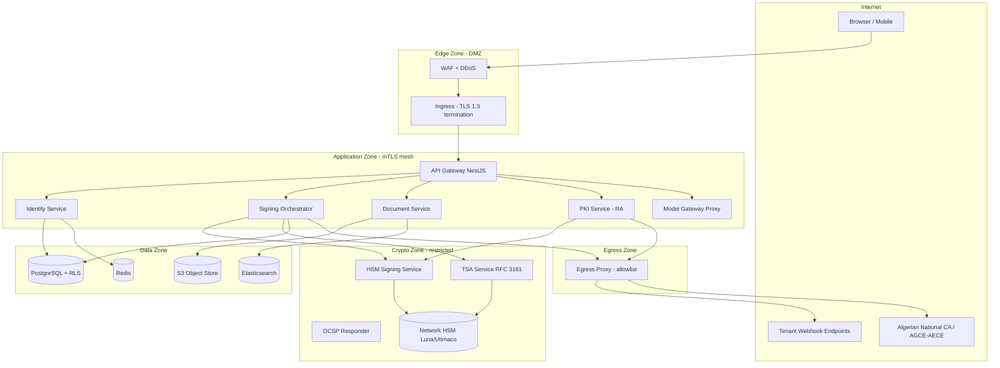

Zone rules (enforced with Cilium NetworkPolicies, default-deny both directions):

- **Crypto Zone** accepts connections **only** from `signing`, `pki`, and `tsa` service identities over mTLS; it has **no** internet egress except the HSM VLAN. The HSM sits on an isolated VLAN reachable only from the HSM Signing Service pods (nodepool with taint `crypto=true:NoSchedule`, dedicated nodes, no other workloads).
- **Data Zone** accepts connections only from the owning bounded context's identity (e.g., Postgres `identity_db` role only from `identity` SVID via mesh authorization policy).
- **Egress Zone** is the only namespace with `0.0.0.0/0` egress, filtered by an allowlist proxy (Envoy) that logs full request metadata to SIEM.

### 1.3 Workload identity: SPIRE + cert-manager

- **SPIRE** attests workloads (k8s PSAT node attestation + workload selectors: namespace, service account, image digest) and issues **X.509-SVIDs** used by the Envoy sidecars for mTLS. SVID TTL: 1 h; rotation at 30 min; the SPIRE upstream authority chains to the internal `TLS/Infrastructure Issuing CA` (Section 4) so mesh identities are verifiable against the corporate PKI.
- **cert-manager** handles non-mesh certs: ingress TLS (public CA), internal service certs for stateful components (Postgres, Redis, Elasticsearch) via a `ClusterIssuer` backed by the same Infrastructure Issuing CA (EST/CA-integration), 30-day certs with auto-renewal at 2/3 lifetime.
- Mesh authorization policies are written as code (namespace-level `AuthorizationPolicy` CRs): e.g. only `spiffe://certidz.dz/ns/signing/sa/signing-orchestrator` may call `hsm-signing-svc:8443` methods `POST /v1/sign`.

### 1.4 Bounded-context isolation matrix

| Caller ↓ / Callee → | identity | signing | pki | documents | billing | audit | ai-gateway |
|---|---|---|---|---|---|---|---|
| api-gateway | ✅ | ✅ | ✅ | ✅ | ✅ | write-only | ✅ |
| identity | — | ❌ | ❌ | ❌ | ❌ | write-only | ❌ |
| signing | assertion API only | — | issue/status API | fetch-by-grant | ❌ | write-only | ❌ |
| pki | vetting-status API | ❌ | — | ❌ | ❌ | write-only | ❌ |
| documents | ❌ | ❌ | ❌ | — | ❌ | write-only | ✅ classification |
| billing | ❌ | usage API read | ❌ | ❌ | — | write-only | ❌ |

Anything not explicitly ✅ is denied at the mesh layer *and* absent from service credentials (defense in depth: policy + capability).

---

## 2. Authentication Flows

All authentication is served by the **Identity Service** (NestJS, `identity` bounded context). Public flows terminate at the API gateway; the identity service is never directly internet-exposed.

### 2.1 Password authentication

**Hashing:** `argon2id` with **memory = 64 MiB (65536 KiB), iterations (t) = 3, parallelism (p) = 4**, 16-byte random salt, 32-byte output. Parameters are stored in the PHC string so future upgrades re-hash transparently on next successful login.

**Pepper:** A 32-byte pepper is held in KMS (never in the DB or app config). The service computes `argon2id(HMAC-SHA-256(pepper, password), salt)`; pepper retrieval uses workload identity, is cached in memory only, and pepper rotation is supported via a `pepper_version` column (re-peppered on next login).

**Breach check:** k-anonymity range query against a Pwned-Passwords-style corpus (self-hosted mirror; SHA-1 prefix of 5 hex chars sent, full hash never leaves the service). Breached passwords are rejected at registration/change and flagged at login (forced reset).

**Lockout / progressive delays:** per-account and per-IP counters in Redis:

| Consecutive failures | Action |
|---|---|
| 1–3 | No delay |
| 4–5 | +2 s constant-time delay |
| 6–8 | +10 s delay + CAPTCHA |
| 9–10 | 15-min soft lock (account), email notification |
| >10 or credential-stuffing pattern | 1-h lock + step-up-only unlock (email link + MFA), SIEM alert `AUTH-BRUTE-01` |

All comparisons are constant-time; the same response timing/shape is returned for "unknown user" and "wrong password."

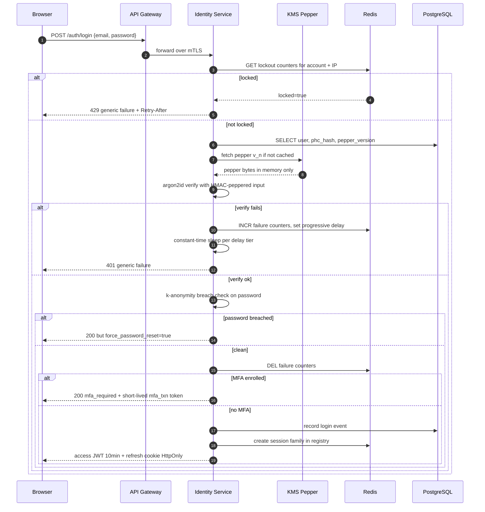

### 2.2 OAuth 2.1 Authorization Code + PKCE (Google / Microsoft)

- Only **Authorization Code + PKCE (S256)** is supported (OAuth 2.1: no implicit, no ROPC).
- `state`: 32-byte CSPRNG value, stored server-side in Redis (`oauth:state:{value}` → `{code_verifier, nonce, redirect_target, tenant_hint}`, TTL 10 min, single-use `GETDEL`).
- `nonce`: separate 32-byte value bound into the OIDC ID token; validated against the stored value to prevent token substitution.
- Redirect URIs: exact-match allowlist, no wildcards, HTTPS only.
- Provider tokens are used once for the userinfo/ID-token claims and then **discarded** — CertiDZ never stores Google/Microsoft refresh tokens.
- Account linking: an OAuth identity may only auto-link to an existing local account if the provider asserts `email_verified=true` **and** the user confirms via an authenticated step (prevents pre-hijack account takeover).

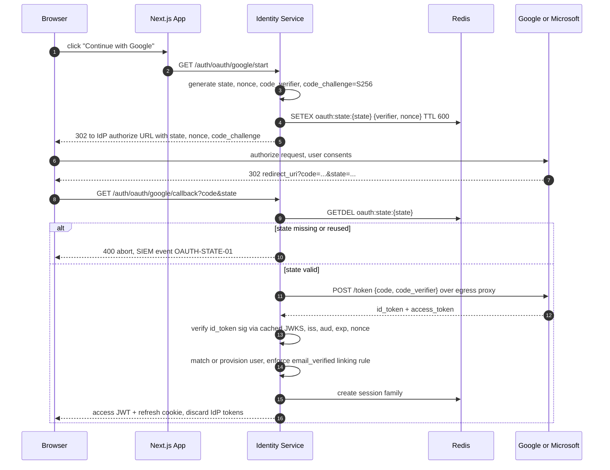

### 2.3 WebAuthn / Passkeys

Relying Party ID: `certidz.dz`. Library: `@simplewebauthn/server` in the identity service; challenges are 32-byte CSPRNG values stored in Redis (TTL 5 min, single-use).

**Attestation policy:**

| Context | Policy |
|---|---|
| Consumer passkey (login) | `attestation: "none"` — privacy-preserving, no attestation CA validation |
| Enterprise tenants with `security.require_attested_authenticators` | `attestation: "direct"`, validate against FIDO MDS3, allowlist of AAGUIDs (e.g. YubiKey 5 FIPS), reject `backupEligible=true` if policy demands device-bound keys |
| Step-up for signing key operations | Must be UV=required (`userVerification: "required"`) |

**Resident keys / backup flags:** registration requests `residentKey: "preferred"` (discoverable credentials enable usernameless login). We persist `credentialId`, COSE public key, `signCount`, `aaguid`, `backupEligible` (BE) and `backupState` (BS) flags, transports. Tenants may forbid synced passkeys (BE=1) for signer roles; a BE flag flip after registration raises a SIEM event (`WEBAUTHN-BE-FLIP`).

**Sign-count:** a non-monotonic `signCount` (when non-zero) indicates possible credential cloning → credential is suspended and the user is challenged via another factor.

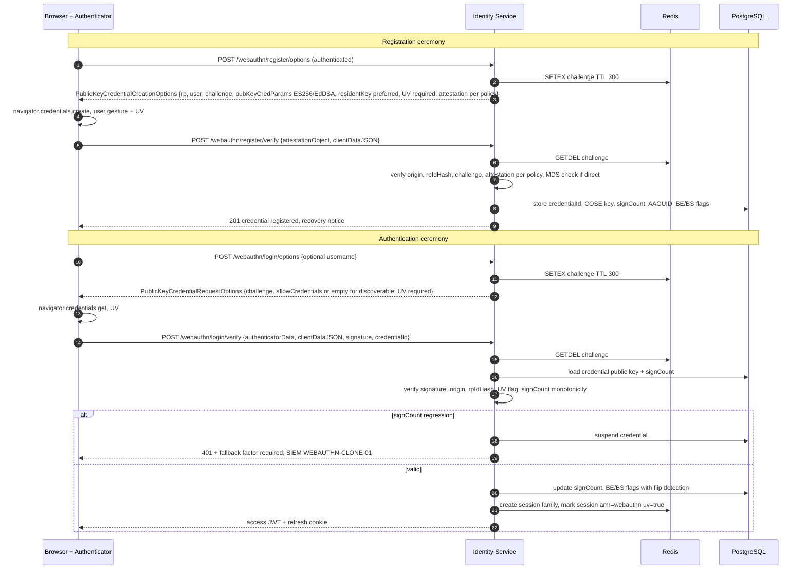

### 2.4 TOTP MFA, recovery codes, step-up authentication

**Enrollment:** RFC 6238, SHA-1/6-digit/30 s (compatibility), secret 160-bit CSPRNG. The secret is encrypted at rest with the tenant DEK (Section 6) and only ever rendered once as QR + manual code. Enrollment is completed only after the user proves possession by submitting **two consecutive** valid codes. ±1 window drift accepted; each `(secret, counter)` is single-use (Redis `SETNX totp:used:{userId}:{counter}` TTL 90 s) to block replay within the window.

**Recovery codes:** 10 codes, each 10 random base32 chars, shown once; stored as **argon2id hashes** (same params as passwords, no pepper needed but salted individually); single-use with atomic consume; regeneration invalidates all prior codes; usage triggers email notification + SIEM event.

**Step-up auth:** sensitive operations require a fresh second-factor assertion regardless of session state:

| Operation | Required step-up | Max assertion age |
|---|---|---|
| Send envelope for signing | recent session (no step-up) | — |
| **Apply advanced/qualified signature** | WebAuthn UV=required, or TOTP if no passkey | 5 min |
| PKI: revoke certificate | WebAuthn UV or TOTP | 5 min |
| Key operations (rotate tenant KEK ref, API-key create) | WebAuthn UV or TOTP | 5 min |
| Change MFA settings, add passkey | Password + existing factor | 5 min |
| Tenant owner transfer, delete tenant | WebAuthn UV + email confirmation | 5 min |

Step-up results are recorded as an `acr=step-up` claim in a short-lived (5 min) **elevation token** bound to the session ID and to the specific operation category; the signing service verifies the elevation token before invoking the HSM.

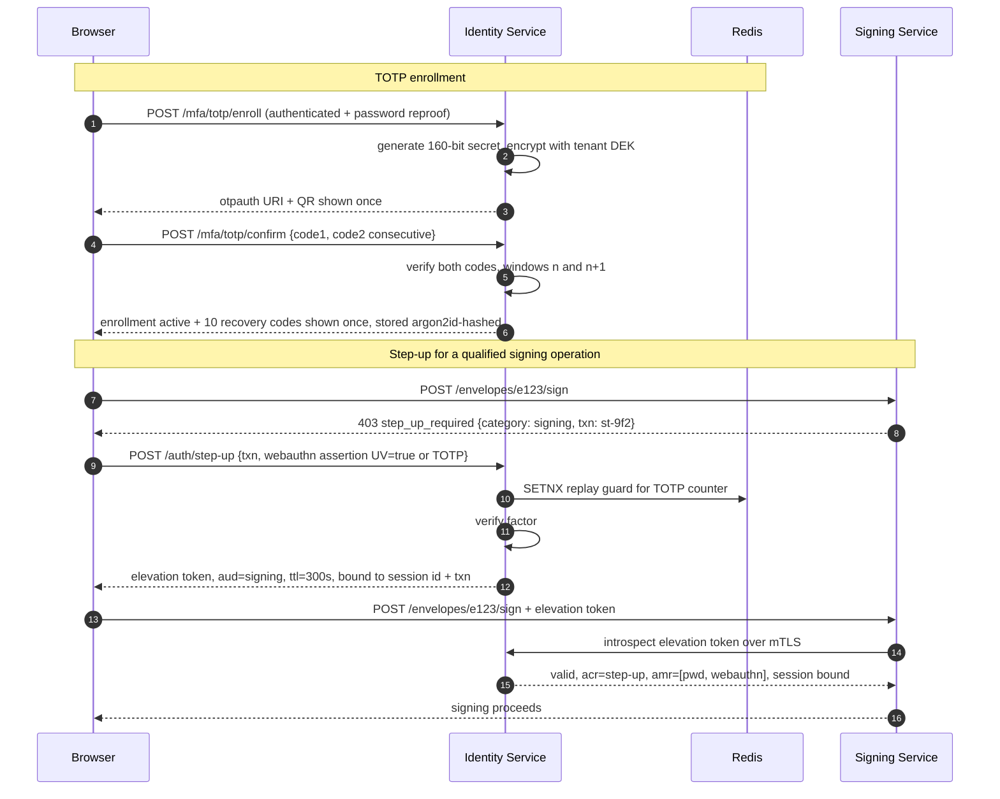

### 2.5 Session model

| Property | Value |
|---|---|
| Access token | JWT, **10 min TTL**, **EdDSA (Ed25519)** signature, `kid`-based rotation (signing key rotated monthly, previous key kept for validation for 24 h) |
| Access claims | `sub`, `tid` (tenant), `sid` (session), `roles`, `perms_ver`, `amr`, `acr`, `dbh` (device-binding hash), `iat/exp/iss/aud`, `jti` |
| Refresh token | **Opaque** 256-bit random, stored **hashed (SHA-256)** in Postgres, delivered as `HttpOnly; Secure; SameSite=Strict; Path=/auth` cookie |
| Refresh TTL | 30 days idle max, absolute lifetime 90 days per family |
| Rotation | Every refresh issues a new token, links `parent_id`, marks the old one `rotated` |
| Family reuse detection | Presenting a `rotated` or `revoked` token revokes the **entire family** |
| Device binding | Refresh bound to a device fingerprint hash (UA class + platform + a per-device cookie secret); access token carries `dbh`; mismatch → family revoked |
| Registry | Redis hash `sess:{sid}` (user, tenant, device, ip_class, created, last_seen, amr) with TTL sync; Postgres is the source of truth for refresh families |
| Revocation latency | Access tokens are short-lived; additionally a Redis bloom/deny-set `sess:revoked` is checked by the gateway for high-risk routes (signing, pki, admin) → effective sub-second revocation on sensitive paths |
| Logout-everywhere | Revokes all families for user, deletes all `sess:*` entries, bumps `perms_ver` so any surviving JWT fails the version check on next sensitive call |

**Refresh rotation & family-based reuse detection:**

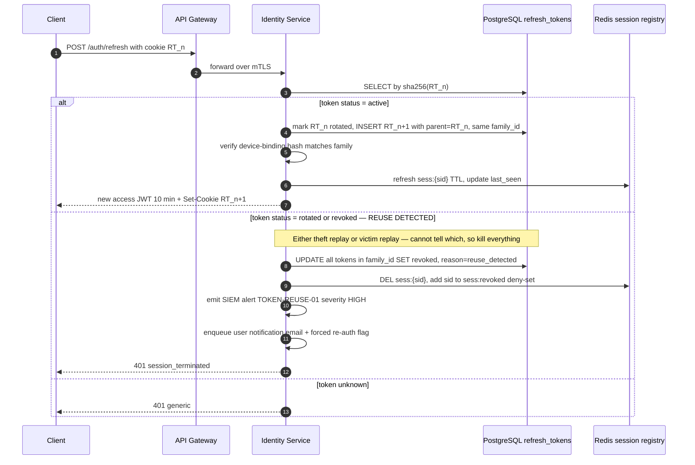

---

## 3. Authorization Model

### 3.1 Permission naming scheme

`context:resource:action` — lowercase, colon-separated, wildcard only in role definitions (never in tokens):

```
signing:envelope:create      signing:envelope:send        signing:envelope:void
signing:signature:apply      signing:template:manage
pki:certificate:request      pki:certificate:approve      pki:certificate:revoke
pki:certificate:suspend      pki:ca:read
documents:document:read      documents:document:upload    documents:document:delete
documents:document:share     documents:document:download
identity:verification:run    identity:verification:review
tenancy:member:invite        tenancy:member:remove        tenancy:settings:manage
tenancy:apikey:create        tenancy:apikey:revoke
billing:subscription:manage  billing:invoice:read
audit:log:read               audit:log:export
```

### 3.2 RBAC matrix

| Permission | owner | admin | member | signer | auditor | billing_manager | developer |
|---|:--:|:--:|:--:|:--:|:--:|:--:|:--:|
| `tenancy:settings:manage` | ✅ | ✅ | — | — | — | — | — |
| `tenancy:member:invite` | ✅ | ✅ | — | — | — | — | — |
| `tenancy:member:remove` | ✅ | ✅ | — | — | — | — | — |
| `tenancy:apikey:create` | ✅ | ✅ | — | — | — | — | ✅ |
| `tenancy:apikey:revoke` | ✅ | ✅ | — | — | — | — | ✅ own |
| `signing:envelope:create` | ✅ | ✅ | ✅ | — | — | — | ✅ API |
| `signing:envelope:send` | ✅ | ✅ | ✅ | — | — | — | ✅ API |
| `signing:envelope:void` | ✅ | ✅ | ✅ own | — | — | — | — |
| `signing:signature:apply` | ✅ | ✅ | ✅ | ✅ | — | — | — |
| `signing:template:manage` | ✅ | ✅ | ✅ | — | — | — | — |
| `documents:document:upload` | ✅ | ✅ | ✅ | — | — | — | ✅ API |
| `documents:document:read` | ✅ | ✅ | ✅ ACL | ✅ ACL | ✅ | — | ✅ ACL |
| `documents:document:share` | ✅ | ✅ | ✅ own | — | — | — | — |
| `documents:document:delete` | ✅ | ✅ | ✅ own | — | — | — | — |
| `pki:certificate:request` | ✅ | ✅ | ✅ self | ✅ self | — | — | — |
| `pki:certificate:approve` | ✅ | ✅ RA role | — | — | — | — | — |
| `pki:certificate:revoke` | ✅ | ✅ | ✅ own | ✅ own | — | — | — |
| `pki:certificate:suspend` | ✅ | ✅ | — | — | — | — | — |
| `identity:verification:run` | ✅ | ✅ | ✅ self | ✅ self | — | — | — |
| `identity:verification:review` | ✅ | ✅ | — | — | — | — | — |
| `billing:subscription:manage` | ✅ | — | — | — | — | ✅ | — |
| `billing:invoice:read` | ✅ | ✅ | — | — | — | ✅ | — |
| `audit:log:read` | ✅ | ✅ | — | — | ✅ | — | — |
| `audit:log:export` | ✅ | — | — | — | ✅ | — | — |

Notes: `✅ own` = only for resources the principal created; `✅ ACL` = subject to resource-level ACL below; `✅ self` = only for the principal's own certificate/verification; `✅ API` = typically exercised through API keys with matching scopes. `owner` is unique per tenant and required for destructive tenant-level operations.

### 3.3 Resource-level ACLs

RBAC gates the *verb*; ACLs gate the *object*. Documents and envelopes carry ACL entries:

```
document_acl(document_id, principal_type user|group|apikey|link, principal_id,
             capability read|comment|sign|manage, granted_by, expires_at, constraints jsonb)
```

- Envelope recipients get **scoped signing links**: a signed grant token (JWT, aud=`signing-session`, 24 h, bound to recipient email/phone OTP) that confers exactly `documents:document:read` + `signing:signature:apply` on that envelope — external signers never get tenant accounts implicitly.
- Share links support constraints: expiry, max downloads, watermarking, IP-country pinning.
- Authorization decision = `RBAC(role, permission) AND (no ACL required OR ACL grants capability) AND tenant match AND policy conditions`.

### 3.4 Tenant isolation — four enforcement layers

Defense in depth: a bug in any single layer does not produce cross-tenant leakage.

| Layer | Mechanism | Failure caught |
|---|---|---|
| 1. Token | `tid` claim in the EdDSA JWT, set at login, never client-supplied | Forged/absent tenant context |
| 2. Middleware | NestJS `TenantContextMiddleware` binds `tid` to `AsyncLocalStorage`; requests with path/body tenant IDs that mismatch the claim → 403 + SIEM | Parameter tampering, confused deputy |
| 3. ORM | Prisma **client extension** injects `where: { tenantId }` into every query/mutation on tenant-scoped models; models without `tenantId` must be explicitly allowlisted; a CI test walks the DMMF and fails if a new model is neither scoped nor allowlisted | Developer forgetting a filter |
| 4. Database | **Postgres RLS**: every tenant-scoped table has `POLICY tenant_isolation USING (tenant_id = current_setting('app.tenant_id')::uuid)`; the pooled connection runs `SET LOCAL app.tenant_id` inside every transaction; app DB roles are **not** `BYPASSRLS` | SQL injection, raw queries, ORM bypass |

```sql
ALTER TABLE documents ENABLE ROW LEVEL SECURITY;
ALTER TABLE documents FORCE ROW LEVEL SECURITY;
CREATE POLICY tenant_isolation ON documents
  USING (tenant_id = current_setting('app.tenant_id')::uuid);
```

### 3.5 NestJS implementation

```ts
// permissions.decorator.ts
export const RequirePermission = (...perms: Permission[]) =>
  applyDecorators(SetMetadata(PERMS_KEY, perms), UseGuards(JwtAuthGuard, PermissionsGuard));

// permissions.guard.ts — CASL-backed
@Injectable()
export class PermissionsGuard implements CanActivate {
  constructor(private abilityFactory: AbilityFactory, private reflector: Reflector) {}
  async canActivate(ctx: ExecutionContext): Promise<boolean> {
    const required = this.reflector.getAllAndOverride<Permission[]>(PERMS_KEY, [
      ctx.getHandler(), ctx.getClass(),
    ]);
    if (!required?.length) return true;
    const { user, params } = ctx.switchToHttp().getRequest();
    const ability = await this.abilityFactory.forPrincipal(user); // roles + ACLs + API-key scopes
    return required.every((p) => ability.can(p.action, subject(p.resource, { id: params.id })));
  }
}

// usage
@Post(':id/revoke')
@RequirePermission('pki:certificate:revoke')
@RequireStepUp('key-ops')                    // elevation token guard, Section 2.4
revoke(@Param('id') id: string, @Body() dto: RevokeDto) { ... }
```

- `AbilityFactory` compiles CASL rules from: role→permission map (cached, versioned by `perms_ver`), resource ACL lookups (batched via DataLoader), and API-key scopes.
- Policy handlers for complex conditions (e.g., `signing:envelope:void` only while `status IN (draft, sent)` and within the caller's tenant).

### 3.6 API-key scopes

- Format: `cdz_live_<keyId>_<secret>`; secret stored as SHA-256 hash; prefix (`keyId`) indexed for O(1) lookup; shown once.
- Scopes are a **subset** of the creating principal's permissions at creation time, expressed in the same `context:resource:action` grammar; wildcard scopes are forbidden for live keys.
- Constraints: IP allowlist, expiry (max 1 year), per-key rate limits, environment binding (live/test).
- Keys are tenant-bound; the middleware sets `tid` from the key record, never from the request.
- Rotation: overlapping dual-key windows; automatic revocation on secret detection (GitHub secret-scanning partner pattern registered for `cdz_live_`).

---

## 4. PKI Architecture

### 4.1 Trust hierarchy

CertiDZ operates a **private corporate PKI** for platform trust (advanced signatures, seals, infra TLS, timestamping) and **integrates with the Algerian national hierarchy for qualified signatures**. Under **Law 15-04**, qualified electronic certification services chain to the national root operated by the **Autorité Nationale / Autorité Gouvernementale de Certification Électronique (AGCE)** for the government sphere and the **Autorité Économique de Certification Électronique (AECE / ARPCE-supervised)** for the economic sphere. **CertiDZ never self-issues qualified certificates**: for QES, CertiDZ acts as a Registration Authority / integration layer to an accredited national CSP, and the qualified certificate + QSCD remain under the national chain.

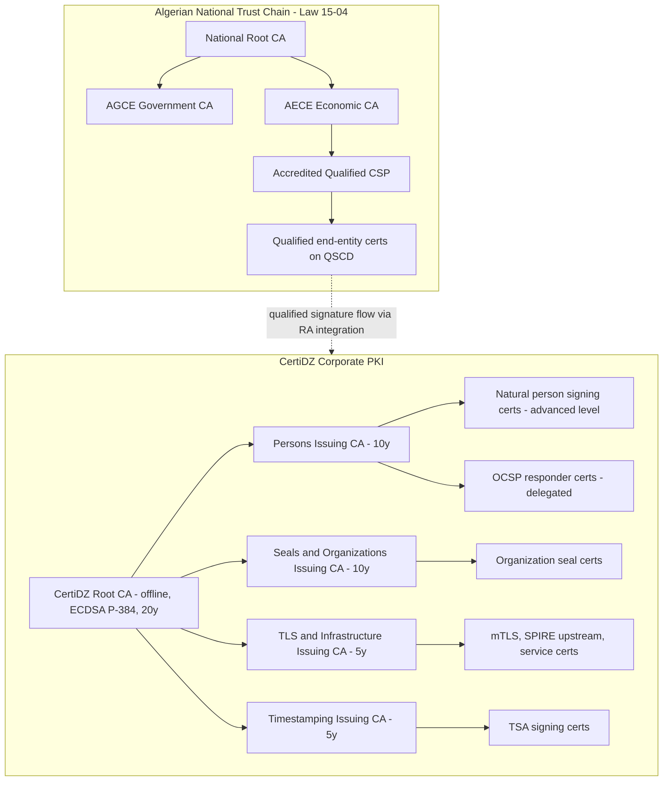

**Separation rules:**

- The CertiDZ Root is **never** cross-signed with the national chain; validation software must not be able to build a path from a CertiDZ advanced cert to the national root or vice versa.
- Qualified signature validation always resolves against the national TSL/trust store; CertiDZ ships both trust stores separately in the verifier.
- Root CA key: **ECDSA P-384** (RSA-4096 acceptable fallback for legacy verifier compatibility — decision recorded in ADR-PKI-001), 20-year validity, offline (Section 4.5).

### 4.2 Certificate profiles

| Profile | Subject DN convention | Key algo | Validity | Key Usage | EKU | Notes |
|---|---|---|---|---|---|---|
| **Natural person signing (advanced)** | `CN=<Given Name> <Surname>, serialNumber=IDCDZ-<verification_ref>, O=<Tenant Org>, C=DZ` | ECDSA P-256 | 2 y | digitalSignature, nonRepudiation (contentCommitment) **only** | id-kp-emailProtection optional; no serverAuth/clientAuth | QC-style statements omitted (not qualified); policy OID `1.3.6.1.4.1.<hisn>.1.2.1` (AdES-NP); subject keyed to `identity_verifications.id` |
| **Organization seal** | `CN=<Org Legal Name> Seal, organizationIdentifier=<RC/NIF>, O=<Org Legal Name>, C=DZ` | ECDSA P-256 or RSA-3072 | 3 y | digitalSignature, contentCommitment | none required | Keys HSM-resident only, never exported; policy OID `...1.2.2` |
| **TLS server (infra)** | `CN=<service>.<ns>.svc.certidz.internal` + SANs | ECDSA P-256 | 30 d (mesh) / 90 d (edge-internal) | digitalSignature | serverAuth, clientAuth | Auto-issued via cert-manager/EST |
| **TSA signing** | `CN=CertiDZ TSA <n>, O=HISN CertiDZ, C=DZ` | ECDSA P-384 | 3 y (overlapping, Section 5.4) | digitalSignature | **id-kp-timeStamping (critical, sole EKU)** | RFC 3161; ESSCertIDv2 in tokens |
| **OCSP responder** | `CN=CertiDZ OCSP <ICA name>, O=HISN CertiDZ, C=DZ` | ECDSA P-256 | 1 y | digitalSignature | id-kp-OCSPSigning + id-pkix-ocsp-nocheck | Delegated responder per issuing CA |

All profiles include: AKI/SKI, CRL DP (`http://crl.certidz.dz/<ca>.crl`), AIA OCSP (`http://ocsp.certidz.dz/<ca>`) + caIssuers, certificatePolicies with CPS URI, and are logged to an internal CT-style append-only log.

### 4.3 Enrollment

Two key-generation modes:

- **HSM-held (default for seals and platform-managed person certs):** key pair generated inside the HSM partition for the tenant; user exercises *sole control* via step-up auth gating each use (advanced level rationale).
- **Client-held (BYO / smart card):** key generated on the client device or token; CSR uploaded; proof-of-possession via the CSR self-signature; for high-assurance, an additional signed challenge nonce.

Identity vetting is bound to the certificate: the RA approval references a completed row in `identity_verifications` (document + liveness + registry checks), and the verification reference is embedded in the subject `serialNumber`.

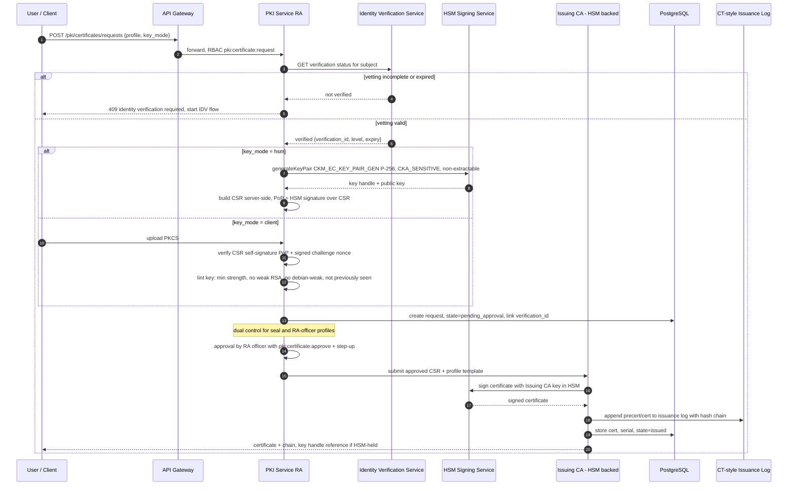

**Infra certificate automation:** EST (RFC 7030) against the TLS/Infrastructure ICA for cert-manager (`external-issuer`); SCEP retained only for legacy network devices (challenge password + allowlisted subnets); public ACME (Let's Encrypt) for internet-facing edge certs — internal ACME is deliberately not exposed to avoid mis-issuance of internal names.

### 4.4 Revocation

**CRLs**

- Full CRL per issuing CA: regenerated **every 6 hours** and immediately on any revocation event; `nextUpdate = thisUpdate + 24 h` (grace overlap).
- Delta CRLs hourly for the Persons ICA (highest churn).
- Signed inside the HSM; published to **S3 (versioned, object-lock governance) fronted by CDN** at stable URLs; cache TTL 15 min; publishing job verifies signature + monotonic CRL number before flipping the CDN pointer.
- Root CA CRL (covers issuing CAs only): regenerated at each root ceremony and at minimum annually; `nextUpdate` 12 months.

**OCSP responder**

- Delegated responder per ICA (`id-pkix-ocsp-nocheck`, 1-year responder certs).
- **Pre-signed responses**: a batch signer produces responses for all non-expired serials every 4 hours (`nextUpdate = 8 h`), stored in Redis + S3; the front-end responder serves them read-only and holds **no CA-adjacent key material** — compromise of the responder cannot forge status.
- Nonce extension: echoed when present (live-sign lane for nonce requests is rate-limited and served by a separate signer with the delegated key); non-nonce requests get cacheable pre-signed responses with `max-age` ≤ remaining validity.
- Unknown serials return `unknown` (not `good`) — blocks serial-guessing forgery.
- Monitoring: response latency, signer cert expiry, `unknown` rate spike alerting.

**Reason codes & suspension**

| Event | RFC 5280 reason | Notes |
|---|---|---|
| Key compromise (proven/suspected) | `keyCompromise (1)` | Backdated `invalidityDate` allowed with CISO approval; triggers IR |
| Subscriber left organization | `affiliationChanged (3)` | |
| Re-key / renewal | `superseded (4)` | |
| Service termination | `cessationOfOperation (5)` | |
| **Suspension** | `certificateHold (6)` | Reversible; auto-revoke with `keyCompromise` review if not lifted in 30 days; used during identity-fraud investigations |
| Un-suspend | `removeFromCRL` in delta CRL | |
| CA-side mis-issuance | `superseded` + incident record | 24 h SLA from confirmation |

Revocation requests require `pki:certificate:revoke` + step-up; subscriber self-revocation for `keyCompromise` is always allowed and processed **≤ 1 h**; a 24/7 out-of-band revocation channel (authenticated hotline + signed email) is documented in the CPS.

### 4.5 Key ceremonies

**Offline Root CA ceremony (generation / annual CRL / ICA signing):**

Roles: **Ceremony Master** (runs script, no key material access), **3 Key Custodians** (Shamir **3-of-5** shares of the HSM security-officer credential; 5 shares distributed, quorum 3), **2 Witnesses** (one internal audit, one external/legal), **Recorder** (video + written log).

Ceremony outline:

1. Pre-ceremony: script approved by CISO + external auditor; participants sign confidentiality/role acknowledgments; tamper-evident bag serials recorded.
2. Room sealed; continuous video; phones surrendered; ceremony laptop is a verified-hash, never-networked machine booted from write-once media.
3. Offline HSM (dedicated, powered off between ceremonies, stored in dual-control safe) unsealed: bag serials verified on camera against the previous ceremony log.
4. Custodians authenticate M-of-N (each enters their share privately).
5. Scripted operations only (each step read aloud, executed, output hash recorded): generate root key (first ceremony) / sign issuing-CA certs / sign root CRL / sign TSL-style trust artifacts.
6. Outputs (certs, CRL) exported via write-once media; hashes read aloud and recorded.
7. HSM re-sealed in new tamper-evident bags; serials recorded; returned to safe under dual control.
8. Artifacts produced: ceremony log (signed by all), video archive (WORM storage, 10-year retention), output hash manifest, deviation register (any off-script event aborts unless unanimously waived and recorded).

**Issuing CA activation:** ICA keys live in the online network HSM but are generated during a witnessed activation ceremony (2-of-3 custodians for the partition SO role), with the CSR carried offline to a root ceremony for signing. Activation artifacts: partition config export hash, key attributes dump (proving `CKA_EXTRACTABLE=false`), activation log.

---

## 5. HSM Integration via PKCS#11

### 5.1 Architecture

A single dedicated **HSM Signing Service** (NestJS worker, Crypto Zone) is the only workload holding PKCS#11 sessions. All other services request cryptographic operations via a narrow mTLS gRPC API (`Sign`, `GenerateKeyPair`, `WrapKey`, `UnwrapKey`, `GetPublicKey`) authorized per SPIFFE ID and per key-label namespace.

- **Production:** network HSM cluster (Thales Luna Network HSM 7 or Utimaco SecurityServer), 2 appliances in HA, FIPS 140-2/3 Level 3 mode; partitions: `root` (offline unit, separate device), `issuing-ca`, `tsa`, `tenant-keks`, `platform-seal`.
- **Cloud/DR option:** cloud KMS/CloudHSM behind the same `CryptoProvider` abstraction.
- **Dev/CI:** SoftHSM2 with identical PKCS#11 code path (see 5.5) — no crypto code branches between environments; only the module path and PIN sourcing differ.

Partition credentials (PINs) are delivered via Vault with response-wrapping at pod start; never in env vars or images.

### 5.2 Key generation & attributes

| Operation | Mechanism | Notes |
|---|---|---|
| EC key pair (P-256/P-384) | `CKM_EC_KEY_PAIR_GEN` | CA, TSA, person/seal keys |
| Ed25519 (JWT signing keys) | `CKM_EC_EDWARDS_KEY_PAIR_GEN` | Session token keys |
| RSA (legacy compat) | `CKM_RSA_PKCS_KEY_PAIR_GEN` 3072/4096 | Only where verifier compatibility demands |
| AES KEK | `CKM_AES_KEY_GEN` 256 | Tenant KEKs |
| DEK wrap/unwrap | `CKM_AES_KEY_WRAP_KWP` (RFC 5649) | Tenant DEKs (Section 6) |
| ECDSA sign | `CKM_ECDSA` over pre-hashed digest | Digest computed app-side (SHA-256/384) |

Mandatory private/secret key attribute template (enforced at creation and asserted by a nightly attribute-audit job):

```
CKA_TOKEN         = true      // persistent
CKA_PRIVATE       = true
CKA_SENSITIVE     = true      // value never readable
CKA_EXTRACTABLE   = false     // cannot be wrapped out (KEKs: false; DEKs live outside HSM, wrapped)
CKA_MODIFIABLE    = false     // attributes locked
CKA_SIGN          = true      // signing keys only
CKA_DERIVE        = false
CKA_WRAP/UNWRAP   = true      // KEKs only, with CKA_WRAP_TEMPLATE restricting wrappable targets
CKA_LABEL         = "certidz/<partition>/<purpose>/<key-id>/v<n>"
```

### 5.3 Signing flow & session pooling

- Pool of long-lived read-only PKCS#11 sessions per partition (default 16, autoscale to 64), health-checked with `C_GetSessionInfo`; broken sessions are discarded and re-logged-in with exponential backoff.
- Object handles cached per label with invalidation on rotation events.
- Every operation is wrapped with: caller SPIFFE ID check → key-namespace ACL (e.g., `signing-orchestrator` may use `platform-seal/*` and `tenant-keks/<its-request-tenant>` only) → rate limit per caller → audit event (key label, mechanism, digest hash, caller, latency) — the digest, never the document, crosses into the Crypto Zone.
- Circuit breaker: on HSM cluster failure, signing operations fail closed (no software fallback in production); TSA has a documented degraded mode (queue + late timestamping within policy limits).

### 5.4 Key rotation policy

| Key | Lifetime | Rotation approach |
|---|---|---|
| Root CA | 20 y | Re-key at year 15 with overlap; old root signs new root cross-cert for migration |
| Issuing CAs | 5–10 y (Persons/Seals 10 y, TLS/TSA 5 y) | Stop issuing at 50% remaining validity vs. longest EE cert; new ICA generated + ceremony-signed; both publish CRLs until last EE expiry |
| TSA signing keys | **1–3 y with overlap**: new key active at month 24, old key retained verify-only until all tokens age past archival policy | Overlap prevents timestamp validation gaps; token includes ESSCertIDv2 pinning |
| Tenant KEKs (HSM) | **Annual** | New KEK version; DEKs lazily re-wrapped (Section 6.5); old KEK disabled for wrap, kept for unwrap for 13 months, then destroyed with ceremony record |
| JWT EdDSA keys | 30 d | JWKS publishes current + previous `kid` |
| OCSP responder keys | 1 y | Aligned with responder cert renewal |

### 5.5 `CryptoProvider` abstraction

```ts
// crypto-provider.interface.ts — implemented by Pkcs11Provider (Luna/Utimaco/SoftHSM2)
// and CloudKmsProvider. Selected by DI token at bootstrap; no runtime branching elsewhere.

export type KeyAlgorithm = 'EC_P256' | 'EC_P384' | 'ED25519' | 'RSA_3072' | 'AES_256';
export type SignatureScheme = 'ECDSA_SHA256' | 'ECDSA_SHA384' | 'EDDSA' | 'RSA_PSS_SHA256';

export interface KeyRef {
  label: string;          // "certidz/tenant-keks/t_9f21/kek/v3"
  version: number;
  algorithm: KeyAlgorithm;
  publicKeyPem?: string;  // absent for secret keys
}

export interface CryptoProvider {
  generateKeyPair(opts: {
    algorithm: Exclude<KeyAlgorithm, 'AES_256'>;
    label: string;
    exportable?: false;               // literal false: non-extractable is not negotiable
    usage: ('sign' | 'wrap')[];
  }): Promise<KeyRef>;

  sign(opts: {
    key: KeyRef | string;             // ref or label
    digest: Buffer;                   // pre-hashed input only — raw data never accepted
    scheme: SignatureScheme;
  }): Promise<Buffer>;

  wrapKey(opts: {
    kek: KeyRef | string;
    dek: Buffer;                      // plaintext DEK, zeroized by caller after call
    mechanism?: 'AES_KWP';
  }): Promise<{ wrapped: Buffer; kekVersion: number }>;

  unwrapKey(opts: {
    kek: KeyRef | string;
    wrapped: Buffer;
    kekVersion: number;
  }): Promise<Buffer>;                // plaintext DEK — must be zeroized after use

  getPublicKey(label: string): Promise<KeyRef>;
  destroyKey(label: string, version: number, ceremonyRef: string): Promise<void>;
  healthCheck(): Promise<{ ok: boolean; slots: number; sessionsActive: number }>;
}
```

Dev mode: `Pkcs11Provider` pointed at `libsofthsm2.so`, token initialized by a seed script; integration tests run the full sign/wrap paths against SoftHSM2 in CI so the PKCS#11 code path is exercised on every merge.

---

## 6. Envelope Encryption Design

### 6.1 Key hierarchy

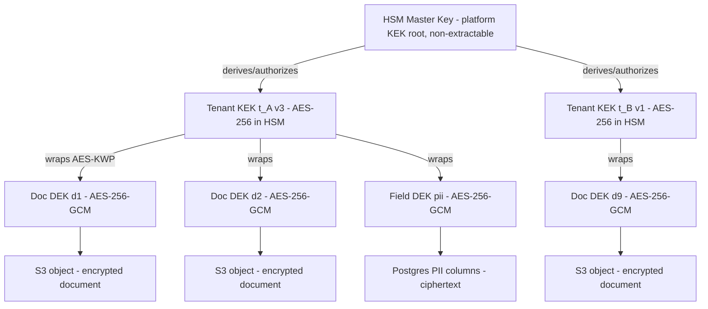

- **KEKs** are AES-256 keys resident in the HSM `tenant-keks` partition, one per tenant, versioned, never extractable.
- **DEKs** are AES-256-GCM keys generated in the app crypto library (CSPRNG), used for at most one *scope* (one document, or one PII field-group per table), and stored **only wrapped**.
- Granularity: per-document DEKs for objects; per-tenant-per-table field DEKs for PII columns.

### 6.2 `tenant_keys` registry

```sql
CREATE TABLE tenant_keys (
  id              uuid PRIMARY KEY,
  tenant_id       uuid NOT NULL,
  scope           text NOT NULL,      -- 'document:<doc_id>' | 'field:<table>' 
  wrapped_dek     bytea NOT NULL,     -- AES-KWP output
  kek_label       text NOT NULL,      -- certidz/tenant-keks/<tid>/kek
  kek_version     int  NOT NULL,
  algorithm       text NOT NULL DEFAULT 'AES-256-GCM',
  state           text NOT NULL DEFAULT 'active',  -- active|rotating|shredded
  created_at      timestamptz NOT NULL,
  rotated_at      timestamptz,
  shredded_at     timestamptz,
  shred_reason    text                -- gdpr_erasure | tenant_offboard | compromise
);
-- RLS-enabled like all tenant tables
```

### 6.3 Encrypt path — documents at rest in S3

1. Upload lands in the Document Service (streamed, size + magic-byte validated).
2. Service generates DEK (32 B) + per-object 12-byte GCM nonce; encrypts client-side (envelope model) — `AES-256-GCM(dek, nonce, plaintext, aad = tenantId || documentId || sha256(plaintext))`.
3. DEK is wrapped by the HSM (`wrapKey` against the tenant KEK) and stored in `tenant_keys`; plaintext DEK zeroized.
4. Ciphertext stored in S3 under `s3://certidz-docs-<region>/<tenantId>/<docId>/<version>` with bucket-level SSE (defense in depth: envelope + SSE-S3). Where client-side encryption is not feasible (very large streaming), **SSE-C** with the per-document DEK is the fallback — the DEK is still tenant-KEK-wrapped in our registry and never stored by S3.
5. Decrypt path requires: RBAC + ACL pass → unwrap via HSM (audited, per-tenant namespace ACL) → stream-decrypt → optional watermark → response. GCM tag failure = integrity alarm, object quarantined.

### 6.4 Field-level encryption for PII

- Prisma middleware/extension transparently encrypts/decrypts annotated columns (`nationalId`, `dateOfBirth`, `phoneNumber`, `idDocumentNumber`, `biometricTemplateRef`, `totpSecret`).
- AES-256-GCM with the tenant's field DEK; AAD = `table || column || rowId` (blocks ciphertext swapping between rows).
- Searchable fields get an additional HMAC-SHA-256 blind index column (keyed per tenant) for equality lookups; no order-revealing schemes.

### 6.5 DEK rotation & lazy re-encryption

- **KEK rotation (annual):** new KEK version created in HSM; `tenant_keys` rows are re-wrapped by a background job (unwrap with v_n, wrap with v_n+1 — data itself untouched, cheap). Old KEK version disabled for wrap immediately, destroyed after 13 months.
- **DEK rotation (on-demand / compromise / policy 3 y):** rows marked `rotating`; a low-priority worker re-encrypts objects on read ("lazy") and via trickle batch overnight; both old and new registry rows exist until the object version is confirmed re-encrypted, then old row is shredded.

### 6.6 Crypto-shredding (GDPR / Law 15-04 erasure)

Erasure request → verify no legal-hold/retention conflict (signed evidence packages have statutory retention; erasure then applies to *source* PII, not the sealed evidence, per DPO matrix) → set `state='shredded'`, overwrite `wrapped_dek` with random bytes, record `shred_reason`, emit audit event. Without the DEK, ciphertext in S3/backups is irrecoverable — this is the erasure mechanism for backups too (backup media are never scrubbed; keys are). KEK destruction similarly shreds an entire tenant at offboarding (30-day grace, dual-control approval).

---

## 7. Document Signing Pipeline

### 7.1 Signature levels

| Level | eIDAS analogue | Certificate | Key control | Identity requirement | Legal weight (Law 15-04) |
|---|---|---|---|---|---|
| **Simple (SES)** | Simple | CertiDZ **platform seal** applied over signer's captured intent + audit trail | Platform | Email/SMS OTP link | Admissible evidence; weight assessed by court |
| **Advanced (AdES)** | Advanced | **User-held cert** from CertiDZ Persons ICA | Sole control: HSM key usable only after user step-up (WebAuthn UV/TOTP), or user's own device/token | Verified identity (`identity_verifications`, document + liveness) | Strong presumption; signer uniquely linked |
| **Qualified (QES)** | Qualified | Qualified cert from **accredited national CSP** under AGCE/AECE chain, on a **QSCD** (smart card, or remote QSCD at the national provider) | Sole control enforced by QSCD + national provider auth | Mandated face-to-face or equivalent vetting per national CSP rules | Equivalent to handwritten signature per Law 15-04 |

All levels produce: PAdES-B-LTA (default for PDF), XAdES/CAdES for XML/binary payloads, RFC 3161 timestamps from the CertiDZ TSA (or the national TSA for QES where mandated), and an evidence package (audit trail extract, hash-chain proof, validation report).

### 7.2 Core signing pipeline (simple & advanced)

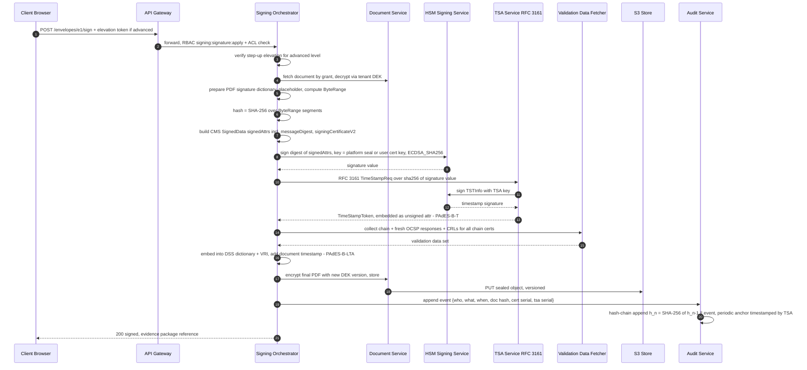

Key properties:

- **The document never enters the Crypto Zone** — only digests cross the boundary.
- **LTV**: full chain, OCSP responses (preferred) and CRLs are embedded in the DSS dictionary at signing time and refreshed by a scheduled **LTA re-timestamping job** before the outermost timestamp's certificate expires.
- **Audit hash-chain**: append-only table, each event carries `prev_hash`; the head is timestamped hourly via the TSA and the anchor stored in WORM S3 — retroactive tampering is detectable.
- **Simple level** differences: no user certificate — the platform seal cert (Seals ICA) signs; the audit trail (OTP verification, IP, consent click, viewed pages) is itself rendered, hashed and bound into the evidence package.

### 7.3 Qualified signature flow — national CA integration

For QES, CertiDZ orchestrates but the cryptographic act happens under the national provider's control (remote QSCD / signature-activation protocol, or local smart card via the provider's middleware). CertiDZ holds **no** qualified private keys.

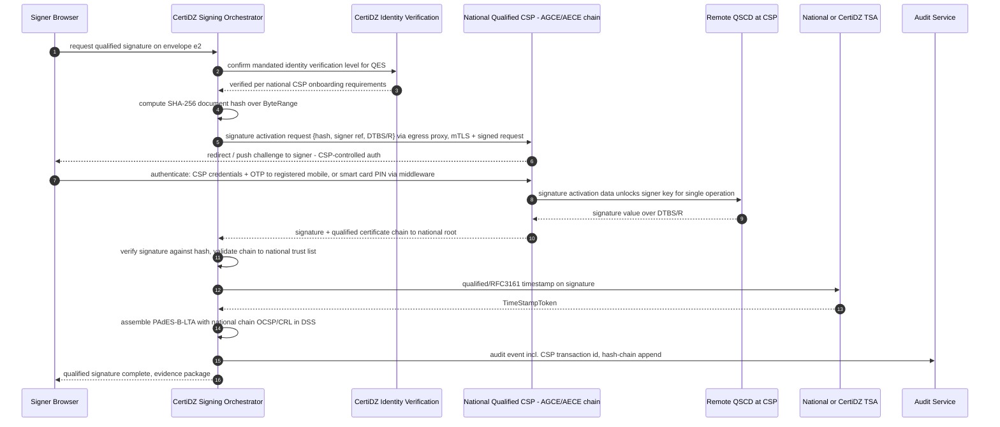

Failure/abort semantics: any CSP-side authentication failure aborts without partial state; the envelope records the attempt; CertiDZ never retries signature activation without a fresh signer action (sole-control preservation).

---

## 8. OWASP Top 10 (2021) Mitigations

| # | Risk | Concrete CertiDZ mechanisms |
|---|------|------------------------------|
| A01 | **Broken Access Control** | Four-layer tenant isolation (JWT `tid` → middleware → Prisma extension → Postgres RLS); CASL `PermissionsGuard` + `@RequirePermission()` on every mutating route (CI lint fails on undecorated handlers); object-level ACL checks in policy handlers; IDOR tests in the e2e suite with cross-tenant fixtures; deny-by-default mesh AuthorizationPolicies |
| A02 | **Cryptographic Failures** | TLS 1.3 only (edge + mesh); envelope encryption (Section 6) with AES-256-GCM + HSM-wrapped DEKs; argon2id + KMS pepper; no home-rolled crypto — `node:crypto`, `@noble` audited libs, PKCS#11 for anything key-bearing; HSTS preload; secrets via Vault/CSI, scanned pre-commit (gitleaks) and in CI |
| A03 | **Injection** | Prisma parameterized queries exclusively (raw SQL requires security review + tagged template); `ValidationPipe({ whitelist: true, forbidNonWhitelisted: true, transform: true })` global with class-validator DTOs on every endpoint; Elasticsearch queries built via typed builders, never string interpolation; output encoding by React defaults + no `dangerouslySetInnerHTML` (ESLint rule error-level); CSP as backstop |
| A04 | **Insecure Design** | Threat modeling (Section 10) at feature design (STRIDE-per-DFD for new bounded contexts); abuse-case reviews for signing/identity flows; rate limits and quotas as product requirements; segregation of qualified vs. advanced trust chains by design |
| A05 | **Security Misconfiguration** | GitOps-managed manifests with Kyverno policies (non-root, read-only FS, dropped capabilities, no hostPath); helmet on NestJS + explicit header set (Section 9); Next.js production config lint; CIS-benchmarked base images (distroless), image signing + admission verification; drift detection alerts |
| A06 | **Vulnerable & Outdated Components** | Renovate auto-PRs; `npm audit` + OSV-Scanner + Trivy (images) gating CI (fail on high/critical with exploit-available); SBOM (CycloneDX) per release; runtime SCA alerts mapped to KEV catalog; base image rebuild cadence weekly |
| A07 | **Identification & Authentication Failures** | Section 2 in full: argon2id + pepper, breach checks, progressive lockout, WebAuthn, TOTP with replay guard, refresh rotation + family reuse detection, device binding, step-up for sensitive ops, session registry with logout-everywhere |
| A08 | **Software & Data Integrity Failures** | Signed container images (cosign) verified at admission; provenance attestations (SLSA-style) in CI; dependency lockfiles enforced; audit hash-chain + TSA anchoring; webhook payloads signed (HMAC-SHA-256, timestamped, replay-windowed); no client-side deserialization of untrusted formats |
| A09 | **Security Logging & Monitoring Failures** | Structured OTel logs → Elasticsearch/SIEM (Section 11); mandatory audit events for authN/authZ decisions, key usage, revocations; alerting use-case catalog with tested detections; log integrity via hash-chain; 13-month hot + 7-year archive for evidentiary logs |
| A10 | **SSRF** | All outbound HTTP (webhooks, OAuth token calls, national CA, model gateway) forced through the **egress proxy** with domain allowlist; webhook URLs validated at registration (public IP only — RFC 1918/link-local/metadata ranges rejected after DNS resolution, re-checked at call time to stop DNS-rebinding); redirects not followed cross-host; response size/time caps |

**Cross-cutting controls:**

- **Rate limiting:** `@nestjs/throttler` with Redis storage — global default 100 req/min/IP; auth endpoints 10/min/IP + 5/min/account; signing 30/min/tenant; OCSP/CRL served from CDN cache. 429 with `Retry-After`; limits are per-route decorators, reviewed in the API catalog.
- **CSRF:** session cookies are `SameSite=Strict`; state-changing browser routes additionally require the double-submit token issued by the Next.js app router (server action origin checks + `Origin`/`Sec-Fetch-Site` validation middleware); pure-API clients use Bearer tokens (no ambient credential → no CSRF surface).
- **File uploads:** size caps per plan; extension **and** magic-byte validation (`file-type` + custom PDF/ODF sniffers); PDFs parsed in a sandboxed worker (structure validation, JS/embedded-file stripping per tenant policy); every object queued for **ClamAV** scanning (BullMQ queue, quarantine bucket until verdict; infected → blocked + tenant notification + SIEM); images re-encoded to strip payloads; content-disposition forced to `attachment` for user content, served from a separate cookieless domain.

---

## 9. Secure Headers & CSP

Applied at the edge (ingress) and asserted by the app (helmet for NestJS APIs, Next.js middleware for the frontend). Values below are the production baseline for `app.certidz.dz`:

```
Content-Security-Policy:
  default-src 'self';
  script-src 'self' 'nonce-{request-nonce}' 'strict-dynamic';
  style-src 'self' 'nonce-{request-nonce}';
  img-src 'self' data: blob: https://cdn.certidz.dz;
  font-src 'self' https://cdn.certidz.dz;
  connect-src 'self' https://api.certidz.dz wss://rt.certidz.dz;
  frame-src 'none';
  frame-ancestors 'none';
  object-src 'none';
  base-uri 'self';
  form-action 'self';
  worker-src 'self' blob:;
  manifest-src 'self';
  upgrade-insecure-requests;
  report-to csp-endpoint

Strict-Transport-Security: max-age=63072000; includeSubDomains; preload
Cross-Origin-Opener-Policy: same-origin
Cross-Origin-Embedder-Policy: require-corp
Cross-Origin-Resource-Policy: same-origin
X-Content-Type-Options: nosniff
X-Frame-Options: DENY
Referrer-Policy: strict-origin-when-cross-origin
Permissions-Policy: camera=(self), microphone=(), geolocation=(), payment=(),
                    usb=(), publickey-credentials-get=(self), browsing-topics=(),
                    interest-cohort=()
Cache-Control: no-store                (authenticated API responses)
X-Permitted-Cross-Domain-Policies: none
Report-To: {"group":"csp-endpoint","max_age":86400,
            "endpoints":[{"url":"https://api.certidz.dz/csp-report"}]}
```

Notes:

- **Nonces in Next.js:** generated per-request in `middleware.ts`, injected via the `x-nonce` header consumed by the root layout; `strict-dynamic` allows Next's runtime chunk loading without `unsafe-inline`. No `unsafe-eval` anywhere (Turbopack production build verified).
- `camera=(self)` is required for the identity-verification liveness capture; every other powerful feature is disabled.
- API domain (`api.certidz.dz`) serves `Content-Security-Policy: default-src 'none'; frame-ancestors 'none'` (pure JSON, defense against MIME confusion).
- Signing-session pages (external signers) run on a separate origin `sign.certidz.dz` with its own CSP and **no** session cookies from the main app (grant-token model, Section 3.3).
- CSP is deployed in `report-only` alongside the enforced policy during changes; reports feed the SIEM.

---

## 10. Threat Model — STRIDE

Methodology: STRIDE per asset over the Level-1 DFD; residual risk after listed mitigations, rated L/M/H against the CertiDZ risk matrix.

| # | Asset | Primary STRIDE threats | Key mitigations | Residual risk |
|---|-------|------------------------|-----------------|---------------|
| 1 | **Tenant/user signing keys (HSM)** | **S** impersonated caller invokes sign; **E** service compromise expands to all keys; **R** signer denies signing | mTLS + SPIFFE per-key-namespace ACL; step-up elevation token verified before HSM call; `CKA_EXTRACTABLE=false`; per-operation audit with hash-chain; sole-control design (key unusable without fresh user factor) | **M** — a fully compromised signing orchestrator + stolen live elevation token could sign one document within the 5-min window; bounded by audit detectability |
| 2 | **Root CA private key** | **S/T/E** forged intermediate = total PKI compromise; **I** ceremony leakage | Offline HSM, powered down, dual-control safe; 3-of-5 Shamir custodian quorum; scripted witnessed ceremonies with video/WORM logs; no network path exists; issuance log makes rogue ICA detectable | **L** — requires multi-party physical collusion |
| 3 | **Tenant documents (S3)** | **I** cross-tenant read, bucket exposure; **T** content substitution post-signature | Envelope encryption per-document DEK + tenant KEK; RLS + ACL + grant tokens; S3 versioning + object lock on evidence; GCM AAD binds doc identity; signature hash makes tampering evident | **L/M** — bulk exfiltration requires HSM unwrap access which is per-tenant-namespaced and rate-limited/alarmed |
| 4 | **Audit hash-chain** | **T** retroactive edit/deletion to hide fraud; **R** disputes over event order | Append-only table (no UPDATE/DELETE grants), `prev_hash` chaining, hourly TSA anchor to WORM S3, cross-region replica; SIEM detection on chain-verification job failure | **L** — tampering within one hour before anchoring is theoretically concealable only with DB superuser + WORM compromise |
| 5 | **Session tokens** | **S** token theft/replay; **E** scope escalation via forged claims | 10-min EdDSA JWTs (keys in HSM); HttpOnly SameSite=Strict cookies; refresh rotation + family reuse detection; device binding; revocation deny-set on sensitive routes; `perms_ver` invalidation | **M** — 10-min replay window for a stolen access token on non-sensitive routes; XSS is the main vector, mitigated by CSP |
| 6 | **Identity documents & biometrics** | **I** PII breach (highest regulatory impact); **T** vetting-result manipulation to obtain certs fraudulently | Field-level + object encryption, dedicated `identity` context with the narrowest access matrix; vetting results signed by IDV service and verified by RA; retention minimization (raw biometrics deleted post-verification per policy, template refs only); crypto-shredding | **M** — insider with IDV-service access remains the main threat; mitigated by JIT access + session recording |
| 7 | **Webhook secrets & endpoints** | **S** forged webhook to tenant systems; **I** secret leak; SSRF via attacker-controlled URLs | Per-endpoint HMAC-SHA-256 secrets (encrypted at rest), timestamped signatures with 5-min replay window, rotation API; egress proxy with private-range blocking + DNS-rebind re-check | **L** |
| 8 | **Admin console** | **E** platform-admin takeover = cross-tenant god mode; **S** phished admin | Separate origin + IdP realm; hardware-key WebAuthn mandatory (attestation-allowlisted); JIT role elevation with approval + 4-h expiry; all actions dual-logged; no tenant-data decryption capability from console (support flows use tenant-consented grants) | **M** — deliberate residual: break-glass path exists, compensated by alerting + dual control |
| 9 | **Model gateway prompts/outputs** | **I** tenant document content leaking into prompts/logs or across tenants; **T** prompt-injection steering AI features (classification, extraction) | Gateway proxy strips/masks PII pre-call (deterministic redaction for configured fields); per-tenant request isolation, no cross-tenant context; zero-retention contractual flags to the model provider; injection-hardened system prompts + output schema validation (AI output is never executed or used for authz decisions); logging of prompts hashed, not raw | **M** — prompt injection can degrade AI-feature quality; blast radius capped because AI outputs are advisory-only |
| 10 | **Billing & subscription data** | **T** entitlement tampering (free qualified signatures); **I** payment-metadata leak; **R** usage disputes | Entitlements computed server-side from the billing context, signed snapshot cached (no client-supplied plan data); usage metering events on the audit chain; PCI scope minimized via hosted payment provider (no PAN storage); reconciliation job alerts on metering/invoice drift | **L** |

Review triggers: new bounded context, new external integration (esp. national CSP endpoints), any change to the Crypto Zone, and annually.

---

## 11. SIEM & Security Monitoring

### 11.1 Pipeline

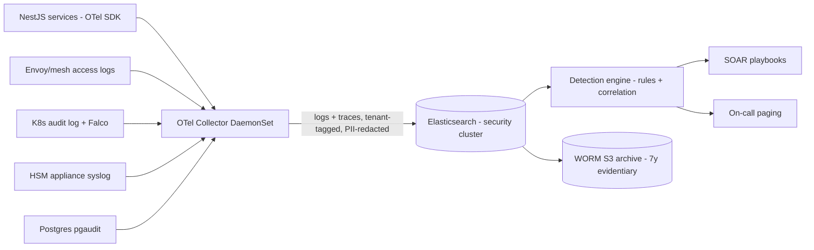

- Structured JSON logs, W3C trace-context correlation; PII redaction processor in the Collector (deny-list + detected patterns) — raw identity documents/biometrics are **never** logged.
- Security cluster is separate from the product search cluster; write-only ingest identity; analysts read via SSO+MFA with field-level security.
- Log integrity: daily index checksum anchored to the audit hash-chain.

### 11.2 Detection use cases

| ID | Use case | Logic sketch | Severity | Automated response |
|----|----------|--------------|----------|--------------------|
| AUTH-IMPTRAVEL-01 | Impossible travel | Same account, successful auths from geo points requiring >900 km/h within window; passkey-synced logins down-weighted | High | Step-up challenge forced on session; notify user |
| TOKEN-REUSE-01 | Refresh-token family reuse | Emitted directly by identity service (Section 2.5) | High | Family already revoked; SOAR opens case, checks for correlated IPs across tenants |
| DATA-MASSDL-01 | Mass document download | Per-principal download count/volume > p99 baseline ×5 within 15 min, or enumeration pattern on doc IDs | High | Throttle principal, snapshot session, page SOC |
| PKI-REVSPIKE-01 | Revocation spike | Revocations per tenant/hour > 10 or platform-wide > 3σ | Medium | SOC triage — possible compromise disclosure event |
| PKI-ISSUANCE-01 | Anomalous issuance | Cert issued outside RA-approval trace, or issuance-log/DB mismatch | Critical | Freeze issuing pipeline, page PKI officer |
| HSM-ANOM-01 | HSM anomalies | Sign-op rate per key > baseline ×10; ops from unexpected SPIFFE ID; attribute-audit drift; HSM auth failures | Critical | Circuit-break caller, page SOC + crypto officer |
| AUTH-BRUTE-01 | Credential stuffing | Failure ratio per IP/ASN across many accounts | Medium | Edge block + CAPTCHA tier |
| AUD-CHAIN-01 | Audit chain verification failure | Nightly re-verification job mismatch | Critical | Incident declared automatically (integrity) |
| SIGN-VELOCITY-01 | Signing velocity anomaly | Signatures per user > plan/behavioral baseline; QES attempts w/o IDV linkage | Medium | Hold envelope, manual review |
| EGRESS-DENY-01 | Egress allowlist violations | Denied outbound attempts from app pods | Medium/High | Investigate pod, check image provenance |
| WEBAUTHN-CLONE-01 | signCount regression / BE-flag flip | From identity service events | High | Credential suspended (automatic) |
| OCSP-ANOM-01 | OCSP `unknown` spike / latency | Responder metrics | Medium | Ops + PKI review |

### 11.3 Severity & SOC integration

| Severity | Examples | Ack SLA | Escalation |
|---|---|---|---|
| Critical | PKI mis-issuance, HSM anomaly, audit-chain failure | 15 min, 24/7 page | IR activated (Section 12.4), CISO informed |
| High | Token reuse, impossible travel on privileged account, mass download | 30 min | SOC L2, IR if confirmed |
| Medium | Revocation spikes, stuffing campaigns, egress denials | 4 h business | SOC L1 triage |
| Low | Single lockouts, CSP reports | Daily review | Trend analysis |

SOC model: internal L1/L2 (business hours, DZ time) + contracted 24/7 MDR for after-hours paging on High/Critical; quarterly purple-team exercises validate the detection catalog (each use case has a replayable test event); MITRE ATT&CK coverage tracked in the detection register.

---

## 12. Backup, DR & Incident Response

### 12.1 Objectives

| Metric | Target | Mechanism |
|---|---|---|
| **RPO** | **15 min** | Postgres WAL streaming to standby + WAL archiving to S3 (`wal-g`, 5-min segments forced); S3 **cross-region replication** (primary DZ region → EU/secondary region, RTC 15-min SLA); Redis: acceptable-loss cache (sessions re-authable), AOF everysec for the durable subset; Elasticsearch: rebuilt from Postgres/S3 sources + hourly snapshots |
| **RTO** | **4 h** | Warm standby stack in secondary region (scaled-down K8s, continuous replicas), IaC-driven scale-up, DNS failover (60 s TTL), rehearsed runbook |

### 12.2 Backup encryption & integrity

- All backups client-side encrypted before upload: backup DEK per backup set, wrapped by a **dedicated backup KEK** in the HSM (separate partition; DR region has an HSM replica pair with securely cloned domain — root CA keys are explicitly **excluded** from cloning).
- Crypto-shredding compatibility: tenant erasure invalidates document DEKs, which equally covers every backup generation (Section 6.6) — no backup rewriting needed.
- Integrity: SHA-256 manifest per backup set, recorded on the audit chain; S3 Object Lock (compliance mode) on backup buckets, 35-day minimum; separate backup-writer credentials that **cannot delete** (ransomware resilience).
- Retention: PITR window 35 days; weekly fulls 12 months; evidentiary/audit archives 7 years (Law 15-04 evidence expectations) in WORM.

### 12.3 Restore testing & DR runbook

- **Automated nightly restore verification:** latest base + WAL replayed into an isolated cluster; row-count/checksum sampling + application smoke tests; failure pages the DBA on-call.
- **Quarterly DR game day:** full regional failover to secondary (Postgres promote, S3 replica flip, HSM replica activation, DNS cutover), measured against RTO/RPO, findings tracked to closure.
- **Runbook summary:** (1) declare DR (authority: CTO or CISO), (2) freeze writes / fence primary, (3) promote standby Postgres + verify replication gap ≤ RPO, (4) activate secondary HSM partitions + verify key availability (test sign against TSA key), (5) scale app tier via IaC, (6) flip DNS + status page, (7) verify signing pipeline end-to-end with canary envelope, (8) re-enable webhooks with replay of queued events, (9) post-DR review. CRL/OCSP continuity note: pre-signed OCSP responses and current CRLs remain valid from CDN throughout — revocation service RTO is effectively zero; the batch signer must resume within 8 h (nextUpdate horizon).

### 12.4 Incident response summary

**Phases (NIST 800-61 aligned):** Preparation → Detection & Analysis → Containment (short-term isolate / long-term eradicate precursor) → Eradication → Recovery → Post-incident (blameless review ≤ 5 business days, actions tracked).

**Severity matrix:**

| Sev | Definition | Examples | IR activation |
|---|---|---|---|
| SEV1 | Trust-service integrity or large-scale confidentiality breach | CA key compromise suspicion, audit-chain tampering, cross-tenant data exposure | Immediate, full IR team + CISO + legal, exec bridge |
| SEV2 | Material single-tenant breach or privileged-account compromise | Admin ATO, tenant document leak, HSM policy violation | ≤ 1 h, IR lead + SOC |
| SEV3 | Contained security event | Confirmed stuffing with lockouts, malware-in-upload blocked late | Business hours IR |
| SEV4 | Policy/hygiene finding | Secret in repo (rotated), missed patch SLA | Ticketed |

**Notification obligations:**

- **GDPR (EU data subjects/tenants):** supervisory-authority notification **within 72 h** of awareness of a notifiable personal-data breach; data-subject notification without undue delay when high risk; processor-to-controller notification without undue delay per DPAs (target ≤ 24 h to affected tenants).
- **Law 15-04 / Algerian obligations:** as a certification-services participant, notify the supervising authority (ARPCE / AGCE-AECE oversight as applicable) of incidents affecting certification-service integrity, and the national CSP partner immediately upon any event affecting qualified-flow integrity; ANPDP (Law 18-07) notification for personal-data breaches affecting Algerian data subjects.
- **PKI-specific:** suspected CA key compromise triggers the CPS compromise procedure — emergency revocation of affected branches, out-of-band relying-party notice, and coordinated trust-store updates; TSA compromise triggers token-audit and re-timestamping advisories.
- All notification decisions and timelines are logged on the audit chain; legal counsel signs off external communications; a pre-approved communication template set is maintained in the IR wiki.

---

*End of document. Changes require CISO approval and a recorded architecture-decision entry (ADR-SEC series).*
