# CertiDZ by HISN — System Architecture

> **The Trusted AI-Powered Digital Trust Platform for Algeria and Africa.**
>
> Document status: **Living document** — owned by the Architecture Guild.
> Version: 2.3 · Last updated: 2026-07-02 · Classification: Internal
>
> Scope: end-to-end technical architecture for the CertiDZ platform — e-signatures
> (simple / advanced / qualified; PAdES, XAdES, CAdES; LTV; RFC 3161 timestamps),
> digital identity verification (OCR, face match, liveness, NFC chip read), PKI &
> certificate lifecycle, trusted document management, AI document intelligence,
> workflow automation, multi-tenant organizations, and compliance
> (eIDAS-ready, Algerian Law 15-04, GDPR, ISO 27001, SOC 2).

---

## Table of Contents

1. [Architecture Principles](#1-architecture-principles)
2. [C4 Views](#2-c4-views)
   - 2.1 System Context
   - 2.2 Container Diagram
   - 2.3 Component Diagram — Signing Context
   - 2.4 Component Diagram — AI Context
3. [Modular Monolith — Bounded Contexts](#3-modular-monolith--bounded-contexts)
4. [Extraction Path to Microservices](#4-extraction-path-to-microservices)
5. [Event-Driven Backbone](#5-event-driven-backbone)
6. [CQRS — Where It Applies](#6-cqrs--where-it-applies)
7. [Multi-Tenancy Model](#7-multi-tenancy-model)
8. [Monorepo Folder Structure](#8-monorepo-folder-structure)
9. [Scalability Plan to Millions of Users](#9-scalability-plan-to-millions-of-users)
10. [Appendix — Decision Log Pointers](#10-appendix--decision-log-pointers)

---

## 1. Architecture Principles

| # | Principle | Consequence |
|---|-----------|-------------|
| P1 | **Modular monolith first, services when forced** | One NestJS deployable (`apps/api`) + a worker fleet (`apps/workers`). Contexts communicate in-process via module APIs or asynchronously via events. Network boundaries are earned, not default. |
| P2 | **Every state change emits an event** | Outbox pattern in the same Prisma transaction as the write. Audit, projections, notifications, and analytics are all downstream consumers. |
| P3 | **Tenant isolation is enforced in the database, not just in code** | Postgres Row-Level Security with `app.tenant_id` session variable. Application bugs cannot leak cross-tenant rows. |
| P4 | **Cryptographic material never leaves the HSM boundary** | Private keys for qualified signatures live in HSM partitions (SoftHSM in dev, network HSM / Luna-class in prod). The API only ever handles key *handles* and signed digests. |
| P5 | **Evidence over trust** | Every signature produces a sealed evidence package: document hash chain, signer identity proofs, timestamps, IP/device metadata, consent records — stored WORM-style in S3 with Object Lock. |
| P6 | **AI is advisory, never authoritative** | AI outputs (classification, extraction, risk scores) are stored with confidence + model version and require human confirmation for legally binding actions. |
| P7 | **Boring, replaceable infrastructure** | PostgreSQL, Redis, S3-compatible storage, Kubernetes. Vendor-specific features hidden behind ports/adapters. |
| P8 | **Data residency by design** | Algerian government / regulated tenants can be pinned to in-country storage and dedicated DB tiers without application changes (see §7.6). |

---

## 2. C4 Views

### 2.1 System Context (C4 Level 1)

Actors and external systems that CertiDZ interacts with. Rendered as a flowchart
for universal Mermaid compatibility.

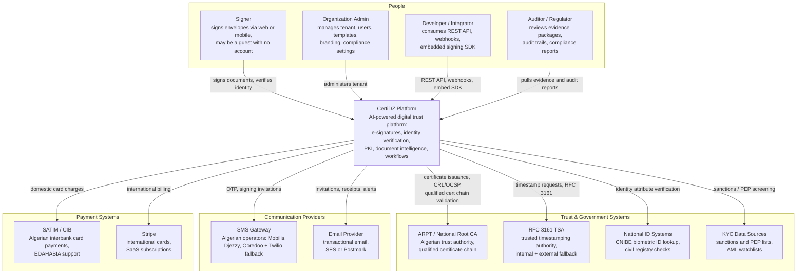

**Context notes**

- **Signers** are frequently *guests*: they receive a signed deep link (JWT with envelope scope), verify identity to the level the envelope demands (email OTP → SMS OTP → full KYC with liveness → qualified certificate), and sign. No account creation required for simple/advanced signatures.
- **ARPT integration** is asynchronous and message-driven: qualified certificate requests are queued, submitted to the national CA RA interface, and completed via callback/polling. CertiDZ also operates a **subordinate/issuing CA** for advanced (non-qualified) certificates under its own root.
- **Auditors** get a read-only, time-boxed access mode with its own role, watermarked document views, and every access itself written to the audit trail.

---

### 2.2 Container Diagram (C4 Level 2)

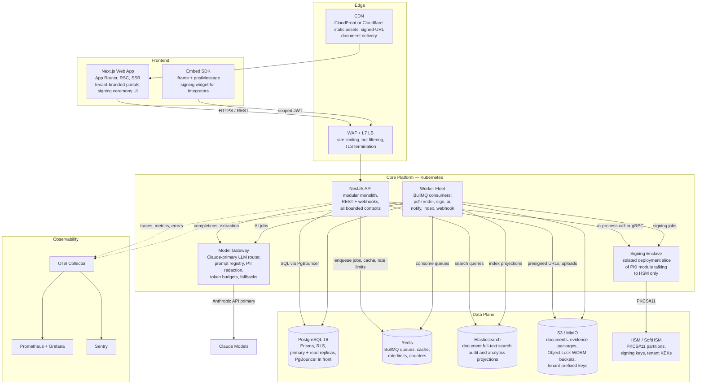

**Container responsibilities**

| Container | Tech | Scaling unit | Notes |
|---|---|---|---|
| Next.js Web | Next.js 15, App Router | HPA on CPU + RPS | RSC for dashboards; signing ceremony is a client-heavy island; per-tenant theming resolved server-side from subdomain. |
| NestJS API | NestJS 10, Fastify adapter | HPA, 3–40 pods | Single deployable containing all bounded contexts as Nest modules. Stateless; sticky-session-free. |
| Worker Fleet | NestJS standalone apps + BullMQ | KEDA on queue depth | One deployment per queue family so `sign` workers scale independently of `ai` workers. |
| Signing Enclave | Same codebase, `SIGNING_ENCLAVE=true` profile | Fixed 2–4 pods, dedicated node pool | Only pods with HSM network access; NetworkPolicy denies everything else. First extraction candidate (§4). |
| Model Gateway | NestJS thin service | HPA | Central prompt registry, model routing (Claude primary, fallback tiers), PII redaction, per-tenant token budgets, response caching. |
| PostgreSQL | 16, Patroni HA | Vertical + read replicas | RLS enforced. `audit_events` partitioned monthly (§9.3). |
| Redis | 7, Cluster in prod | Redis Cluster 6 shards | Queues on dedicated logical shard-set; cache and rate limits separate. |
| Elasticsearch | 8.x, 3+ nodes | Data-node scale-out | Read models only — always rebuildable from Postgres + events. |
| S3 / MinIO | Versioned + Object Lock | n/a | `certidz-docs` (mutable drafts), `certidz-evidence` (WORM, compliance mode). |
| HSM | PKCS#11; SoftHSM2 dev, network HSM prod | n/a | Per-tenant KEK slots + platform signing keys; quorum-controlled admin. |

---

### 2.3 Component Diagram — Signing Context (C4 Level 3)

Internals of the `SigningModule` in the NestJS monolith. Hexagonal layout:
controllers → application services → domain → ports, with adapters at the edge.

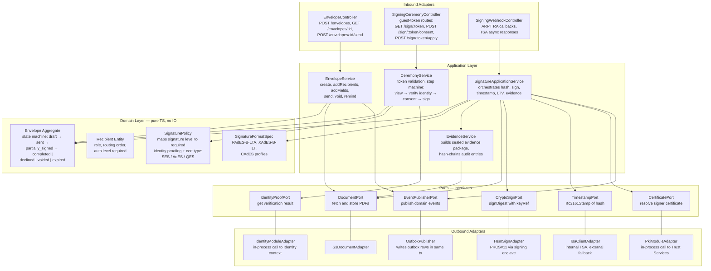

**Signature application sequence** — the critical path for `signature.applied`:

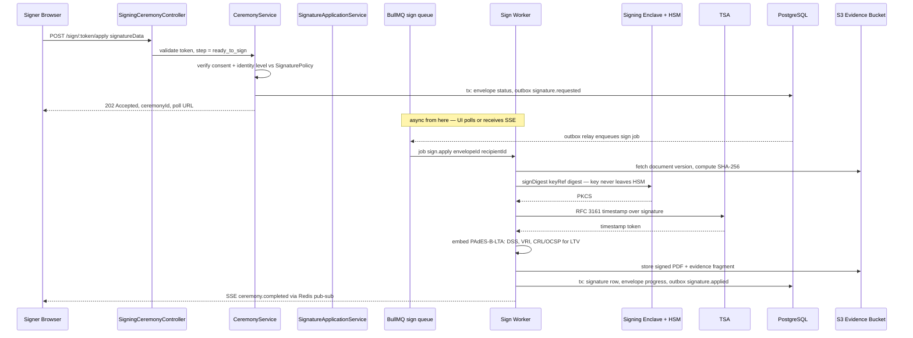

Failure notes: the sign job is **idempotent** (keyed by `ceremonyId`); a retry after
an HSM timeout re-checks whether the signature row exists before re-signing. TSA
failover order: internal TSA → national TSA → configured external TSA; if all fail,
the job parks in the DLQ and the envelope shows "signature pending timestamp" —
never a silently unstamped qualified signature.

---

### 2.4 Component Diagram — AI Context (C4 Level 3)

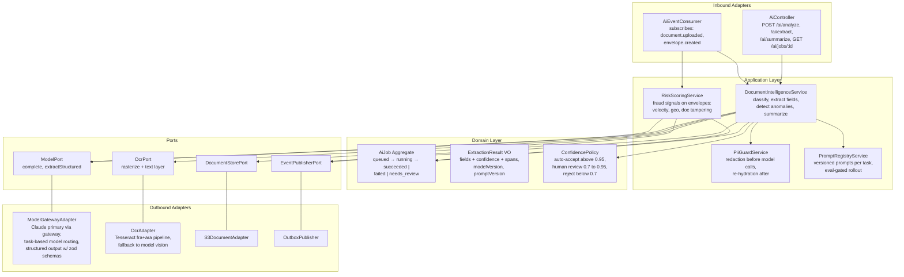

**AI context rules**

- All model calls go through the **model gateway** — no direct provider SDK usage inside contexts. The gateway enforces: per-tenant token budgets, prompt/model version pinning, PII redaction verification, response caching (Redis, keyed by `hash(promptVersion + redactedInput)`), and fallback routing (Claude Sonnet-class for extraction, Haiku-class for classification, Opus-class for complex legal document analysis).
- Every `ExtractionResult` persists `modelId`, `promptVersion`, `confidence`, and token usage — required for SOC 2 change-management evidence and for regression evals when prompts change.
- Documents in Arabic and French are the norm; OCR runs `fra+ara` traineddata with RTL-aware post-processing before any model call.
- `needs_review` results land in a human review queue surfaced in the org admin UI; the human decision is captured as a domain event (`ai.review.completed`) and feeds the eval dataset.

---

## 3. Modular Monolith — Bounded Contexts

Nine bounded contexts, each a top-level NestJS module backed by a
`packages/domain/<context>` library. Contexts share one Postgres database but
**never touch another context's tables** — cross-context reads go through the
public module API or read models.

### 3.1 Context Map

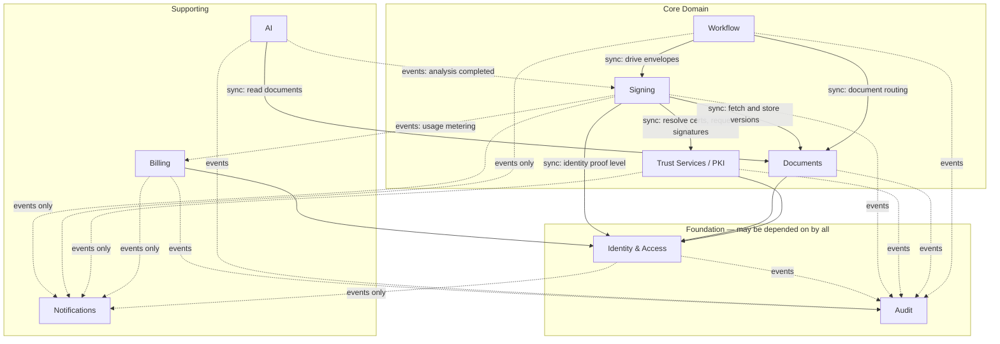

**Dependency rules** (solid = allowed synchronous in-process call; dotted = event-only):

1. Everyone may depend on **Identity & Access** (authN/Z, tenants, users) and publish to **Audit**.
2. **Audit** and **Notifications** depend on *no one* — they only consume events. This is what makes them trivially extractable.
3. **AI** never calls Signing synchronously; it reacts to events and emits results as events. Signing decides what to do with them.
4. **Billing** learns about usage exclusively via events (`signature.applied`, `identity.verified`, `ai.job.completed`) — metering must not couple the hot signing path to billing availability.
5. No context imports another context's Prisma models. Cross-context foreign keys are **soft** (UUID references, no DB-level FK across context table groups) so extraction later doesn't require schema surgery.

### 3.2 Context Catalog

| Context | Responsibilities | Owned tables (prefix) | Publishes | Consumes | Public in-process API (`packages/domain/<ctx>` exports) |
|---|---|---|---|---|---|
| **Identity & Access** | Tenants, users, roles/permissions (RBAC + per-envelope grants), sessions, API keys, SSO (OIDC/SAML), guest signer identities, KYC orchestration (OCR, face match, liveness, NFC), verification levels | `tenants`, `users`, `memberships`, `roles`, `api_keys`, `sessions`, `identity_verifications`, `identity_documents`, `verification_artifacts` | `user.registered`, `user.invited`, `tenant.created`, `identity.verification.started`, `identity.verified`, `identity.rejected` | `envelope.completed` (to close verification sessions) | `IamFacade`: `authenticate()`, `authorize(actor, action, resource)`, `resolveTenant()`, `getVerificationLevel(userOrGuestId)`, `startVerification(spec)` |
| **Documents** | Upload, versioning, format validation, PDF normalization, storage keys, retention policies, folders/tags, share links, search indexing triggers | `documents`, `document_versions`, `folders`, `document_tags`, `retention_policies`, `share_links` | `document.uploaded`, `document.version.created`, `document.deleted`, `document.retention.expired` | `signature.applied` (attach signed version), `ai.analysis.completed` (attach metadata) | `DocumentsFacade`: `createFromUpload()`, `getVersion(id, v)`, `presignDownload(id)`, `applyRetention()` |
| **Signing** | Envelopes, recipients, routing order, fields/tabs, signing ceremony, signature application (SES/AdES/QES), evidence packages, reminders/expiry | `envelopes`, `recipients`, `envelope_documents`, `fields`, `signatures`, `ceremonies`, `consents`, `evidence_packages` | `envelope.created`, `envelope.sent`, `envelope.completed`, `envelope.declined`, `envelope.voided`, `envelope.expired`, `signature.requested`, `signature.applied` | `identity.verified`, `certificate.issued`, `ai.analysis.completed`, `workflow.step.activated` | `SigningFacade`: `createEnvelope()`, `sendEnvelope()`, `getCeremonyState(token)`, `applySignature(cmd)` |
| **Trust Services / PKI** | Issuing CA operations, CSR generation, certificate issuance (advanced) and RA brokering to ARPT (qualified), CRL/OCSP responder, key ceremony records, TSA client, HSM key lifecycle, envelope-encryption KEKs | `certificates`, `certificate_requests`, `crls`, `key_refs`, `tsa_receipts`, `kek_registry` | `certificate.requested`, `certificate.issued`, `certificate.revoked`, `certificate.expiring`, `crl.published` | `identity.verified` (gate cert issuance), `tenant.created` (provision KEK) | `PkiFacade`: `requestCertificate(subject, level)`, `getSignerCert(recipientId)`, `signDigest(keyRef, digest)`, `timestamp(hash)`, `revoke(serial, reason)` |
| **Workflow** | Multi-step approval/signing flows, templates, conditional branches, parallel/serial routing, SLA timers, escalation | `workflows`, `workflow_templates`, `workflow_steps`, `step_assignments`, `workflow_timers` | `workflow.started`, `workflow.step.activated`, `workflow.step.completed`, `workflow.completed`, `workflow.escalated` | `envelope.completed`, `envelope.declined`, `identity.verified`, `document.uploaded` | `WorkflowFacade`: `startFromTemplate()`, `advance(stepId, outcome)`, `getInstanceState(id)` |
| **AI** | Document classification, field extraction, summarization, anomaly/tamper detection, envelope risk scoring, prompt registry, human review loop | `ai_jobs`, `ai_results`, `ai_reviews`, `prompt_versions`, `model_usage` | `ai.job.queued`, `ai.analysis.completed`, `ai.review.required`, `ai.review.completed`, `ai.risk.flagged` | `document.uploaded`, `envelope.created`, `envelope.sent` | `AiFacade`: `analyzeDocument(docId, tasks)`, `getResult(jobId)`, `scoreEnvelopeRisk(envId)` |
| **Billing** | Plans, subscriptions, seat + usage metering (signatures, verifications, AI credits), invoices, SATIM/CIB + Stripe adapters, dunning, tax (Algerian TVA) | `plans`, `subscriptions`, `usage_records`, `invoices`, `invoice_lines`, `payments`, `payment_methods` | `subscription.created`, `subscription.updated`, `payment.succeeded`, `payment.failed`, `usage.threshold.reached` | `signature.applied`, `identity.verified`, `ai.job.completed`, `tenant.created` | `BillingFacade`: `getEntitlements(tenantId)`, `checkQuota(tenantId, metric)`, `recordUsage()` |
| **Notifications** | Template rendering (fr/ar/en, RTL), channel routing (email, SMS, in-app, webhook), delivery tracking, preference management, webhook signing + retries | `notification_templates`, `notifications`, `deliveries`, `webhook_endpoints`, `webhook_deliveries`, `preferences` | `notification.sent`, `notification.failed`, `webhook.delivery.failed` | Nearly everything: `envelope.*`, `identity.*`, `certificate.expiring`, `payment.*`, `workflow.escalated`, `user.invited` | `NotificationsFacade`: `send(templateKey, recipient, data)` — *discouraged; prefer events* |
| **Audit** | Immutable hash-chained audit trail, evidence export, regulator reports, retention enforcement, tamper verification | `audit_events` (partitioned), `audit_chains`, `audit_exports` | `audit.event.recorded`, `audit.export.ready` | **All** events (wildcard consumer) | `AuditFacade`: `query(filter)`, `verifyChain(tenantId, range)`, `export(spec)` — read-only |

### 3.3 Boundary Enforcement

Boundaries are enforced by **tooling, not discipline**:

1. **Nx module boundaries** (`@nx/enforce-module-boundaries`) with tags. Every library gets `scope:<context>` and `type:domain|application|contracts|infra` tags:

```jsonc
// .eslintrc.json (root) — excerpt
{
  "rules": {
    "@nx/enforce-module-boundaries": ["error", {
      "depConstraints": [
        { "sourceTag": "scope:signing",
          "onlyDependOnLibsWithTags": [
            "scope:signing", "scope:shared",
            "api:iam", "api:documents", "api:pki", "type:contracts"] },
        { "sourceTag": "scope:notifications",
          "onlyDependOnLibsWithTags": ["scope:notifications", "scope:shared", "type:contracts"] },
        { "sourceTag": "scope:audit",
          "onlyDependOnLibsWithTags": ["scope:audit", "scope:shared", "type:contracts"] },
        { "sourceTag": "type:domain",
          "onlyDependOnLibsWithTags": ["type:domain", "type:contracts"] }
      ]
    }]
  }
}
```

   The `api:<context>` tag is applied only to the small `*.facade.ts` public-API library of each context — so Signing may import `IamFacade` but *not* `iam/internal/*` services or repositories. CI fails on violation.

2. **eslint-plugin-boundaries** adds file-level rules inside each context: `controllers` may import `application`, `application` may import `domain` + `ports`, `domain` imports nothing with IO. Prevents the classic "service imports another context's repository" drift.

3. **NestJS module encapsulation**: each context module `exports` only its facade provider. Anything not exported is invisible to `imports: [SigningModule]` consumers. Combined with `forRoot()`-style configuration, contexts read their own config namespace only.

4. **Database-level**: one Prisma schema, but a CI script (`tools/scripts/check-table-ownership.ts`) parses each context's repository files and fails the build if a context references a table outside its ownership manifest (`packages/domain/<ctx>/tables.json`).

5. **Contract tests**: `packages/contracts` holds zod schemas for every event and facade DTO. Consumers pin schema versions; a breaking change to a contract fails the affected consumers' contract-test suites in CI, not in production.

---

## 4. Extraction Path to Microservices

The monolith is the *strategy*, not a phase of shame. Extraction happens only when
a trigger fires. Order of extraction is pre-decided so infra investment (event bus,
service mesh, contract testing) is amortized deliberately.

### 4.1 Extraction Order & Rationale

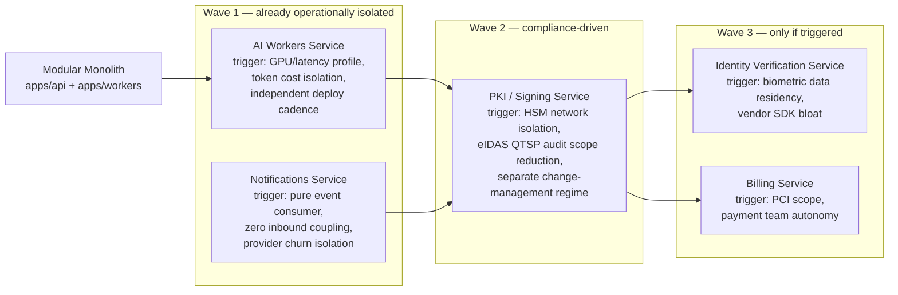

| Candidate | Why first | What moves | What stays |
|---|---|---|---|
| **AI workers** | Already async-only; distinct resource profile (long-running, bursty, external API bound); model gateway is the natural network seam; a bad AI deploy must never take down signing. | `apps/workers/ai` deployment + `packages/domain/ai` application/infra layers behind the existing event contracts. | `ai_jobs`/`ai_results` tables move to a dedicated schema, then DB (see data rules below). The `AiFacade` in-process calls become thin clients that enqueue + poll — call sites already treat AI as async. |
| **Notifications** | Zero synchronous inbound dependencies by design (§3.1 rule 2). Extraction = point its consumers at the bus and move its tables. Ideal dry run for the extraction playbook. | Template rendering, channel adapters, webhook delivery. | Delivery-status read model stays queryable via API composition in the BFF layer. |
| **PKI / Signing service** | Compliance, not scale: eIDAS/QTSP and ARPT audits want the smallest possible trust boundary around key material. Extracting shrinks the audited deployable from "everything" to one service + HSM. The signing enclave (§2.2) is already a separate deployment profile — extraction formalizes it with gRPC + mTLS (SPIFFE IDs) and its own release train with four-eyes deploy approval. | `PkiFacade.signDigest/timestamp/requestCertificate` become gRPC. `key_refs`, `certificates`, `kek_registry` move to a dedicated, encrypted, separately backed-up database. | Envelope orchestration stays in the monolith; only cryptographic primitives cross the wire — digests in, signatures out. Documents never transit the PKI service. |

### 4.2 Strangler Pattern Mechanics

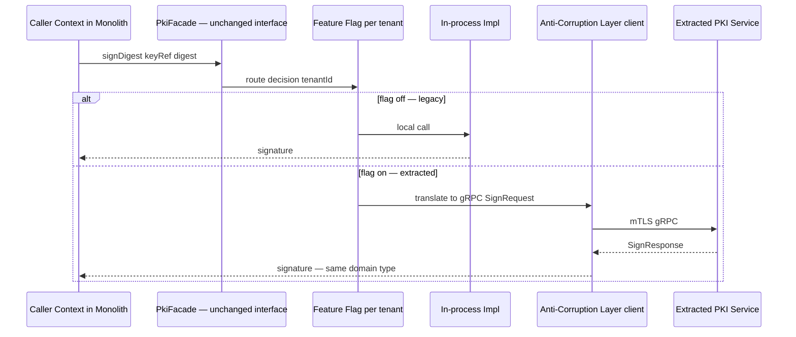

Rules of the strangler migration:

1. **The facade interface never changes.** Callers cannot tell whether the implementation is local or remote — that is the whole point of ports/adapters from day one.
2. **Anti-corruption layer** lives on the *consumer* side (`packages/contracts/pki-client`): it translates between the monolith's domain types and the service's wire protocol, owns retries/timeouts/circuit breaking (never let remote semantics leak into domain code), and maps remote errors into the same domain error taxonomy the local impl used.
3. **Dual-run verification** for the PKI service: shadow mode where both impls run and results are compared (signatures verified against both cert chains) for two weeks before flipping any tenant.
4. **Data ownership rules** — non-negotiable:
   - A table is owned by exactly one context/service. At extraction, tables move *with* the service (schema-per-context makes this a `pg_dump`/logical-replication exercise, not a refactor).
   - No shared-database access post-extraction. Other services get data via events (build their own read model) or the owning service's API.
   - During transition: logical replication keeps the old tables read-only-synced for rollback; cut writes over atomically via the feature flag.
5. **Events are already the integration layer** — extraction does not change a single event contract. The outbox relay of the extracted service publishes to the same bus (§5.5).

### 4.3 Extraction Triggers (objective, reviewed quarterly)

| Trigger class | Threshold that opens an extraction RFC |
|---|---|
| Team scaling | > 2 squads regularly conflicting in one context's code; deploy queue contention > 1 blocked release/week |
| Scaling hotspot | A context needs > 3× the fleet-average pod count, or its worker queues force cluster-wide scaling |
| Compliance isolation | Auditor/regulator requires reduced scope (QTSP for PKI; PCI for Billing; biometric residency for Identity) |
| Fault isolation | Context caused ≥ 2 monolith-wide incidents in a quarter (e.g., AI provider timeout starving the event loop) |
| Tech divergence | Context genuinely needs a different runtime (e.g., Python for a bespoke CV model in Identity) |

Absent a trigger, **extraction is refused** — a network hop, a second on-call rotation, and distributed-transaction pain are costs that need a paying customer.

---

## 5. Event-Driven Backbone

### 5.1 Today: BullMQ on Redis

BullMQ serves double duty: **work queues** (jobs that must run once) and the
**event fan-out** (outbox relay publishes each event to every subscriber's queue).

**Queue topology**

| Queue | Purpose | Concurrency/pod | Priority levels | Retry policy | DLQ |
|---|---|---|---|---|---|
| `sign` | Signature application, sealing, LTV enrichment | 4 | ceremony-interactive=1, batch=5 | 5 attempts, exp backoff 2s→60s, jitter | `sign:dlq` |
| `pdf` | Rendering, flattening, page previews, watermarks | 8 | preview=3, final=1 | 3 attempts, exp 1s→10s | `pdf:dlq` |
| `ai` | Classification, extraction, risk scoring | 6 | interactive=2, bulk=8 | 4 attempts, exp 5s→120s (provider-aware: honors retry-after) | `ai:dlq` |
| `notify-email` | Email rendering + dispatch | 10 | otp=1, transactional=3, digest=8 | 6 attempts, exp 10s→15m | `notify-email:dlq` |
| `notify-sms` | SMS/OTP via operator gateways | 10 | otp=1, other=5 | 4 attempts, exp 5s→5m, provider failover on attempt 3 | `notify-sms:dlq` |
| `webhook` | Signed webhook delivery to integrators | 16 | uniform | 8 attempts, exp 30s→6h (integrator endpoints are flaky) | `webhook:dlq` |
| `index` | Elasticsearch projection updates | 8 | uniform | 5 attempts, exp 2s→60s | `index:dlq` |
| `pki` | Cert issuance, ARPT RA polling, CRL publication, KEK rotation | 2 | revocation=1, issuance=3 | 5 attempts, exp 10s→10m | `pki:dlq` |
| `billing` | Usage aggregation, invoice generation, payment capture | 4 | capture=1, aggregate=5 | 5 attempts, exp 30s→30m | `billing:dlq` |
| `events:<consumer>` | Per-consumer event delivery queues fed by outbox relay (e.g. `events:audit`, `events:notifications`) | 8 | uniform | 10 attempts, exp 1s→10m | `events:<consumer>:dlq` |

Operational conventions:

- **DLQ handling**: every `:dlq` queue has a Grafana alert at depth > 0 for `sign`/`pki`, depth > 50 for others. A small admin UI (`/admin/queues`, Bull Board behind IAM) supports inspect → fix → replay. DLQ jobs carry the full event envelope + error history.
- **Per-tenant fairness**: see §7.5 — group-based rate limiting so one tenant's 50k-envelope bulk send cannot starve interactive ceremonies.
- **Scheduled jobs** (BullMQ repeatables): `certificate.expiring` scanner (daily), envelope expiry sweeper (hourly), retention enforcement (daily), CRL publication (per CA policy, 24h), outbox janitor (hourly).

### 5.2 Reliable Publishing: Outbox Pattern

Events are written **in the same Prisma transaction** as the state change. A relay
process publishes them. No event is ever lost to a crash between DB commit and
Redis publish, and no event is published for a rolled-back transaction.

**Table:**

```sql
CREATE TABLE outbox (
    id             UUID PRIMARY KEY DEFAULT gen_random_uuid(),
    event_type     TEXT        NOT NULL,          -- 'envelope.completed'
    aggregate_type TEXT        NOT NULL,          -- 'envelope'
    aggregate_id   UUID        NOT NULL,
    tenant_id      UUID        NOT NULL,
    payload        JSONB       NOT NULL,          -- full event envelope, §5.4
    occurred_at    TIMESTAMPTZ NOT NULL DEFAULT now(),
    published_at   TIMESTAMPTZ,                   -- NULL = pending
    attempts       INT         NOT NULL DEFAULT 0,
    trace_id       TEXT
);
CREATE INDEX outbox_pending_idx ON outbox (occurred_at) WHERE published_at IS NULL;
```

**Write side (application code):**

```ts
// packages/shared/outbox/outbox.writer.ts
async completeEnvelope(cmd: CompleteEnvelopeCommand) {
  await this.prisma.$transaction(async (tx) => {
    const envelope = await tx.envelope.update({
      where: { id: cmd.envelopeId },
      data: { status: 'COMPLETED', completedAt: new Date() },
    });
    await tx.outbox.create({
      data: {
        eventType: 'envelope.completed',
        aggregateType: 'envelope',
        aggregateId: envelope.id,
        tenantId: envelope.tenantId,
        traceId: this.ctx.traceId,
        payload: buildEnvelopeV1({
          type: 'envelope.completed',
          tenantId: envelope.tenantId,
          actor: cmd.actor,
          payload: { envelopeId: envelope.id, documentIds: envelope.documentIds,
                     completedAt: envelope.completedAt },
        }),
      },
    });
  }); // atomic: state change + event, or neither
}
```

**Relay** (`apps/workers/outbox-relay`): polls with `FOR UPDATE SKIP LOCKED` in
batches of 500 every 250 ms (plus a `LISTEN/NOTIFY` fast path for near-real-time),
fans each event out to every subscribed `events:<consumer>` queue with
`jobId = "${outbox.id}:${consumer}"` — BullMQ dedupes on jobId, making the relay
crash-safe (at-least-once toward Redis, exactly-once effect via jobId). Rows are
marked `published_at` after successful enqueue and purged after 7 days.

**Idempotent consumers**: every consumer table-tracks processed event IDs:

```sql
CREATE TABLE consumer_inbox (
    consumer   TEXT NOT NULL,
    event_id   UUID NOT NULL,
    processed_at TIMESTAMPTZ NOT NULL DEFAULT now(),
    PRIMARY KEY (consumer, event_id)
);
```

Handler pattern: `INSERT INTO consumer_inbox ... ON CONFLICT DO NOTHING` inside the
handler's own transaction; if the insert reports a conflict, skip. Combined with
at-least-once delivery this yields effectively-once processing.

### 5.3 Event Catalog

All events use the envelope schema in §5.4. Payload sketches show domain fields only.

| Event | Producer | Consumers | Payload sketch |
|---|---|---|---|
| `user.registered` | Identity & Access | Notifications (welcome), Billing (seat count), Audit | `{ userId, tenantId, email, method: "password" \| "oidc" \| "invite" }` |
| `user.invited` | Identity & Access | Notifications, Audit | `{ inviteId, email, role, invitedBy }` |
| `tenant.created` | Identity & Access | PKI (provision KEK), Billing (trial subscription), Notifications, Audit | `{ tenantId, name, plan, region }` |
| `identity.verification.started` | Identity & Access | AI (doc pre-checks), Audit | `{ verificationId, subjectId, requiredLevel: "basic" \| "kyc" \| "qes_ready", channels: ["ocr","face","liveness","nfc"] }` |
| `identity.verified` | Identity & Access | Signing (unblock ceremony), PKI (cert eligibility), Billing (metering), Notifications, Audit | `{ verificationId, subjectId, level, checks: { ocr, faceMatch, liveness, nfc, sanctions }, expiresAt }` |
| `identity.rejected` | Identity & Access | Signing (fail ceremony step), Notifications, Audit | `{ verificationId, subjectId, reasonCodes: ["FACE_MISMATCH", ...], reviewable }` |
| `document.uploaded` | Documents | AI (auto-analysis), Search indexer, Audit | `{ documentId, versionId, tenantId, mime, pages, sha256, sizeBytes }` |
| `document.version.created` | Documents | Search indexer, Audit | `{ documentId, versionId, sha256, createdBy }` |
| `document.deleted` | Documents | Search indexer (remove), Audit | `{ documentId, mode: "soft" \| "retention_purge" }` |
| `envelope.created` | Signing | AI (risk baseline), Audit | `{ envelopeId, documentIds, recipientCount, signatureLevel: "SES" \| "AdES" \| "QES" }` |
| `envelope.sent` | Signing | Notifications (invitations), Workflow, AI (risk score), Audit | `{ envelopeId, recipients: [{ recipientId, channel, routingOrder }], expiresAt }` |
| `signature.requested` | Signing | Sign worker (via queue), Audit | `{ ceremonyId, envelopeId, recipientId, keyRef, digestAlgo: "SHA-256" }` |
| `signature.applied` | Signing | Documents (attach signed version), Billing (metering), Notifications (progress), Workflow, Audit | `{ envelopeId, recipientId, signatureId, level, format: "PAdES-B-LTA", certSerial, tsaToken: { tsa, genTime } }` |
| `envelope.completed` | Signing | Documents, Workflow (advance), Notifications (all parties + webhook), Billing, Search indexer, Audit | `{ envelopeId, completedAt, evidencePackageKey, documentIds }` |
| `envelope.declined` | Signing | Workflow (branch), Notifications, Audit | `{ envelopeId, recipientId, reason, declinedAt }` |
| `envelope.voided` | Signing | Workflow, Notifications, Audit | `{ envelopeId, voidedBy, reason }` |
| `envelope.expired` | Signing (sweeper) | Workflow, Notifications, Audit | `{ envelopeId, sentAt, expiredAt }` |
| `certificate.requested` | Trust Services | PKI worker (issuance/RA flow), Audit | `{ requestId, subjectId, level: "advanced" \| "qualified", csrRef }` |
| `certificate.issued` | Trust Services | Signing (unblock QES ceremony), Notifications, Audit | `{ certificateId, serial, subjectId, level, notBefore, notAfter, issuerChainRef }` |
| `certificate.revoked` | Trust Services | Signing (invalidate pending ceremonies), Notifications, Audit | `{ certificateId, serial, reason: "keyCompromise" \| "cessationOfOperation" \| ..., revokedAt }` |
| `certificate.expiring` | Trust Services (daily scan) | Notifications (30/14/3-day reminders), Audit | `{ certificateId, serial, subjectId, notAfter, daysRemaining }` |
| `workflow.started` | Workflow | Notifications, Audit | `{ workflowId, templateId, initiator, contextRefs }` |
| `workflow.step.activated` | Workflow | Signing (create envelope for step), Notifications (assignee), Audit | `{ workflowId, stepId, type: "sign" \| "approve" \| "review", assignees }` |
| `workflow.step.completed` | Workflow | Workflow engine (advance), Notifications, Audit | `{ workflowId, stepId, outcome: "approved" \| "rejected" \| "signed", completedBy }` |
| `workflow.completed` | Workflow | Notifications, Audit | `{ workflowId, outcome, durationMs }` |
| `workflow.escalated` | Workflow (SLA timer) | Notifications (escalation contact), Audit | `{ workflowId, stepId, slaMs, escalatedTo }` |
| `ai.analysis.completed` | AI | Documents (metadata), Signing (pre-fill fields), Search indexer, Audit | `{ jobId, documentId, tasks: ["classify","extract"], classification, fields: [{ name, value, confidence, span }], modelId, promptVersion }` |
| `ai.review.required` | AI | Notifications (review queue alert), Audit | `{ jobId, documentId, reason: "low_confidence", minConfidence }` |
| `ai.risk.flagged` | AI | Signing (hold envelope), Notifications (admin alert), Audit | `{ envelopeId, score, signals: ["geo_velocity","doc_tamper_suspect"] }` |
| `payment.succeeded` | Billing | Notifications (receipt), Audit | `{ paymentId, invoiceId, tenantId, amount, currency: "DZD" \| "EUR" \| "USD", provider: "satim" \| "stripe" }` |
| `payment.failed` | Billing | Notifications (dunning), Audit | `{ paymentId, invoiceId, reason, attempt, nextRetryAt }` |
| `subscription.updated` | Billing | IAM (entitlement cache bust), Notifications, Audit | `{ subscriptionId, tenantId, plan, seats, status, effectiveAt }` |
| `usage.threshold.reached` | Billing | Notifications (quota warning) | `{ tenantId, metric: "signatures" \| "verifications" \| "ai_credits", used, limit, pct }` |
| `audit.event.recorded` | Audit | Search indexer (audit projection) | `{ auditId, chainPosition, prevHash, hash }` |

### 5.4 Event Envelope Schema

Every event — outbox payload, queue job data, and future bus message — is wrapped:

```jsonc
{
  "id": "0197a3f1-6a2e-7cc1-9f3d-0b2a1c4d5e6f",   // UUIDv7, time-ordered
  "type": "envelope.completed",                    // <aggregate>.<past-tense-fact>
  "version": 1,                                    // payload schema version
  "occurredAt": "2026-07-02T14:31:07.412Z",
  "tenantId": "3f8a...-tenant-uuid",
  "actor": {
    "type": "user" | "guest" | "system" | "api_key",
    "id": "user-uuid-or-key-id",
    "ip": "41.111.x.x",                            // where legally recordable
    "onBehalfOf": null
  },
  "traceId": "otel-trace-id",                      // joins events to OTel traces
  "correlationId": "workflow-or-envelope-uuid",    // business correlation
  "causationId": "id-of-event-that-caused-this",
  "payload": { /* per-type schema, zod-defined in packages/contracts */ }
}
```

Versioning rules: additive changes keep `version`; breaking changes bump it and the
producer **dual-publishes** both versions for one deprecation window (90 days).
Consumers declare the versions they accept in contract tests.

### 5.5 Later: NATS JetStream / Kafka Migration

BullMQ-as-bus has known ceilings: no replay for new consumers, fan-out cost is
O(consumers) enqueues, Redis memory bounds retention. Migration trigger: first
extracted service that needs replay/backfill, or > 5k events/s sustained, or a
consumer that needs to rebuild a projection from history.

Choice: **NATS JetStream first** (operationally light, K8s-native, per-subject
retention, works for both queues-ish and streams); Kafka only if we later need
its ecosystem (Connect/Debezium at scale, stream processing).

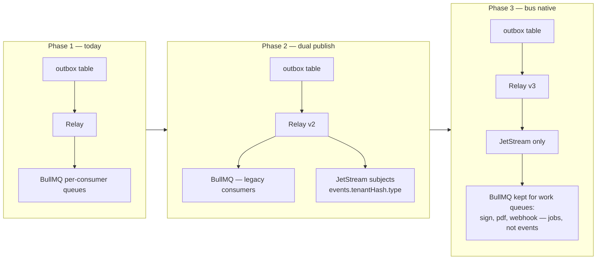

Migration invariants: (a) the **outbox stays** — it is the durability boundary and is
bus-agnostic; (b) consumers migrate one at a time by switching their inbox source,
with the `consumer_inbox` dedupe table absorbing the overlap window; (c) BullMQ is
retained forever for *work* (things that must run once with retries), while the bus
carries *facts*. Event envelope and catalog do not change at all.

---

## 6. CQRS — Where It Applies

CQRS is applied **selectively** — only where read and write shapes genuinely diverge.
Envelope CRUD does not need it; audit, search, and dashboards do.

| Read model | Store | Source events | Staleness budget | Rebuildable |
|---|---|---|---|---|
| Audit trail projection (per-tenant, filterable, export-ready) | Elasticsearch `audit-{tenant-tier}-{month}` | all `audit.event.recorded` | ≤ 5 s | Yes — from `audit_events` partitions |
| Document search (full text incl. AI-extracted fields, ar/fr analyzers) | Elasticsearch `documents-v3` | `document.*`, `ai.analysis.completed`, `envelope.completed` | ≤ 10 s | Yes — reindex job from PG + S3 text layers |
| Envelope analytics (funnel: sent → viewed → signed, time-to-sign percentiles) | Elasticsearch `envelope-analytics` | `envelope.*`, `signature.applied` | ≤ 60 s | Yes |
| Dashboard counters (pending signatures, completed this month, quota usage) | Redis hashes `tenant:{id}:counters`, TTL 24 h | `envelope.*`, `signature.applied`, `usage.*` | ≤ 2 s | Yes — recompute-on-miss from PG |
| Entitlement cache (plan limits, feature flags) | Redis `tenant:{id}:entitlements` | `subscription.updated` | ≤ 2 s | Yes |

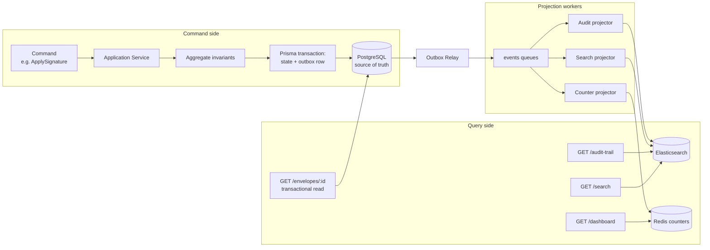

**Eventual consistency handling**

- Transactional reads (fetch the envelope you just created) always hit Postgres — no projection in the critical write→read path of a single user action.
- Projected reads carry `X-Data-Freshness: projected` and the UI copy is designed for it ("results update within seconds"). Search results after upload show an "indexing" chip driven by comparing `document.updatedAt` vs the projection watermark.
- Every projector maintains a **watermark** (`projector_state` table: last processed `occurredAt` per projector). Grafana alerts when `now() - watermark > 60s`.
- Projections are **versioned** (`documents-v3`): schema changes deploy a new index, backfill runs from PG at controlled rate, alias flips atomically, old index kept 7 days.
- Counters use idempotent event-ID-guarded `HINCRBY` (Lua script checks a per-counter dedupe set) and a nightly reconciliation job that recomputes from Postgres and logs drift as a metric — drift > 0.1% pages the on-call.

---

## 7. Multi-Tenancy Model

### 7.1 Tiers

| Tier | Isolation | Target customers |
|---|---|---|
| **Pooled** (default) | Shared DB + RLS, shared queues with fairness, tenant-prefixed S3 | SMB, startups, professional plans |
| **Dedicated schema** | Own Postgres schema, shared cluster; dedicated queue group | Enterprise, banks |
| **Dedicated database** | Own PG instance + own S3 bucket + optional in-country region; own HSM partition | Government / Law 15-04 regulated bodies |

The application code is identical across tiers — a `TenantDirectory` service resolves
`tenantId → { connectionRef, s3Bucket, kekSlot, queueGroup }` at request time.

### 7.2 Row-Level Security — the actual mechanism

Every tenant-owned table carries `tenant_id UUID NOT NULL` and RLS:

```sql
-- Migration: enable RLS on a tenant-owned table
ALTER TABLE envelopes ENABLE ROW LEVEL SECURITY;
ALTER TABLE envelopes FORCE ROW LEVEL SECURITY;  -- applies to table owner too

CREATE POLICY tenant_isolation ON envelopes
    USING (tenant_id = current_setting('app.tenant_id')::uuid)
    WITH CHECK (tenant_id = current_setting('app.tenant_id')::uuid);

-- Break-glass role for migrations/support tooling, audited separately:
CREATE POLICY admin_bypass ON envelopes
    TO certidz_admin
    USING (current_setting('app.bypass_rls', true) = 'on')
    WITH CHECK (current_setting('app.bypass_rls', true) = 'on');
```

The app connects as `certidz_app` (not the table owner, **no** `BYPASSRLS`).
`current_setting('app.tenant_id')` throws if unset — a query without tenant context
fails loudly instead of returning everything.

**Prisma integration** — every tenant-scoped operation runs in a transaction that
first sets the tenant GUC with `SET LOCAL` (scoped to that transaction, safe with
PgBouncer transaction pooling):

```ts
// packages/shared/database/tenant-prisma.extension.ts
export const tenantScoped = (base: PrismaClient) =>
  base.$extends({
    client: {
      async $tenant<T>(tenantId: string, fn: (tx: Prisma.TransactionClient) => Promise<T>) {
        return base.$transaction(async (tx) => {
          // SET LOCAL lives and dies with this transaction
          await tx.$executeRawUnsafe(
            `SET LOCAL app.tenant_id = '${assertUuid(tenantId)}'`,
          );
          return fn(tx);
        });
      },
    },
  });

// Usage inside a repository — the CLS-stored tenant is applied automatically
// by a request-scoped wrapper, so context code just does:
await this.db.$tenant(ctx.tenantId, (tx) =>
  tx.envelope.findMany({ where: { status: 'SENT' } }),
); // RLS guarantees the where-clause could even be omitted safely
```

`assertUuid` validates the value before interpolation (GUC values cannot be bound
as parameters in `SET LOCAL`). A Nest interceptor + `AsyncLocalStorage` (nestjs-cls)
carries `tenantId` so repositories never take it as a parameter. Defense in depth:
Prisma `where` clauses still filter by `tenantId` (via a query extension that
injects it), and RLS is the backstop — belt *and* suspenders.

### 7.3 Tenant Resolution Middleware

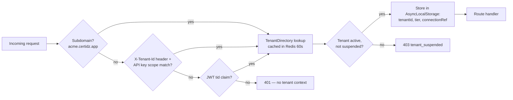

Precedence: subdomain > header (must agree with the API key's tenant — mismatch is
a 403 and a security audit event) > JWT `tid` claim. Guest signing links embed the
tenant in the signed ceremony token; the middleware treats it as a JWT source.

### 7.4 Storage & Encryption Isolation

- **S3 layout**: `s3://certidz-docs/{tenantId}/{documentId}/{versionId}.pdf` and
  `s3://certidz-evidence/{tenantId}/{envelopeId}/evidence.zip` (Object Lock,
  compliance mode, retention per tenant policy). IAM session policies for presigned
  URL generation are templated with the tenant prefix, so a leaked presigner cannot
  cross prefixes.
- **Envelope encryption**: per-tenant KEK in the HSM (`kek_registry` maps
  `tenantId → hsm slot/label`); per-object DEK (AES-256-GCM) generated at upload,
  wrapped by the tenant KEK, stored in object metadata. KEK rotation re-wraps DEKs
  lazily (on next read) + a background sweep; deleting a government tenant's KEK is
  crypto-shredding of their entire corpus.

### 7.5 Noisy-Neighbor Controls

| Layer | Mechanism |
|---|---|
| API | Per-tenant token bucket in Redis (`ratelimit:{tenantId}:{route-class}`) — plan-based: 20 rps pooled, 100 rps enterprise; separate stricter buckets for expensive routes (AI, bulk send). 429 with `Retry-After`. |
| Queues | BullMQ **group fairness**: jobs enqueued with `group: tenantId`; workers round-robin across groups (BullMQ Pro groups; OSS fallback: per-tenant sub-queues sampled round-robin by a dispatcher). Bulk sends additionally rate-limited at intake to N envelopes/min by plan. |
| AI | Per-tenant daily token budget enforced in the model gateway; over-budget requests degrade to queued/batch tier instead of failing. |
| DB | `statement_timeout = 5s` for the app role; heavy exports run on read replicas via the reporting role with a 60 s budget. |
| Search | Per-tenant ES query rate limit + mandatory `tenant_id` filter injected by the search service (never client-supplied). |

### 7.6 Path to Dedicated Tiers

1. **Dedicated schema**: `TenantDirectory.connectionRef` points at the same cluster
   with `search_path` pinned; Prisma uses a schema-parameterized datasource pool.
   Migration = logical dump of the tenant's rows (RLS makes the export trivially
   scoped) → import into schema → flip directory entry inside a maintenance window
   token that drains the tenant's queue group first.
2. **Dedicated DB / region**: same playbook, plus S3 bucket move (server-side copy,
   then prefix tombstone) and HSM partition assignment. The event backbone is global;
   events from dedicated-DB tenants flow through the same relay with the tenant's
   `connectionRef` outbox.
3. Nothing above requires code changes in bounded contexts — this is the payoff for
   routing every DB access through the tenant-scoped extension and every storage
   access through the directory.

---

## 8. Monorepo Folder Structure

Nx workspace, pnpm, TypeScript project references.

```text
certidz/
├── apps/
│   ├── web/                          # Next.js 15 — App Router
│   │   ├── app/
│   │   │   ├── (marketing)/          # public site, per-locale fr/ar/en
│   │   │   ├── (app)/                # authenticated dashboard, tenant-branded
│   │   │   ├── sign/[token]/         # guest signing ceremony (no auth shell)
│   │   │   └── api/                  # BFF-only route handlers (auth callbacks, SSE relay)
│   │   └── middleware.ts             # tenant subdomain resolution, locale, CSP
│   ├── api/                          # NestJS modular monolith
│   │   └── src/
│   │       ├── main.ts               # Fastify adapter, OTel init, helmet, versioned prefix /v1
│   │       ├── app.module.ts         # composes all context modules
│   │       └── bootstrap/            # tenant middleware, CLS, global pipes/filters/guards
│   ├── workers/                      # NestJS standalone processes, one entry per queue family
│   │   ├── src/entries/
│   │   │   ├── sign.worker.ts        # 'sign' queue — signature application pipeline
│   │   │   ├── pdf.worker.ts
│   │   │   ├── ai.worker.ts
│   │   │   ├── notify.worker.ts      # email + sms + webhook queues
│   │   │   ├── index.worker.ts       # ES projections
│   │   │   ├── pki.worker.ts         # issuance, CRL, ARPT RA polling
│   │   │   └── outbox-relay.ts       # the event publisher
│   │   └── Dockerfile                # one image, ENTRYPOINT selects entry via WORKER env
│   └── model-gateway/                # thin NestJS service: prompt registry, routing, budgets
├── packages/
│   ├── domain/                       # one library per bounded context
│   │   ├── iam/
│   │   │   ├── src/
│   │   │   │   ├── iam.module.ts
│   │   │   │   ├── facade/           # ONLY exported surface (tag api:iam)
│   │   │   │   ├── application/      # services, command handlers
│   │   │   │   ├── domain/           # entities, VOs, policies — zero IO
│   │   │   │   ├── ports/            # interfaces
│   │   │   │   ├── adapters/         # prisma repos, oidc, kyc vendors
│   │   │   │   └── events/           # consumers of foreign events
│   │   │   └── tables.json           # table-ownership manifest (CI enforced)
│   │   ├── documents/
│   │   ├── signing/
│   │   ├── pki/
│   │   ├── workflow/
│   │   ├── ai/
│   │   ├── billing/
│   │   ├── notifications/
│   │   └── audit/
│   ├── contracts/                    # zod schemas: event catalog, facade DTOs, API types
│   │   ├── events/                   # one file per event, versioned (envelope.completed.v1.ts)
│   │   ├── api/                      # OpenAPI-generated client types for apps/web
│   │   └── pki-client/               # ACL for the future extracted PKI service
│   ├── ui/                           # shared React components, RTL-aware, design tokens
│   ├── config/                       # eslint, tsconfig, tailwind presets, zod env schemas
│   └── shared/                       # cross-cutting: outbox writer, tenant prisma ext,
│                                     #   cls context, result types, otel helpers, queue defs
├── prisma/
│   ├── schema.prisma                 # single schema; models grouped by context comment blocks
│   └── migrations/                   # includes RLS policies + partition DDL as raw SQL
├── infra/
│   ├── terraform/
│   │   ├── modules/                  # vpc, eks, rds, elasticache, opensearch|es, s3, cdn, waf
│   │   └── envs/                     # dev / staging / prod-dz (in-country) / prod-eu
│   └── k8s/
│       ├── base/                     # kustomize: deployments, HPA, KEDA ScaledObjects,
│       │                             #   NetworkPolicies (signing-enclave isolation)
│       └── overlays/                 # per-env patches, sealed-secrets
├── tools/
│   └── scripts/                      # check-table-ownership.ts, event-catalog-docs gen,
│                                     #   projection backfill runners, tenant-migration CLI
├── docs/
│   ├── architecture/                 # this document, ADRs (adr/NNN-*.md)
│   ├── runbooks/                     # DLQ replay, projection rebuild, KEK rotation, DR
│   └── compliance/                   # eIDAS mapping, Law 15-04 controls, SOC 2 matrices
├── nx.json                           # tags + boundary config
└── pnpm-workspace.yaml
```

Annotations worth stressing:

- **One worker image, many entries** keeps builds fast and guarantees worker code is always the same commit as the API — no contract skew inside the monolith.
- **`packages/contracts` is the only package both `apps/web` and `apps/api` share** for types — the frontend never imports domain libraries.
- **Migrations contain raw SQL** for everything Prisma can't express: RLS policies, partitions, `FORCE ROW LEVEL SECURITY`, indexes with `WHERE` clauses. They are reviewed by the data owner of the affected context.

---

## 9. Scalability Plan to Millions of Users

### 9.1 Targets

| Metric | Target (24-month horizon) |
|---|---|
| Registered users | 3 M (plus unbounded guest signers) |
| Tenants | 60 k pooled, 200 dedicated |
| Envelopes/day | 500 k (peak month-end ×3) |
| Signatures/day | 1.2 M |
| API sustained / peak RPS | 2,500 / 12,000 |
| p99 API latency (reads) | < 250 ms |
| p99 API latency (writes, non-crypto) | < 400 ms |
| Signature application e2e (async path, p95) | < 6 s including TSA |
| OTP delivery p95 | < 5 s |
| Search p99 | < 300 ms |
| Event publish→consume lag p99 | < 3 s |
| Availability (signing path) | 99.95% monthly |

### 9.2 Data Tier

**PostgreSQL**

- **PgBouncer** (transaction pooling) in front of primary and each replica; app pool sized `pods × 8` client conns → 3 PgBouncer pods → ≤ 400 server conns on primary. `SET LOCAL` (§7.2) is transaction-scoped, so it is pooling-safe by construction.
- **Read replicas + Prisma routing**: `@prisma/extension-read-replicas` with 2–4 replicas. Routing policy: explicit — repositories mark queries `.$replica()` only for endpoints tolerant of replication lag (search fallbacks, exports, dashboards, list views with the freshness header). Anything inside `$tenant()` transactions and all ceremony reads pin to primary. Replica lag exported to Prometheus; router ejects replicas lagging > 5 s.
- **Partitioning** — `audit_events` is the unbounded table (every event lands here). Declarative monthly range partitions:

```sql
CREATE TABLE audit_events (
    id            UUID        NOT NULL,
    tenant_id     UUID        NOT NULL,
    event_type    TEXT        NOT NULL,
    actor         JSONB       NOT NULL,
    payload       JSONB       NOT NULL,
    prev_hash     BYTEA       NOT NULL,   -- hash chain per tenant
    hash          BYTEA       NOT NULL,
    occurred_at   TIMESTAMPTZ NOT NULL,
    PRIMARY KEY (occurred_at, id)
) PARTITION BY RANGE (occurred_at);

CREATE TABLE audit_events_2026_07 PARTITION OF audit_events
    FOR VALUES FROM ('2026-07-01') TO ('2026-08-01');
-- pg_partman (or a cron migration) pre-creates 3 months ahead;
-- partitions older than the hot window (13 months) are detached,
-- dumped to S3 parquet for the compliance archive, then dropped.

CREATE INDEX ON audit_events_2026_07 (tenant_id, occurred_at DESC);
CREATE INDEX ON audit_events_2026_07 (tenant_id, event_type, occurred_at DESC);
```

  Same treatment planned for `outbox` (weekly, aggressive drop), `webhook_deliveries`, and `notifications`.

**Redis**: Cluster mode, 6 shards / 3 AZs. Hash-tagged keys per concern
(`{q}` queues, `{rl}` rate limits, `{cache}`) to control slot placement; queues get
`noeviction`, cache pool gets `allkeys-lru`. BullMQ streams sized with
`removeOnComplete: { age: 3600, count: 10000 }`.

**Elasticsearch**: search + projections offload every list/filter/full-text query
Postgres would hate. Monthly indices for audit/analytics with ILM (hot 30 d → warm
90 d → delete after S3 snapshot); `documents-v3` sized ~1 primary shard / 30 GB.

### 9.3 Delivery Tier

- **CDN**: all static assets (immutable, content-hashed) + **signed-URL document
  delivery**: API issues short-lived (5 min) presigned S3 URLs; CDN fronts the
  bucket with signed cookies for the ceremony session so multi-page PDF renders
  don't re-hit the API. Evidence downloads bypass CDN (audit logging requirement)
  and stream via the API with range support.
- **API/Workers autoscaling**: API HPA on `rps_per_pod > 120 || p95 > 300ms`
  (custom metrics via Prometheus adapter), 3→40 pods. Workers scale on **KEDA
  queue depth** per queue family (e.g. `sign`: 1 pod per 200 waiting jobs, max 30;
  `ai`: budget-capped max to bound provider spend). Outbox relay is a 2-pod
  active/passive pair with a Redis lock.
- **Signing enclave** does not autoscale on general load — fixed pool sized for
  peak crypto ops (HSM sessions are the constraint: ~800 sign ops/s per partition;
  two partitions active/active).

### 9.4 Caching Layers

| Layer | What | TTL / invalidation | Notes |
|---|---|---|---|
| CDN | static assets, fonts, tenant logos | immutable / content hash | |
| CDN + signed URLs | document page renders during ceremony | 5 min URL validity | per-session signed cookies |
| Next.js RSC cache | marketing pages, docs | ISR 10 min | |
| Redis `{cache}` | tenant directory, entitlements, branding | 60 s / event-busted on `subscription.updated`, `tenant.*` | read-through |
| Redis `{cache}` | session + guest ceremony state | session TTL | write-through |
| Redis counters | dashboard aggregates | 24 h / event-incremented, nightly reconcile | §6 |
| Model gateway cache | identical AI extraction requests | 7 d, keyed by prompt+input hash | big token saver on template documents |
| In-process (LRU) | JWKS, permission matrices, prompt registry | 30–60 s | per-pod, small |
| Postgres | n/a — no materialized views on hot path | | MVs only for weekly compliance reports |

### 9.5 Load Shape & Failure Posture

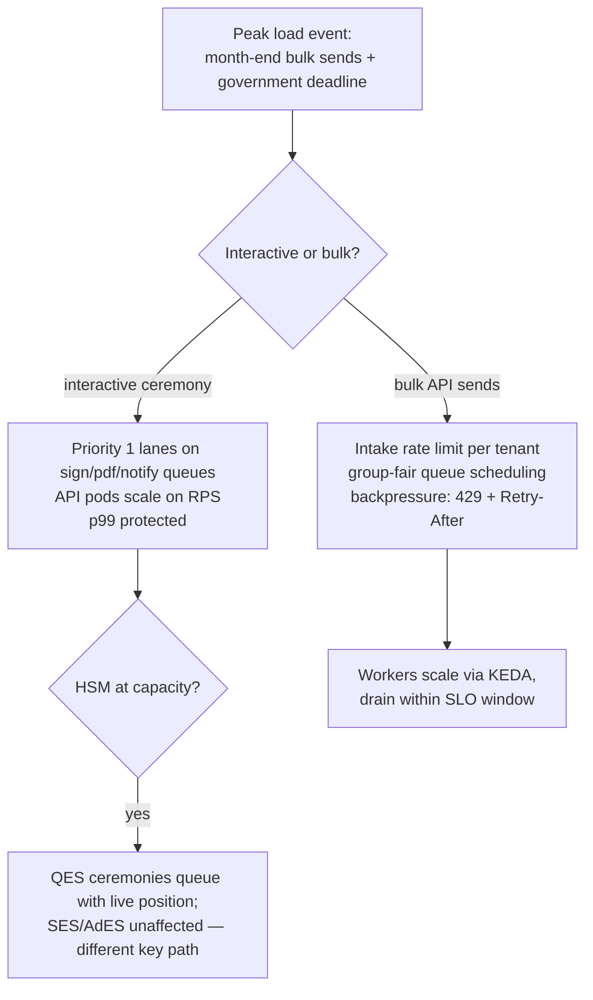

Degradation ladder (worst-first): Elasticsearch down → search/dashboards degrade,
signing unaffected. Redis cluster degraded → rate limits fail-open with WAF
backstop, queues are the incident. Postgres primary failover (Patroni, ~30 s) →
API returns 503 on writes, ceremonies auto-resume (client retry with idempotency
keys on all POSTs). AI provider outage → `ai` queue parks, envelopes proceed
without AI enrichment — P6: AI is never on the legal critical path.

---

## 10. Appendix — Decision Log Pointers

| ADR | Decision | Status |
|---|---|---|
| ADR-001 | Modular monolith over microservices at launch | Accepted |
| ADR-004 | Postgres RLS as mandatory tenant backstop | Accepted |
| ADR-007 | Outbox + BullMQ before a dedicated event bus | Accepted |
| ADR-009 | PAdES-B-LTA as default signed format; XAdES for XML e-invoicing flows | Accepted |
| ADR-012 | SoftHSM in dev/CI; PKCS#11 abstraction validated against two vendors | Accepted |
| ADR-015 | NATS JetStream selected over Kafka for phase-2 bus | Proposed |
| ADR-018 | Claude-primary model gateway with task-tiered routing | Accepted |
| ADR-021 | Dedicated-DB tier playbook for Law 15-04 government tenants | Accepted |

*Questions or proposed changes: open an RFC in `docs/architecture/rfc/` and tag the Architecture Guild.*
