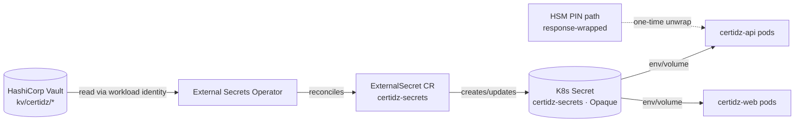
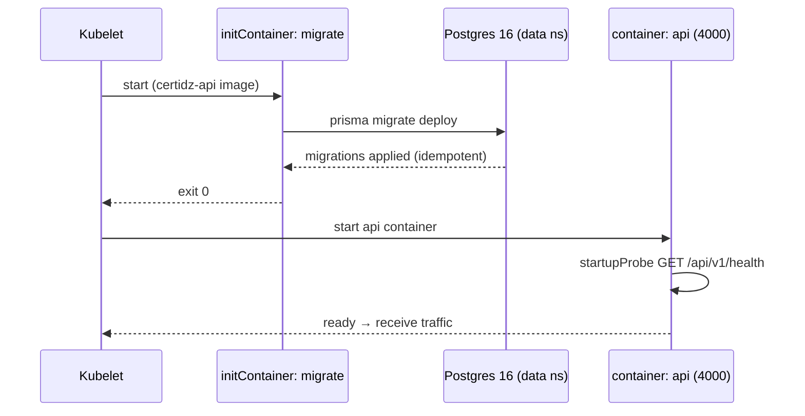

# CertiDZ by HISN — Deployment Guide

> **Document class:** Internal
> **Owner:** Platform / SRE Guild
> **Version:** 1.0 — 2026-07-02
> **Review cadence:** Quarterly, and after any material change to the CI/CD pipeline, cluster topology, or release process
> **Applies to:** All CertiDZ environments — dev (docker-compose), staging (`certidz-staging`), production (`certidz`), and sovereign air-gapped on-prem
> **Related docs:** [MONITORING.md](./MONITORING.md), [RUNBOOKS.md](./RUNBOOKS.md), [DISASTER-RECOVERY.md](./DISASTER-RECOVERY.md), [../architecture/SYSTEM-ARCHITECTURE.md](../architecture/SYSTEM-ARCHITECTURE.md), [../architecture/SECURITY-ARCHITECTURE.md](../architecture/SECURITY-ARCHITECTURE.md)

---

## Table of Contents

1. [Environments](#1-environments)
2. [CI Pipeline](#2-ci-pipeline)
3. [CD Flow](#3-cd-flow)
4. [Release Process](#4-release-process)
5. [Secrets Management](#5-secrets-management)
6. [Database Migration Strategy](#6-database-migration-strategy)
7. [Rollback Procedure](#7-rollback-procedure)
8. [Sovereign / On-Prem Deployment Specifics](#8-sovereign--on-prem-deployment-specifics)

---

## Preamble — Deployment principles

CertiDZ is a **digital-trust platform**: it issues certificates, seals evidence packages, and produces qualified electronic signatures under Algerian **Law 15-04** and eIDAS-aligned ETSI baselines. Deployments therefore carry a higher burden of proof than a typical SaaS. Every release must be **reproducible, attestable, and reversible**, and every change to PKI, HSM, or signing paths is subject to **four-eyes approval**.

Three rules govern everything in this document:

1. **Evidence over trust.** A release is not "done" because a pipeline turned green; it is done when the pinned digest is running, health is verified, and the smoke suite passes against the live environment.
2. **Immutable, digest-pinned artifacts.** The same image digest that passes staging is the one promoted to production. We never rebuild "the same commit" for prod.
3. **Least standing access.** No human holds long-lived production credentials. Deployment is performed by the CD system with workload identity; human production access is JIT, ticket-bound, and session-recorded (see [SECURITY-ARCHITECTURE §1](../architecture/SECURITY-ARCHITECTURE.md)).

---

## 1. Environments

CertiDZ runs across four environment classes. All non-dev environments share the **same Kustomize base** (`infra/k8s/base/`) so that staging is functionally identical to production and drift is structurally impossible.

### 1.1 Environment matrix

| Attribute | **dev** | **staging** | **production** | **sovereign on-prem** |
|-----------|---------|-------------|----------------|------------------------|
| Purpose | Local development, fast inner loop | Pre-production verification, promotion source | Live customer traffic | Government / regulated, in-country, air-gapped |
| Runtime | `docker-compose` (root `docker-compose.yml`) | Kubernetes | Kubernetes | Kubernetes (customer/government-operated) |
| Namespace | n/a (containers) | `certidz-staging` | `certidz` | `certidz` (per-deployment) |
| Public hostname | `localhost:3000` (web), `localhost:4000` (api) | `staging.certidz.dz` | `app.certidz.dz` (+ `tsa.`/`ocsp.`/`crl.certidz.dz`) | Internal only (e.g. `certidz.gov.local`) |
| Kustomize path | — | `infra/k8s/overlays/staging/` | `infra/k8s/overlays/production/` | dedicated overlay derived from `base` |
| Image tag policy | local build / `:dev` | `sha-<shortsha>` (mutable, set by CD) | `vX.Y.Z@sha256:<digest>` (immutable, promoted) | `vX.Y.Z@sha256:<digest>` from offline mirror |
| Data plane | Containers: Postgres, Redis, Elasticsearch, MinIO, SoftHSM2 | Shared cluster `data` namespace, staging DB | `data` namespace: Postgres 16 (Patroni HA + PgBouncer), Redis 7, Elasticsearch 8, MinIO/S3 | In-cluster data only, MinIO WORM, no cloud egress |
| HSM | SoftHSM2 (software) | SoftHSM2 or shared test HSM partition | Network HSM cluster (Luna/Utimaco), FIPS 140-2/3 L3 | Customer-owned HSM partition, in-country |
| Certificate issuance | Internal dev CA | Internal CA / staging ACME | ACME (Let's Encrypt / internal) + Corporate PKI | **Internal CA issuer only** (no external ACME/egress) |
| Replicas | 1 each | 1–2 each (smaller resource tier) | 3+ each, topology spread across nodes/zones | Sized per deployment, HA where hardware allows |
| Secrets source | `.env` / compose env | ESO + Vault | ESO + Vault | ESO + **in-country Vault**, response-wrapped HSM PIN |
| SLO enforcement | none | soft (canary of prod SLOs) | full (99.9%, see [MONITORING §5](./MONITORING.md#5-slos--error-budgets)) | per contract, in-country |
| Data residency | local | Algeria | Algeria (Algerian tenants' primary data) | **In-country only**, government-operated |

### 1.2 dev — docker-compose (local)

The developer inner loop runs entirely from the root `docker-compose.yml`. It stands up the full data plane so that behaviour matches production semantics (RLS, outbox relay, BullMQ queues, WORM object lock in MinIO, PKCS#11 against SoftHSM2).

- **Web** (`apps/web`, Next.js 15 App Router) on port **3000**.
- **API** (`apps/api`, NestJS 10 on Fastify) on port **4000**, REST base `/api/v1`.
- Postgres 16 (Prisma + RLS), Redis 7 (BullMQ + cache), Elasticsearch 8, MinIO (Object Lock), SoftHSM2.
- Prisma migrations applied via `pnpm db:migrate` / `prisma migrate dev`; seed data via `pnpm db:seed`.
- Health check: `GET http://localhost:4000/api/v1/health`. Metrics: `GET http://localhost:4000/api/v1/metrics`.

> **Tip:** dev uses `MASTER_ENCRYPTION_KEY` envelope wrapping and SoftHSM2 in place of a network HSM. Never point a dev workstation at a production HSM partition.

### 1.3 staging — `certidz-staging`

Staging is the **promotion source of truth**. It is the same Kustomize base with a smaller resource tier (`infra/k8s/overlays/staging/`), its own namespace, and its own hostname `staging.certidz.dz`. Kustomize's namespace transformer also renames the `Namespace` object itself. CD sets the image tag to the freshly built `sha-<shortsha>` via `kustomize edit set image`. Every change destined for production **must** run in staging first and pass the smoke suite.

### 1.4 production — `certidz`

Production serves live traffic on `app.certidz.dz` (web + API under `/api`), plus the trust-service hostnames `tsa.certidz.dz`, `ocsp.certidz.dz`, `crl.certidz.dz`. The overlay (`infra/k8s/overlays/production/`) runs 3+ replicas with hard topology spreading across nodes and zones and a wider HPA range. Images are pinned to an **exact `vX.Y.Z@sha256:<digest>`** promoted from staging — **never `:latest`**.

### 1.5 sovereign on-prem — air-gapped government K8s

For Government-tier and Law 15-04 data-residency customers, CertiDZ is deployed into an **air-gapped, in-country, government-operated Kubernetes cluster**. Key differences (detailed in [§8](#8-sovereign--on-prem-deployment-specifics)):

- **No external egress.** Images are served from an in-cluster/registry mirror; certificates are issued by an **internal CA issuer** (cert-manager `Issuer`/`ClusterIssuer` backed by the Corporate PKI), never ACME.
- **In-cluster data only** — Postgres, Redis, Elasticsearch, MinIO (WORM) all reside inside the sovereign boundary; no cloud object storage.
- **Customer-owned HSM partition**, in-country. Licensing and updates arrive through a controlled offline bundle.

---

## 2. CI Pipeline

Continuous integration is defined in **`.github/workflows/ci.yml`** and runs on every `push` to `main` and every `pull_request` targeting `main`. Concurrency is grouped by `github.ref` with `cancel-in-progress: true`, and the workflow requests only `contents: read`. The toolchain is **Node 22 + pnpm + turbo**.

### 2.1 Jobs

| Job (id) | Name | Needs | Trigger condition | What it does |
|----------|------|-------|-------------------|--------------|
| `lint-typecheck-test` | Lint, Typecheck & Test | — | all pushes/PRs | Quality gate |
| `build` | Build | `lint-typecheck-test` | all pushes/PRs | Compiles all packages |
| `security` | Security Scans | — (parallel) | all pushes/PRs | Supply-chain + SAST + secret scan |
| `docker` | Docker Build | `build` | **only `refs/heads/main`** | Builds container images (currently `push: false`) |

### 2.2 `lint-typecheck-test` — quality gate

```
actions/checkout@v4
pnpm/action-setup@v4
actions/setup-node@v4 (node-version: 22, cache: pnpm)
pnpm install --frozen-lockfile      # reproducible install, lockfile is law
pnpm db:generate                    # generate Prisma client (types needed for typecheck)
pnpm lint                           # ESLint across the monorepo
pnpm typecheck                      # tsc --noEmit across packages
pnpm test                           # unit tests
```

`--frozen-lockfile` guarantees the resolved dependency graph is exactly what the lockfile encodes; a drifted lockfile fails the job rather than silently resolving new versions.

### 2.3 `build`

Depends on `lint-typecheck-test`. Re-checks out, sets up Node 22 + pnpm, runs `pnpm install --frozen-lockfile`, `pnpm db:generate`, then `pnpm build` (turbo-orchestrated build of `apps/web`, `apps/api`, and shared packages). This job proves the release artifact compiles before we spend time building images.

### 2.4 `security` — supply-chain, SAST, secrets

Runs in parallel with the quality gate (no `needs`). Three independent controls:

| Step | Tool | Configuration | Notes |
|------|------|---------------|-------|
| Dependency audit | `pnpm audit` | `--audit-level high` (soft-fails via `\|\| true`) | `corepack enable`, `pnpm install --frozen-lockfile --ignore-scripts` first |
| Secret scan | **gitleaks** (`gitleaks/gitleaks-action@v2`) | uses `GITHUB_TOKEN` | catches committed credentials |
| SAST | **semgrep** (`returntocorp/semgrep-action@v1`) | `config: p/owasp-top-ten` | OWASP Top 10 static analysis |

> **⚠️ Warning:** `pnpm audit` is intentionally non-blocking today (`|| true`). The **gitleaks** and **semgrep** steps are hard gates — a leaked secret or an OWASP Top 10 finding fails the pipeline. Treat any audit finding as a tracked action item even though it does not fail the build.

### 2.5 `docker` — image build

Depends on `build` and is **guarded by `if: github.ref == 'refs/heads/main'`** — image builds only occur on the trunk, never on PRs. It uses `docker/setup-buildx-action@v3` and `docker/build-push-action@v6` to build:

- **API image** from `apps/api/Dockerfile`, context `.`
- **Web image** from `apps/web/Dockerfile`, context `.`

Both currently set **`push: false`** and use GitHub Actions cache (`cache-from: type=gha`, `cache-to: type=gha,mode=max`). CI proves the images build; **pushing and deploying is the job of the separate CD workflow described in [§3](#3-cd-flow)**.

---

## 3. CD Flow

Continuous delivery is a **separate deploy workflow** (e.g. `.github/workflows/deploy.yml`) distinct from `ci.yml`. CI proves correctness; CD produces and promotes immutable, digest-pinned artifacts. CD triggers on a merge to `main` (staging) and on a semver tag `vX.Y.Z` (production candidate).

### 3.1 Image build & push

CD builds the same two Dockerfiles CI validates (`apps/api/Dockerfile`, `apps/web/Dockerfile`) and **pushes** to GHCR:

- `ghcr.io/hisn/certidz-api`
- `ghcr.io/hisn/certidz-web`

Authentication uses a short-lived OIDC-federated token (`packages: write`), never a static PAT.

### 3.2 Image tagging & digest pinning

Every image is tagged with **both** a commit-derived tag and, on release, a semver tag — and is always referenced by **digest** downstream:

| Tag form | Example | Where used | Mutable? |
|----------|---------|------------|----------|
| Git SHA | `sha-4f2a91c` (`sha-<shortsha>`) | staging deploys | mutable label, but points at one build |
| Semver | `v1.4.2` | production releases | one-time, immutable by convention |
| Digest | `@sha256:9c1f…` | **all** promotions (pinned in overlays) | fully immutable |

The contract is: **the digest that passed staging is the digest promoted to prod.** We never rebuild the "same commit" for production — a rebuild produces a different digest and voids the staging evidence.

```
# staging  (mutable-tag deploy of the just-built commit)
kustomize edit set image \
  ghcr.io/hisn/certidz-api=ghcr.io/hisn/certidz-api:sha-4f2a91c \
  ghcr.io/hisn/certidz-web=ghcr.io/hisn/certidz-web:sha-4f2a91c

# production (exact release tag + immutable digest, promoted from staging)
kustomize edit set image \
  ghcr.io/hisn/certidz-api=ghcr.io/hisn/certidz-api:v1.4.2@sha256:<digest> \
  ghcr.io/hisn/certidz-web=ghcr.io/hisn/certidz-web:v1.4.2@sha256:<digest>
```

> **⚠️ Warning:** `:latest` is **forbidden** in production. The base `infra/k8s/base/kustomization.yaml` carries `newTag: latest` only as a placeholder that CD overwrites; the production overlay (`infra/k8s/overlays/production/kustomization.yaml`) pins an exact `vX.Y.Z` and CD appends the digest. A production apply that would resolve `:latest` must be rejected by policy (admission control / OPA Gatekeeper).

### 3.3 Kustomize overlays

CD manipulates the overlays, not the base:

- **Base** — `infra/k8s/base/kustomization.yaml`. Ships namespace, ConfigMap (`certidz-config`), API/web Deployments + Services, Ingress, HPAs, NetworkPolicy, PDB. `secrets.example.yaml` is **intentionally NOT a resource** (see [§5](#5-secrets-management)).
- **Staging** — `infra/k8s/overlays/staging/kustomization.yaml`. `namespace: certidz-staging`, environment label `staging`, resource/HPA/ingress/configmap patches, image tag `sha-<shortsha>`.
- **Production** — `infra/k8s/overlays/production/kustomization.yaml`. `namespace: certidz`, environment label `production`, production resource + HPA + PDB patches, pinned `vX.Y.Z@sha256:<digest>`.

CD runs `kustomize edit set image` inside the target overlay, commits the change to the GitOps repo (or renders and applies), and lets the reconciler roll it out.

### 3.4 Promotion: staging → production

Promotion is **GitOps-driven** (Argo CD / Flux) with a **manual approval gate**, or equivalently a `kustomize build | kubectl apply` guarded by a GitHub Environment protection rule:

1. Merge to `main` → CD builds `sha-<shortsha>`, pushes to GHCR, sets the staging overlay image, reconciler rolls staging.
2. Automated **smoke tests** run against `staging.certidz.dz` (see [§4.4](#44-release-checklist)).
3. On green, a release engineer cuts tag `vX.Y.Z`; CD re-tags the **same digest** as `v1.4.2`.
4. CD opens a promotion PR that pins `vX.Y.Z@sha256:<digest>` in the production overlay.
5. **Manual approval gate** (four-eyes; PKI/signing changes require a second, PKI-authorized approver — see [§4.5](#45-four-eyes-approval)).
6. On approval, Argo CD syncs `certidz` (or `kubectl apply -k infra/k8s/overlays/production`); rolling update proceeds.
7. **Verify** — health, readiness, smoke suite, and SLO dashboards.

### 3.5 Pipeline diagram

```mermaid
flowchart TD
    A[Commit / merge to main] --> B[CI: lint-typecheck-test]
    B --> C[CI: build]
    B --> S[CI: security<br/>gitleaks · semgrep · pnpm audit]
    C --> D[CI: docker build<br/>push:false]
    D --> E[CD: build & push images<br/>ghcr.io/hisn/certidz-api|web<br/>tag sha-shortsha + digest]
    E --> F[kustomize edit set image<br/>overlays/staging → sha-shortsha]
    F --> G[Deploy staging<br/>namespace certidz-staging]
    G --> H{Smoke tests<br/>staging.certidz.dz}
    H -- fail --> X[Halt · investigate · fix forward]
    H -- pass --> I[Tag vX.Y.Z<br/>re-tag same digest]
    I --> J[Promotion PR<br/>pin vX.Y.Z@sha256:digest in overlays/production]
    J --> K{{Manual approval gate<br/>four-eyes · PKI second approver}}
    K -- approved --> L[Promote to production<br/>Argo sync / kubectl apply -k<br/>namespace certidz]
    L --> M[Rolling update<br/>migrate initContainer → api/web]
    M --> N{Verify<br/>health · smoke · SLO dashboards}
    N -- healthy --> O[Release complete · changelog · audit event]
    N -- unhealthy --> R[Rollback: rollout undo / revert digest]
```

---

## 4. Release Process

### 4.1 Rolling update (default)

The default deployment strategy is a Kubernetes **RollingUpdate**. New pods are brought up and verified healthy before old pods are drained, so there is no downtime.

- Recommended `strategy.rollingUpdate`: **`maxSurge: 1`, `maxUnavailable: 0`** for the API (never lose capacity while adding one), and `maxSurge: 25%, maxUnavailable: 0` for web at higher replica counts.
- Rollout gating is enforced by the API's **startupProbe / livenessProbe / readinessProbe**, all `GET /api/v1/health` on port `http` (4000). Traffic is only sent once readiness passes.
- The `migrate` initContainer (`prisma migrate deploy`) runs **before** the `api` container starts on each new pod — so schema is in place before new code serves traffic (see [§6](#6-database-migration-strategy)).
- A **PodDisruptionBudget** protects minimum availability during node drains; HPAs handle load-driven scaling independently of the rollout.

### 4.2 Blue-green (optional, for risky releases)

For high-risk releases — HSM/PKCS#11 changes, signing-pipeline changes, PKI issuance changes, or major Prisma refactors — use **blue-green**:

1. Deploy the new version (`green`) as a parallel Deployment/Service with zero external traffic.
2. Run the full smoke + signing-verification suite against `green` internally.
3. Shift traffic at the Ingress (or via a weighted canary) from `blue` to `green`.
4. Hold `blue` warm for the observation window; cut over fully once SLOs hold.
5. Decommission `blue`.

> **Tip:** Blue-green is the preferred strategy whenever a bad release could produce **invalid signatures or mis-issued certificates**, because it lets you validate the trust path end-to-end before any customer traffic reaches the new version.

### 4.3 Changelog & semver

- Releases follow **semantic versioning** `vMAJOR.MINOR.PATCH`. Breaking API (`/api/v1`) or schema-contract changes bump MAJOR; backward-compatible features bump MINOR; fixes bump PATCH.
- Each release has a **CHANGELOG** entry: version, date, summary, migration notes, and an explicit "**PKI/signing impact: yes/no**" flag.
- The git tag `vX.Y.Z`, the GHCR image tag, and the changelog entry must all agree.

### 4.4 Release checklist

- [ ] CI green on the release commit (`lint-typecheck-test`, `build`, `security`, `docker`).
- [ ] Images pushed to GHCR; digest recorded.
- [ ] Staging deployed at `sha-<shortsha>`; smoke suite green against `staging.certidz.dz`.
- [ ] Smoke suite covers: `GET /api/v1/health` 200; auth login + refresh; document upload; **envelope send + signature completion (SES/AdES)**; certificate issue + **OCSP/CRL** freshness; verification portal read path.
- [ ] Prisma migration reviewed for **expand-contract safety** (see [§6.4](#64-migration-safety-checklist)).
- [ ] Changelog updated; PKI/signing impact flag set.
- [ ] Rollback plan identified (previous pinned digest recorded).
- [ ] Error budget checked — not in freeze (see [MONITORING §5](./MONITORING.md#5-slos--error-budgets)).
- [ ] Approvals obtained (four-eyes; PKI second approver if applicable).
- [ ] On-call notified; deploy window inside change policy.

### 4.5 Four-eyes approval

**Two categories require a second, independent approver before a production apply:**

1. **All production releases** — one release engineer proposes, a second approves (GitHub Environment protection rule on the `production` environment; the proposer cannot self-approve).
2. **PKI / signing / HSM changes** — additionally require a **PKI-authorized approver** (Trust Services). This covers changes to CA issuance, HSM partitions/PINs, TSA config, OCSP/CRL generation, signature formats (PAdES/XAdES/CAdES), and the CryptoProvider abstraction.

Approvals are recorded as immutable **audit events** (hash-chained `audit_events`), tying the release digest to the approving identities.

---

## 5. Secrets Management

### 5.1 Model — External Secrets Operator + HashiCorp Vault

**No secret value ever lives in git.** The workloads consume a single Opaque Secret named **`certidz-secrets`**, which is **materialized at runtime by External Secrets Operator (ESO)** from **HashiCorp Vault**. Non-secret configuration lives in the `certidz-config` ConfigMap (e.g. `OTEL_EXPORTER_OTLP_ENDPOINT`, `LOG_FORMAT=json`, `JWT_ACCESS_TTL=900`, `AI_DEFAULT_MODEL=anthropic/claude-sonnet-4-6`, `AI_OCR_MODEL=anthropic/claude-haiku-4-5-20251001`).



### 5.2 The `certidz-secrets` shape (documentation only)

`infra/k8s/base/secrets.example.yaml` documents the **shape only** — the exact keys the workloads expect. It is **deliberately NOT listed** in `infra/k8s/base/kustomization.yaml`, so `kustomize build` never ships placeholder credentials. All its values are `CHANGE_ME` / Vault-ref placeholders.

Keys (all sourced from Vault in real environments):

| Group | Keys |
|-------|------|
| Database / cache | `DATABASE_URL`, `REDIS_URL` |
| Object storage | `S3_ACCESS_KEY`, `S3_SECRET_KEY` |
| Auth / JWT | `JWT_ACCESS_SECRET`, `JWT_REFRESH_SECRET` |
| OAuth | `GOOGLE_CLIENT_ID/SECRET`, `MICROSOFT_CLIENT_ID/SECRET` |
| Crypto / PKI | `MASTER_ENCRYPTION_KEY`, `HSM_PKCS11_LIBRARY`, `HSM_SLOT`, `HSM_PIN` |
| Notifications / billing | `SMTP_USER/PASS`, `SMS_PROVIDER_API_KEY`, `STRIPE_SECRET_KEY`, `STRIPE_WEBHOOK_SECRET` |
| Observability / AI | `SENTRY_DSN`, `AI_GATEWAY_API_KEY` |

### 5.3 ExternalSecret CR → Vault paths

Each environment defines an `ExternalSecret` that points at Vault KV paths and renders `certidz-secrets`:

```yaml
apiVersion: external-secrets.io/v1beta1
kind: ExternalSecret
metadata:
  name: certidz-secrets
  namespace: certidz          # certidz-staging in staging
spec:
  refreshInterval: 1h
  secretStoreRef:
    name: vault-backend
    kind: ClusterSecretStore
  target:
    name: certidz-secrets      # exactly the Secret the Deployments mount
    creationPolicy: Owner
  dataFrom:
    - extract:
        key: kv/certidz/production/app     # DATABASE_URL, REDIS_URL, JWT_*, OAuth, S3_*, SMTP_*, Stripe, Sentry, AI
    - extract:
        key: kv/certidz/production/pki      # HSM_PKCS11_LIBRARY, HSM_SLOT (NOT the raw PIN — see below)
```

ESO reconciles the CR against Vault using the operator's own **workload identity** (Kubernetes auth backend), not a static token. If Vault is unreachable, ESO keeps the last-known Secret; it never falls back to committed values.

### 5.4 HSM PIN via Vault response-wrapping

The **`HSM_PIN` never appears in CI logs, `kubectl` history, or this repository**. It is delivered using **Vault response-wrapping**: Vault returns a single-use, short-TTL wrapping token; the workload (or a controlled bootstrap step) unwraps it exactly once to obtain the PIN, which is then held only in memory for PKCS#11 login. A wrapping token that has already been unwrapped is detectably burned — providing tamper evidence. This aligns with the note in `secrets.example.yaml`: *"Real HSM PINs must ONLY ever transit Vault with response-wrapping."*

### 5.5 Rotation

| Secret | Rotation | Mechanism |
|--------|----------|-----------|
| `DATABASE_URL` creds | dynamic, short-lease | Vault database secrets engine; ESO refresh |
| `JWT_ACCESS_SECRET` / `JWT_REFRESH_SECRET` | scheduled + on compromise | dual-key overlap window, then retire old |
| `S3_*` | scheduled | STS-style scoped tokens preferred |
| OAuth / SMTP / SMS / Stripe | per-provider policy or on compromise | Vault KV update → ESO reconcile → rolling restart |
| `HSM_PIN` | on compromise / partition rekey | response-wrapped re-delivery; HSM partition procedure |
| `MASTER_ENCRYPTION_KEY` | key rotation via envelope re-wrap | never destructive; new KEK, re-wrap DEKs |

> **⚠️ Warning:** Rotating a signing/HSM credential is a **PKI change** and requires the four-eyes PKI approver ([§4.5](#45-four-eyes-approval)). Never rotate an HSM PIN outside a change window with Trust Services present.

---

## 6. Database Migration Strategy

### 6.1 Mechanism — `prisma migrate deploy` in the `migrate` initContainer

Schema changes are Prisma migrations applied by the **`migrate` initContainer** in the API Deployment. The initContainer uses the `certidz-api` image and runs **`prisma migrate deploy`** (apply-only, no drift/dev prompts) **before** the `api` container starts. Because the initContainer must succeed for the pod to become ready, a failed migration halts the rollout rather than serving code against an unmigrated schema.



### 6.2 Expand-contract (backward-compatible) rule

Migrations MUST be **backward-compatible with the currently running code**, because during a rolling update old and new pods run simultaneously and the migration runs before the new code is fully rolled out. We use **expand-contract** (a.k.a. parallel change):

1. **Expand** — add the new structure in a non-breaking way: add **nullable** columns / new tables / new indexes `CONCURRENTLY`. Old code ignores them; new code can use them.
2. **Backfill** — populate new columns in batches (idempotent, resumable), out of band from the request path.
3. **Dual-write** — new code writes both old and new shapes during the transition.
4. **Switch** — once backfill is complete and verified, reads move to the new shape.
5. **Contract** — in a **later** release, drop the old column/table and stop dual-writing.

### 6.3 Never destructive in the same release

> **⚠️ Warning:** **Never** ship a destructive change (drop column, rename, tighten a constraint, `NOT NULL` on an existing column) **in the same release** as code that still needs the old schema. Drops happen at least **one release after** the last code that referenced them is gone. A rename is modeled as add-new → backfill → switch → drop-old across releases, never as an in-place `RENAME`.

This is also what makes rollback safe ([§7](#7-rollback-procedure)): if the new code is reverted, the old code still works because the old schema still exists.

### 6.4 Migration safety checklist

- [ ] Additive only in this release (new nullable columns / tables / indexes); no drops of anything current code uses.
- [ ] New columns are **nullable** or have a safe default that does not rewrite the table.
- [ ] Indexes created **`CONCURRENTLY`**; no `ACCESS EXCLUSIVE` locks on hot tables during business hours.
- [ ] No implicit full-table rewrite (watch `ALTER TYPE`, `SET NOT NULL`, default backfills on large tables).
- [ ] Backfill is batched, idempotent, resumable, and rate-limited; runs outside the migrate initContainer if long.
- [ ] Compatible with **RLS** (`app.tenant_id`, `FORCE ROW LEVEL SECURITY`) — new tables get tenant policies; app roles are not `BYPASSRLS`.
- [ ] Reviewed against the running release for expand-contract compatibility.
- [ ] Rollback stance documented (forward-fix vs revert; see [§7](#7-rollback-procedure)).
- [ ] For partitioned tables (e.g. `audit_events` monthly) the change is partition-aware.

### 6.5 Long-running / locking migrations

- The `migrate` initContainer must stay **fast and lock-light** — it blocks pod startup. Anything that takes locks on hot tables or runs for minutes must **not** live in the initContainer.
- Long backfills and index builds run as a **separate Kubernetes Job** (or maintenance task), decoupled from the rollout, using `CREATE INDEX CONCURRENTLY` and batched updates.
- Set a conservative `lock_timeout` and `statement_timeout` for DDL so a migration fails fast rather than queuing behind (and blocking) live traffic.
- Prefer PgBouncer session pinning awareness: DDL that needs session-level state must target Postgres directly, not through a transaction-pooled path that could break.

---

## 7. Rollback Procedure

### 7.1 Application rollback (fast path)

Because artifacts are immutable and digest-pinned, rollback is **redeploying a previous known-good digest**. Two equivalent mechanisms:

```bash
# Option A — Kustomize/GitOps revert (preferred, keeps git as source of truth)
#   revert the production overlay to the previously pinned image, e.g.:
kustomize edit set image \
  ghcr.io/hisn/certidz-api=ghcr.io/hisn/certidz-api:v1.4.1@sha256:<prev-digest> \
  ghcr.io/hisn/certidz-web=ghcr.io/hisn/certidz-web:v1.4.1@sha256:<prev-digest>
#   commit → Argo CD syncs (or) kubectl apply -k infra/k8s/overlays/production

# Option B — imperative rollout undo (incident speed, reconcile git after)
kubectl -n certidz rollout undo deployment/certidz-api
kubectl -n certidz rollout undo deployment/certidz-web
kubectl -n certidz rollout status deployment/certidz-api
```

> **Tip:** Option B is faster during an active incident, but it puts the cluster **ahead of git**. Immediately follow up by reverting the overlay so GitOps does not re-sync the bad digest.

### 7.2 Database rollback stance — forward-fix preferred

**Forward-fix is the default.** Because migrations are expand-contract and backward-compatible ([§6](#6-database-migration-strategy)), **rolling back the application is safe without rolling back the schema** — the previous code still runs against the expanded schema.

- **Do not** run `prisma migrate resolve --rolled-back` / down-migrations against production as a reflex; destructive down-migrations risk data loss.
- If a migration itself is faulty, prefer a **forward migration** that corrects it.
- Restore-from-backup (point-in-time recovery via WAL / `wal-g`) is a **last resort** governed by [DISASTER-RECOVERY](./DISASTER-RECOVERY.md) — **RPO 15 min / RTO 4 h** standard, **RPO ≤ 5 min / RTO ≤ 1 h** Enterprise/Government.

### 7.3 Evidence & audit of rollback

Every rollback is a change and must be **attestable**:

- Record the from-digest, to-digest, initiating identity, reason, and incident ID.
- Emit an immutable **`audit_events`** entry (hash-chained) for the rollback.
- Rollbacks touching PKI/signing require the **PKI four-eyes approver** even under incident pressure (a second responder acknowledges).
- File/annotate the incident per [RUNBOOKS](./RUNBOOKS.md) and update the changelog.

### 7.4 When to invoke rollback

| Signal | Action |
|--------|--------|
| Smoke suite fails post-deploy | Roll back immediately (or halt promotion before prod). |
| SLO **burn-rate** alert fires (error budget bleeding fast) | Roll back; see [MONITORING §5–6](./MONITORING.md#5-slos--error-budgets). |
| Signature/certificate correctness regression | **Immediate** rollback (blue-green cut-back if used); PKI on-call paged. |
| Elevated 5xx / p95 latency breach not resolved by scaling | Roll back application. |
| Migration failed in `migrate` initContainer | Rollout is already halted; fix forward or revert the release commit. |
| Data corruption suspected | Do **not** just redeploy — invoke DR / PITR per [DISASTER-RECOVERY](./DISASTER-RECOVERY.md). |

---

## 8. Sovereign / On-Prem Deployment Specifics

The sovereign profile targets **Government-tier and Law 15-04 data-residency** customers on an **air-gapped, in-country, government-operated Kubernetes cluster**. It reuses the same `infra/k8s/base/` but changes four things: image source, certificate issuance, secrets locality, and egress.

### 8.1 Offline images — registry mirror

- There is **no path to GHCR** from the sovereign cluster. Release images are exported from `ghcr.io/hisn/certidz-{api,web}` at a specific **`vX.Y.Z@sha256:<digest>`**, transferred through the customer's controlled offline-bundle process, and loaded into an **in-country registry mirror** (e.g. Harbor).
- The sovereign overlay pins the mirror reference by the **same digest** verified upstream, preserving the "digest that passed staging" contract across the air gap.
- Image signatures/attestations (cosign) are verified against the digest before load; admission control rejects unpinned or unsigned images.

### 8.2 Internal CA issuer (no ACME)

- Ingress and workload TLS are issued by an **internal CA issuer** — a cert-manager `Issuer`/`ClusterIssuer` backed by the **CertiDZ Corporate PKI** (or the customer's own in-country CA) — **instead of ACME**. There is no Let's Encrypt reachability and none is required.
- Trust-service endpoints (TSA/OCSP/CRL) are served internally; CRLs and OCSP responses are generated in-cluster on the standard cadence.

### 8.3 In-cluster data & no external egress

- **All data stays in-cluster and in-country**: Postgres 16, Redis 7, Elasticsearch 8, and **MinIO** with **Object Lock (WORM)** for evidence packages. No cloud object storage, no cross-border replication outside the sovereign boundary.
- **NetworkPolicies default-deny egress.** No external analytics, no external AI egress (the Model Gateway runs against an in-country/offline model endpoint or is disabled per contract), no external Sentry — telemetry stays inside the boundary.
- Backups are written to in-country WORM storage; DR is arranged in-country per the customer's residency obligations.

### 8.4 HSM & signing

- Uses the **customer-owned HSM partition**, in-country, via the same PKCS#11 CryptoProvider abstraction. `HSM_PIN` is delivered through the **in-country Vault with response-wrapping** ([§5.4](#54-hsm-pin-via-vault-response-wrapping)).
- Qualified signatures still follow the national chain model (CertiDZ acts as RA; QES is never self-issued) — see [SECURITY-ARCHITECTURE §4](../architecture/SECURITY-ARCHITECTURE.md).

### 8.5 Licensing & air-gap operations

- Deployments are **license-gated**; the license and its updates arrive via the offline bundle, not a phone-home check.
- Upgrades follow the same expand-contract migration discipline ([§6](#6-database-migration-strategy)); the entire release (images + manifests + migration set) is delivered as one signed bundle.
- Because there is no live CD reach-through, promotion in sovereign environments is **operator-driven** (`kubectl apply -k` of the sovereign overlay) with the same four-eyes approval, executed by cleared in-country staff.

> **⚠️ Warning:** In sovereign deployments, **nothing** leaves the boundary — not images, not logs, not telemetry, not AI prompts, not backups. Any tooling that assumes outbound internet (ACME, GHCR pulls, SaaS Sentry, cloud KMS) must be replaced by its in-country equivalent before go-live.

---

*End of DEPLOYMENT.md — CertiDZ by HISN, Platform / SRE Guild, v1.0 (2026-07-02), Classification: Internal.*
