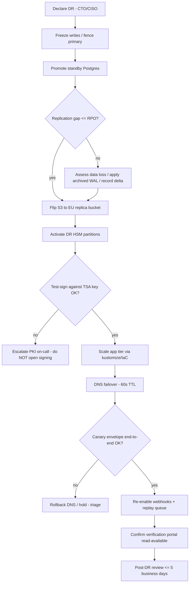
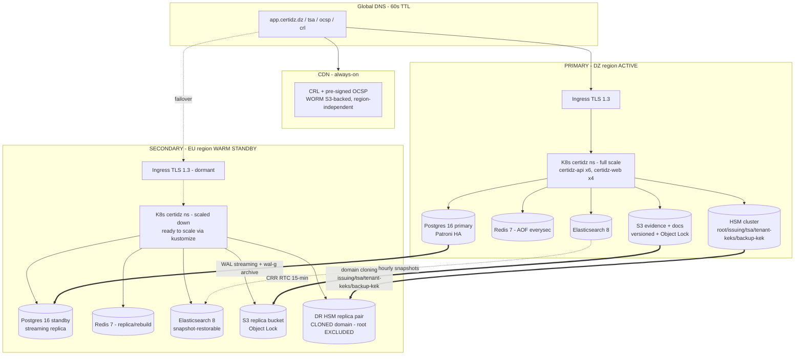

# CertiDZ by HISN — Disaster Recovery Plan

> **Document class:** Internal — Restricted (Operational Continuity Baseline)
> **Owners:** SRE / Platform Reliability (primary) · CISO / Security Architecture Office (co-owner)
> **Version:** 1.0 — 2026-07-02
> **Review cadence:** Quarterly, after every DR game day, and after any material change to data-store topology, HSM configuration, or regional footprint
> **Applies to:** All CertiDZ production and DR environments (namespaces `certidz`, `data`, `observability`), primary DZ region + secondary (EU) region, all bounded contexts
> **Aligns with:** [`SECURITY-ARCHITECTURE.md` §12 (Backup, DR & IR)](../architecture/SECURITY-ARCHITECTURE.md) — RPO/RTO, backup encryption, HSM domain-cloning, and notification obligations are inherited from and MUST NOT contradict that document.
> **Companion:** [`RUNBOOKS.md`](./RUNBOOKS.md) — single-incident operational runbooks; this document covers regional/data-loss disaster recovery.
> **Compliance anchors:** Algerian Law 15-04 (e-signature / e-certification), Law 18-07 (data protection, ANPDP), eIDAS-alignment (SES/AdES/QES), GDPR, ISO/IEC 27001:2022, SOC 2 Type II, ETSI EN 319 401/411/421, RFC 3161/5280/6960

---

## Table of Contents

1. [Objectives — RPO / RTO](#1-objectives--rpo--rto)
2. [Backup Matrix](#2-backup-matrix)
3. [Restore Runbooks](#3-restore-runbooks)
   - [3.1 Postgres PITR restore (wal-g)](#31-postgres-pitr-restore-wal-g)
   - [3.2 Full regional failover](#32-full-regional-failover)
   - [3.3 S3 object restore from version](#33-s3-object-restore-from-version)
   - [3.4 Elasticsearch snapshot restore + reindex](#34-elasticsearch-snapshot-restore--reindex-from-postgres)
4. [DR Drill Schedule](#4-dr-drill-schedule)
5. [Failover Architecture](#5-failover-architecture)
6. [Evidence-Vault Immutability & PKI Key Considerations](#6-evidence-vault-immutability--pki-key-considerations)
7. [Incident Severity Matrix](#7-incident-severity-matrix)
8. [Communications Plan](#8-communications-plan)

---

## 1. Objectives — RPO / RTO

Disaster Recovery at CertiDZ is built on the principle of **evidence-over-trust**: the platform must be able to prove — not merely assert — that after any regional loss, no sealed evidence, no issued certificate, and no audit-chain event has been lost or altered. Recovery targets are therefore tiered by plan, and every target is measurable against telemetry captured during game days.

### 1.1 Recovery targets

| Tier | Applies to | RPO (max data loss) | RTO (max downtime) | Recovery mechanism |
|---|---|:--:|:--:|---|
| **Standard** | Free / Pro / Business tenants | **15 min** | **4 h** | Warm standby in secondary region; IaC-driven scale-up; DNS failover (60 s TTL); rehearsed runbook |
| **Enterprise / Government** | Enterprise + Government (Law 15-04 in-country) tenants | **≤ 5 min** | **≤ 1 h** | Continuous synchronous-leaning replicas, pre-scaled warm capacity, dedicated HSM partition replica, priority failover ordering |

> **Alignment note:** These targets are inherited verbatim from [`SECURITY-ARCHITECTURE.md` §12.1](../architecture/SECURITY-ARCHITECTURE.md). The Standard RPO 15 min / RTO 4 h is the platform SLA baseline (paid plans 99.9% monthly on signing/verification/API). The Enterprise/Government tier tightens RPO to ≤ 5 min and RTO to ≤ 1 h by maintaining warm, pre-scaled capacity and by prioritizing those tenants' data stores first in the failover sequence.

### 1.2 How the targets are met

- **RPO 15 min (Standard).** PostgreSQL streams WAL to a hot standby *and* archives WAL to S3 via `wal-g` with 5-minute forced segment switches, so the worst-case unreplicated window is one segment (< 5 min) plus replication lag. S3 documents/evidence use cross-region replication (DZ → EU) under a **15-minute Replication Time Control (RTC)** SLA. Elasticsearch is fully rebuildable from Postgres + S3 and additionally snapshotted hourly. Redis is treated as acceptable-loss cache (sessions are re-authable) with AOF `everysec` for the durable subset.
- **RPO ≤ 5 min (Enterprise/Gov).** The same WAL pipeline runs with the standby confirmed current before promotion, and the 5-min `wal-g` segment cadence bounds archive loss; RTC still governs S3. Government tenants on a dedicated database + in-country region additionally keep a same-region standby so failover never crosses a border in violation of residency.
- **RTO 4 h / ≤ 1 h.** A warm standby stack (scaled-down Kubernetes, continuous data replicas) runs permanently in the secondary region. Recovery is IaC-driven (kustomize overlays + Terraform), promotion is scripted, and DNS uses a 60-second TTL. Enterprise/Gov capacity is pre-scaled (no cold-start scale-up on the critical path), which is what brings RTO under one hour.

### 1.3 What "recovered" means (exit criteria)

Recovery is declared complete only when ALL of the following are true and captured in the incident record:

1. Postgres standby promoted; measured replication gap at fence time **≤ RPO** for the tenant tier.
2. HSM signing available in the DR region; a **test-sign against the TSA key** succeeds (proves key material cloned + partitions active).
3. A **canary envelope** completes the full sign → timestamp → seal → verify pipeline end-to-end.
4. CRL/OCSP endpoints answer (they never went down — see §6), and the OCSP batch signer has resumed within its 8-hour `nextUpdate` horizon.
5. Webhook delivery re-enabled with queued-event replay drained.
6. Verification portal read-availability confirmed (it must never be unavailable — see §6.5).

---

## 2. Backup Matrix

Every stateful store has an explicit backup method, cadence, retention, encryption, and destination. The matrix below is the authoritative reference; the [restore runbooks](#3-restore-runbooks) operate against exactly these artifacts.

| Store | What is protected | Method | Frequency | Retention | Encryption | Where |
|---|---|---|---|---|---|---|
| **PostgreSQL 16** (`postgres.data.svc.cluster.local:5432`) | All relational state: tenants, users, envelopes, signatures, certificates metadata, `audit_events` hash-chain, outbox | (1) **Streaming replication** to hot standby (primary DZ → standby); (2) **`wal-g` WAL archiving** to S3, **5-min forced segment switch** (`archive_timeout`); (3) **daily full base backup** (`wal-g backup-push`) | Continuous (WAL stream); WAL segment ≤ 5 min; base backup daily 01:00 UTC | **PITR window 35 days**; daily bases 35 d; weekly fulls 12 months | Client-side: backup DEK per set, AES-256 (`WALG_LIBSODIUM_KEY` / KMS-wrapped); DEK wrapped by **backup KEK** in HSM backup partition; TLS in transit | S3 backup bucket (Object Lock compliance ≥ 35 d), CRR DZ → EU |
| **S3 documents & evidence** (`minio.data.svc.cluster.local:9000` / S3) | Uploaded documents, sealed evidence packages (PAdES-B-LTA, WORM), invoices, CRLs published | **Versioning** + **cross-region replication (CRR)** DZ → EU with **RTC 15-min**; **Object Lock compliance mode** | Real-time (versioned on write; CRR continuous, RTC ≤ 15 min) | Evidentiary/audit archives **7 years** WORM; document versions per tenant retention policy; **Object Lock ≥ 35 d** minimum on all objects | Server-side SSE-KMS (per-tenant DEK envelope, Section 6 of security doc) + client-side seal integrity; evidence packages cryptographically sealed | Primary DZ bucket + EU replica bucket, both Object-Lock enabled |
| **Elasticsearch 8** (`elasticsearch.data.svc.cluster.local:9200`) | Search/index projections of documents, envelopes, audit search | **Hourly snapshots** to S3 snapshot repository; **fully rebuildable** by reindex from Postgres + S3 (source of truth) | Hourly snapshot; reindex on demand | Snapshots 7 days (index is derived data, not system-of-record) | Snapshot repo SSE-KMS; no primary secrets in ES | S3 snapshot repo, CRR to EU |
| **Redis 7** (`redis.data.svc.cluster.local:6379`) | BullMQ queue state, session registry, rate-limit counters, OCSP pre-signed cache | **AOF `appendfsync everysec`** (durable subset); RDB hourly snapshot | AOF everysec; RDB hourly | AOF/RDB 24 h | At-rest volume encryption; no long-lived secrets persisted | Same-region PVC + hourly RDB to S3; **cache is acceptable-loss / re-authable** |
| **HSM key material** | Issuing-CA, TSA, tenant-KEK, platform-seal keys | **HSM domain cloning** to DR HSM replica pair; **root CA keys EXCLUDED** from cloning (offline only) | Continuous domain sync; verified quarterly | Per HSM lifecycle; backup KEK versioned | Keys never leave HSM; `CKA_EXTRACTABLE=false` | Primary DZ HSM cluster + DR EU HSM replica pair (cloned domain) |

### 2.1 Backup encryption & integrity (aligned with security doc §12.2)

- **Backup DEK / KEK separation.** Each backup set has its own backup DEK. That DEK is wrapped by a **dedicated backup KEK** that lives in a **separate HSM partition** from issuing/TSA/tenant keys. The DR region runs an **HSM replica pair with a securely cloned domain** so the DR site can unwrap backup DEKs; **root CA keys are explicitly excluded from cloning** and remain offline (§6.3).
- **Integrity manifest.** Every backup set produces a **SHA-256 manifest** recorded on the immutable `audit_events` hash-chain. Restore verifies the manifest before trusting a set; a mismatch aborts the restore and pages the DBA on-call.
- **Ransomware resilience.** Backup buckets use **S3 Object Lock in compliance mode (WORM), ≥ 35 days**. The **backup-writer credentials can create/read but CANNOT delete or shorten retention** — a compromised writer cannot destroy or encrypt-over history. Deletion requires a separate break-glass lifecycle role under dual control.
- **Crypto-shredding compatibility.** Tenant erasure destroys the tenant/document DEK, which renders every backup generation of that tenant's data unrecoverable without rewriting backups (Section 6.6 of the security doc). This is how right-to-erasure (Law 18-07 / GDPR) coexists with WORM immutability.

> **⚠️ Warning:** Never disable Object Lock, shorten a retention period, or grant `s3:BypassGovernanceRetention` to an automation identity. These controls are the platform's primary ransomware and insider-tamper defense. Changes require CISO approval and an ADR entry.

---

## 3. Restore Runbooks

All commands assume `kubectl` context is set to the target cluster and that the operator has completed JIT production access (ticket-bound, session-recorded). Substitute bracketed values. Bucket, region, and label names follow the platform conventions in the [BRIEF](../../) and security architecture.

Common environment:

```bash
# S3 / wal-g environment (sourced from Vault via ESO in-cluster; shown for out-of-band ops box)
export AWS_REGION=eu-west-1                     # secondary region example
export WALG_S3_PREFIX=s3://certidz-pg-backups/prod
export WALG_LIBSODIUM_KEY_TRANSIT=vault:transit/decrypt/backup-dek   # DEK unwrap via HSM-backed transit
export PGHOST=postgres.data.svc.cluster.local
export PGUSER=postgres
export PGDATABASE=certidz
```

### 3.1 Postgres PITR restore (wal-g)

**Use when:** logical corruption, bad migration, accidental bulk delete, or restoring into an isolated cluster for the nightly verification job. For a full primary-down failover, use §3.2.

**Objective:** restore to a specific point in time within the 35-day PITR window with zero uncommitted-transaction loss beyond RPO.

```bash
# 0. Provision a fresh, EMPTY PGDATA target (isolated cluster / standby node).
#    Never restore over a live primary. Stop Postgres on the target first.
kubectl -n data scale statefulset/postgres-restore --replicas=0
rm -rf /var/lib/postgresql/16/main/*        # target PGDATA only

# 1. List available base backups and pick the one at/just-before the target time.
wal-g backup-list --detail --pretty
#   name                 modified              wal_segment_backup_start
#   base_00000...A0      2026-07-01T01:00Z     00000001000000A0...

# 2. Fetch the chosen base backup into the empty PGDATA.
wal-g backup-fetch /var/lib/postgresql/16/main LATEST
#   or a specific base:
#   wal-g backup-fetch /var/lib/postgresql/16/main base_00000001000000A0000000...

# 3. Configure recovery. Postgres 16 uses standby.signal + recovery settings in postgresql.auto.conf.
cat >> /var/lib/postgresql/16/main/postgresql.auto.conf <<'EOF'
restore_command = 'wal-g wal-fetch "%f" "%p"'
recovery_target_time = '2026-07-02 09:12:00+00'
recovery_target_action = 'promote'
recovery_target_inclusive = false
EOF
touch /var/lib/postgresql/16/main/recovery.signal

# 4. Start Postgres; it replays archived WAL up to recovery_target_time, then promotes.
kubectl -n data scale statefulset/postgres-restore --replicas=1
kubectl -n data logs -f sts/postgres-restore | grep -E 'recovery|consistent|promoted'
#   LOG:  recovery stopping before commit of transaction ... 
#   LOG:  redo done at ...
#   LOG:  database system is ready to accept connections

# 5. Verify integrity BEFORE routing traffic.
psql -h localhost -U postgres -d certidz -c "SELECT max(created_at), count(*) FROM audit_events;"
psql -h localhost -U postgres -d certidz -c "SELECT verify_chain();"   # audit hash-chain check
#   Compare SHA-256 backup manifest recorded on audit chain against the fetched set.

# 6. Only after verification, re-point PgBouncer / promote to primary role.
```

> **Tip:** For the **automated nightly restore verification** (security doc §12.3), steps 1–5 run headless into a throwaway cluster with `recovery_target = 'latest'`; row-count/checksum sampling + `/api/v1/health` smoke test gate success; failure pages DBA on-call.

### 3.2 Full regional failover

**Use when:** primary DZ region is lost or degraded beyond in-region recovery (control-plane outage, storage-plane failure, network partition, datacenter event). **Declaration authority: CTO or CISO** (per security doc §12.3).

This is the rehearsed quarterly game-day procedure. Execute in order; do not skip verification gates.



```bash
# ---- STEP 1: Declare + fence primary (prevent split-brain) ----
# Fence the (possibly reachable) primary so it cannot accept writes after promotion.
kubectl --context dz-primary -n data annotate postgres/certidz-ha \
  patroni.dynamic.pause="true" --overwrite 2>/dev/null || true
# If DZ control plane is reachable, scale writers to zero; else rely on DNS + fencing token.
kubectl --context dz-primary -n certidz scale deploy/certidz-api --replicas=0 2>/dev/null || true

# ---- STEP 2: Promote standby Postgres in secondary region ----
kubectl --context eu-dr -n data exec sts/postgres-ha-0 -- patronictl -c /etc/patroni/patroni.yml failover \
  --candidate postgres-ha-0 --force
# Verify it is now leader and read-write:
kubectl --context eu-dr -n data exec sts/postgres-ha-0 -- patronictl -c /etc/patroni/patroni.yml list
psql -h <eu-standby> -U postgres -d certidz -c "SELECT pg_is_in_recovery();"   # expect: f

# ---- STEP 3: Verify replication gap <= RPO ----
# Compare last replayed LSN vs last archived WAL time. Gap must be <= tenant-tier RPO.
psql -h <eu-standby> -U postgres -c \
  "SELECT now() - pg_last_xact_replay_timestamp() AS replica_lag;"
# For Enterprise/Gov tenants confirm lag <= 5 min; Standard <= 15 min. Record the measured value.

# ---- STEP 4: Flip S3 to EU replica bucket ----
# Documents/evidence already replicated via CRR (RTC 15-min). Point the app at the EU endpoint.
kubectl --context eu-dr -n certidz set env deploy/certidz-api \
  S3_ENDPOINT=https://s3.eu-west-1.certidz.dz S3_REGION=eu-west-1
# Confirm the latest evidence object versions are present in the replica:
aws s3api list-object-versions --bucket certidz-evidence-eu --max-items 5 --region eu-west-1

# ---- STEP 5: Activate DR HSM partitions + TEST-SIGN against TSA key ----
# The DR HSM replica pair has the cloned domain (issuing/TSA/tenant-KEK/backup-KEK). Root is EXCLUDED.
kubectl --context eu-dr -n certidz exec deploy/hsm-signing-svc -- \
  hsm-admin partition activate --partitions issuing-ca,tsa,tenant-keks,platform-seal,backup-kek
# Prove key availability with a NON-PRODUCTION test digest signed by the TSA key:
kubectl --context eu-dr -n certidz exec deploy/hsm-signing-svc -- \
  hsm-cli test-sign --key-label 'certidz/tsa/tsa-signing/v3' --digest-sha256 <known-test-digest>
#   -> expect valid signature; verify against TSA cert. If this fails, DO NOT open signing (STEP 6 gate).

# ---- STEP 6: Scale app tier via kustomize / IaC ----
kubectl --context eu-dr apply -k infra/k8s/overlays/production      # DR overlay pins same vX.Y.Z@sha256 digest
kubectl --context eu-dr -n certidz scale deploy/certidz-api --replicas=6
kubectl --context eu-dr -n certidz scale deploy/certidz-web --replicas=4
kubectl --context eu-dr -n certidz rollout status deploy/certidz-api --timeout=300s
# initContainer 'migrate' runs prisma migrate deploy; probes gate on GET /api/v1/health.

# ---- STEP 7: DNS failover (60s TTL) ----
# Flip app.certidz.dz (and tsa/ocsp/crl if regionally homed) to EU ingress.
dig +short app.certidz.dz            # observe current value
# Update the record set (provider CLI or Terraform), TTL already 60s:
#   e.g. route53/clouddns change-record app.certidz.dz A|CNAME -> <eu-ingress>
dig +short @1.1.1.1 app.certidz.dz   # confirm propagation from a public resolver

# ---- STEP 8: Canary envelope end-to-end ----
# Drive a synthetic tenant through create -> send -> sign -> timestamp -> seal -> verify.
curl -sf https://app.certidz.dz/api/v1/health | jq .
scripts/dr/canary-envelope.sh --tenant canary --wait 60   # asserts sealed PAdES + verifiable TSA token

# ---- STEP 9: Re-enable webhooks with replay ----
# Webhooks were paused during fence to avoid duplicate/late delivery. Resume + replay queued events.
kubectl --context eu-dr -n certidz set env deploy/certidz-api WEBHOOKS_ENABLED=true
kubectl --context eu-dr -n certidz exec deploy/certidz-worker -- \
  node dist/ops/replay-webhooks.js --since '<fence-timestamp>'
# Confirm 'webhook' queue drains and DLQ is not growing (see RUNBOOKS.md #3).
```

**Exit gate:** all six [exit criteria in §1.3](#13-what-recovered-means-exit-criteria) satisfied and recorded. CRL/OCSP remained available throughout (§6.5); confirm the OCSP batch signer resumes within 8 h.

### 3.3 S3 object restore from version

**Use when:** a document/evidence object was overwritten, logically corrupted, or (soft-)deleted. Object Lock prevents true deletion within retention, so a prior version is always recoverable.

```bash
# 1. List versions of the object (newest first).
aws s3api list-object-versions --bucket certidz-evidence \
  --prefix 'tenants/t_9f21/evidence/env_abc123.pdf' --region dz-alg-1

# 2. Identify the good VersionId (before the bad write) from the output.
#    Note DeleteMarkers: a delete on a versioned+locked bucket only adds a marker.

# 3a. Restore by copying the good version back as the current version.
aws s3api copy-object --bucket certidz-evidence \
  --copy-source 'certidz-evidence/tenants/t_9f21/evidence/env_abc123.pdf?versionId=<GOOD_VID>' \
  --key 'tenants/t_9f21/evidence/env_abc123.pdf' --region dz-alg-1

# 3b. Or, if a delete marker is the current version, remove the marker to expose the prior version.
aws s3api delete-object --bucket certidz-evidence \
  --key 'tenants/t_9f21/evidence/env_abc123.pdf' --version-id <DELETE_MARKER_VID> --region dz-alg-1

# 4. Verify seal integrity of the restored evidence package (must re-validate as PAdES-B-LTA).
scripts/evidence/verify-seal.sh --key 'tenants/t_9f21/evidence/env_abc123.pdf'
```

> **⚠️ Warning:** You cannot "restore" by deleting locked versions — compliance-mode Object Lock forbids it within retention, by design. Recovery is always *forward* (copy a good version to current), never destructive.

### 3.4 Elasticsearch snapshot restore + reindex from Postgres

**Use when:** search index corruption, red cluster, or version-upgrade rollback. Elasticsearch holds **derived data only** — Postgres + S3 are the source of truth, so a full rebuild is always available.

```bash
# ---- Option A: Fast path — restore latest hourly snapshot ----
# 1. Confirm the snapshot repository and list snapshots.
curl -s "http://elasticsearch.data.svc.cluster.local:9200/_snapshot/s3_repo/_all?pretty" \
  | jq '.snapshots[-3:] | .[] | {snapshot, state, end_time}'

# 2. Close/delete the corrupted index, then restore the last SUCCESS snapshot.
curl -X POST "http://elasticsearch.data.svc.cluster.local:9200/documents_v3/_close"
curl -X POST "http://elasticsearch.data.svc.cluster.local:9200/_snapshot/s3_repo/snap-2026-07-02-09/_restore?wait_for_completion=true" \
  -H 'Content-Type: application/json' -d '{
    "indices": "documents_v3",
    "rename_pattern": "documents_v3",
    "rename_replacement": "documents_v3"
  }'
curl -s "http://elasticsearch.data.svc.cluster.local:9200/_cluster/health/documents_v3?wait_for_status=green&timeout=120s"

# ---- Option B: Authoritative rebuild — reindex from Postgres/S3 ----
# Used when snapshots are unusable or after a schema/mapping change.
# 1. Create the target index with current mappings.
kubectl -n certidz exec deploy/certidz-worker -- node dist/search/create-index.js --index documents_v4

# 2. Drive the reindex job (reads Postgres via the 'index' BullMQ queue, backfills S3-derived fields).
kubectl -n certidz exec deploy/certidz-worker -- node dist/search/reindex.js \
  --source postgres --index documents_v4 --batch 1000 --since '2000-01-01'

# 3. Watch queue depth drain (see RUNBOOKS.md #3 for the 'index' queue).
kubectl -n certidz exec deploy/certidz-worker -- node dist/ops/queue-stats.js index

# 4. Atomically flip the read alias once counts reconcile against Postgres.
curl -X POST "http://elasticsearch.data.svc.cluster.local:9200/_aliases" \
  -H 'Content-Type: application/json' -d '{"actions":[
    {"remove":{"index":"documents_v3","alias":"documents"}},
    {"add":{"index":"documents_v4","alias":"documents"}}]}'
```

> **Tip:** Because search is rebuildable, Elasticsearch is intentionally excluded from RPO-critical accounting. Losing the index delays search availability, never evidence integrity.

---

## 4. DR Drill Schedule

DR readiness is proven continuously, not assumed. Findings from every exercise are tracked to closure in the reliability backlog; unresolved SEV-relevant findings block the next release train for the affected subsystem.

| Exercise | Cadence | Scope | Success criteria | Owner |
|---|---|---|---|---|
| **Automated restore verification** | **Nightly** | Postgres latest base + WAL replay into isolated cluster; row-count/checksum sampling + `/api/v1/health` smoke test | Restore completes; checksums match; smoke test green; SHA-256 manifest matches audit-chain record | SRE (automated; pages DBA on failure) |
| **Monthly restore test** | **Monthly** | Single-store restore rehearsed by a human: rotate through Postgres PITR (§3.1), S3 version restore (§3.3), ES snapshot restore (§3.4) | Restore completes within store's target; operator follows runbook without gaps; runbook drift logged | SRE on-call |
| **Quarterly DR game day** | **Quarterly** | **Full regional failover** (§3.2): promote Postgres, flip S3 replica, activate DR HSM, scale app, DNS cutover, canary envelope, webhook replay | **Measured RTO ≤ 4 h** (≤ 1 h for Enterprise/Gov path), **measured RPO ≤ 15 min** (≤ 5 min Ent/Gov); all six exit criteria (§1.3) met; TSA test-sign passes | SRE + PKI + CISO |
| **Tabletop exercise** | **Semi-annual** (and after any SEV1/SEV2) | Discussion-based walkthrough of a scenario (e.g., HSM cluster loss, ransomware on backup writer, CA-key compromise) with IC, SRE, PKI, Legal, Comms | Decision points, authorities, and comms flows validated; gaps become tracked actions | CISO + IC |
| **Chaos / dependency drill** | **Monthly** (rotating) | Inject single-store failure in staging (kill Postgres primary, block S3 endpoint, pause HSM) to validate [RUNBOOKS.md](./RUNBOOKS.md) detection + response | Alert fires within target; on-call runbook resolves; MTTR recorded | SRE |

**Measurement.** Every exercise records: declared time, per-step timestamps, measured RPO (replication gap at fence), measured RTO (declare → exit-criteria-met), and any deviation from runbook. These feed the quarterly DR readiness report to the CISO. A game day that misses RTO or RPO is itself a tracked finding with a remediation owner and due date.

---

## 5. Failover Architecture

The platform runs **active/warm-standby** across two regions. The primary DZ region serves all production traffic; the secondary (EU) region continuously receives data replicas and runs a scaled-down Kubernetes footprint that is scaled up on failover.



**Key properties:**

- **Data plane replicates continuously.** Postgres WAL streams + `wal-g` archives to the standby; S3 CRR runs under 15-min RTC; HSM domain cloning keeps issuing/TSA/tenant-KEK/backup-KEK material available in EU. Root CA keys are **never** cloned (offline, air-gapped).
- **Control plane is asymmetric.** The secondary K8s footprint is scaled down (cost + blast-radius) and scaled up only on failover via `kubectl apply -k infra/k8s/overlays/production` against the EU context, using the **same promoted `vX.Y.Z@sha256:<digest>`** image (never `:latest`).
- **DNS is the switch.** 60-second TTL on public hostnames enables sub-two-minute cutover once the record set is flipped.
- **CRL/OCSP are region-independent.** They are served from CDN off WORM-backed S3 and do not depend on either region's control plane — revocation stays available even mid-failover (§6.5).
- **Enterprise/Government** dedicated-database + in-country tenants keep a same-region standby so failover honors data residency (Law 15-04); cross-border EU replication is disabled for Government tenants.

---

## 6. Evidence-Vault Immutability & PKI Key Considerations

CertiDZ's value is trust: sealed evidence must survive, and signing keys must never be forgeable. This section covers the immutability guarantees and the PKI-specific recovery considerations that make DR trustworthy.

### 6.1 Evidence-vault immutability (WORM)

- Evidence packages (sealed PAdES-B-LTA, XAdES-B-LT, CAdES) and backups live in **S3 Object Lock, compliance mode** — Write-Once-Read-Many. Within the retention period (evidence archives **7 years**; backups **≥ 35 days**), **no principal — not root, not the account owner — can delete or overwrite** the object. Overwrites create new versions; the sealed version is immutable.
- Retention is set **at write time** and cannot be shortened in compliance mode. This is what makes the vault ransomware-resistant: an attacker with full write credentials still cannot encrypt-over or delete history.
- The immutable **`audit_events` hash-chain** records the SHA-256 manifest of every evidence package and backup set, so tampering is detectable via `verify_chain()` even if storage-layer controls were somehow bypassed.

### 6.2 Ransomware resilience summary

| Control | Effect |
|---|---|
| Object Lock compliance mode (WORM) | Existing evidence/backups cannot be encrypted-over or deleted |
| Backup-writer creds cannot delete | A compromised backup identity cannot destroy history |
| Cross-region replication (immutable both sides) | Region-local ransomware cannot reach the replica's locked objects |
| SHA-256 manifest on audit chain | Tamper is cryptographically detectable |
| Crypto-shredding via DEK destruction | Legitimate erasure without weakening WORM |
| Break-glass deletion under dual control only | No single identity can bypass retention |

### 6.3 PKI key-escrow & HSM domain cloning

- **Root CA keys are offline and excluded from DR cloning.** The Root (ECDSA P-384, 20-year, offline unit) exists only in the air-gapped root HSM, powered off between ceremonies, under dual-control safe storage. It is deliberately **NOT** part of the DR HSM domain clone. DR does not need the root online — issuing-CA certs are already signed and long-lived.
- **Custodian shares (Shamir).** The root HSM security-officer credential is split **3-of-5** among Key Custodians (security doc §4.5). Reconstitution requires quorum + ceremony; no single custodian can activate the root.
- **DR HSM domain cloning** covers the *online* operational keys needed to keep issuing and timestamping alive in the secondary region: **issuing-CA, TSA, tenant-KEK, platform-seal, and backup-KEK** partitions. The clone uses the HSM vendor's secure domain/cloning-vector mechanism; the DR replica pair holds the same domain so those keys are usable after failover — proven by the **TSA test-sign gate** in §3.2 step 5.

### 6.4 If the HSM is lost (re-key ceremony)

| Scenario | Recovery |
|---|---|
| **Primary HSM cluster lost, DR replica intact** | Fail over to DR HSM (cloned domain). Issuing/TSA/tenant-KEK/platform-seal keys available immediately. Rebuild primary HSM and re-clone domain from DR. **No re-key needed.** |
| **Both operational HSMs lost, root safe** | Stand up new HSM cluster; run **issuing-CA activation ceremony** (2-of-3 custodians); carry CSRs offline to a **root ceremony** to re-sign new issuing CAs; migrate tenant KEKs (re-wrap tenant DEKs under new KEK, §6.5 of security doc); publish new TSA keys with overlap. Previously issued end-entity certs remain valid until expiry; CRLs continue. |
| **Root key compromise suspected** | SEV1. Invoke CPS compromise procedure: emergency revocation of affected branches, out-of-band relying-party notice, coordinated trust-store update, full re-key ceremony for a new root, cross-sign for migration where possible. Legal + national CSP partner notified. |
| **Backup KEK lost** | Backups encrypted under a lost KEK are unrecoverable by design (this is the crypto-shred property). Restore from a backup set whose DEK is wrapped by a surviving/versioned backup KEK; the DR HSM holds the cloned backup-KEK partition specifically to avoid this. |

### 6.5 CRL / OCSP continuity (revocation RTO ≈ 0)

- **Pre-signed OCSP responses** for all non-expired serials are produced every 4 hours (`nextUpdate = 8 h`), stored in Redis + S3, and served read-only from CDN by a front-end responder that holds **no CA-adjacent key material**. **Full CRLs** regenerate every 6 h (delta hourly for Persons ICA), published to versioned/Object-Lock S3 behind CDN.
- Because these artifacts are static, WORM-backed, and CDN-fronted, **revocation service RTO is effectively zero** — relying parties can validate certificate status throughout a regional failover without either region's control plane.
- **Constraint:** the **OCSP batch signer must resume within 8 hours** (the `nextUpdate` horizon) so responses do not go stale. Bringing the signer back online is part of the failover exit criteria (§1.3, §3.2). The delegated responder key is in the cloned DR HSM domain, so re-signing is possible in the secondary region.
- The **verification portal must remain read-available at all times**, including during control-plane incidents — it is served from replicas and CDN-cached artifacts and never depends on the write path.

### 6.6 TSA-specific recovery

The TSA (RFC 3161, `tsa.certidz.dz`) fails **closed** rather than issue an untrusted timestamp. Its documented **degraded mode** queues timestamp requests and applies late timestamps within policy limits once signing is restored. On failover, the TSA key (cloned in the DR HSM domain) is validated by the §3.2 test-sign gate before the signing pipeline is opened. Tokens embed ESSCertIDv2 so validation pins the exact TSA cert across key rollovers.

---

## 7. Incident Severity Matrix

Severities are **aligned with [`SECURITY-ARCHITECTURE.md` §12.4](../architecture/SECURITY-ARCHITECTURE.md)** and are the same scale used by [`RUNBOOKS.md`](./RUNBOOKS.md). Availability incidents and security incidents share one scale so the incident commander (IC) can reason about blast radius consistently.

| Sev | Definition | Examples | Response time | Comms | Who declares |
|---|---|---|---|---|---|
| **SEV1** | Trust-service integrity failure, large-scale confidentiality breach, or total platform outage of a core service | CA key-compromise suspicion, audit-chain tampering, cross-tenant data exposure, full regional loss, signing/verification down platform-wide | **Immediate** — full IR team + CISO + Legal, exec bridge, 24/7 page | Status page within 15 min; regulator/ANPDP + national CSP as applicable; affected-tenant notice; hourly updates | **CTO or CISO** (DR); CISO (security) |
| **SEV2** | Material single-tenant breach, privileged-account compromise, or major degradation of a core service | Admin account takeover, single-tenant document leak, HSM policy violation, Postgres primary down (failover in progress), signing degraded (HSM unreachable) | **≤ 1 h** — IR lead + SOC + SRE on-call | Status page for platform-visible impact; direct notice to affected tenant(s) within DPA SLA | IC / SRE on-call (avail); CISO or delegate (security) |
| **SEV3** | Contained security event or partial/recoverable degradation without data loss | Confirmed credential-stuffing with lockouts holding, queue backlog recovering, single-store restore in progress, malware-in-upload blocked | **≤ 4 h** — business-hours IR / on-call | Internal incident channel; status page only if customer-visible | SRE on-call |
| **SEV4** | Policy/hygiene finding, minor issue, no user impact | Secret committed then rotated, missed patch SLA, single non-critical pod crashloop self-healed, cosmetic alert | **Next business day** — ticketed | Ticket only | Any engineer |

**Declaration principle.** When in doubt, declare **higher** and downgrade later. Anything touching **CA/TSA keys, the audit chain, or cross-tenant boundaries is SEV1 by default** until disproven. A regional failover is at minimum SEV2 (SEV1 if customer-visible outage exceeds the error budget or if data loss is possible).

---

## 8. Communications Plan

Clear, timely, accurate communication is a compliance obligation (Law 18-07 / ANPDP, GDPR, Law 15-04) and a trust obligation. All external communications are signed off by Legal; all notification decisions and timelines are logged on the audit chain.

### 8.1 Roles

| Role | Responsibility |
|---|---|
| **Incident Commander (IC)** | Owns the incident end-to-end: declares severity, coordinates responders, is the single decision-maker, keeps the timeline. Not hands-on-keyboard. |
| **Ops/Comms Lead** | Drafts and posts status-page updates and customer notices; liaises with Support. |
| **Scribe** | Maintains the running timeline in the incident channel; captures decisions + timestamps for the post-incident review. |
| **SME on-call(s)** | SRE, DBA, PKI/HSM, Security — execute remediation. |
| **Legal / DPO** | Owns regulator/ANPDP/CSP notifications and external-message sign-off; determines notifiability. |
| **Exec sponsor (CTO/CISO)** | Declaration authority for DR/SEV1; exec bridge owner. |

### 8.2 Internal communications

- **Incident channel.** A dedicated Slack/Teams channel per incident (`#inc-<date>-<slug>`) is auto-created on declaration; the IC pins the severity, scope, and current status. Bridge (voice) opened for SEV1/SEV2.
- **Cadence.** SEV1: written update every **30 min** minimum; SEV2: hourly; SEV3: on state change.
- **Paging.** Alerts from `infra/monitoring/prometheus/alerts.yml` route via Alertmanager → PagerDuty/Opsgenie to the on-call rotation; SEV1/SEV2 auto-escalate to secondary + IC + CISO if unacked in 10 min.

### 8.3 External communications

| Audience | Trigger | SLA | Channel |
|---|---|---|---|
| **Public status page** (`status.certidz.dz`) | Any customer-visible degradation/outage | Post within **15 min** of SEV1/SEV2 confirmation; updates per cadence; post-mortem link when resolved | status.certidz.dz (independently hosted, off the primary region) |
| **Affected tenants (direct)** | Confirmed impact to their data/service | Within DPA SLA — **target ≤ 24 h** for processor→controller notice | Email to tenant admins + in-app banner |
| **Regulator — ANPDP (Law 18-07)** | Notifiable personal-data breach of Algerian data subjects | Notify per Law 18-07; **GDPR supervisory authority within 72 h** of awareness for EU data subjects | Legal/DPO, documented + audit-logged |
| **Sector oversight (Law 15-04)** | Incident affecting certification-service integrity | ARPCE / AGCE-AECE oversight as applicable, per CPS | Legal + PKI lead |
| **National CSP partner** | Any event affecting qualified-signature-flow integrity | **Immediately** | PKI lead, out-of-band |
| **Relying parties (PKI)** | Suspected CA/TSA key compromise | Out-of-band notice + coordinated trust-store update per CPS | PKI lead + Comms |

> **⚠️ Regulatory clock:** The **72-hour** GDPR supervisory-authority window starts at **awareness** of a notifiable breach, not at resolution. The DPO must be looped in at declaration of any SEV1/SEV2 with a confidentiality dimension so the clock is managed, not discovered late.

### 8.4 Templates

Pre-approved templates live in the IR wiki and are kept current; using them shortens time-to-notify and keeps language legally reviewed.

**Status-page — investigating (SEV1/SEV2):**

```
[INVESTIGATING] <Service> degraded — <HH:MM UTC>
We are investigating an issue affecting <signing / verification / API / uploads>.
Some customers may experience <symptom>. The verification portal and certificate
status (CRL/OCSP) remain available. Next update by <HH:MM UTC>.
```

**Status-page — resolved:**

```
[RESOLVED] <Service> restored — <HH:MM UTC>
The issue affecting <service> is resolved as of <HH:MM UTC>. Root cause is under
review; a post-incident report will be published within 5 business days.
No evidence, signatures, or certificates were lost; audit-chain integrity verified.
```

**Affected-tenant notice (breach dimension):**

```
Subject: CertiDZ security notice regarding your account
On <date/time UTC> we detected <concise description>. Data potentially affected:
<scope>. Actions we have taken: <containment>. Actions we recommend: <steps>.
This notice is provided under Law 18-07 / applicable data-protection obligations.
Contact: security@certidz.dz / DPO: dpo@certidz.dz.
```

**Regulator/ANPDP notification (internal draft, Legal-owned):** captures nature of breach, categories & approximate number of data subjects/records, likely consequences, measures taken/proposed, DPO contact — the fields required to satisfy Law 18-07 and GDPR Art. 33.

---

*End of document. Changes require joint SRE + CISO approval and a recorded ADR entry (ADR-OPS series). This plan is exercised quarterly; the last game-day report supersedes any assumption herein where measurements differ.*
