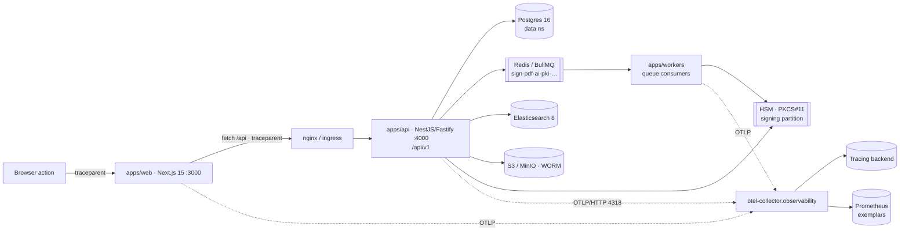

# CertiDZ by HISN — Monitoring & Observability Guide

> **Document class:** Internal
> **Owner:** SRE / Observability Guild
> **Version:** 1.0 — 2026-07-02
> **Review cadence:** Quarterly, and after any change to SLOs, alert rules, or the telemetry pipeline
> **Applies to:** All CertiDZ environments — staging (`certidz-staging`) and production (`certidz`); the `observability` namespace (otel-collector, prometheus, grafana)
> **Related docs:** [DEPLOYMENT.md](./DEPLOYMENT.md), [RUNBOOKS.md](./RUNBOOKS.md), [DISASTER-RECOVERY.md](./DISASTER-RECOVERY.md), [../architecture/SYSTEM-ARCHITECTURE.md](../architecture/SYSTEM-ARCHITECTURE.md), [../architecture/SECURITY-ARCHITECTURE.md](../architecture/SECURITY-ARCHITECTURE.md)
> **Infra referenced (owned by the monitoring stack, not this doc):** `infra/monitoring/prometheus/prometheus.yml`, `infra/monitoring/prometheus/alerts.yml`, `infra/monitoring/grafana/dashboards/certidz-overview.json`, `infra/nginx/nginx.conf`

---

## Table of Contents

1. [Observability Strategy & Golden Signals](#1-observability-strategy--golden-signals)
2. [OpenTelemetry Instrumentation Plan](#2-opentelemetry-instrumentation-plan)
3. [Metrics — RED & USE](#3-metrics--red--use)
4. [Logging](#4-logging)
5. [SLOs & Error Budgets](#5-slos--error-budgets)
6. [Alerting Philosophy](#6-alerting-philosophy)
7. [Dashboards](#7-dashboards)
8. [Sentry Usage](#8-sentry-usage)
9. [On-Call](#9-on-call)

---

## 1. Observability Strategy & Golden Signals

CertiDZ is a trust platform: when it is slow or wrong, customers cannot sign contracts or verify certificates, and regulators care. Observability here is not optional instrumentation — it is the **evidence layer** that proves the platform met its SLOs, and the fastest path from "something is wrong" to "here is exactly which span, on which tenant, against which dependency."

We instrument along **three pillars** — **metrics** (Prometheus), **traces** (OpenTelemetry → collector), and **logs** (pino JSON → Loki) — and stitch them together with a shared **`trace_id`** so any one signal navigates to the others. Everything is measured against the **four golden signals**:

| Golden signal | What it means for CertiDZ | Primary source |
|---------------|---------------------------|----------------|
| **Latency** | p50/p95/p99 of `/api/v1/*`; signature completion time; verification-portal read time | app metrics + traces |
| **Traffic** | requests/s, envelopes sent/s, signatures/s, verifications/s, queue enqueue rate | app `/api/v1/metrics` |
| **Errors** | 5xx rate, failed signatures, DLQ growth, OCSP/CRL generation failures | app metrics + Sentry |
| **Saturation** | CPU/memory vs limits, PgBouncer pool, Redis memory, HSM session pool, queue depth | node/kube/pg/redis exporters |

Design principles:

1. **Symptom-first.** We alert on user-visible symptoms and SLO burn, not on every internal blip (see [§6](#6-alerting-philosophy)).
2. **Correlate, don't hunt.** A metric exemplar links to a trace; a trace's `trace_id` links to logs; an error in Sentry carries the same `trace_id`.
3. **Tenant-aware, PII-free.** Telemetry is labeled by tenant/plan where useful for triage, but never carries document content or personal data ([§4.3](#43-pii-scrubbing)).
4. **The verification portal is sacred.** Its read path must stay observable and available even during control-plane incidents ([§5](#5-slos--error-budgets)).

---

## 2. OpenTelemetry Instrumentation Plan

### 2.1 Goal

Every request is a **distributed trace** from the browser action in `apps/web` (Next.js 15) through the `apps/api` (NestJS/Fastify) modular monolith, out to Postgres, Redis/BullMQ, Elasticsearch, S3/MinIO, and the **HSM** during signing. One `trace_id` should tell the whole story of "sign this document."

### 2.2 Collector target

All services export via **OTLP/HTTP** to the collector at:

```
otel-collector.observability.svc.cluster.local:4318
```

configured through the `OTEL_EXPORTER_OTLP_ENDPOINT` key in the `certidz-config` ConfigMap. The collector fans out: traces → tracing backend (Tempo/Jaeger), metrics/exemplars → Prometheus remote paths, and drops/samples per policy.

### 2.3 Context propagation from Next.js

- The browser and `apps/web` server components/route handlers start the trace and propagate **W3C `traceparent`** on every outbound `fetch` to `/api`. `nginx` (`infra/nginx/nginx.conf`) and the ingress pass the header through unmodified so context is preserved end-to-end.
- `apps/api` continues the incoming trace (never starts a fresh root when a valid `traceparent` is present), so a single trace spans web → api → dependencies.
- **Baggage** carries low-cardinality context (e.g. `tenant.tier`, `request.kind`) — never PII.

### 2.4 Span conventions

Follow OpenTelemetry **semantic conventions** plus CertiDZ additions:

| Span | Naming / attributes |
|------|--------------------|
| HTTP server | `http.route` = `/api/v1/...`, `http.request.method`, `http.response.status_code` |
| DB | `db.system=postgresql`, `db.operation`, statement **without** bound PII values; RLS tenant as `certidz.tenant_id` (id, not name) |
| Queue | `messaging.system=bullmq`, `messaging.destination` = queue (`sign`,`pdf`,`ai`,`pki`,…), `messaging.operation` (publish/consume) |
| HSM / signing | `certidz.hsm.partition`, `certidz.signature.level` (SES/AdES/QES), `certidz.signature.format` (PAdES-B-LTA/XAdES-B-LT/CAdES) — **no key material, no PIN** |
| AI (Model Gateway) | `certidz.ai.model` (e.g. `anthropic/claude-sonnet-4-6`), `certidz.ai.prompt_version`, `certidz.ai.confidence`, token counts — **redacted input only** |
| Outbox / events | span links from producer outbox row to consumer inbox for causal tracing |

> **⚠️ Warning:** Signing spans must never record the PKCS#11 PIN, private key handles, raw document bytes, or personal data. Attribute allow-lists are enforced in the collector processor.

### 2.5 Exemplars

Prometheus histograms (latency, signature duration) carry **exemplars** tagged with `trace_id`. In Grafana, clicking a spike on the p95 latency panel jumps straight to a representative trace — metrics↔traces without manual correlation.

### 2.6 Trace-flow diagram



---

## 3. Metrics — RED & USE

We combine **RED** (for request-driven services) and **USE** (for resources).

### 3.1 RED — services

| Signal | Meaning | Example series |
|--------|---------|----------------|
| **Rate** | requests / operations per second | `http_requests_total`, `certidz_signatures_started_total` |
| **Errors** | failed fraction | `http_requests_total{status=~"5.."}`, `certidz_signatures_failed_total` |
| **Duration** | latency distribution | `http_request_duration_seconds_bucket`, `certidz_signature_duration_seconds_bucket` |

### 3.2 USE — resources

| Signal | Meaning | Example |
|--------|---------|---------|
| **Utilization** | how busy | CPU%, memory%, PgBouncer active connections, Redis memory |
| **Saturation** | queued/waiting work | BullMQ queue depth, DB wait, HSM session-pool wait, run-queue |
| **Errors** | resource-level failures | disk errors, OOMKills, Redis evictions, replication errors |

### 3.3 Exporters & scrape

Prometheus scrape config lives in **`infra/monitoring/prometheus/prometheus.yml`** (owned by the monitoring stack). Targets:

| Exporter | Scrapes | Endpoint |
|----------|---------|----------|
| **Application** | `certidz-api` RED + business metrics | `GET /api/v1/metrics` on port `http` (4000) |
| **node-exporter** | host CPU/mem/disk/net (USE) | node metrics |
| **postgres-exporter** | Postgres 16 connections, replication lag, locks | `data` namespace |
| **redis-exporter** | Redis 7 memory, evictions, keyspace, BullMQ backlog | `data` namespace |
| **blackbox-exporter** | probes `app.certidz.dz`, verification portal, `ocsp.`/`crl.`/`tsa.certidz.dz` | HTTP/TLS/cert-expiry probes |
| **kube-state-metrics** | Deployment/Pod state, restarts, HPA, PDB | cluster-wide |

### 3.4 Useful PromQL

```promql
# API error rate (RED · Errors) over 5m
sum(rate(http_requests_total{job="certidz-api",status=~"5.."}[5m]))
  / sum(rate(http_requests_total{job="certidz-api"}[5m]))

# API p95 latency (RED · Duration)
histogram_quantile(0.95,
  sum by (le) (rate(http_request_duration_seconds_bucket{job="certidz-api"}[5m])))

# Signature completion p95 (business SLI, target < 30s)
histogram_quantile(0.95,
  sum by (le) (rate(certidz_signature_duration_seconds_bucket[5m])))

# Queue backlog (USE · Saturation) for the sign queue
certidz_bullmq_queue_waiting{queue="sign"}

# Saturation: API pods near memory limit
max by (pod) (container_memory_working_set_bytes{namespace="certidz",container="api"})
  / max by (pod) (kube_pod_container_resource_limits{namespace="certidz",container="api",resource="memory"})
```

---

## 4. Logging

### 4.1 Pipeline

- Services emit **structured JSON logs via pino** (`LOG_FORMAT=json` in `certidz-config`) to stdout.
- The node log agent ships them to **Loki** (ELK is the alternative where a customer standardizes on Elasticsearch). No log parsing regex on hot paths — logs are already JSON.

### 4.2 Correlation

Every log line carries **`trace_id`** and `span_id` (from the active OTel context), plus `tenant_id`, `request_id`, `service`, and `level`. This is what turns "an error happened" into "here is the trace and the exact tenant."

### 4.3 PII scrubbing

> **⚠️ Warning:** CertiDZ handles identity documents, signatures, and personal data under **Law 18-07 / ANPDP** and GDPR. Logs must **never** contain document content, national IDs, full email/phone bodies, key material, PINs, or JWT/refresh tokens.

- pino **redaction** paths strip known-sensitive fields at emit time (`req.headers.authorization`, `password`, `pin`, `token`, `secret`, document payloads).
- A collector/agent-side scrubbing pass provides defense in depth.
- AI Model Gateway logs only **redacted** input and metadata (modelId, promptVersion, confidence, token usage) — consistent with zero-retention and PII redaction in the gateway.

### 4.4 Levels & retention

| Level | Use |
|-------|-----|
| `error` | actionable failure; usually also a Sentry event |
| `warn` | degraded but handled (retry, fallback routing, DLQ) |
| `info` | lifecycle & business events (envelope sent, cert issued) |
| `debug` | disabled in prod; enabled transiently for investigation |

Retention: hot searchable window (e.g. 30 days) in Loki; **audit-relevant events are NOT just logs** — they live in the immutable hash-chained `audit_events` store with WORM evidence, governed separately. Security-relevant logs are retained per [SECURITY-ARCHITECTURE §11](../architecture/SECURITY-ARCHITECTURE.md).

---

## 5. SLOs & Error Budgets

### 5.1 SLO table

| SLO | Target | Window | Error budget | SLI source |
|-----|--------|--------|--------------|------------|
| **Platform availability** (signing/verification/API) | **99.9%** | 30 days | **43.8 min / month** | blackbox + 5xx ratio |
| **API latency p95** | **< 500 ms** | 30 days | latency-budget on `/api/v1/*` | app duration histogram |
| **Signature completion** | **< 30 s** | 30 days | signature duration histogram | `certidz_signature_duration_seconds` |
| **Verification-portal read availability** | **≥ 99.95%** (read-available always) | 30 days | ~21.9 min / month | blackbox read-path probe |
| Analytics / AI | 99.5% | 30 days | per SLA tier | app metrics |

These match the platform SLA (paid tiers 99.9% monthly for signing/verification/API; 99.5% analytics/AI). The **verification portal read path is held to a stricter bar** because it must stay read-available even during control-plane incidents ([DISASTER-RECOVERY](./DISASTER-RECOVERY.md)).

### 5.2 Error-budget policy

- The **43.8 min/month** availability budget is tracked continuously.
- **Budget healthy** → ship features normally.
- **Budget burning fast** (burn-rate alert) → page, stabilize, consider rollback ([DEPLOYMENT §7](./DEPLOYMENT.md#7-rollback-procedure)).
- **Budget exhausted** → **feature freeze**: no non-essential production changes until the budget recovers; only reliability fixes ship. The freeze is lifted by the SRE Guild once the trailing-window budget is back in the black.

### 5.3 Multi-window, multi-burn-rate alerts

We alert on **error-budget burn rate** over two windows to catch both fast and slow burns while suppressing noise:

```promql
# Fast burn: 14.4x over 1h (and confirmed over 5m) → page
(
  sum(rate(http_requests_total{job="certidz-api",status=~"5.."}[1h]))
    / sum(rate(http_requests_total{job="certidz-api"}[1h])) > 14.4 * 0.001
)
and
(
  sum(rate(http_requests_total{job="certidz-api",status=~"5.."}[5m]))
    / sum(rate(http_requests_total{job="certidz-api"}[5m])) > 14.4 * 0.001
)

# Slow burn: 6x over 6h (and confirmed over 30m) → ticket/page per policy
(
  sum(rate(http_requests_total{job="certidz-api",status=~"5.."}[6h]))
    / sum(rate(http_requests_total{job="certidz-api"}[6h])) > 6 * 0.001
)
and
(
  sum(rate(http_requests_total{job="certidz-api",status=~"5.."}[30m]))
    / sum(rate(http_requests_total{job="certidz-api"}[30m])) > 6 * 0.001
)
```

(`0.001` = the 0.1% error budget for a 99.9% SLO.)

---

## 6. Alerting Philosophy

### 6.1 Principles

- **Symptom-based, SLO-driven.** Page on user-visible impact and error-budget burn ([§5.3](#53-multi-window-multi-burn-rate-alerts)), not on every internal metric wobble.
- **Every page is actionable and has a runbook.** Alert annotations link to a section in [RUNBOOKS.md](./RUNBOOKS.md). If there is no action, it is a dashboard, not a page.
- **Severity-tiered routing.** Sev-1/2 page **PagerDuty/Opsgenie**; Sev-3 opens a ticket; info goes to a channel.

### 6.2 Severity & routing

| Severity | Meaning | Routing |
|----------|---------|---------|
| **Sev-1** | Customer-facing outage / signing or verification broken / data-integrity risk | Page primary + secondary + IC; PagerDuty high-urgency |
| **Sev-2** | Partial degradation, SLO burning fast, single AZ/dependency down | Page primary on-call |
| **Sev-3** | Degraded-but-served, slow burn, capacity warning | Ticket / low-urgency |
| **Sev-4 / info** | Informational, trend | Channel notification |

### 6.3 Alert rules

Rules live in **`infra/monitoring/prometheus/alerts.yml`** (owned by the monitoring stack). Each rule carries a `severity` label and a `runbook_url` annotation pointing at [RUNBOOKS.md](./RUNBOOKS.md).

| Alert | What it means | Typical severity |
|-------|---------------|------------------|
| **APIHighErrorRate** | `certidz-api` 5xx ratio exceeds the SLO threshold over the alert window — customers seeing failures; error budget burning. | Sev-1/2 |
| **APIHighLatencyP95** | API p95 over `/api/v1/*` exceeds **500 ms** for the sustained window — latency SLO breach. | Sev-2 |
| **PodCrashLooping** | A pod (api/web/worker) is restarting repeatedly (`kube_pod_container_status_restarts_total` climbing / `CrashLoopBackOff`) — bad release, failed `migrate` initContainer, or config error. | Sev-2 |
| **PostgresReplicationLag** | Patroni standby replication lag exceeds threshold — HA/DR risk; threatens **RPO 15 min** (≤5 min Ent/Gov) and read-replica correctness. | Sev-2 |
| **RedisDown** | Redis 7 unreachable — BullMQ queues (`sign`,`pdf`,`ai`,`pki`,…) and cache impaired; signing/notifications stall. | Sev-1/2 |
| **CertificateExpiringSoon** | A TLS or PKI certificate (ingress, TSA, issuing CA, or a probed endpoint via blackbox-exporter) is approaching expiry — act before an outage or trust-chain failure. | Sev-2/3 |
| **SignatureQueueBacklog** | The `sign` (and related) BullMQ queue depth is growing beyond threshold / not draining — signature completion SLO (**< 30 s**) at risk; possible worker or HSM saturation. | Sev-2 |
| **DiskPressure** | Node or PVC disk usage high (Postgres/Elasticsearch/MinIO volumes) — risk of write failures, WAL archiving stalls, and cascading outage. | Sev-2 |
| **TargetDown** | Prometheus cannot scrape a target (exporter/service down) — blind spot; often a leading indicator of a broader failure. | Sev-2/3 |

> **Tip:** `TargetDown` on a monitoring exporter is treated seriously — a silent monitoring gap can hide an in-progress SLO breach. Never leave a `TargetDown` unacknowledged.

---

## 7. Dashboards

Grafana dashboards live under **`infra/monitoring/grafana/`** (owned by the monitoring stack).

### 7.1 Overview dashboard

**`infra/monitoring/grafana/dashboards/certidz-overview.json`** — the single pane the on-call opens first. Panels:

| Panel | Signal |
|-------|--------|
| **Request rate** | RED · Rate — `sum(rate(http_requests_total{job="certidz-api"}[5m]))` |
| **Error rate** | RED · Errors — 5xx ratio vs SLO line |
| **p95 latency** | RED · Duration — with exemplars linking to traces |
| **Envelope throughput** | envelopes sent / signatures completed per second |
| **Queue depth** | BullMQ waiting per queue (`sign`,`pdf`,`ai`,`pki`,…) |

### 7.2 Other dashboards

| Dashboard | Focus |
|-----------|-------|
| **Signing & PKI** | signature duration p95 (SLO < 30 s), HSM session pool, OCSP/CRL freshness, TSA latency |
| **Database (Postgres/PgBouncer)** | connections, replication lag, locks, slow queries, WAL archiving |
| **Redis & Queues** | memory, evictions, per-queue depth + DLQ growth |
| **Kubernetes / Cluster** | pod restarts, HPA, PDB, node CPU/mem/disk (USE) |
| **SLO & Error Budget** | burn-rate (multi-window), remaining budget, availability |
| **Verification Portal** | read-path availability + latency (stricter SLO) |
| **AI / Model Gateway** | model mix, token budget per tenant, confidence distribution, fallback rate |

---

## 8. Sentry Usage

Sentry is the **application error-tracking** layer, complementary to metrics/traces. `SENTRY_DSN` is delivered via `certidz-secrets` ([DEPLOYMENT §5](./DEPLOYMENT.md#5-secrets-management)).

- **Error tracking** — unhandled exceptions and handled errors from `apps/api`, `apps/web`, and `apps/workers`, grouped by fingerprint. Each event carries the **`trace_id`** so it links to the OTel trace and logs.
- **Release health** — events are tagged with the release (`vX.Y.Z` / `sha-<shortsha>`), so a regression is attributed to the exact deploy; crash-free session/user rates gate release confidence.
- **Source maps** — web source maps are uploaded at build time (and not served publicly) so stack traces are readable without shipping readable bundles.
- **PII scrubbing** — Sentry's `beforeSend` + server-side data scrubbing strip tokens, PINs, document content, and personal data before events leave the process. Consistent with [§4.3](#43-pii-scrubbing) and Law 18-07.
- **Sampling** — 100% of errors; **traces sampled** (e.g. a modest `tracesSampleRate`, higher on signing/PKI paths) to control cost while keeping the important paths well covered. In **sovereign/air-gapped** deployments external Sentry SaaS is disabled and replaced by an in-country sink or turned off per contract ([DEPLOYMENT §8.3](./DEPLOYMENT.md#83-in-cluster-data--no-external-egress)).

---

## 9. On-Call

### 9.1 Rotation & escalation

- **Primary** and **secondary** on-call per weekly rotation, backed by an **Incident Commander (IC)** pool for Sev-1.
- Paging via **PagerDuty/Opsgenie**. Escalation: primary → (no ack in N min) secondary → IC / engineering lead.
- **PKI/signing on-call** is a distinct escalation path (Trust Services) for signature-correctness and CA/HSM incidents, aligned with the four-eyes PKI approver in [DEPLOYMENT §4.5](./DEPLOYMENT.md#45-four-eyes-approval).

### 9.2 Incident severity matrix

Aligned with the [DISASTER-RECOVERY](./DISASTER-RECOVERY.md) severity matrix and the alert severities in [§6.2](#62-severity--routing):

| Sev | Definition | Examples | Response | Comms |
|-----|-----------|----------|----------|-------|
| **Sev-1** | Full/critical outage or trust-integrity risk | API down, signing broken, verification portal unreadable, data-integrity/PKI mis-issuance | Immediate page primary+secondary+IC; war room; consider rollback/DR | Status page + customer comms; exec notify |
| **Sev-2** | Major degradation / fast SLO burn / HA at risk | High error rate, p95 breach, `PostgresReplicationLag`, `RedisDown`, `SignatureQueueBacklog` | Page primary; engage secondary as needed | Internal; status page if customer-visible |
| **Sev-3** | Minor / degraded-but-served / slow burn | Elevated latency within budget, `CertificateExpiringSoon`, `TargetDown` on a non-critical target | Ticket; handle in business hours | Internal |
| **Sev-4** | Informational | Capacity trend, single transient blip | Track | None |

### 9.3 Paging thresholds

- **Page (Sev-1/2):** fast-burn error-budget alert ([§5.3](#53-multi-window-multi-burn-rate-alerts)), `APIHighErrorRate`, `RedisDown`, `PostgresReplicationLag`, `SignatureQueueBacklog`, `PodCrashLooping` on api/web, verification-portal read-path down.
- **Ticket (Sev-3):** slow-burn budget alert, `APIHighLatencyP95` within tolerance, `CertificateExpiringSoon`, `DiskPressure` early warning, `TargetDown` on a non-critical exporter.
- **Every page** links to its [RUNBOOKS.md](./RUNBOOKS.md) entry; post-incident, a review is filed and any missing runbook/alert is added (evidence over trust).

> **Tip:** During a Sev-1 the IC owns decisions, comms, and the timeline; responders own remediation. Keep the immutable audit trail intact — rollbacks and DR actions are recorded as `audit_events` ([DEPLOYMENT §7.3](./DEPLOYMENT.md#73-evidence--audit-of-rollback)).

---

*End of MONITORING.md — CertiDZ by HISN, SRE / Observability Guild, v1.0 (2026-07-02), Classification: Internal.*
