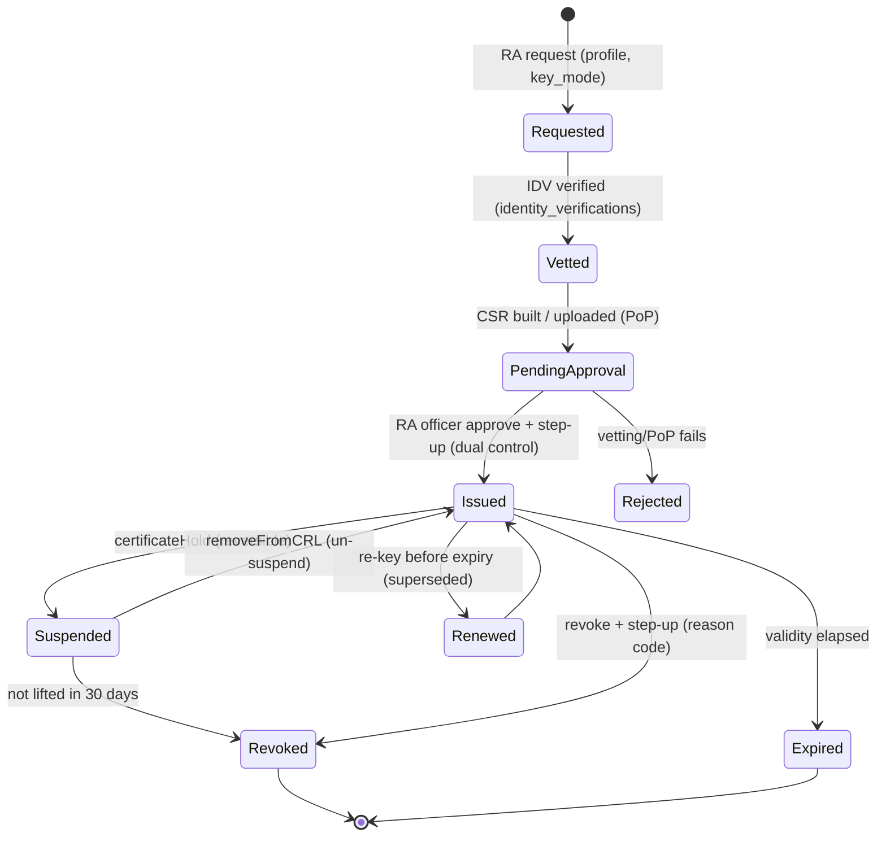

# CertiDZ by HISN — Administrator Guide

| | |
|---|---|
| **Document** | Administrator Guide |
| **Product** | CertiDZ by HISN — The Trusted AI-Powered Digital Trust Platform for Algeria and Africa |
| **Audience** | Tenant **Owners**, **Admins**, and **Compliance Officers** (primary). Platform **Operations / SuperAdmin / Support** notes are marked *`[Platform Ops]`* throughout. |
| **Version** | 1.0 |
| **Last updated** | 2026-07-02 |
| **Classification** | Internal / Customer-shareable — Operational |
| **Related docs** | `docs/product/PRD.md` (ADM/BIL/CMP requirements), `docs/architecture/SECURITY-ARCHITECTURE.md` (§3 authorization, §4 PKI, §12 DR/IR), `docs/product/ROADMAP.md` (pricing) |

> **Scope.** This guide covers day-to-day administration of a CertiDZ tenant: organization setup, roles & permissions, certificate-authority operations, audit and evidence, retention, billing, feature flags, incident handling, and Algerian-compliance obligations. It is authoritative for administrator-facing behavior; where it references cryptographic or platform internals it defers to `SECURITY-ARCHITECTURE.md`.

---

## Table of Contents

1. [Tenant / Organization Setup](#1-tenant--organization-setup)
2. [RBAC Roles & Full Permission Matrix](#2-rbac-roles--full-permission-matrix)
3. [Certificate Authority Operations](#3-certificate-authority-operations)
4. [Audit-Log Review & Export for Legal Evidence](#4-audit-log-review--export-for-legal-evidence)
5. [Data-Retention Configuration](#5-data-retention-configuration)
6. [Billing Administration](#6-billing-administration)
7. [Feature Flags](#7-feature-flags)
8. [Incident Procedures for Administrators](#8-incident-procedures-for-administrators)
9. [Algerian-Compliance Operational Notes](#9-algerian-compliance-operational-notes)
10. [Appendix A — Admin Quick Reference](#appendix-a--admin-quick-reference)

---

## 1. Tenant / Organization Setup

A **tenant** (organization) is the top-level container in CertiDZ. Everything — members, documents, envelopes, certificates, billing, and policy — is scoped to it. The hierarchy is **Organization → Workspaces/Teams → Members** (PRD ADM-01).

### 1.1 Create the organization

1. Sign up at `https://app.certidz.dz` (email + password with Argon2id hashing; passkey enrollment offered immediately).
2. Create the organization: legal name, display name, primary language (**ar-DZ / fr-DZ / en**), country (`DZ` default), and time zone (`Africa/Algiers`).
3. The creating user becomes the **Owner** (exactly one per tenant; see §2).
4. Complete organization identity verification (§1.2) before issuing any advanced/qualified certificates or seals.

> **Onboarding target (US-24).** Signup → org creation → first envelope sent should be achievable in ≤ 15 minutes.

> 📸 [Screenshot: Organization creation wizard — legal identity step]

### 1.2 Verify organization identity (RC / NIF)

Organization-level trust artifacts (seals, org certificates, compliant invoices) require a **verified legal identity**. Provide:

| Field | Description | Used for |
|---|---|---|
| **RC** (Registre du Commerce) | Commercial register number | Org cert `organizationIdentifier`, invoices |
| **NIF** (Numéro d'Identification Fiscale) | Tax identification number | Invoices (TVA), fiscal mentions |
| **AI** (Article d'Imposition) | Tax article number | Invoices |
| **NIS** (optional) | Statistical identification number | Public-sector procurement |
| Legal representative | Name + a completed IDV session (`identity_verifications`) | RA vetting binding (§3) |

Verification states: `unverified → pending → verified → suspended`. Seal issuance and Government-plan onboarding are blocked until `verified`. The RC/NIF is embedded into the **Organization Seal** certificate subject DN (`organizationIdentifier=<RC/NIF>`) — see `SECURITY-ARCHITECTURE.md` §4.2.

> **⚠️ Warning:** Do not request seal certificates before the legal representative's IDV is complete. The RA (§3.1) rejects the request with `409 identity verification required`.

### 1.3 Branding & white-label

Applies to signing pages, transactional emails, and the tenant footer of the public verification portal (US-24, PRD ADM-01).

| Asset | Constraint |
|---|---|
| Logo | ≤ 1 MB (PNG/SVG); light + dark variants |
| Brand colors | Primary + accent (hex); contrast auto-checked ≥ 4.5:1 (WCAG 2.2 AA) |
| Email sender name | Free-text; falls back to `certidz.dz` sender + org name if the domain is unverified |
| Verification-portal footer | Org name + logo shown to third parties verifying that tenant's documents |

**White-label (Enterprise/Government):** remove CertiDZ chrome, custom fonts, and custom legal-disclosure text (AR/FR/EN). On-prem Enterprise/Government deployments may fully re-skin.

### 1.4 Domains & subdomain

| Item | Setup | Notes |
|---|---|---|
| Custom subdomain | e.g. `acme.certidz.dz` (tenant vanity host) | Optional; TLS auto-provisioned |
| Email sender domain | Add domain → publish **SPF, DKIM, DMARC** records → verify | Unverified domains fall back to the `certidz.dz` sender (US-24 AC2) |
| Verified apex/CNAME | For white-label portals | Enterprise/Government |

> **Tip:** DKIM alignment materially improves signature-request deliverability (transactional email p95 hand-off < 60 s, PRD NOT-03). Verify DNS before your first bulk send.

### 1.5 Plan selection

Choose a plan at creation or upgrade later (§6). Plans: **Free, Pro, Business, Enterprise, Government**. Plan gates seats, quotas, signature levels, data-residency options, SSO/SCIM, custom roles, and SLA/RTO. See §6 for the full matrix.

### 1.6 Data-residency choice

CertiDZ offers three isolation tiers (per `SECURITY-ARCHITECTURE.md` multi-tenancy model). Algerian tenants' **primary data resides in Algeria** (Law 18-07); the DR replica location is contractually disclosed (§9).

| Tier | Isolation | DB model | Target segment | Region |
|---|---|---|---|---|
| **Pooled** | Shared DB + PostgreSQL **RLS** (`app.tenant_id`, `FORCE ROW LEVEL SECURITY`) | Shared | Free / Pro / Business | DZ primary |
| **Dedicated schema** | Own schema in shared cluster | Shared cluster, isolated schema | Enterprise, banks, insurers | DZ primary |
| **Dedicated database** | Own database + **own HSM partition**, in-country region | Dedicated | **Government (Law 15-04)**, sovereign | DZ in-country only; on-prem option |

- Region is **visible in the admin UI** (PRD ADM-06). Cross-region transfer requires a documented legal basis.
- Government: **in-country only + on-prem Kubernetes** option; no cross-border DR replica unless separately contracted and disclosed.

> **⚠️ Warning:** Data-residency tier is set at provisioning and changing it is a **migration**, not a toggle. Choose deliberately; Government tenants cannot be pooled.

### 1.7 SSO (OIDC / SAML) & SCIM — Enterprise

| Capability | Standard | Plan | Notes |
|---|---|---|---|
| **SSO** | **SAML 2.0** and **OIDC** (Azure AD/Entra, Google Workspace, Keycloak) | Enterprise (Business add-on) | JIT provisioning with **domain-claim verification** (PRD AUTH-05) |
| **SCIM** | **SCIM 2.0** user lifecycle | Enterprise (PRD AUTH-06) | Create/update/deactivate members from your IdP |
| Enforcement | Restrict a verified domain to SSO-only | Enterprise | Prevents password logins for `@acme.dz` |
| Role mapping | Map IdP groups → CertiDZ roles (§2) | Enterprise | SCIM `deactivate` revokes ≤ 60 s (token invalidation, US-25 AC2) |

> **Tip:** Combine SSO enforcement with the tenant MFA policy (PRD ADM-03) so that IdP-side MFA plus CertiDZ step-up (§3) both apply to signing acts.

---

## 2. RBAC Roles & Full Permission Matrix

CertiDZ RBAC is the single source of truth in `apps/api/src/modules/organizations/permissions.ts`. Guards resolve a member's `MembershipRole`, look up `ROLE_PERMISSIONS[role]`, and check the required `Permission`. This section mirrors that code exactly.

### 2.1 Permission model

Permissions are stable `resource:action` strings (persistable as API-key scopes), grouped as:

| Group | Actions (enum values) |
|---|---|
| **Documents** | `documents:read`, `documents:write`, `documents:delete` |
| **Envelopes** | `envelopes:read`, `envelopes:send`, `envelopes:void` |
| **Certificates** | `certificates:read`, `certificates:issue`, `certificates:revoke` |
| **Identity** | `identity:read`, `identity:verify` |
| **Members** | `members:read`, `members:manage` |
| **Billing** | `billing:read`, `billing:manage` |
| **Audit** | `audit:read` |
| **Settings** | `settings:manage` (tenant policy), `org:manage` (org lifecycle / ownership transfer) |

Role rank (used for role-change authorization — an actor may only assign roles strictly below their own): **Owner 100 → Admin 80 → Compliance Officer 60 → Manager 40 → Member 20 → Auditor 10**.

### 2.2 Tenant roles

| Role | Purpose | Key privileges | Key limits |
|---|---|---|---|
| **Owner** | Ultimate authority; one per tenant | **All permissions**, including `org:manage` (ownership transfer, org deletion, data-residency, plan) | Cannot be removed/downgraded while sole Owner (US-25 AC3) |
| **Admin** | Runs the tenant operationally | All permissions **except `org:manage`** — includes members, billing, settings, full trust surface | Cannot transfer ownership, delete the org, or change data residency |
| **Compliance Officer** | Owns the **trust surface** | Certificates (read/issue/revoke), Identity (read/verify), Envelope **void**, Documents read, Members read, **Audit read**. Releases **legal holds** (§5) | No document write/delete, no send, no billing, no settings |
| **Manager** (Team Manager) | Day-to-day signing + team lead | Documents read/write/delete, Envelopes read/send/void, Identity read/verify, Certificates read, Members read | Cannot issue/revoke certs, no billing/settings/audit |
| **Member** | Standard contributor | Documents read/write, Envelopes read/send, Certificates read | No delete, no void, no identity verify, no members visibility |
| **Auditor** | Segregation-of-duties read-only | **Read-only everywhere**: Documents, Envelopes, Certificates, Identity, Members, Billing, **Audit** | Any mutation → `403` and is itself audited (US-23 AC3) |

### 2.3 Platform roles *`[Platform Ops]`* (HISN internal)

| Role | Purpose | Access | Hard limits |
|---|---|---|---|
| **SuperAdmin** | Platform operations across all tenants | Tenant lifecycle, plan overrides, feature flags, health dashboards; **platform-wide** | No routine plaintext **document content**; break-glass access is dual-controlled and fully audited |
| **Support** | Customer support | **Impersonation-with-consent** only; tenant health, metadata, billing/refund tooling | **Never document content**, never biometrics/PII, no signing acts; every session tied to a consent grant and audited (PRD ADM-05, persona P8) |

### 2.4 Full permission matrix

Legend: **✔** full (all actions in the group) · **▲** partial/conditional (see footnotes) · **—** none.

| Group → | Documents | Envelopes | Certificates | Identity | Members | Billing | Audit | Settings |
|---|:--:|:--:|:--:|:--:|:--:|:--:|:--:|:--:|
| **Owner** | ✔ | ✔ | ✔ | ✔ | ✔ | ✔ | ✔ | ✔ |
| **Admin** | ✔ | ✔ | ✔ | ✔ | ✔ | ✔ | ✔ | ▲ ¹ |
| **Compliance Officer** | ▲ ² | ▲ ³ | ✔ | ✔ | ▲ ⁴ | — | ✔ | — |
| **Manager** | ✔ | ✔ | ▲ ⁵ | ✔ | ▲ ⁴ | — | — | — |
| **Member** | ▲ ⁶ | ▲ ⁷ | ▲ ⁵ | ▲ ⁸ | — | — | — | — |
| **Auditor** | ▲ ⁹ | ▲ ⁹ | ▲ ⁹ | ▲ ⁹ | ▲ ⁹ | ▲ ⁹ | ✔ | — |
| **SuperAdmin** *`[Platform]`* | ▲ ¹⁰ | ✔ | ✔ | ▲ ¹¹ | ✔ | ✔ | ✔ | ✔ |
| **Support** *`[Platform]`* | — ¹² | ▲ ¹³ | ▲ ¹³ | — ¹¹ | ▲ ¹³ | ▲ ¹⁴ | ▲ ¹³ | — |

**Footnotes**

1. **Admin/Settings** — has `settings:manage` (tenant policy: MFA, allowed signature levels, IP allowlists, retention defaults, AI on/off) but **not** `org:manage`. Ownership transfer, org deletion, and data-residency changes are Owner-only.
2. **CO/Documents** — `documents:read` only (no write/delete).
3. **CO/Envelopes** — `envelopes:read` + `envelopes:void`; **no** `envelopes:send`.
4. **Members (read-only)** — `members:read` only; cannot invite/remove/change roles (`members:manage`).
5. **Certificates (read-only)** — `certificates:read` only; cannot issue or revoke org-scoped certificates. (Any user may still request/revoke **their own** certificate — see footnote 8.)
6. **Member/Documents** — `documents:read` + `documents:write`; **no** `documents:delete`.
7. **Member/Envelopes** — `envelopes:read` + `envelopes:send`; **no** `envelopes:void`.
8. **Member/Identity** — no org-scoped `identity:read`/`identity:verify`; a member may still run **their own** IDV and request **their own** certificate (`self`-scoped, per `SECURITY-ARCHITECTURE.md` §3.2).
9. **Auditor** — read-only across every group (`*:read`); any write/delete/void/issue/revoke is denied with `403` and audited.
10. **SuperAdmin/Documents** — platform metadata, lifecycle, and legal-hold orchestration; **no routine plaintext content** — content access requires audited break-glass with tenant notification.
11. **Identity/PII** — SuperAdmin has no routine biometric/PII access; Support has **none**. Raw IDV media is per-tenant DEK-encrypted (PRD IDV-08).
12. **Support/Documents** — **never** document content (contractual + technical guarantee, PRD ADM-05).
13. **Support (with-consent)** — status/metadata only, exercised through impersonation bound to an active tenant-admin consent grant; read-only, no content.
14. **Support/Billing** — read + refund/adjustment tooling for support cases; no plan-structure changes without SuperAdmin.

> **Consistency note.** This matrix is derived directly from `ROLE_PERMISSIONS` in `permissions.ts` (Owner = `ALL_PERMISSIONS`; Admin = all except `ORG_MANAGE`; Compliance Officer = trust surface + audit read; Manager = signing + team read; Member = contributor; Auditor = `READ_ONLY`). An automated permission test suite covers **every role × permission cell** (US-25 AC1).

### 2.5 Role administration rules

- **Least privilege** — assign the lowest role that lets a member do their job.
- **Rank enforcement** — an actor can only assign/modify roles **strictly below** their own rank; nobody can elevate a member above themselves.
- **Last Owner protection** — the sole Owner cannot be removed or downgraded; **ownership transfer** requires the new Owner's acceptance **plus step-up auth** (US-25 AC3).
- **Effect latency** — role changes propagate ≤ 60 s across sessions via token refresh/invalidation; downgrades revoke in-flight privileged UI on the next request (US-25 AC2).

### 2.6 Custom roles — Enterprise

Enterprise tenants can compose **custom roles** from the permission catalog above (PRD ADM-02): pick any subset of `resource:action` permissions, name the role, and optionally map it to an IdP group (§1.7). Custom roles still obey rank rules (assign a rank between two built-ins) and cannot exceed the assigning actor's permissions. The six built-in roles remain immutable; custom roles are additive.

---

## 3. Certificate Authority Operations

CertiDZ operates a **private corporate PKI** for advanced signatures, seals, TLS, and timestamping, and acts as a **Registration Authority (RA)** to the Algerian national chain for qualified signatures. **CertiDZ never self-issues qualified (QES) certificates** — the qualified certificate and QSCD remain under the national chain (`SECURITY-ARCHITECTURE.md` §4.1).

### 3.1 Trust hierarchy at a glance

- **Advanced / seals** → CertiDZ Root CA (offline, **ECDSA P-384**, 20 y) → Persons / Seals / TLS / Timestamping issuing CAs.
- **Qualified (Law 15-04)** → National Root → **AGCE** (government) / **AECE** (economic, ARPCE-supervised) → accredited **CSP** → qualified end-entity on QSCD. CertiDZ = RA/integration layer only.
- The two chains are **never cross-signed**; the verifier ships both trust stores separately.

### 3.2 Certificate lifecycle



### 3.3 Issue & approve (RA flow)

Advanced/seal issuance is an RA workflow (`SECURITY-ARCHITECTURE.md` §4.3):

1. **Request** — a user or admin submits `POST /pki/certificates/requests` with a profile and key mode. RBAC: `certificates:issue` (Compliance Officer / Admin / Owner) for org-scoped; `self` for own person certs.
2. **Vetting** — the RA checks `identity_verifications` for a completed, unexpired IDV. If missing/expired → `409 identity verification required`.
3. **Key generation**
   - **HSM-held** (default for seals + platform-managed person certs): keypair generated **inside the HSM partition**, `CKA_SENSITIVE`, **non-extractable**; server builds the CSR; proof-of-possession = HSM signature.
   - **Client-held** (BYO/smart card): CSR uploaded; PoP via CSR self-signature + signed challenge nonce; RA lints the key (min strength, no weak/Debian-weak RSA, not previously seen).
4. **Approval** — an **RA officer** with `certificates:issue` + **step-up auth** approves. **Dual control** is required for seal and RA-officer profiles.
5. **Issuance** — the issuing CA signs inside the HSM; the cert is appended to a **CT-style hash-chained issuance log** and stored (`state=issued`).

> **⚠️ Warning:** Sole control for advanced certs is enforced by **step-up authentication gating each use** (WebAuthn UV or TOTP, 5-minute elevation token). Never share step-up factors; each signing act must be individually authorized.

### 3.4 Renew

Re-key before expiry produces a fresh keypair and a new certificate; the superseded certificate is revoked with reason `superseded (4)`. For **long-term signatures**, the LTA re-timestamping job (PRD SIG-03) runs ≥ 90 days before the newest embedded timestamp-certificate expires — monitor the **LTV health** dashboard (healthy / re-stamp due < 90 d / at risk) and clear any at-risk items.

### 3.5 Qualified (QES) via national CSP

- CertiDZ collects and vets identity (RA role), then relays the request to an **accredited AECE CSP**; the CSP issues the qualified certificate and the private key stays in a **QSCD/HSM** under the national chain.
- At signing, **step-up (fresh factor ≤ 5 min)** is mandatory; if the certificate is **revoked or expired at signing time, signing is blocked** — never a silent downgrade to Advanced (US-05 AC3).
- Qualified validation always resolves against the **national TSL/trust store**.

### 3.6 Suspend, un-suspend & revoke

Revocation requires `certificates:revoke` + step-up. **Subscriber self-revocation for `keyCompromise` is always allowed and processed ≤ 1 hour**; a 24/7 out-of-band revocation channel (authenticated hotline + signed email) is documented in the CPS.

| Event | RFC 5280 reason code | Reversible | Notes |
|---|---|:--:|---|
| Key compromise (proven/suspected) | `keyCompromise (1)` | No | Backdated `invalidityDate` with CISO approval; triggers IR |
| Subscriber left organization | `affiliationChanged (3)` | No | |
| Re-key / renewal | `superseded (4)` | No | |
| Service termination | `cessationOfOperation (5)` | No | |
| **Suspension** | `certificateHold (6)` | **Yes** | Used during identity-fraud investigations; auto-revokes (`keyCompromise` review) if not lifted in **30 days** |
| Un-suspend | `removeFromCRL` (delta CRL) | — | Lifts a hold |
| CA-side mis-issuance | `superseded` + incident record | No | 24 h SLA from confirmation |

### 3.7 CRL / OCSP behavior (what admins should expect)

| Mechanism | Cadence | Notes |
|---|---|---|
| **Full CRL** (per issuing CA) | Every **6 h** + immediately on any revocation | `nextUpdate = thisUpdate + 24 h`; signed in HSM; published to S3 (object-lock) via CDN at `http://crl.certidz.dz/<ca>.crl`; 15-min cache |
| **Delta CRL** | **Hourly** (Persons ICA, highest churn) | |
| **Root CRL** | Each root ceremony + ≥ annually | Covers issuing CAs; 12-month `nextUpdate` |
| **OCSP** | **Pre-signed every 4 h** (`nextUpdate = 8 h`) | Served from `http://ocsp.certidz.dz/<ca>`; front-end holds **no CA key** — a responder compromise cannot forge status; unknown serials return `unknown` (not `good`) |

> **Tip:** Revocation is effective for relying parties once the next CRL/OCSP batch publishes (or immediately via the on-revocation CRL). For urgent compromise, self-revocation (≤ 1 h) plus the OCSP `unknown`/revoked status is your fastest path.

### 3.8 Key ceremony summary *`[Platform Ops]`*

Root CA operations (key generation, annual CRL, issuing-CA signing) run **offline** under a scripted, witnessed ceremony (`SECURITY-ARCHITECTURE.md` §4.5). Tenant admins do not run these but should understand the controls for audit/attestation:

| Role | Responsibility |
|---|---|
| **Ceremony Master** | Runs the approved script; **no key-material access** |
| **Key Custodians** | **Shamir 3-of-5** shares of the HSM security-officer credential (5 distributed, quorum 3) |
| **Witnesses (2)** | One internal audit, one external/legal |
| **Recorder** | Video + written ceremony log |

Controls: **offline root** HSM (powered off between ceremonies, dual-control safe), never-networked verified-hash ceremony laptop booted from write-once media, tamper-evident bags with recorded serials, **dual control**, scripted-only operations with each step read aloud and output hashes recorded, WORM ceremony archive (10-year retention), and a deviation register (any off-script event aborts unless unanimously waived and recorded). Issuing-CA activation uses **2-of-3** custodians and proves `CKA_EXTRACTABLE=false`.

---

## 4. Audit-Log Review & Export for Legal Evidence

CertiDZ maintains an **immutable, hash-chained** audit log: every security-relevant and document-lifecycle event, each entry embedding the **SHA-256 of the previous** entry (`audit_events`, partitioned monthly). Signature events retain for **≥ 10 years** (PRD ADM-04). Access: `audit:read` (Owner, Admin, Compliance Officer, Auditor); export is scoped to Owner/Auditor at the platform authorization layer.

### 4.1 Filtering & review

Filter by **actor, event type, resource, and date range** (combined with AND). Every entry is traceable end-to-end by **correlation ID** (exposed to support tooling **without content access**). Typical audited events: auth/MFA/step-up, role changes, envelope lifecycle (sent/viewed/signed/voided/declined), certificate issue/suspend/revoke, IDV decisions, retention purges, legal-hold set/release, billing changes, and admin/impersonation sessions.

> 📸 [Screenshot: Audit console with actor/event/resource/date filters]

### 4.2 Hash-chain integrity & tamper verification

- Each export **includes the hash chain**; a provided verification script/endpoint (`verifyChain`) re-validates integrity end-to-end (US-23 AC2).
- Any modification to a historical entry breaks the chain at that point and is detectable; audit-chain tampering is a **SEV1** incident (§8).
- The chain's SHA-256 manifest is also recorded for backup sets (`SECURITY-ARCHITECTURE.md` §12.2), so tampering is caught across restores.

### 4.3 Export formats & evidence packages

| Output | Use | Properties |
|---|---|---|
| **CSV / JSON export** | General audit, attestation | Includes hash chain; async generation; 100k-row export downloads via **expiring link within 5 min** (US-23 AC1) |
| **Signed/sealed export** | Legal submission | Export sealed with the **platform seal (PAdES)**; tamper-evident |
| **Envelope evidence file** | Per-envelope court evidence | Sealed **Certificate of Completion** PDF + machine-readable JSON: all events (sent/viewed/authenticated/signed), UTC timestamps, SHA-256 hash chain of document versions, auth methods, signature level per signer (PRD SIG-07) |
| **Evidence package** | Case bundle | Documents + evidence files + audit slice, WORM-stored (S3 Object Lock) |

### 4.4 Chain of custody

- Every export action is **itself audited** (who, when, filter scope, correlation ID).
- Sealed exports carry the platform signature so a recipient can independently verify authenticity via the public verification portal.
- Evidence files are **platform-sealed** and stored WORM; they are **excluded from document retention rules** and follow their own ≥ 10-year schedule (US-22 AC3).

### 4.5 Retention: audit vs. source documents

| Class | Default retention | Rule |
|---|---|---|
| Audit log (signature/security events) | **≥ 10 years** | Independent of document retention; not user-deletable |
| Evidence files (Certificate of Completion, JSON) | **≥ 10 years** (evidentiary WORM 7 y minimum in backups) | Excluded from document retention |
| Signed documents | 10 years default, tenant-extendable | Law 15-04 archival alignment |
| Raw IDV media (selfie/document) | 90 days default (1–365 or "delete on decision") | Audit **metadata** retained separately |

---

## 5. Data-Retention Configuration

Retention balances legal archival obligations against Law 18-07 data-minimization. Configure under **Settings → Data & Retention** (`settings:manage`; Owner/Admin). Legal-hold **release** additionally requires the **Compliance Officer** role.

### 5.1 Retention policies per document class

Define per-class schedules (PRD DOC-06 / US-22):

| Document class | Default retention | Then |
|---|---|---|
| Signed contracts / notarial acts | **10 years** | Purge → certified deletion report |
| Evidence files & audit logs | **≥ 10 years** (own schedule) | Never purged by document rules |
| Diplomas / sealed institutional docs | Tenant-defined (often permanent) | Manual review |
| Raw IDV media | 90 days (configurable 1–365, or delete-on-decision) | Crypto-shred; metadata retained |
| Draft / unsent documents | Tenant-defined (e.g. 1 year) | Purge |
| Invoices (fiscal) | Per Algerian fiscal obligations | Retain |

A retention rule (`class`, `keep`, `then=purge`) runs on schedule; **purge produces a certified deletion report** (doc IDs, hashes, timestamp, approver) **sealed by the platform** (US-22 AC1).

### 5.2 Legal hold

- A legal hold on a matter/tag **freezes deletion** for all tagged documents **regardless of retention rules** (US-22 AC2).
- **Setting** a hold: Owner/Admin/Compliance Officer.
- **Releasing** a hold: requires the **Compliance Officer role + a documented reason** — recorded on the audit chain. (Admins can set but the release control is deliberately scoped to compliance for segregation of duties.)
- While held, retention purges skip the documents and log the skip.

> **⚠️ Warning:** Do not attempt to delete documents under legal hold. The purge job excludes them; manual delete attempts by non-privileged roles return `403` and are audited.

### 5.3 Crypto-shredding erasure

- Erasure is achieved by **destroying the document DEK** (per-tenant/per-object key). Once the DEK is destroyed, ciphertext — **including every backup generation** — is unrecoverable (`SECURITY-ARCHITECTURE.md` §6.6, §12.2). No backup rewriting is needed.
- Used for Law 18-07 / GDPR erasure requests, subject to the **signed-document legal-obligation carve-out**: documents needed to satisfy a legal/evidentiary obligation are exempted and the exemption is **documented in the deletion report** (PRD CMP-02).

### 5.4 Backup coverage note

Backups are client-side encrypted (backup DEK wrapped by a dedicated **backup KEK** in a separate HSM partition), integrity-manifested (SHA-256 on the audit chain), and stored under **S3 Object Lock (compliance mode ≥ 35 days)**; backup-writer credentials **cannot delete** (ransomware resilience). PITR window is **35 days**; weekly fulls kept 12 months; evidentiary/audit archives 7 years WORM. Crypto-shredding covers backups automatically — see §8 for RPO/RTO.

---

## 6. Billing Administration

Billing is managed under **Settings → Billing** by Owner and Admin (`billing:manage`); Auditor/Support have read/scoped access (§2). Metering is event-sourced, idempotent, and reconciled daily (PRD BIL-05).

### 6.1 Plans

| Plan | Segment | Seats | Signature levels | Residency | SSO/SCIM | Custom roles | SLA / RTO |
|---|---|---|---|---|---|---|---|
| **Free** | Individuals / trial | 1–small | Simple, Advanced (quota-limited) | Pooled (DZ) | — | — | Best-effort; **over-quota blocked** |
| **Pro** | Freelancers / SMEs | Small teams | Simple, Advanced | Pooled (DZ) | — | — | 99.9% / RTO ≤ 4 h |
| **Business** | Growing orgs | Teams | Simple, Advanced, **Qualified** (via CSP) | Pooled / dedicated-schema | SSO add-on | — | 99.9% / RTO ≤ 4 h |
| **Enterprise** | Banks, insurers, large orgs | Custom | All + bulk seal | Dedicated schema/DB | **SSO + SCIM** | **Yes** | 99.9% / **RTO ≤ 1 h, RPO ≤ 5 min** |
| **Government** | Public sector (Law 15-04) | Custom | All + org seals | **Dedicated DB, in-country + on-prem** | SSO + SCIM | Yes | 99.9% / **RTO ≤ 1 h, RPO ≤ 5 min** |

- **SLA (paid):** 99.9% monthly uptime for signing/verification/API (≤ 43.8 min/month); 99.5% for analytics/AI.
- **Service credits:** **10%** (99.0–99.9%), **25%** (95–99%), **50%** (< 95%).

### 6.2 Payment rails

| Rail | Currency | Method | Notes |
|---|---|---|---|
| **SATIM gateway** | **DZD** | **CIB / EDAHABIA** | Redirect to SATIM-integrated gateway; plan activates ≤ 60 s on success (US-26 AC1) |
| **Stripe** | EUR / USD | Cards | Diaspora, exporters, pan-African |
| PayPal | EUR / USD | Wallet | Secondary |
| **Bank transfer** | DZD | **Proforma → invoice** | Unique reference code; admin reconciliation UI matches incoming transfers, then activates with full audit (US-26 AC3) |

Order state machine is **idempotent** — gateway timeouts leave the account unchanged; duplicate callbacks never double-charge (US-26 AC2).

### 6.3 Seats & metered add-ons

| Item | Model | Over-quota behavior |
|---|---|---|
| Seats | Per active member | Add/remove; proration |
| **Envelopes** | Included quota + metered overage | Free **blocks**; paid **meters** at published rate |
| **IDV checks** | Metered | Metered overage (paid) |
| **API calls** | Metered | Metered overage (paid) |
| **AI credits** | Metered (token-budgeted per tenant) | Metered overage (paid); per-tenant AI can be disabled |

Usage counters update **≤ 5 min** after the event; admins are notified at **80% and 100%** of quota (US-27 AC1). Daily reconciliation between event stream and billing aggregates must diverge **≤ 0.1%**, else an internal alarm fires (US-27 AC3).

### 6.4 Invoices & Algerian fiscal mentions

- Sequentially numbered, in **DZD/EUR/USD**, rendered as **platform-sealed PDF** (PAdES).
- Mandatory Algerian fiscal mentions: **NIF, RC, AI**, and **TVA 19%** (PRD BIL-03). Ensure organization identity (§1.2) is verified so these populate correctly.
- Bank-transfer flow issues a **proforma** first; the sealed fiscal invoice is issued on reconciliation.

### 6.5 Dunning & non-payment

Card-failure retries at **days 3, 5, 7**, **14-day grace**, then **downgrade-not-delete**: documents remain **readable and verifiable** on non-payment (PRD BIL-04). Verification portal availability is never affected by billing state.

### 6.6 Usage dashboards

Admins see envelopes sent/completed/declined/expired, median time-to-completion, IDV pass rates, and **seat/API/AI usage vs. plan** (PRD ANA-01). Scheduled report emails (weekly/monthly PDF) can be enabled per team.

---

## 7. Feature Flags

Features are gated by a combination of **plan entitlements** and **per-tenant feature flags** controlled by Platform SuperAdmin (PRD ADM-05).

### 7.1 How gating works

```
feature_enabled(tenant, feature) =
    plan_includes(tenant.plan, feature)     # entitlement (§6.1)
    AND tenant_flag(tenant, feature) != off # per-tenant override
    AND global_rollout(feature) allows tenant
```

- **Plan gate** — e.g. SCIM requires Enterprise; qualified signing requires Business+.
- **Per-tenant flag** *`[Platform Ops]`* — SuperAdmin can enable/disable a feature for a specific tenant (early access, incident kill-switch, contractual scoping).
- **Global rollout stance** — `off` → `internal` → `beta (opt-in)` → `staged %` → `GA`.

### 7.2 Rollout stances

| Stance | Meaning | Who sees it |
|---|---|---|
| `off` | Disabled everywhere | Nobody |
| `internal` | HISN staff / staging only | Platform team |
| `beta` | Opt-in per tenant | Tenants who enable it |
| `staged` | Percentage/segment rollout | Sampled tenants |
| `GA` | Generally available | All entitled plans |

> **Tip:** A per-tenant flag can also act as an **incident kill-switch** (§8) — e.g. temporarily disabling AI features for a tenant while a model-gateway issue is investigated, without affecting signing.

Tenant admins can toggle **tenant-owned toggles** (e.g. AI on/off, allowed IDV document types, allowed signature levels) via the policy engine (PRD ADM-03); platform-owned flags are SuperAdmin-only.

---

## 8. Incident Procedures for Administrators

CertiDZ IR follows NIST 800-61 (Preparation → Detection → Containment → Eradication → Recovery → Post-incident; blameless review ≤ 5 business days). This section is the **tenant-admin playbook**; platform severity/notification internals are in `SECURITY-ARCHITECTURE.md` §12.4.

### 8.1 Suspected account compromise

1. **Contain** — force-logout the affected user (device list → remote revoke all sessions); reset the password; require re-enrollment of MFA/passkeys.
2. **Review** — check the audit log (§4) for the actor's recent events (role changes, sends, cert requests, exports).
3. **Escalate** — if a **privileged** account (Owner/Admin) is involved, this is **SEV2** (material breach / privileged ATO); contact Support/SOC immediately (≤ 1 h target).
4. **Harden** — enforce tenant MFA (PRD ADM-03), enable IP allowlists, and consider SSO enforcement (§1.7).

### 8.2 Credential-stuffing / brute force

- The platform already rate-limits (5 failures → 15-min lockout, exponential backoff) — confirmed stuffing with lockouts is **SEV3**.
- **Admin actions:** enforce MFA/passkeys tenant-wide, enable IP allowlists, and review the audit log for any successful logins from unexpected geographies.

### 8.3 Lost signer access

- **Lost MFA factors:** recovery requires **identity re-verification (IDV)** or **admin-approved reset with a 24 h delay** and notification to the account email; all resets audited (US-08 AC3).
- **Lost passkey:** fall back to password + OTP (unless the tenant enforces passkey-only), then re-enroll.
- **External signer lost link:** the recipient's self-service **"resend link"** invalidates prior links (US-28 AC3); scoped signing tokens expire in 24 h.

### 8.4 Certificate compromise

1. **Self-revoke immediately** — subscriber self-revocation for `keyCompromise` is always available and processed **≤ 1 hour** (§3.6). Use the 24/7 out-of-band channel (authenticated hotline + signed email) if you cannot reach the console.
2. **Suspend** related certificates (`certificateHold`) during investigation if revocation is premature.
3. Relying parties see the change on the next CRL/OCSP batch (immediate on-revocation CRL is generated).
4. Suspected **CA-key** compromise is a **SEV1** platform incident — HISN executes the CPS compromise procedure (emergency branch revocation, out-of-band relying-party notice, coordinated trust-store updates).

### 8.5 Contacting support, status page, SLA

| Resource | Where | Notes |
|---|---|---|
| **Support** | In-app / documented channel | **Impersonation-with-consent** only; Support never sees document content |
| **Status page** | Public status endpoint | Incident and maintenance notices |
| **Verification portal** | `https://app.certidz.dz` (public) | Designed to stay **read-available even during control-plane incidents** |
| **SLA / credits** | §6.1 | 99.9% signing/verification/API; credits 10/25/50% |

### 8.6 Continuity expectations (RPO/RTO)

| Tier | RTO | RPO |
|---|---|---|
| Standard / paid | **≤ 4 h** | **≤ 15 min** |
| **Enterprise / Government** | **≤ 1 h** (warm standby) | **≤ 5 min** |
| Evidence files & audit log | — | **≤ 5 min** |
| Revocation service (CRL/OCSP) | Effectively **zero** (pre-signed responses served from CDN) | — |

Backed by Postgres WAL streaming + `wal-g` archiving, S3 cross-region replication (RTC 15-min), quarterly DR game days, and nightly automated restore verification.

---

## 9. Algerian-Compliance Operational Notes

CertiDZ is designed **Law 15-04-native** with Law 18-07 data protection and eIDAS-alignment. This section summarizes the obligations administrators must operate within.

### 9.1 Law 15-04 — qualified-signature obligations

| Obligation | How CertiDZ meets it | Admin responsibility |
|---|---|---|
| **Identity vetting** before qualified issuance | RA flow bound to a completed `identity_verifications` row (§3.3) | Ensure the legal representative / signer completes IDV |
| **QSCD** key protection | Qualified keys held in QSCD/HSM under the **national chain**; CertiDZ never self-issues QES | Do not attempt to export qualified keys |
| **National chain** | Qualified certs chain to **AGCE** (gov) / **AECE** (economic) via accredited CSP; validation uses the national TSL | Choose qualified only where legally required |
| **Signature-level metadata** | Every signature carries machine-readable assurance level (Simple/Advanced/Qualified), CA chain, legal regime | Verify the intended level appears in the evidence file |
| **Archival** | 10-year default for signed acts; LTV/LTA maintenance | Keep long-term docs on the LTV-health dashboard (§3.4) |

> **⚠️ Warning:** If a qualified certificate is revoked/expired at signing time, signing is **blocked**, never silently downgraded to Advanced (US-05 AC3). Plan renewals ahead of expiry.

### 9.2 Law 18-07 — data protection (ANPDP)

- **ANPDP registration/notifications** must be completed before processing biometric data in production (PRD dependency).
- Principles enforced: consent, purpose limitation, data minimization (raw IDV media default 90-day retention), and cross-border transfer restrictions.
- **Data-subject rights** tooling: machine-readable export, erasure with the **signed-document legal-obligation carve-out** documented in the deletion report (§5.3).
- **Breach notification:** ANPDP notification for personal-data breaches affecting Algerian data subjects; ≤ 24 h target to affected tenants; 72 h to supervisory authority for GDPR-scoped data (§8, `SECURITY-ARCHITECTURE.md` §12.4).

### 9.3 Data residency

| Tenant type | Primary data | DR replica |
|---|---|---|
| Algerian (Pooled/Schema) | **In Algeria** (DZ region) | Cross-border DR replica location **contractually disclosed** |
| **Government** | **In-country only** + on-prem Kubernetes option | **No** cross-border replica unless separately contracted/disclosed |

Region is visible in the admin UI (PRD ADM-06); cross-region transfer requires a documented legal basis. The **cross-border DR replica** (primary DZ → EU/secondary, for RPO/RTO) is disclosed to the customer as part of the contract — surface this to your DPO.

### 9.4 Records-retention obligations

| Record | Minimum retention | Basis |
|---|---|---|
| Signed acts / contracts | 10 years (default; extendable) | Law 15-04 archival alignment |
| Evidence files | ≥ 10 years (7 y WORM in backups) | Court admissibility |
| Audit log (signature events) | ≥ 10 years | PRD ADM-04 |
| Key-ceremony records | 10 years (WORM video + logs) | `SECURITY-ARCHITECTURE.md` §4.5, ISO 27001 |
| Fiscal invoices | Per Algerian fiscal law | BIL-03 |

### 9.5 Certification-service incident notifications

As a certification-services participant, HISN notifies the supervising authority (**ARPCE / AGCE–AECE** oversight as applicable) of incidents affecting certification-service integrity, and the **national CSP partner immediately** upon any event affecting qualified-flow integrity. Tenant admins should report suspected trust-service issues to Support without delay so these obligations can be met (§8.4).

---

## Appendix A — Admin Quick Reference

### A.1 Who can do what (fast lookup)

| Task | Minimum role |
|---|---|
| Change plan / transfer ownership / data residency | **Owner** (`org:manage`) |
| Invite/remove members, manage roles | Admin (`members:manage`) |
| Configure MFA / retention defaults / policy | Admin (`settings:manage`) |
| Issue / revoke org certificates | Compliance Officer |
| Void an envelope | Compliance Officer / Manager (Member cannot) |
| Send an envelope | Member and up |
| Delete a document | Manager and up (Member cannot) |
| Release a legal hold | **Compliance Officer** (+ reason) |
| Export audit log for legal evidence | Owner / Auditor |
| Manage billing / reconcile transfers | Owner / Admin (`billing:manage`) |
| Self-revoke own compromised certificate | Any subscriber (≤ 1 h) |

### A.2 Key endpoints & hosts

| Purpose | Host / path |
|---|---|
| App + admin console | `https://app.certidz.dz` |
| Public verification portal | `https://app.certidz.dz` (no account) |
| CRL distribution | `http://crl.certidz.dz/<ca>.crl` |
| OCSP | `http://ocsp.certidz.dz/<ca>` |
| Timestamping (TSA) | `https://tsa.certidz.dz` |
| API base | `https://app.certidz.dz/api/v1` |

### A.3 Escalation cheat-sheet

| Situation | Severity | First action |
|---|---|---|
| CA-key compromise suspicion / audit-chain tamper | **SEV1** | Contact Support/SOC immediately; HISN CPS procedure |
| Admin/Owner account takeover | **SEV2** | Revoke sessions, reset, contact SOC (≤ 1 h) |
| Subscriber key compromise | — | **Self-revoke ≤ 1 h** (`keyCompromise`) |
| Credential stuffing with lockouts | SEV3 | Enforce MFA, IP allowlist, review audit |
| Secret in repo / missed patch | SEV4 | Ticket, rotate |

---

*CertiDZ by HISN — evidence over trust. This guide is maintained by HISN Product & Compliance. For platform-internal runbooks see `docs/architecture/SECURITY-ARCHITECTURE.md`. © HISN, 2026.*
